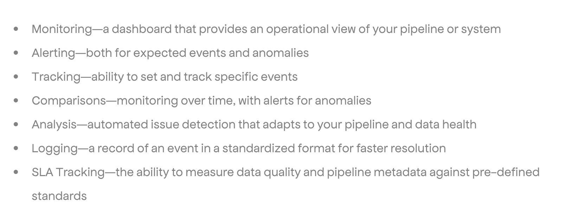

---
layout:
 title:
 visible: false
 description:
 visible: false
 tableOfContents:
 visible: true
 outline:
 visible: true
 pagination:
 visible: true
---

# AI Compendium

The AI Compendium was previously the Machine & Deep Learning Compendium, also known as the ML Compendium and the ML & DL Compendium. It started as a private list of resources and became an open book that walks from a business problem through data, AI, engineering, and product. This page says what the book covers, where it lives, and how it came to be, and the reading order itself is in [Introduction](start/introduction.md).

The book was reorganized once already, and the record of that makeover is kept so the old order can still be traced. A makeover of this book was done. [How it was done](appendix/makeover.md).

<figure><figcaption>
The Machine and Deep Learning Compendium.
</figcaption></figure>

The scope is wide on purpose. Covering **502 topics**, the ML and DL Compendium includes summaries, links, and articles across a wide array of subjects, including LLMs. These range from modern machine learning algorithms and deep learning techniques to specialized areas like NLP, audio processing, computer vision (classic and deep), time-series analysis, anomaly detection, and graphs. It also goes deep into strategic themes like data science management, team building, and practical essentials like product management, design, and technology stacks from a data science perspective. The [Ops](ai-engineering/intro.md) half of this book covers how you build, ship, govern, and run the system.

Because the book is for everyone, the source is open too. The ML and DL Compendium is completely open and now lives on [GitHub](https://github.com/orico/www.mlcompendium.com/) (please star it!). Driven by my belief in knowledge-sharing and education, this project will always remain not-for-profit and free.


The ML and DL Compendium official GitHub repo


The repo is where the book is kept; the reason it exists is older. The Machine and Deep Learning Compendium began as a personal project: a curated list of resources I maintained in a private Google document for my own learning. That document has now evolved into this new interface, and I am excited to share it as an educational tool to help others learn and connect with the brilliant authors I have summarized, quoted, and referenced.

I envision it as a go-to resource for learners of all levels, whether you are an industry data scientist, an academic, or just starting out. It is designed to save you countless hours of searching and filtering through content, providing a streamlined path to invaluable authors and resources you can further support.

<figure><figcaption>
The Machine and Deep Learning Compendium.
</figcaption></figure>

Let us work together to support the community, amplify the voices of authors, and democratize education. If you spot something that could be improved, feel free to contribute via [GitHub](https://github.com/orico/www.mlcompendium.com/tree/master) or [reach out](https://www.linkedin.com/in/cohenori/) to me directly.

The book also has its own article, embedded below, for readers who want the story of the compendium in one place.


The ML Compendium article, by Dr. Ori Cohen


Many thanks,

Dr. Ori Cohen

[My Website](https://www.oricohen.com/) | [Medium](https://medium.com/@cohenori) | [LinkedIn](https://www.linkedin.com/in/cohenori/) | [ML Compendium](http://www.mlcompendium.com/) | [Ops](ai-engineering/intro.md) | [State of GenAI](https://stateofgenai.com/) | [State Of MLOps](https://stateofmlops.com/) |
