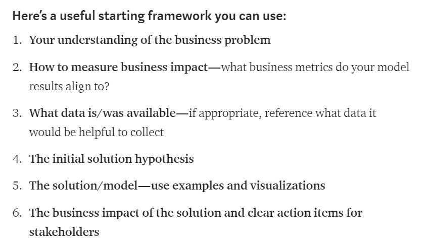

# Management

People, metrics, and culture decide whether ML ships. The page starts with what makes a manager, then how the work is measured with OKRs and KPIs, how projects run, and how teams are built and scaled; it ends with partners, culture, safety, standards, career development, and the books behind all of it.

## Management

The first question is what kind of manager a data-science team needs. [Important Traits To Help You Become A Better Data-Science Manager](https://medium.com/data-science/important-traits-to-help-you-become-a-better-data-science-manager-dc0de3a37961) is Ori Cohen's list of management points, based on his experience of managing a team of two data-scientists. Traits then show up as a style, and [7 management styles and how to use them](https://www.breathehr.com/en-gb/blog/topic/business-leadership/best-management-styles-and-how-to-use-them) explains what the Hay-McBer management styles are, why they are important, and how awareness of them helps smaller companies; 7 leadership styles are similar to the above. For the data-science version of the same question, [The secret sauce of DS management](https://www.youtube.com/watch?v=qO7sl8_YtJM) is the talk "The Secret Sauce of Data Science Management" by Shir Meir Lador at WiDS Israel. At company scale, rework by Google - [what makes a great manager](https://rework.withgoogle.com/guides/managers-identify-what-makes-a-great-manager/steps/learn-about-googles-manager-research/) is Google's manager research.

## OKRs & KPIs

With management named, OKRs and KPIs are how that work is measured, and most confusion starts from mixing up the terms.

The same notes are in [Data KPIs](../data/engineering/data-kpis.md) and [North star metric](product-management-resources.md#north-star-metric).

[Metrics vs KRs](https://www.perdoo.com/resources/the-difference-between-metrics-kpis-key-results/) is the place to stop confusing metrics, KPIs, and Key Results: it separates the components of each and shows how to use them together to measure business success. [OKRs vs KPIs](https://medium.com/@meetfelipe/okr-vs-kpis-what-is-the-difference-ffa54673fcf1) starts from the problem that "KPI" can mean different things for different people, which is confusing. Three more guides make the same comparison from different angles, by filipe castro: [1](https://weekdone.com/okr-comparison/okr-vs-kpi) is a guide to understanding both, how they differ and how they work together, with examples; [2](https://www.wrike.com/blog/kpis-vs-okrs-compare-need-successful/) is Alex Zhezherau's version, where OKRs set new goals with measurable outcomes and KPIs track ongoing progress for existing goals; [3](https://www.whatmatters.com/resources/difference-between-okr-kpi) frames OKRs as the most important outcomes you want to achieve and KPIs as performance measurement, and shows how they can work together.

### Data Science OKR KPI

The general distinction then has to be applied to data science work, where output is harder to count.

The same notes are in [Data KPIs](../data/engineering/data-kpis.md).

[OKR vs KPI](https://www.clearpointstrategy.com/okrs-vs-kpis/) is ClearPoint Strategy's argument that the difference matters less than you think, based on what thousands of strategic plans reveal about why metrics fail. [Difference between KPI targets and goals](https://bernardmarr.com/default.asp?contentID=1346) is Bernard Marr on the terms key performance indicator (KPI), target, and goal, which are sometimes used interchangeably. A metric is only useful if it reaches the people who decide, so [Comet ml on medium](https://medium.com/comet-ml/a-data-scientists-guide-to-communicating-results-c79a5ef3e9f1) is a data scientist's guide to communicating results to stakeholders with varying technical expertise, buy-in, and business goals, keeping an eye on how the work ties into their role and decisions. The figure below is from that guide, by Cecelia Shao at Comet ml.

<figure><figcaption>
Communicating results, by Cecelia Shao, Comet ml.

Credit: by <a href="https://medium.com/comet-ml/a-data-scientists-guide-to-communicating-results-c79a5ef3e9f1">Cecelia Shao Comet ml</a>.
</figcaption></figure>

Beyond communication, the team still needs its own numbers. [For the Data Driven manager (not ds)](https://www.klipfolio.com/blog/17-kpi-management-data-driven-manager) lists 17 essential KPIs for managers across marketing, sales, SaaS, social media, and finance. [Measuring DS business value](https://blog.dominodatalab.com/measuring-data-science-business-value/) covers metrics that help data science leaders keep the team's work aligned to business value. [Best KPIS for DS - the best is what not to do](https://www.quora.com/What-are-the-best-KPIs-for-Data-Science-team) is the Quora thread on the question.

## Project Management

Metrics are not a plan. Once the team knows what it measures, it still has to decide how a data-science or AI project moves.

The same notes are in [Data Program Management](../data/engineering/data-program-management.md), [Product / Program Managers](product-managers.md), and [Project & Program Management](project-and-program-management.md).

[Data-science? Agile? Cycles? My method for managing data-science projects in the Hi-tech industry](https://medium.com/data-science/data-science-agile-cycles-my-method-for-managing-data-science-projects-in-the-hi-tech-industry-b289e8a72818) Ori Cohen, starts from the fact that Scrum, Kanban, and Scrumban work in short cycles that suit development but collide with research, so the core values have to be adapted to be agile in research. [Lessons learned leading AI teams](https://blogs.intuit.com/blog/2020/06/23/lessons-learned-leading-ai-teams/) is from the Intuit developer blog. The same blog carries How to avoid conflicts and delays in the AI development in two parts, [Part 1](https://blogs.intuit.com/blog/2020/12/08/how-to-avoid-conflicts-and-delays-in-the-ai-development-process-part-i/), [Part 2](https://blogs.intuit.com/blog/2021/01/06/how-to-avoid-conflicts-and-delays-in-the-ai-development-process-part-ii/), by Shir Meir Lador.

## Building Teams

Projects need teams, and the shape of the team decides the shape of what it builds. The notes go from team effectiveness, to Conway's law, to team topologies and the alternatives.

The same notes are in [Agile for data-science-research](../business-problems/data-science.md#agile-for-data-science-research), [Data Teams](../data/engineering/data-teams.md), [MLOps Teams](../ai-engineering/mlops/mlops-teams.md), and [Team Building / Group Cohesion](../business-problems/data-science.md#team-building--group-cohesion).

The starting point is rework by google - [understanding team effectiveness](https://rework.withgoogle.com/guides/understanding-team-effectiveness/steps/introduction/). Effectiveness is bounded by structure, which is Conway's law: "Organizations which design systems are constrained to produce designs which are copies of the communication structures of these organizations."

If structure shapes the system, it should be designed on purpose. [team topologies](https://teamtopologies.com/) is the approach to organizing business and technology for fast flow of value and business agility, a practical, step-by-step, adaptive model for organizational design and team interaction. Its [youtube](https://www.youtube.com/c/TeamTopologies/videos) channel has the talks, and [key concepts](https://teamtopologies.com/key-concepts) explains the four team types, interaction modes, platform-as-a-product, and the tools and practices around them. Mapped onto a data organization, the four types read like this:

- DS are "Complicated Subsystem team: Phd Level, great expertise, in depth knowledge.
- feature teams are "Stream-aligned team"
- enabling teams help bridge the gap in knowledge for feature teams, such as architecture
- platform team - providing a platform to speed up feature teams.

The DS placement comes from the [team topologies article](https://www.scaledagileframework.com/organizing-agile-teams-and-arts-team-topologies-at-scale/) - A complicated-subsystem team is responsible for building and maintaining a part of the system that depends heavily on specialist knowledge, to the extent that most team members must be specialists in that area of knowledge in order to understand and make changes to the subsystem. [1] The same idea is worked out for specific functions in [team topology for ML](https://medium.com/data-science/team-topology-for-machine-learning-45bddba626e3), by Misbah Uddin, and in [team topologies for data engineering](https://medium.com/data-arena/team-topologies-for-data-engineering-teams-a15c5eb3849c). A third one, towards data mesh: data domains and team topologies, used to sit here and is kept at the end of the page.

Topologies are not the only view. [atlassian](https://www.atlassian.com/devops/frameworks/team-structure) - "it's important to understand that not every team shares the same goals, or will use the same practices and tools. Even the way a team is composed shouldn’t be standardized. Different teams require different structures, depending on the greater context of the company and its appetite for change. "

Back on the complicated-subsystem team, a [good article](https://betterprogramming.pub/team-topologies-a-new-way-of-thinking-about-teams-8f4853038509), "Team Topologies — A New Way of Thinking About Teams", says what that team is for. Quote "The goal of this team is to reduce the cognitive load of stream-aligned teams working on systems that include or use the complicated subsystem. The team handles the subsystem complexity via specific capabilities and expertise that are typically hard to find or grow.

Examples of complicated subsystems might include face-recognition algorithms, machine learning approaches, real-time devices drivers, digital signal processing, or any other expertise-based capability that would be hard to embed directly within the stream-aligned team"

A different cut of the same problem is [team patterns building an eng team](https://www.kennethlange.com/team-patterns-how-to-structure-an-engineering-team/) by Kenneth Lange - an alternative to team topologies? His four patterns are a genuine list:

 "In my experience there are four general team patterns that most companies follow. Yes, they have tweaked them to fit their circumstances, but the overall idea behind the pattern remains the same:

 1. **Technology Team:** The team is formed around a technology, such as Android. For example, a team of mobile developers who build and maintain a mobile app.
 2. **Matrix Team:** The developers report to a Development Manager, but they are “lend out” to cross-functional product or project teams where they do their daily work.
 3. **Product Team:** The team is oriented around a product area, such as billing. It’s cross-functional, but all people on the team, regardless of their specialization, report to the same line manager.
 4. **Self-Managed Product Team:** The team is oriented around a product area. But the management of the team is divided into technical leadership, typically handled by an Engineering Lead on the team, and people management, typically handled by an Engineering Manager outside the team."

Whichever pattern is chosen, it has to keep changing. [another good article](https://betterprogramming.pub/your-team-structures-aint-working-let-s-apply-team-topologies-470e8d4f7fe5) Ryan Dawson, "Your Team Structures Ain't Working. Let's Apply Team Topologies", goes over the key insights of the book by Matthew Skelton and Manuel Pais on why team structures matter and how to use them within the bigger picture of software delivery, and quotes it:

 > “Organizations not only need to strive for autonomous teams, they also need to continuously think about and evolve themselves in order to deliver value quickly to customers” — _Team Topologies_

[1] Book: Skelton, Matthew, and Manuel Pais. Team Topologies: Organizing Business and Technology Teams for Fast Flow. IT Revolution Press, 2019.

The data-science answer to the same structural question is [Full cycle DS](https://medium.com/data-science/fcds-b2d2e6b08d34), Daniel Marcous on Full Cycle Data Science: a well-functioning data science unit is a strong requirement for business prosperity, yet there is no single recipe for making one successful.

## Scaling Agile - Agile Approaches

Teams at scale need a model, and the model most companies reach for first is Spotify's. The notes go through that model, the pushback against copying it, and then Shape Up and SAFe as alternatives.

The same notes are in [Agile for data-science-research](../business-problems/data-science.md#agile-for-data-science-research) and [Team Building / Group Cohesion](../business-problems/data-science.md#team-building--group-cohesion).

The spotify "model" - squads tribes chapters guilds - was first written down in the [Scaling agile snapshot 2012](https://blog.crisp.se/wp-content/uploads/2012/11/SpotifyScaling.pdf), which describes how Spotify kept an agile mindset despite having scaled to over 30 teams across 3 cities. The people behind it explain it in talks: [Scaling Agile at Spotify](https://www.youtube.com/watch?v=SUR9q_Qcrk4) is Joakim Sunden and Anders Ivarsson at LKNA13, and [inside Spotify by Andres Ivarsson](https://theagilerevolution.com/2016/07/06/episode-112-inside-spotify-with-anders-ivarsson/) is episode 112 of The Agile Revolution Podcast. The culture side is Henrik Kniberg's short animated videos describing Spotify's engineering culture: Spotify eng culture [p1](https://engineering.atspotify.com/2014/03/spotify-engineering-culture-part-1/) and [p2](https://engineering.atspotify.com/2014/09/spotify-engineering-culture-part-2/), which asks you to watch part 1 first. The 2014 [youtube](https://www.youtube.com/watch?v=4GK1NDTWbkY) upload of Spotify Engineering Culture (by Henrik Kniberg) is the same video in one place, listed again as [Spotify engineering culture](https://www.youtube.com/watch?v=4GK1NDTWbkY).

The model's own authors then said what did not work. [how things dont work in spotify and we are trying to solve them](https://www.slideshare.net/jchyip/how-things-still-dont-quite-work-at-spotify-and-how-were-trying-to-solve-it) is the slide deck "How things still don't quite work at Spotify... and how we're trying to solve it", with the 2017 talk and [youtube](https://www.youtube.com/watch?v=VZMf8QJmB98) recording of it. [you can do better than the spotify model](https://agile2017.sched.com/event/ATal/you-can-do-better-than-the-spotify-model-joakim-sunden-catherine-peck-phillips?ref=JeremiahLee) is the Agile2017 session, and the [video](https://vimeo.com/240125835) of Joakim Sundén's version puts aside the "bubblegum and unicorns" of the culture videos to talk about what doesn't quite work at Spotify, as a failure and learning report for coaches and change agents. The takeaways from that talk:

 "Spotify is used as a framework/model copied by others, but Spotify's model isn't without challenges even for Spotify

 Encouragement that it's always hard AND it's always possible to improve

 It's great to be inspired by others but at the end of the day you need to face your difficulties and solve your problems yourself

 You can succeed with autonomy by never giving up; it comes with challenges and benefits"

The sharpest critique came later. [failed squad goals](https://www.jeremiahlee.com/posts/failed-squad-goals/) is Jeremiah Lee's "Spotify's Failed #SquadGoals": "the Spotify model" got a bunch of companies talking like Taylor Swift about startup culture, but four former Spotify employees reveal that its eponymous way of working failed before it scaled. The 2020 audio version is his reading of it, listen on [spotify](https://anchor.fm/jeremiah-oral-lee/episodes/Spotifys-Failed-SquadGoals-edia0p). The [blowback response](https://www.jeremiahlee.com/posts/failed-squad-goals/comments/) collects his clarifications and select comments from readers. A piece titled there is no spotify model for scaling agile used to sit here and is kept at the end of the page. [spotify model sucks](https://www.linkedin.com/pulse/spotify-sucks-erwin-verweij/) is a LinkedIn post making the same point. [how to structure eng team](https://www.linkedin.com/pulse/how-structure-engineering-team-scale-yotam-hadass) is an engineering leader's account of reshaping the engineering organization at Electric to prepare the team for scale, with 60% growth in headcount in a year. [spotify model - I dont think it means what you think it means](https://medium.com/serious-scrum/you-want-to-adopt-the-spotify-model-i-dont-think-it-means-what-you-think-it-means-7df4316081f) - "Don’t fool yourself and others. The Spotify engineering culture is NOT about their organisational structure. It is how people are allowed to determine what to do. It’s about autonomy. It’s about having a culture of safety. Among others. I advise you to revisit the videos so that you can experience it yourself." - Willem Jan Ageling. The thread ends on the tension behind all of it, [balancing autonomy with accountability](https://www.scrum.org/resources/blog/balancing-autonomy-accountability).

Outside the Spotify debate, two other approaches are on the table. ["shape up"](https://basecamp.com/shapeup?ref=JeremiahLee) is Basecamp's method for breaking free of "best practices" that aren't really working, thinking deeper about the right problems, and shipping meaningful projects a team can celebrate. [SAFe](https://www.scaledagileframework.com/?ref=JeremiahLee) scaled agile framework is the heavier option, now at SAFe 6, aimed at helping organizations become Lean Enterprises and achieve business agility, and [Safe agile principles](https://scaledagileframework.com/safe-lean-agile-principles/) are the ten underlying Lean-Agile principles that inform its roles and practices.

## Working with partners

Scaling is internal, while partners are outside the team. This section is reserved for notes on working with partners.

## Culture building

Partners sit beside culture. This section is reserved for culture-building notes.

## Psychological Safety

Culture needs safety before people will take the risks that research demands. [high performing teams need PS](https://www.fearlessculture.design/blog-posts/high-performing-teams-need-psychological-safety) is (great) and has a lot of tips on how to measure it. A summary by microsoft, high performing teams need psychological safety, used to sit here and is kept at the end of the page. The 1st one to read on the research side is [five keys to successful google team](https://rework.withgoogle.com/blog/five-keys-to-a-successful-google-team/).

## Settings standarts

Safety is not standards, and a team needs both. This section is reserved for setting standards.

## Career development

Standards sit beside growth, for managers and for the people they manage. [development plan for managers](https://www.indeed.com/career-advice/career-development/development-plan-for-managers) discusses what a good development plan for managers is and offers development goals you can include for your team. From the other side, the plan [for junior DS](https://medium.com/@mbsahar4/my-development-plan-as-a-junior-data-scientist-ec3c68a2b641) is a personal account of the first 9 months as a junior data scientist, where work should bring value to customers, code should run in production, and you should write unit tests.

## Books

The shelf ends with management, influence, negotiation, and related books, grouped by the kind of problem they help with.

For people management the books are (good) the effective manager, radical candor, and managing humans. For company management they are The CEO within and business without the bullshit.

Collaborations and influence start with (good) crucial conversations, 1 (the first summary is kept at the end of the page); [2](https://slooowdown.wordpress.com/2013/06/09/summary-of-crucial-conversations-tools-for-talking-when-the-stakes-are-high-by-kerry-patterson-joseph-grenny-ron-mcmillan-and-al-swizler/) is the Ignition Blog summary of Crucial conversations – Tools for talking when the stakes are high by Kerry Patterson, Joseph Grenny, Ron McMillan and Al Swizler, and [3](https://fourminutebooks.com/crucial-conversations-summary/) is the Four Minute Books summary on how to avoid conflict and reach positive outcomes in high-stakes conversations.

Negotiations centre on never split the difference. The [TLDR](https://www.linkedin.com/pulse/never-split-difference-tldr-john-dziedzic/) calls it one of the most insightful books the author had read in some time, tying together psychology, sales, and negotiation. The summary [summary & commentary](https://growth.me/books/never-split-the-difference/) is a longer read. The Oberlo [summary](https://www.oberlo.com/blog/never-split-the-difference-by-chris-voss-summary) lets a former FBI hostage negotiator teach how to win every conflict, deal, and negotiation. [2](https://www.freshworks.com/crm/sales/sdr-sales-development-reps/summary-of-never-split-the-difference-blog/) is a 12-minute summary from Freshsales of the classic guidebook on negotiation techniques by Chris Voss and Tahl Raz. The 3rd written one, [4](https://medium.com/@highperformancelifestyle/never-split-the-difference-summary-review-animated-c32f72a36608), is Kosio Angelov's animated summary and review, which quotes Chris Voss: the beauty of empathy is that it doesn't demand that you agree with the other person's ideas. On video, the [youtube](https://www.youtube.com/watch?v=OaEw7ZFs5sU) animated summary is by Successful By Design, [chris voss](https://www.youtube.com/watch?v=yPsvgmZlVuQ) is Chris Voss on tactical empathy and successful negotiation for Performance Coaching, [2](https://www.youtube.com/watch?v=guZa7mQV1l0) is his Talks at Google, and [3](https://www.youtube.com/watch?v=YNqpQ3zi8iQ) is one more talk.

Manipulations are the darker shelf. The prince [1](https://www.sparknotes.com/philosophy/prince/section3/) is the SparkNotes summary and analysis of chapters 5–7, and [2](https://www.cliffsnotes.com/literature/p/the-prince/book-summary) is the CliffsNotes book summary. [The 48 Laws of Power](https://www.amazon.com/48-Laws-Power-Robert-Greene/dp/0140280197) - “Amoral, cunning, ruthless, and instructive, this multi-million-copy New York Times bestseller is the definitive manual for anyone interested in gaining, observing, or defending against ultimate control – from the author of The Laws of Human Nature.

Others on the shelf are (good) High output management, multipliers, radical candor, Trillion dollar coach, The HP way, How to measure anything, Mindset, and (good) The hard thing about hard things. [principles life & work](https://www.amazon.com/Principles-Life-Work-Ray-Dalio/dp/1501124021) is Ray Dalio's book, and the Readingraphics [summary](https://readingraphics.com/book-summary-principles-ray-dalio/) outlines his principles for life and work so you can uncover and apply your own.

The Spotify critique from the scaling section, spotify model sucks, is also here as a plain address: [https://www.linkedin.com/pulse/spotify-sucks-erwin-verweij/](https://www.linkedin.com/pulse/spotify-sucks-erwin-verweij/)

[Measuring AI Agent Adoption in R&D Organizations](https://cohenori.medium.com/measuring-ai-agent-adoption-in-r-d-organizations-a-data-driven-approach-51c06cd0726d) (August 2025) is how this chapter measures teams and KPIs.

## Deprecated links


These links and images no longer work. The original wording is kept here. A same-resource copy, when one was checked, is used above.


- towards data mesh: data domains and team topologies. This address no longer opens: https://francois-nguyen.blog/2021/03/07/towards-a-data-mesh-part-1-data-domains-and-teams-topologies/
- high performing teams need psychological safety. This address no longer opens: https://workplaceinsights.microsoft.com/productivity/high-performing-teams-need-psychological-safety-heres-how-to-create-it/
- there is no spotify model for scaling agile. This address no longer opens: https://vitalitychicago.com/blog/there-is-no-spotify-model-for-scaling-agile/
- (good) crucial conversations, 1. This address no longer opens: https://wikisummaries.org/crucial-conversations-tools-for-talking-when-stakes-are-high/
- never split the difference. summary. This address no longer opens: https://www.samuelthomasdavies.com/book-summaries/business/never-split-the-difference/
