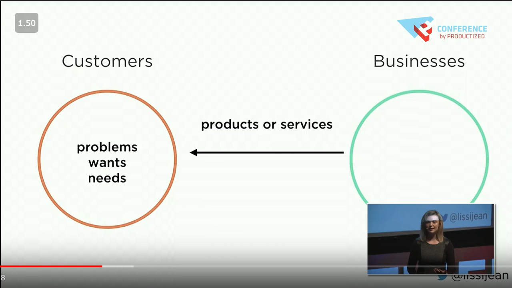
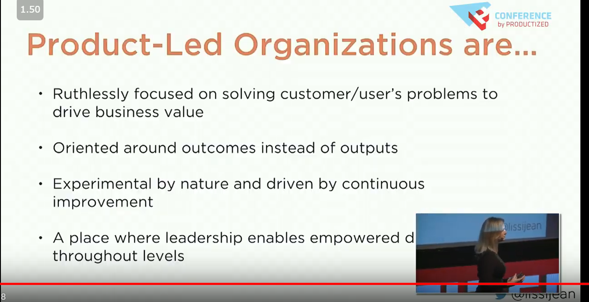
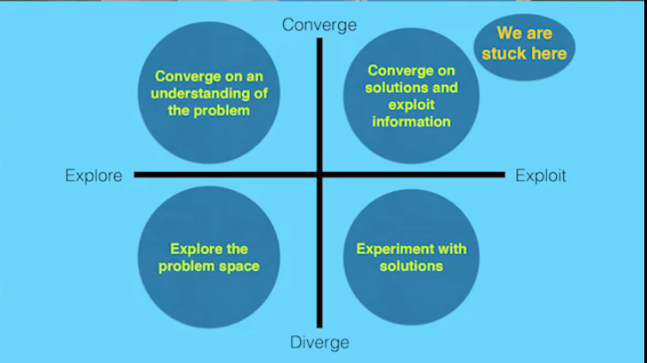
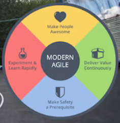

# Product Management Resources

Product work needs shared reading, not only tribal memory. The page starts with a beginner reading list, then moves to outcomes, the north-star metric, and product-market fit, and only then to advanced reading, general essays, and books.

This list was compiled thanks to [Sefi Keller](https://www.linkedin.com/in/sefikeller/?originalSubdomain=il)

## Beginner reading list

A new product manager first needs to know what the job is and what good looks like, before outcomes and metrics.

[A living list of product management resources](https://artplusmarketing.com/a-living-list-of-product-management-resources-c5dddbff8b12) was the running list to start from; that address now returns the HackerNoon AI Image Gallery instead of the list, so treat it as a pointer to look for rather than a page to read.

[Good Product Manager/Bad Product Manager](https://a16z.com/2012/06/15/good-product-managerbad-product-manager/) is Ben Horowitz's training document, with his own warning that it was written 15 years ago and is probably not relevant for today's product managers; he keeps it as an example of a useful training document, where good product managers know the market, the product, the product line, and the competition extremely well and operate from a strong basis of knowledge.

Next to that old playbook sits a founder's counterweight: [Do Things that Don't Scale](http://paulgraham.com/ds.html) is Paul Graham's essay of that title.

The Three Jobs of Product Management is the next item on the list; its source used to sit here and is kept at the end of the page.

Once the job is named, it turns out there is more than one kind of product manager. [The 6 types of Product Managers. Which one do you need?](https://medium.com/@kit_ulrich/the-6-types-of-product-managers-which-one-do-you-need-75c2e66dd592) starts from the observation that marketers and developers have well-defined words for their specialties, while product often starts and ends with the single word product.

Whatever the type, the strategy has to exclude things. [Product strategy means saying no](https://www.intercom.com/blog/product-strategy-means-saying-no/): if you are building a product, you have to be great at saying no, not "maybe" or "later".

Two longer reading lists extend this one. [https://medium.com/@sebastienphl/my-product-management-reading-list-2017-cb874975c635](https://medium.com/@sebastienphl/my-product-management-reading-list-2017-cb874975c635) is "My Product Management Reading List — 2017".

[https://medium.com/@noah_weiss/50-articles-and-books-that-will-make-you-a-great-product-manager-aad5babee2f7](https://medium.com/@noah_weiss/50-articles-and-books-that-will-make-you-a-great-product-manager-aad5babee2f7) is the list now titled "80 Articles and Books that will Make you a Great Product Manager".

For the step into the role itself, [https://medium.com/pminsider/preparing-for-pm-interviews-how-to-get-there-in-15-20-hours-193f6fcbf606](https://medium.com/pminsider/preparing-for-pm-interviews-how-to-get-there-in-15-20-hours-193f6fcbf606) is about preparing for PM interviews in 15-20 hours.

The beginner list closes on the smallest version of the job: [Minimum Viable Product Manager](https://blackboxofpm.com/mvpm-minimum-viable-product-manager-e1aeb8dd421).

## Outcomes

With the beginner list open, the next shift is from shipping things to changing things: outcomes vs outputs is the product mindset.

[output vs outcomes a product mind set](https://medium.com/product-management-in-minutes/output-vs-outcome-a-product-mindset-499735230ce) is Jay Hawkins on that mindset, written from the position most product people are in, thrown head-first into product management and learning on the fly while dealing with customers' feature requests, code-hungry engineers, and expectant CEOs. [outcomes vs outputs](https://medium.com/is-that-product-management/product-management-by-outcomes-vs-outputs-45acdefd1efd) takes apart the common reasoning of product managers: the user has a problem, so I do a feature, improvement, or change and solve the problem.

## North star metric

Outcomes need a single number to point at. These notes are how a north-star metric is chosen and when it changes.

The same notes are in [OKRs & KPIs](management.md#okrs--kpis).

The metric does not have to come from intuition alone. [Using trees and logreg to determine metrics that outperform intuition only, by linkedIN](http://papers.www2017.com.au.s3-website-ap-southeast-2.amazonaws.com/companion/p617.pdf) is that approach. Once a metric exists, it will not stay fixed: [In-company northstar metrics, when to change and why](https://amplitude.com/blog/evolving-the-product-north-star-metric) is a brief history of Amplitude's north star metric and the changes they made to continue its evolution. [Another one about finding your northstar, actually understanding that more indepth data leads to a](https://www.sisense.com/blog/find-north-star/) is a second account of finding one.

## Product market fit

A north star still needs a market that wants the product. These notes are product-market fit and the questions that show value.

[Superhuman and surveys](https://firstround.com/review/how-superhuman-built-an-engine-to-find-product-market-fit/) is Superhuman founder and CEO Rahul Vohra walking through the framework his startup used to make product/market fit more actionable, including the survey and the four-step process that were key to measuring and optimizing it. What makes things work in a harder market is the question behind [pmf rather than sales](https://blog.betterplanning.co/whats-different-about-govtech-1e3e1fc25963).

Fit is also where teams fool themselves with activity. [Escaping the build trap](https://www.youtube.com/watch?v=DmJXpI7OJuY&feature=youtu.be) - designing features, doing more agile work without a brain is not a value for the client, using analytics can help us understand if a feature has value.

The remedy is asking the right questions and asking the client why they are leaving, which is what the two figures below show.

<figure><figcaption>
Asking the right questions and asking the client why they are leaving

Credit: <a href="https://lh3.googleusercontent.com/XUq7djFLFMdHsmVTlVL6V2EjmKV2MSVw38w6FSiSONmL6ctdET4gOQmGjPz9sH94FwQJI0IEQXH6DcQa0dGHAXqb0lYRA4kNvKkd2oBM0ymaXQJ-F__UOzCWZSl1iCGtzpZqJds3">copied from the original hosted image</a>.
</figcaption></figure>

<figure><figcaption>
Asking the right questions and asking the client why they are leaving

Credit: <a href="https://lh3.googleusercontent.com/-iyLLS4NFG4RS66aAeWX3h9j_QORnvfUefXVCiDMNZ8K_vPuljKCMmviNbnmubYafEgCaBaWD7N2vv7jAnxKaYRbCFKThBpsfYaUbeJtzssUxRI4Ndkg81cMbjr_7XJPu7Hoe76n">copied from the original hosted image</a>.
</figcaption></figure>

## Advanced reading list

After fit, the advanced reading list goes deeper on research, decisions, and prioritization.

Research comes first. [https://medium.com/pminsider/usability-pro-tips-7b4eb2cc63c4](https://medium.com/pminsider/usability-pro-tips-7b4eb2cc63c4) is 10 usability testing pro-tips, written as the advice given to a colleague who asked for them. Asking better research questions is the next step, and its source is kept at the end of the page.

The list then turns to the people doing the job. [https://blackboxofpm.com/managing-and-developing-product-managers-2f9a3963fab6](https://blackboxofpm.com/managing-and-developing-product-managers-2f9a3963fab6) is about managing and developing product managers.

[https://medium.com/product-manager-hq/product-managers-are-also-products-bfba0c19636d](https://medium.com/product-manager-hq/product-managers-are-also-products-bfba0c19636d) argues that product managers are also products.

From people it moves to how they think. [https://blackboxofpm.com/product-management-mental-models-for-everyone-31e7828cb50b](https://blackboxofpm.com/product-management-mental-models-for-everyone-31e7828cb50b) is product management mental models for everyone.

[https://blackboxofpm.com/making-good-decisions-as-a-product-manager-c66ddacc9e2b](https://blackboxofpm.com/making-good-decisions-as-a-product-manager-c66ddacc9e2b) is about making good decisions as a product manager.

User stories, how? is the open question here; its source is kept at the end of the page.

Ideas are the raw material for those decisions. [https://hackernoon.com/where-do-product-ideas-come-from-d035c8d6b2e4](https://hackernoon.com/where-do-product-ideas-come-from-d035c8d6b2e4) asks where product ideas come from, and names the ability to generate good product ideas as one of the most important skills that separates a junior product manager from a senior PM, or a project manager from a product manager.

[https://medium.com/swlh/practicing-the-art-of-the-lazy-product-manager-part-2-2e21dd4345eb](https://medium.com/swlh/practicing-the-art-of-the-lazy-product-manager-part-2-2e21dd4345eb) is Parul Singh's "Practicing the Art of the Lazy Product Manager", part 2 of a 2-article series.

The list ends on interview-style exercises. [https://medium.com/stellarpeers/how-would-you-prioritize-new-product-features-for-facebook-301ef72a2dce](https://medium.com/stellarpeers/how-would-you-prioritize-new-product-features-for-facebook-301ef72a2dce) asks how you would prioritize new product features for Facebook.

[https://medium.com/stellarpeers/give-an-example-of-a-good-and-not-so-good-product-2a36c56cffb1](https://medium.com/stellarpeers/give-an-example-of-a-good-and-not-so-good-product-2a36c56cffb1) asks for an example of a good and not so good product.

Design docs for products is the last item; its source is kept at the end of the page.

## General

Beside the named lists, these general notes cover prioritization, metrics, and product craft.

The first question is whether to build at all. [Root cause of failure](https://www.youtube.com/watch?v=9dccd8lihpQ) - "should we build this feature?" - is Marty Cagan's talk on the root causes of product failure at Mind the Product San Francisco.

Answering that needs numbers. [Growth analysis, customer cohort, distribution analysis - mostly business stuff but aimed to explain how to use a lot of metrics to measure product market fit](https://tribecap.co/a-quantitative-approach-to-product-market-fit/) is Tribe Capital's overview of how they quantify product-market fit, the underpinnings of their underwriting framework.

Numbers are not the whole story. [3 things to make your product great](http://paulbuchheit.blogspot.com/2010/02/if-your-product-is-great-it-doesnt-need.html) is the post "If your product is Great, it doesn't need to be Good.", written in response to the negative reactions to the iPad.

A great product still has a backlog to order. [Best ways to prioritize](https://www.quora.com/Product-Management/What-are-the-best-ways-to-prioritize-a-list-of-product-features) is the Quora thread on the best ways to prioritize a list of product features.

https://vimeo.com/228831629, don't get stuck :) The two figures below go with it.

<figure><figcaption>
General

Credit: <a href="https://lh3.googleusercontent.com/lfaagtSwfLv38zlhEn54fbDvQmqOOWI3MiVunmlDeKcF6YJtEHGCQ2NbjXrQCrtYgkQCaG9GRSf5a-gyaKoWzyXTTghHrw0aP32c0maP5YwfYEb6DcaMTfP0nyIaDcAiFmlOFzw0">copied from the original hosted image</a>.
</figcaption></figure>

<figure><figcaption>
General

Credit: <a href="https://lh3.googleusercontent.com/soo6_0ds8ORPwD-5ZPFnze1iR8ZJyTSKn2iYh2HQyKmkaPaVcObm1iP1d4Fa90aYqfX3hYLY1izLUT7rnu87XrDdtWh33eQEafPziD9MCzZrXjWIA2Fxkt-h5pTgcKWy7lXfvtZx">copied from the original hosted image</a>.
</figcaption></figure>

Which idea is better? Compare them. That comparison needs a metric: [The best potential metric to move the needle](https://www.youtube.com/watch?v=ri9X02dPXlY) is Dan Olsen on optimizing your product and business using analytics.

Metrics then have to become a plan. [Tool for product strategy, because, while, without by trees](https://www.youtube.com/watch?v=H8Xlrd2QGmU) is John Cutler on mind mapping product strategy and roadmaps, and the [medium](https://medium.com/@johnpcutler/a-better-roadmap-mind-map-mousetrap-cdbacaaa664b) post is the written version, which opens with the complaints it answers: "I don't understand the big picture!", "I don't understand how my work fits into the big picture!", and "We are working in opposition to each other. We need better alignment".

A plan built on one number is fragile. [One metric is not enough](https://brianbalfour.com/essays/north-star-metric-growth) for growth, i.e., "What actions could we take to lead to our users to.." and "Input metrics are leading indicators and output metrics are lagging indicators. By definition, it can take time for the output to reflect positive or negative changes in the inputs." The process that follows is three steps:

1. Get metrics
2. Break output metrics into inputs
3. Understand and monitor tradeoffs

Applied to retention, the same idea gives a [better decision tree and a metric that tells us when and how someone will churn.](https://www.sisense.com/blog/find-north-star/)

Design docs for products come up again here.

The same advanced-list sources come back with the author's own one-line takeaways. [Grammarly vs other solutions, in depth analysis of qualities](https://medium.com/stellarpeers/give-an-example-of-a-good-and-not-so-good-product-2a36c56cffb1) is the good-and-not-so-good product example. [User product ideas](https://hackernoon.com/where-do-product-ideas-come-from-d035c8d6b2e4) is the where-ideas-come-from piece.

User stories, how? stays an open question.

[Long and complex theory about how to do good or bad decisions](https://blackboxofpm.com/making-good-decisions-as-a-product-manager-c66ddacc9e2b) is the decisions essay, and [Modes of product management](https://blackboxofpm.com/product-management-mental-models-for-everyone-31e7828cb50b) is the mental-models one.

Fit returns as well: [Achieve product market fit, a product that satisfies the market](https://www.forbes.com/sites/hayleyleibson/2018/01/18/how-to-achieve-product-market-fit/#237def48476b), 2. (the second source is kept at the end of the page).

On research, the takeaway is [Dont ask your users if they like it, let them say what they like](https://medium.com/pminsider/usability-pro-tips-7b4eb2cc63c4).

Asking better research questions remains the companion skill.

On people, [Managing pms](https://blackboxofpm.com/managing-and-developing-product-managers-2f9a3963fab6) is the management essay again.

For a shared language, [Visual vocabulary for product building - lots of theory and figures](https://productlogic.org/2014/09/13/the-product-triangle-a-visual-vocabulary-for-product-building/) starts from the point that there is no formula product builders can apply to create thriving products.

The last general note is the everyday metrics: [Dau, mau, stickiness, wau, wau stickiness, cac, etc](https://www.geckoboard.com/learn/kpi-examples/startup-kpis/dau-mau-ratio/), where the DAU/MAU ratio of daily to monthly active users shows how often people are using your product.

## Books

The shelf ends with The Mom Test summaries, since user research is where most of the reading above leads.

The mom test, summaries: [1](https://www.wilselby.com/2020/06/the-mom-test-summary-and-insights/) is Wil Selby's key takeaways from "The Mom Test" by Rob Fitzpatrick about Product Discovery and user research. [2](https://feelinspired.medium.com/things-i-learnt-the-mom-test-by-rob-fitzpatrick-9d9d58ce8098) is a reader's notes on why we check that what we are building truly makes customers' lives better. [3](https://www.slideshare.net/xamde/summary-of-the-mom-test) is a slide summary of 'The Mom Test' (v2 2013-11-05). [4](https://lifeclub.org/books/the-mom-test-rob-fitzpatrick-review-summary) is The Mom Test Summary, Review PDF. A fifth summary used to sit here and is kept at the end of the page.

## Deprecated links


These links and images no longer work. The original wording is kept here. A same-resource copy, when one was checked, is used above.


- https://vimeo.com/228831629, don't get stuck. This video is gone: https://vimeo.com/228831629
- Which idea is better? Compare them. This address no longer opens: https://www.mindtheproduct.com/2017/10/critical-thinking-product-teams-teresa-torres/?utm_campaign=coschedule&utm_source=twitter&utm_medium=MindTheProduct&utm_content=Critical%20Thinking%20for%20Product%20Teams%20by%20Teresa%20Torres
- Design docs for products. This address no longer opens: https://productcoalition.com/how-i-formulate-and-use-my-product-requirement-docs-c52692564d0e
- User stories, how? This address no longer opens: https://productcoalition.com/anatomy-of-a-great-user-story-f56fb1b63e38
- 2. This address no longer opens: https://a16z.com/2017/02/18/12-things-about-product-market-fit/
- Asking better research questions. This address no longer opens: https://productcoalition.com/how-to-ask-better-user-research-questions-a-guide-for-startup-product-managers-dc076c4004cb
- The Three Jobs of Product Management. This address no longer opens: https://productcoalition.com/three-jobs-of-product-management-9e006f944bc7
- https://productcoalition.com/product-management-interviews-68541a46da2b. This address no longer opens: https://productcoalition.com/product-management-interviews-68541a46da2b
- https://productcoalition.com/the-best-product-management-podcasts-a7cfe0dffdbb. This address no longer opens: https://productcoalition.com/the-best-product-management-podcasts-a7cfe0dffdbb
- https://productcoalition.com/the-product-management-reading-essentials-90b537ffec62. This address no longer opens: https://productcoalition.com/the-product-management-reading-essentials-90b537ffec62
- 5. This address now points to an unrelated site: https://booksconcepts.com/the-mom-test-by-rob-fitzpatrick/
