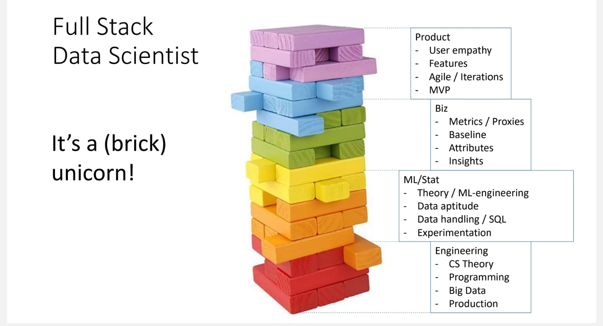
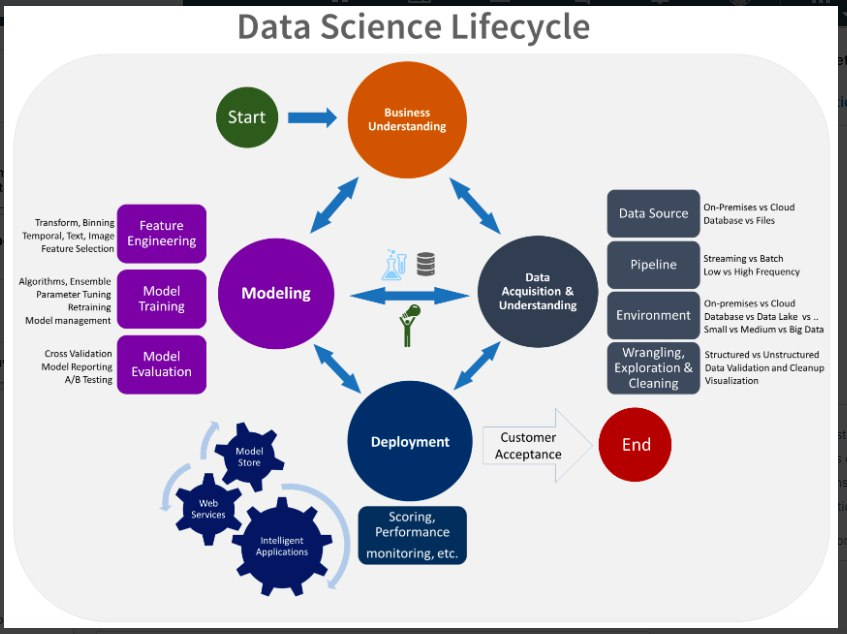
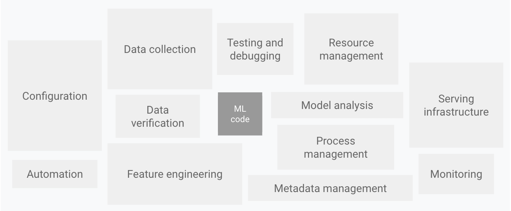
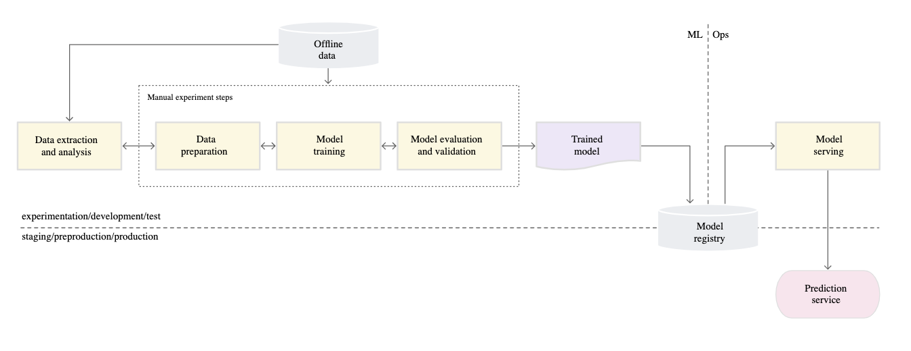

# Data Science

A company hires a data scientist to turn a business problem into a model someone else can run. That only works if the role, the lifecycle, the stack, and the way the team works are named before anyone picks a course or a book. The path below starts with the job itself, then the process and the platforms, then how a research team actually moves, and only then the courses, books, cost, and patents.

## Being a DS / Researcher

The job is a day of engineering mixed with research, and the first mistake is treating a business KPI as if it were a research KPI. [A day in a life](https://medium.com/data-science/12-things-i-learned-during-my-first-year-as-a-machine-learning-engineer-2991573a9195) is the first-year machine-learning-engineer account of that mix. [Advice for a ds](https://medium.com/the-data-experience/building-a-data-pipeline-from-scratch-32b712cfb1db) is the pipeline built from scratch, where business KPIs and research KPIs are not the same thing. A review of deep learning papers and co-authorship used to sit here; that address no longer opens and is kept at the end of the page.

Once the day is clear, the work is a stack, not a single model. The full-stack DS diagram is by [Uri Weiss](https://linkedin.com/in/uriweiss).

<figure><figcaption>
Full stack DS diagram.

Credit: by <a href="https://linkedin.com/in/uriweiss">Uri Weiss</a>.

</figcaption></figure>

If the credit to [Uri Weiss](https://linkedin.com/in/uriweiss) on that figure is wrong, [please contact me](mailto:ori@oricohen.com). The practices that sit under the diagram, the engineering habits a DS still has to keep, are on the [ML practices for a DS](https://se-ml.github.io/) page for software engineering for machine learning.

## Life cycle

The role only becomes a team process when someone writes down how a project moves from question to deployed model. The same notes are in [MLOps Intro](../ai-engineering/mlops/mlops-intro.md).

[Microsoft on Team DS Lifecycle](https://docs.microsoft.com/en-us/azure/architecture/data-science-process/overview) is that write-up. Microsoft describes the Team Data Science Process as an agile, iterative methodology for predictive analytics and intelligent applications. It says how roles work together, pulls in practices from Microsoft and other companies, and aims at an analytics program that actually ships. The page gives a generic process that can be implemented with different tools, then a more detailed account of tasks and roles, then guidance for the Microsoft tools their own teams use.

<figure><figcaption>
The DS lifecycle, Microsoft Documentation.

Credit: by <a href="https://docs.microsoft.com/en-us/azure/architecture/data-science-process/overview">The DS lifecycle, Microsoft Documentation</a>.

</figcaption></figure>

<figure><figcaption>
The DS lifecycle, Microsoft Documentation.

Credit: by <a href="https://docs.microsoft.com/en-us/azure/architecture/data-science-process/overview">The DS lifecycle, Microsoft Documentation</a>.
</figcaption></figure>

Google draws the same lifecycle and then shows why the model code is the small part. [Google’s famous MLops](https://cloud.google.com/solutions/machine-learning/mlops-continuous-delivery-and-automation-pipelines-in-machine-learning#mlops_level_0_manual_process) is the continuous-delivery picture, starting from a fully manual process.

<figure><figcaption>
ML systems is more than ML code. Google.

Credit: by <a href="https://cloud.google.com/solutions/machine-learning/mlops-continuous-delivery-and-automation-pipelines-in-machine-learning#mlops_level_0_manual_process">ML systems is more than ML code. Google.</a>.

</figcaption></figure>

<figure><figcaption>
ML systems is more than ML code. Google.

Credit: by <a href="https://cloud.google.com/solutions/machine-learning/mlops-continuous-delivery-and-automation-pipelines-in-machine-learning#mlops_level_0_manual_process">ML systems is more than ML code. Google.</a>.

</figcaption></figure>

Before any of that machinery, the project still needs a questionnaire. The [Fast ai project checklist](https://www.fast.ai/posts/2020-01-07-data-questionnaire.html) is the consulting list for the organization's context:

> "When I used to do consulting, I’d always seek to understand an organization’s context for developing data projects, based on these considerations:
>
> - Strategy: What is the organization trying to do (objective) and what can it change to do it better (levers)?
> - Data: Is the organization capturing necessary data and making it available?
> - Analytics: What kinds of insights would be useful to the organization?
> - Implementation: What organizational capabilities does it have?
> - Maintenance: What systems are in place to track changes in the operational environment?
> - Constraints: What constraints need to be considered in each of the above areas?"

## Workflows

A lifecycle is a map. A workflow is one project walking it. After Microsoft and Google, the concrete move is a competition-style loop: the [kaggle](https://medium.com/data-science/my-secret-sauce-to-be-in-top-2-of-a-kaggle-competition-57cff0677d3c) write-up of what it took to land in the top 2% of a competition.

## Platforms

A workflow still has to run somewhere. The tour of [Uber, google, netflix, airbnb, etc](https://databaseline.tech/a-tour-of-end-to-end-ml-platforms/) is how those companies built the platform that holds the workflow, not just the notebook.

## Stack

The platform is made of a small set of pieces that show up again and again. [Medium on canonical stack](https://medium.com/data-science/rise-of-the-canonical-stack-in-machine-learning-724e7d2faa75) is the argument that machine learning converged on a canonical stack.

## Agile for data-science-research

A stack does not tell a research team how to plan the week. Research is not a backlog of known tickets, so the method here is agile without pretending it is scrum or kanban. The same notes are in [Building Teams](../ai-product/management.md#building-teams) and [Scaling Agile - Agile Approaches](../ai-product/management.md#scaling-agile---agile-approaches).

[How to manage a data science research team using agile methodology, not scrum and not kanban](https://medium.com/data-science/data-science-agile-cycles-my-method-for-managing-data-science-projects-in-the-hi-tech-industry-b289e8a72818) is the cycle used for high-tech research projects. [Workflow for data science research projects](https://medium.com/data-science/data-science-project-flow-for-startups-282a93d4508d) is the startup version of that flow. [Tips for data science research management](https://medium.com/data-science/my-best-tips-for-agile-data-science-research-b40365cc979d) are the operating tips that go with it. [IMO a really bad implementation of agile for data-science-projects](https://www.locallyoptimistic.com/post/agile-analytics-p1/) is Michael Kaminsky's "Agile Analytics, Part 1: The Good Stuff" on Locally Optimistic, kept here as the counterexample: what happens when analytics is forced into a ceremony that does not fit the work.

## Team Building / Group Cohesion

The method only holds if the team knows which job is which. The same notes are in [Building Teams](../ai-product/management.md#building-teams) and [Scaling Agile - Agile Approaches](../ai-product/management.md#scaling-agile---agile-approaches).

[DS vs DA vs MLE](https://medium.com/@meightpc_14421/data-scientist-vs-data-analysis-vs-ml-engineer-which-job-is-most-suited-for-you-def7b12b3256) is the diagram-heavy comparison of data scientist, data analyst, and ML engineer, a distinction that is the motherlode of the figures people reuse when they argue about the role.

The team then has to form. The references are a roadmap and the classic stages, not a new org chart:

[1](https://medium.com/@rdavila01/a-team-development-roadmap-ce5247127037) is a team-development roadmap. [2](https://medium.com/swlh/team-development-stages-51df5606c0a2) and [3](https://medium.com/unexpected-leadership/forming-storming-norming-and-performing-5d06d021a969) are the forming, storming, norming, and performing stages. [4](https://medium.com/@RiterApp/8-models-of-team-effectiveness-3a3b84efb3ae) lists eight models of team effectiveness. [5](https://medium.com/@warren2lynch/traditional-to-scrum-team-forming-storming-norming-and-performing-3fd5fd1f5ea9) carries those stages from a traditional team into scrum. [6](https://medium.com/@pallawi.ds/new-employee-best-practices-to-perform-with-the-team-tuckmans-stages-of-group-development-c656ca295bee) is Tuckman's stages from the new employee's side. [7](https://medium.com/agilegreat/tuckman-model-for-building-great-teams-7b3203d7a9e3) is the Tuckman model aimed at building the team. [8](https://medium.com/simply-agile/agile-leader-pattern-2-for-building-awesome-teams-stabilize-teams-32785b70868c) is the agile-leader pattern of stabilizing teams. [9](https://medium.com/hackernoon/team-building-mental-models-1f431ae29361) is the mental models behind team building. Item 10 in that run has no address left on the page.

The hiring implication of those stages is [Why data science needs generalists not specialists](https://hbr.org/2019/03/why-data-science-teams-need-generalists-not-specialists). [(great) Building a DS function (team)](https://medium.com/ww-tech-blog/from-0-to-60-models-in-two-years-building-out-an-impactful-data-science-function-9ef86abb9605) is the story of standing that function up, from zero to sixty models in two years.

## Culture

A formed team still has a culture that decides who stays. Netflix states the aspiration directly: entertain the world, thrilling audiences everywhere, on the [Netflix](https://jobs.netflix.com/culture) culture page. [Reed hastings on netflix' keeper test](https://hrtechx.com/2020/11/20/netflixs-keeper-test-is-the-secret-to-a-successful-workforce/) is the keeper test as the workforce mechanism behind that page. A [response 1](https://www.highlights.lornerubis.com/page/83/) to that test used to be linked here; the address no longer opens and is kept at the end.

## Building Data/DS teams

Culture then has to become a structure. The same notes are in [Data Teams](../data/engineering/data-teams.md) and [MLOps Teams](../ai-engineering/mlops/mlops-teams.md).

[(great) the data team a short story by erik bern](https://erikbern.com/2021/07/07/the-data-team-a-short-story.html) is Erik Bernhardsson's story of being brought into a startup to run a three-person data team. [Guilds / Gangs / Squads](https://aviranm.medium.com/the-evolution-of-a-guild-a6c7d1927610) is Aviran Mordo on how a guild evolves. [Squads, Tribes, Guilds, dont be like Spotify](https://uxdesign.cc/squads-tribes-guild-to-be-like-spotify-or-not-13ecf690fd36) is the warning against copying the names without the conditions. [Discover the Spotify Model](https://www.atlassian.com/agile/agile-at-scale/spotify) is Atlassian's account of the model Spotify used to scale agile by putting culture and network ahead of a fixed hierarchy.

## SOTA and current trends summaries

A team that can ship still has to know what the field just changed. Chip Huyen's [ICLR 2019](https://huyenchip.com/2019/05/12/top-8-trends-from-iclr-2019.html) is a Twitter-thread-style list of eight trends, with the disclaimer that it does not reflect the organizations she is associated with and is peppered with personal and institutional biases. The [Medium](https://medium.com/huggingface/the-best-and-most-current-of-modern-natural-language-processing-5055f409a1d1) piece is Hugging Face on what was current in modern NLP at the time. [State of ai, a yearly report](https://www.stateof.ai/) is the independent annual report covering research, industry, geopolitics, and safety, the recurring summary after the one-off conference notes.

## YouTube courses

The practice above is what the courses are for. This shelf is the long-form video and tutorial path, and it is deliberately mixed: some of it is excellent, some of it is too long or not intuitive, and that judgment stays with the link.

[DEEPNET.TV YOUTUBE (excellent)](https://www.youtube.com/channel/UC9OeZkIwhzfv-_Cb7fCikLQ) is the channel to start with. [Mitchel ML Lectures (too long)](http://www.cs.cmu.edu/~ninamf/courses/601sp15/lectures.shtml) are the Carnegie Mellon 10-601 lectures. [Quoc Les (google) wrote DNN tutorials and 3H video (not intuitive)](http://cs.stanford.edu/~quocle/) is Quoc Viet Le's page, useful and not the intuitive introduction. [KDnuggets: numpy, panda, scikit, tutorials.](http://www.kdnuggets.com/2015/11/seven-steps-machine-learning-python.html) is the seven-step path through the Python stack. [Deep learning online book (too wordy)](http://neuralnetworksanddeeplearning.com/) is the neural networks and deep learning book credited to David Cervone, and it is the wordy one. [Genetic Algorithms - grid search hyper params better than brute force.. obviously](https://medium.com/@harvitronix/lets-evolve-a-neural-network-with-a-genetic-algorithm-code-included-8809bece164) is evolving a network instead of brute-force search. [CNN tutorial](http://mccormickml.com/2015/01/10/understanding-the-deeplearntoolbox-cnn-example/) walks the convolutional example in Rasmus Berg Palm's DeepLearnToolbox. [Introduction to programming in scikit](http://nbviewer.jupyter.org/github/donnemartin/data-science-ipython-notebooks/blob/master/scikit-learn/scikit-learn-intro.ipynb) is the notebook introduction. From the same PyCon 2015 materials, [SVM in scikit python](https://github.com/jakevdp/sklearn_pycon2015/blob/master/notebooks/03.1-Classification-SVMs.ipynb) is the classifier notebook and [Sklearn scipy PCA tutorial](https://github.com/jakevdp/sklearn_pycon2015/blob/master/notebooks/04.1-Dimensionality-PCA.ipynb) is the PCA notebook. [RNN](http://colah.github.io/posts/2015-08-Understanding-LSTMs/) is colah's explanation of LSTM networks, the point where the course shelf reaches sequence models. [Matrix Multiplication](http://www.mathwarehouse.com/algebra/matrix/multiply-matrix.php) is the visual reminder of the operation under all of the above.

## Deep learning Course

The video shelf is not a course with exercises. Kadenze is. [Kadenze - deep learning tensor flow](https://www.kadenze.com/courses/creative-applications-of-deep-learning-with-tensorflow-iv/sessions/introduction-to-tensorflow) introduces TensorFlow through creative applications, including the histogram check where image-distribution mean over standard deviation should look sane. The notebooks that match a book-length version of that stack are [deep learning with keras](https://github.com/fchollet/deep-learning-with-python-notebooks), François Chollet's notebooks for Deep Learning with Python.

## Machine Learning Courses

Deep learning sits on a core ML course, not the other way around. [Recommended: Udacity includes ML and DL](https://classroom.udacity.com/courses/ud188/lessons/b4ca7aaa-b346-43b1-ae7d-20d27b2eab65/concepts/4b7026be-06e3-49de-a362-ce109172659e) is the Udacity course that includes both. The lecture pointers that used to sit under it, without their own addresses, are still the syllabus to walk: Week 1, Lesson 4, supervised and unsupervised; Lesson 6, model regression and the cost function; Lesson 71, the optimization objective and large-margin classification; PCA at Coursera in three parts; SVM at Coursera, the simplified first lecture.

## NLP Courses

After the core ML lectures, language is its own stack. [spacy](https://spacy.io/usage/spacy-101) is the 101, the concepts in spaCy's own terms. [gensim](https://www.machinelearningplus.com/nlp/gensim-tutorial/) is Selva Prabhakaran's tutorial for the library billed as topic modeling for humans. [2](https://radimrehurek.com/gensim/auto_examples/) is the official gensim examples. [nltk](https://realpython.com/nltk-nlp-python/) is the Real Python NLTK path. The second [2](https://www.tutorialspoint.com/natural_language_toolkit/index.htm) is TutorialsPoint's NLTK index, starting from language as a method of communication you can speak, read, and write. The [yandex](#life-cycle) pointer is an anchor back to the lifecycle section above rather than a separate course, and the Yandex course repo itself is in the notebooks below. [voita](https://lena-voita.github.io/nlp_course.html) is Lena Voita's course: interactive lectures, research exercises, and papers with summaries.

## Predictive Analytics Course

The last course on the shelf is predictive analytics as a lecture sequence, not another library tour. The [Syllabus](https://www.coursera.org/learn/predictive-analytics) is the Coursera course. Week 2 runs Lesson 29, supervised learning; Lesson 36, from rules to trees; Lesson 43, overfitting, then validation, then accuracy; Lesson 46, bootstrap, bagging, boosting, and random forests; Lesson 52, neural nets; Lesson 55, gradient descent; Lesson 59, logistic regression, SVM, regularization, lasso, and ridge; Lesson 64, gradient descent in stochastic, parallel, and batch forms. Unsupervised learning in that course is the lesson on k-means and DBSCAN.

## Books & notebooks

Courses end. The books are what you keep on the desk, and the design-pattern series is the one that connects training choices to production.

[Machine learning design patterns](https://www.oreilly.com/library/view/machine-learning-design/9781098115777/) is the O'Reilly book. The [git](https://github.com/GoogleCloudPlatform/ml-design-patterns) repo is the source that accompanies it. The [medium](https://lakshmanok.medium.com/machine-learning-design-patterns-58e6ecb013d7) notebooks are the walkthrough. The five patterns, in order, are the production habits the earlier lifecycle was pointing at: [DP1 - transform](https://medium.com/swlh/ml-design-pattern-1-transform-9e82ccbc3209) keeps inputs, features, and transforms separate so the model can move to production; [DP2 - checkpoints](https://medium.com/data-science/ml-design-pattern-2-checkpoints-e6ca25a4c5fe) saves intermediate weights for resilience, generalization, and tuning; [DP3 - virtual epochs](https://medium.com/google-cloud/ml-design-pattern-3-virtual-epochs-f842296de730) trains and evaluates on a total number of examples, not on epochs or steps; [DP4 - keyed predictions](https://medium.com/data-science/ml-design-pattern-4-keyed-predictions-a8de67d9c0f4) keys the predictions; [DP5 - repeatable sampling](https://medium.com/data-science/ml-design-pattern-5-repeatable-sampling-c0ccb2889f39) hashes a well-distributed column to split training, validation, and test.

Beside that series, [Gensim notebooks](https://github.com/RaRe-Technologies/gensim/tree/develop/docs/notebooks) run from word2vec and doc2vec through NMF, LDA, PCA, the scikit-learn API, cosine similarity, topic modeling, and t-SNE. [Deep learning with python](https://www.manning.com/books/deep-learning-with-python) is the Manning book for building applications with Python and Keras. The [git notebooks!](https://github.com/fchollet/deep-learning-with-python-notebooks) are François Chollet's notebooks for that book, covering deep learning and vision. The [official notebooks](https://github.com/PacktPublishing/Deep-Learning-with-Keras) are the Packt repo for Deep Learning with Keras. Yandex school's [nlp notebooks](https://github.com/yandexdataschool/nlp_course) are the course repo that matches the NLP shelf above. [Machine learning engineering book](http://www.mlebook.com/wiki/doku.php) is the companion wiki of Andriy Burkov's The Hundred-Page Machine Learning Book. [Interpretable Machine Learning book](https://christophm.github.io/interpretable-ml-book/) is Christoph Molnar's book. The same notes are in [Interpretable & Explainable AI (XAI)](../responsible-ai/interpretable-and-explainable-ai-xai.md).

## Cost

A trained model still has a bill. [GPT2/3](https://medium.com/modern-nlp/estimating-gpt3-api-cost-50282f869ab8) is how to estimate GPT API cost before the call volume surprises you.

## Patents

Cost is not the only constraint on what you ship. [Method Patent Exceptionalism](https://ilr.law.uiowa.edu/print/volume-102-issue-3/method-patent-exceptionalism) is the Iowa Law Review article on how method patents are treated differently, the legal boundary around a method you might think is just an algorithm.

## General Advice

After the role, the process, the courses, and the books, the last note is how to look at a large messy table without lying to yourself. [Practical advice for analysis of large, complex data sets](https://www.unofficialgoogledatascience.com/2016/10/practical-advice-for-analysis-of-large.html) covers distributions, outliers, examples, slices, whether a metric is significant, consistency over time, validation, description, evaluation, robustness of the measurement, and reproducibility.

## Deprecated links


These links and images no longer work. The original wording is kept here. A same-resource copy, when one was checked, is used above.


- Review of deep learning papers and co authorship. This address no longer opens: https://neurovenge.antonomase.fr/
- response 1. This address no longer opens: https://www.highlights.lornerubis.com/page/83/
