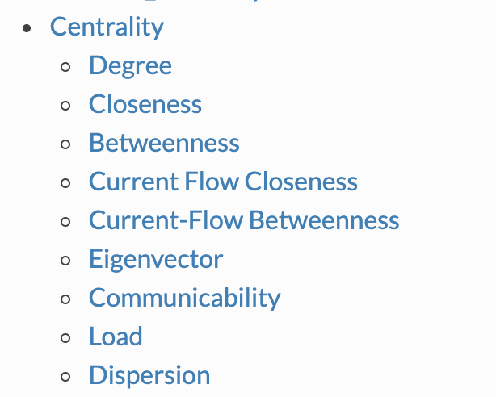

# Social Network Analysis

This page collects definitions, people, traits that spread in networks, and tools for social network analysis.

1. [Wiki](https://en.wikipedia.org/wiki/Social_network)
2. [Paper: algorithmic approach to social networks](http://web.archive.org/web/20240712194953/http://www.cs.carleton.edu/faculty/dlibenno/papers/thesis/thesis.pdf)
3. [Steve Borgatti](https://sites.google.com/site/steveborgatti/home)
4. [Intro to SNA](http://www.orgnet.com/sna.html)
   1. Centrality
   2. Betweenness centrality
   3. Network centralization
   4. Network reach
   5. Network integration
   6. Boundary spanners
   7. Peripheral players
5. [Social Network Analysis: Can Quantity Compensate for Quality?](https://33bits.wordpress.com/2009/02/15/social-network-analysis-can-quantity-substitute-for-quality/)
6. [Nicholas Christakis](http://web.archive.org/web/20110603105212/http://www.wjh.harvard.edu/soc/faculty/christakis/) of Harvard and [James Fowler](http://web.archive.org/web/20150810035527/http://jhfowler.ucsd.edu/) of UC San Diego have produced a series of ground-breaking papers analyzing the spread of various traits in social networks: [obesity](http://content.nejm.org/cgi/content/full/357/4/370), [smoking](http://content.nejm.org/cgi/content/full/358/21/2249), [happiness](http://www.bmj.com/cgi/content/full/337/dec04_2/a2338), and most recently, in collaboration with John Cacioppo, [loneliness](http://papers.ssrn.com/sol3/papers.cfm?abstract_id=1319108). The Christakis-Fowler collaboration has now become [well-known](http://web.archive.org/web/20170808104848/http://jhfowler.ucsd.edu/science_friendship_as_a_health_factor.pdf), but from a technical perspective, what was special about their work?

   It turns out that they found a way to distinguish between the three reasons why people who are related in a social network are similar to each other.

   Homophily is the tendency of people to seek others who are alike. For example, most of us restrict our dates to smokers or non-smokers, mirroring our own behavior.

   Confounding is the phenomenon of related individuals developing a trait because of a (shared) environmental circumstance. For example, people living right next to a McDonald’s might all gradually become obese.

   Induction is the process of one individual passing a trait or behavior on to their friends, whether by active encouragement or by setting an example.
7. [Networkx](https://networkx.org/documentation/networkx-1.10/reference/algorithms.html) — Centrality is just a fraction of the algorithms contained in networkx.

<figure><figcaption>
Networkx algorithms.

Credit: <a href="https://lh3.googleusercontent.com/Z2U_f5O_A407pAxkfZzNLMDjm0LZbFa4bDs2qddvSE2HQ-UbaXHAMRAylOhM7AgblncrxGKHzFvT31O96jKfJ2QgxHK7ntItXsbOxEdlt8eL1HlLUKvvo1tG6kT-txQuxMyAYEif">copied from the original hosted image</a>.
</figcaption></figure>

8. [Social Network analysis from theory to applications](https://towardsdatascience.medium.com/social-network-analysis-from-theory-to-applications-with-python-d12e9a34c2c7) — [Dima Goldenberg](https://www.linkedin.com/in/dimgold/)

## Deprecated links


These links and images no longer work. The original wording is kept here. A same-resource copy, when one was checked, is used above.


- Paper: algorithmic approach to social networks. This address no longer opens: http://www.cs.carleton.edu/faculty/dlibenno/papers/thesis/thesis.pdf
- Nicholas Christakis. This address no longer opens: http://www.wjh.harvard.edu/soc/faculty/christakis/
- James Fowler. This address no longer opens: http://jhfowler.ucsd.edu/
- well-known (science friendship as a health factor PDF). This address no longer opens: http://jhfowler.ucsd.edu/science_friendship_as_a_health_factor.pdf
