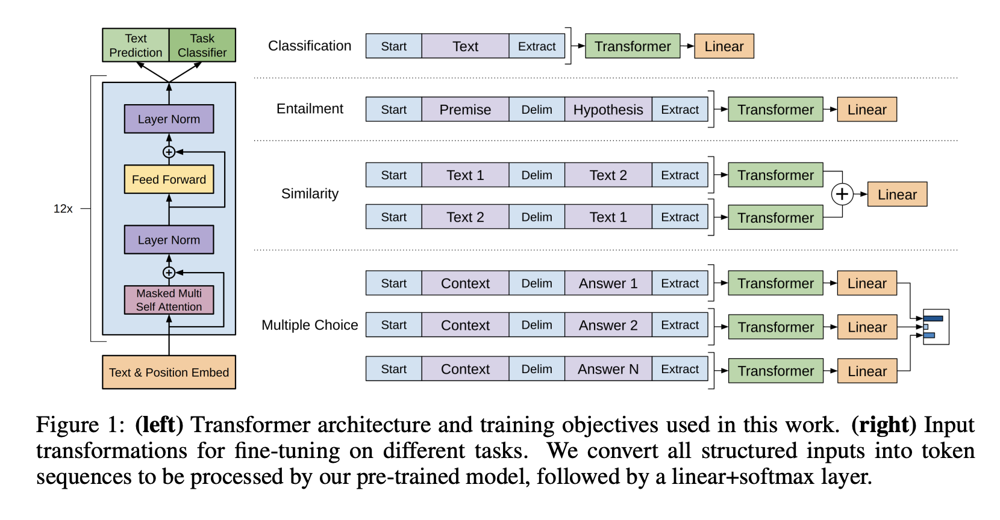

# Data Mesh

1. what is a [data mesh](https://databricks.com/session\_na20/data-mesh-in-practice-how-europes-leading-online-platform-for-fashion-goes-beyond-the-data-lake)? and in practice.
2. [Introduction to Data Mesh](https://www.youtube.com/watch?v=\_bmYXWCxF\_Q) - Zhamak Dehghani
3. (good) [Keynote - Data Mesh by Zhamak Dehghani](https://www.youtube.com/watch?v=L\_-fHo0ZkAo) (oltp->etl->olap is broken)
4. [lake vs mesh, he probably means fabric vs mesh](https://medium.com/codex/data-lakehouse-vs-data-mesh-bfa1132f94b)
5.  (good) [mesh topologies](https://towardsdatascience.com/data-mesh-topologies-and-domain-granularity-65290a4ebb90) - by Piethein Strengholt\

    <figure><figcaption></figcaption></figure>
