# Datasets

A model is only as good as the dataset under it, so this page is the work of typing the data, splitting it, and deciding when the sample is fair.
It moves from structured versus unstructured data through bias, sparsity, train and test splits, sample selection, imbalance, learning curves, distilling, selection, and transfer learning.

### Structured / Unstructured data

The first split is not train versus test but what kind of data you hold at all. The two Webopedia definitions, [Unstructured ](https://www.webopedia.com/TERM/U/unstructured_data.html) and [Structured](https://www.webopedia.com/TERM/S/structured_data.html), are the terms the rest of the page assumes.

### BIAS / VARIANCE

Once the data is typed, the next question is whether it misleads the model, and that starts with bias. The [Various Bias types](https://queue.acm.org/detail.cfm?id=3466134) piece from queue acm is the source of the bias taxonomy in the figure below.

 <figure><figcaption>
Various bias types.
</figcaption></figure>

Bias also hides in how a test set is reused. Lauren Oakden-Rayner's "AI competitions don’t produce useful models" is the [Overfitting your test set, a statistican view point, a great article](https://lukeoakdenrayner.wordpress.com/2019/09/19/ai-competitions-dont-produce-useful-models/) link, the warning that a leaderboard can reward fitting the test set rather than the problem.

The working diagnosis comes from understanding what is the next stage in DL (& ML) algorithm development, the basic approach laid out by [Andrew NG](https://www.youtube.com/watch?v=F1ka6a13S9I). The terms are training, validation, and test. The split is training & validation 70%, test 30%. The procedure is cross fold training and validation, or a further split of the 70% into training and validation. With those three errors in hand, each situation reads off the gap between them.

BIAS, situation 1, is doing much worse than human. The human expert has 1% error, the training set error is 5% (test on train), and the validation set error is 6% (test on validation or CFV). The conclusion is that there is a BIAS between the human expert and the training set. The solution is 1. train deeper or bigger\larger networks, 2. train longer, 3. it may need more data to get to the human expert level, or 4. a new model architecture.

VARIANCE, situation 2, is a validation set error that is not close to the training set error. The human expert has 1% error, the training set error is 2%, and the validation set error is 6%. The conclusion is that there is a VARIANCE problem, i.e. OVERFITTING, between training and validation. The solution is 1. early stopping, 2. regularization, or 3. get more data, or 4. a new model architecture.

Situation 3 is both. The human expert has 1% error, the training set error is 5%, and the validation set error is 10%. The conclusion is that both problems occur, i.e., BIAS as well as VARIANCE, and the solution is to do it all.

The short version: underfitting means get more data; overfitting means early stop and regularization, because the model learns detail and noise. It happens more in non parametric (and non linear) algorithms such as decision trees. Bottom line, a bigger model or more data will solve most issues. The Stanford Machine Learning lecture 10, Advice for applying Machine Learning, gives that advice in practice with [regularized linear regression.](http://www.holehouse.org/mlclass/10_Advice_for_applying_machine_learning.html) The four figures below are the bias and variance situations drawn out.

<figure>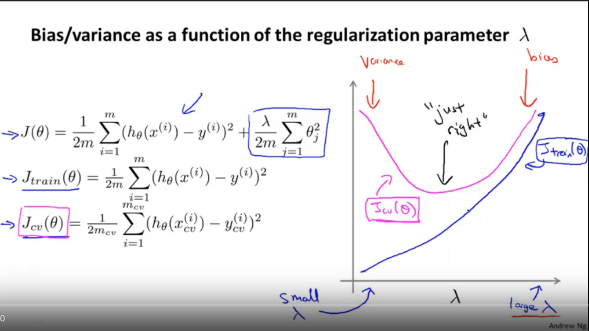<figcaption>
Bias and variance situations.

Credit: <a href="https://lh4.googleusercontent.com/Zg_aGmWE7DxzEUboiliygq923F9Dj6kwmXuCZ2-D4uti4R5HApLcTC-TDaHyb4BLvqRZns6dgTgxABzOObqPvtHIl9Enm5wGCtkC27gNRsnCjzhDxZwaHdwJUTRGu-MpSGvyl72q">copied from the original hosted image</a>.
</figcaption></figure>

<figure>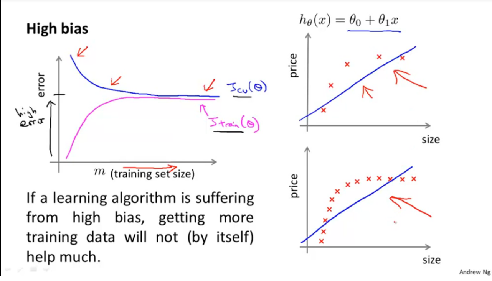<figcaption>
Bias and variance situations.

Credit: <a href="https://lh5.googleusercontent.com/0T7HwSvfvzgWXZTPeKGHmqQK0LhY1B7gJMMxXjAA4UEFlL1H9_7pngyLM8LXnqdvMglswd_UDH2GjymXZs-Lt3ET5ETZSNc3PsGXH5wbccfr61fUiUlRWN1ya6sI-9hHqn1Rg0PP">copied from the original hosted image</a>.
</figcaption></figure>

<figure>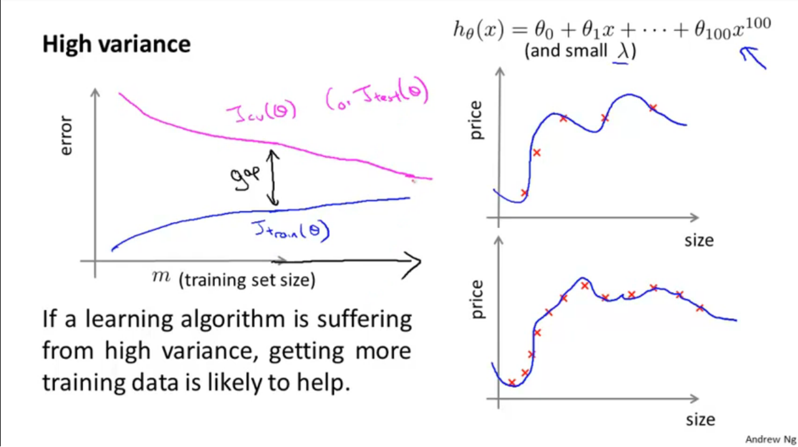<figcaption>
Bias and variance situations.

Credit: <a href="https://lh6.googleusercontent.com/A7XbPpsAfZ59Mehdl96Vm_GfICYZQvl9dNZD-WWuxbvPvbkBJ6DB6KFWFoMtu2nMow9V7yDwpItj4PVi2m8pLYoOkzbCOKscftUvVP-2N49kTWxRedfO7IIQnA-IHIdWoN89Ad-D">copied from the original hosted image</a>.
</figcaption></figure>

<figure>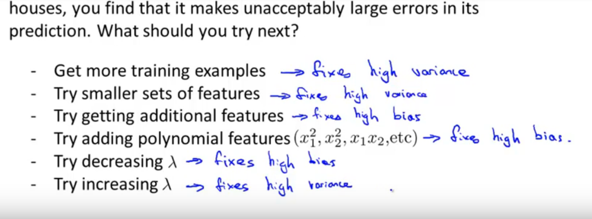<figcaption>
Bias and variance situations.

Credit: <a href="https://lh4.googleusercontent.com/CUYtuclj3O7kKkb8M103Tx96LdES40KCqdXB5-t7tByYj3m-rgEdBLtWdtgdggj8-i-qOTh-GdZA_zJoP-R69sXg2VwelR3glO1zqrvhAt9uvYD5zH_DfqxU4m5wMcmLhL2EgKtQ">copied from the original hosted image</a>.
</figcaption></figure>

IMPORTANT! Those situations assume one distribution, and train/test efficiency changes when the data is from different distributions. For example, TRAIN is 50K hours of voice chatter as the train set for a DLN, and TEST is 10H for a specific voice-based problem, i.e., taxi chatter. Best practice is to divide the validation & test from the same distribution, i.e. the 10H set. The reason is that improving scores on a validation set from a different distribution will not be the same quality as improving scores on a validation set originated from the actual distribution of the problem’s data, i.e., 10H. NOTE: this is unlike the usual supervised learning, where all the data is from the same distribution and we split the training to train and validation (cfv).

[Situation 4](https://youtu.be/F1ka6a13S9I?t=47m26s) is the point in the same talk where this is resolved: however, when there are 2 distributions it’s possible to extend the division of the training set to validation_training and training, and the test to validation and test. The split is Train, Valid_Train = 48K\2K & Valid, Test, 5K & 5K, as drawn below.

<figure>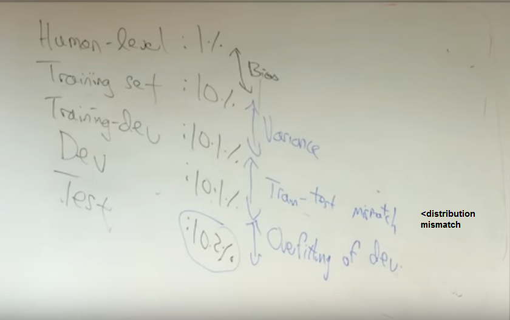<figcaption>
Train and test when two distributions exist.

Credit: <a href="https://lh6.googleusercontent.com/Fllv8NnciZ-EQsdO2zvfLdLt90e3t1BIrXWR5NvAap64k0JdChd7j3ABT6RoE83d0BM5EFgTwW9asrN99yDW58hAPoaOLG8eI43rlO_tK68e-SkHej65LEV0xCfFT5aUI78g4oIQ">copied from the original hosted image</a>.
</figcaption></figure>

So situation 1 stays the same. Situation 2 is the Valid_Train error (train_dev). Situation 3 is the Valid_Test error, where the solution is more data, data synthesis that tweaks the test to be similar to the train data, or a new architecture. Situation 4 is now the Test set error, and the answer is to get more data.

### SPARSE DATASETS

Bias and variance are about the errors; sparsity is about the shape of the data that produces them. [Sparse matrices](https://machinelearningmastery.com/sparse-matrices-for-machine-learning/) in ML come from one hot/tfidf encodings and are stored as a dictionary/list of lists/ coordinate list.

###

### TRAINING METHODOLOGIES

With the data typed and its errors diagnosed, the next choice is how to train on it at all. The same notes are in [Fine tuning](../deep-learning/deep-neural-nets.md#fine-tuning), [Methods](../generative-ai/methods.md), and [Transfer Learning using CNN](../deep-learning/convolutional-nets.md#transfer-learning-using-cnn).

The methodologies run from the plain split to borrowing labels from another dataset or model:

1. Train test split
2. Cross validation
3. Transfer learning - using a pre existing classifier similar to your domain, usually trained on millions of samples. fine-tuned on new data in order to create a new classifier that utilizes that information in the new domain. Examples such as w2v or classic resnet fine-tuning.
4. Bootstrapping training- using a similar dataset, such as yelp, with 5 stars to create a pos/neg sentiment classifier based on 1 star and 5 stars. Finally using that to label or sample select from an unlabelled dataset, in order to create a new classifier or just to sample for annotation etc.
5. The [Student-teacher paradigm](https://developers.facebook.com/videos/2019/from-visual-recognition-to-reasoning/) (facebook), using a big labelled dataset to train a teacher classifier, predicting on unlabelled data, choosing the best classified examples based on probability, using those to train a new student model, finally fine-tune on the labeled dataset to create a more robust model, which is expected to know the unlabelled dataset and the labelled dataset with higher accuracy. With respect to the fully supervised teacher model / baseline.

The same notes are in [PRUNING / KNOWLEDGE DISTILLATION / LOTTERY TICKET](../deep-learning/deep-network-optimization.md#pruning--knowledge-distillation--lottery-ticket).

 <figure>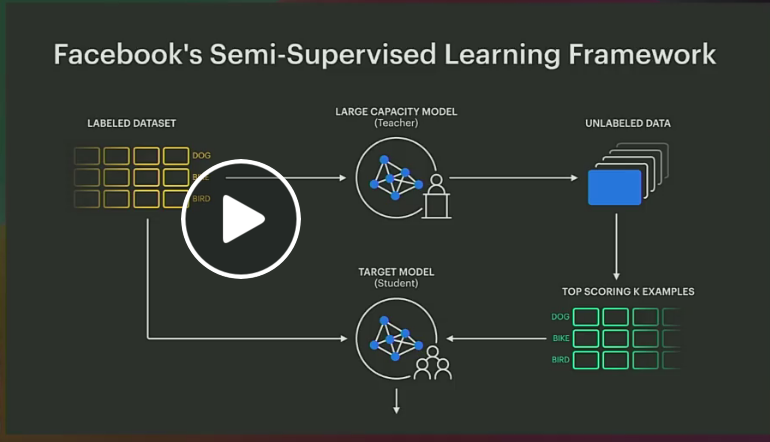<figcaption>
Student–teacher paradigm.

Credit: <a href="https://lh6.googleusercontent.com/U7Zn0WtBMVLvvN4rinTJhzRU4P8zMJB_1SNiGPQzboJfltWzdTUmcoDcc_0lx94qlfHW4QU11wftCujikfvR3StMxOPCE3FTWPhwPqsfCrYj29NIVt8jb1PlU3hv7hq2Y1DscOWH">copied from the original hosted image</a>.
</figcaption></figure>

6. Yoav’s method for transfer learning for languages - train a classifier on labelled data from english and spanish, fine tune using left out spanish data, stop before overfitting. This can be generalized to other domains.

### TRAIN / TEST / CROSS VALIDATION

The first two methodologies above, the split and cross validation, need more care than a single line. The same notes are in [STATISTICAL SAMPLING AND RESAMPLING](probability-and-statistics.md#statistical-sampling-and-resampling).

When rows belong to groups, Scikit-lego on group-based splitting and transformation is the tool for splitting by group; its archived page is in the reference list under dataset selection below.

The holdout and cross-validation figures below are credited to [Images from here](https://www.kdnuggets.com/2017/08/dataiku-predictive-model-holdout-cross-validation.html), the KDnuggets piece on making predictive models robust. It explains that the validation step helps you find the best parameters for your model and prevent overfitting, and weighs the pros and cons of the hold-out strategy against k-fold.

<figure>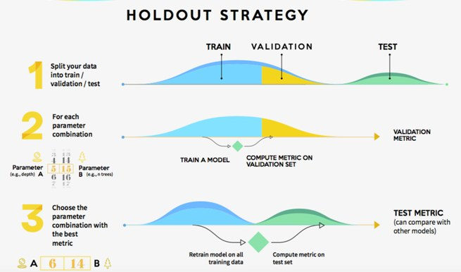<figcaption>
Holdout and cross-validation.

Credit: <a href="https://lh3.googleusercontent.com/v_T8IXtpI7PhjIrwPjLqsh0rEGm-ejpzFK1FlDRByqkpm1sWHxtKCMkspBW9omVpJo-EhuURiipbqEFM_yVZIviCp7XtI8RMLPd347ccOkmjOADJjPuSUl8sd-2eQmpK1SoJgg_R">copied from the original hosted image</a>.
</figcaption></figure>

<figure>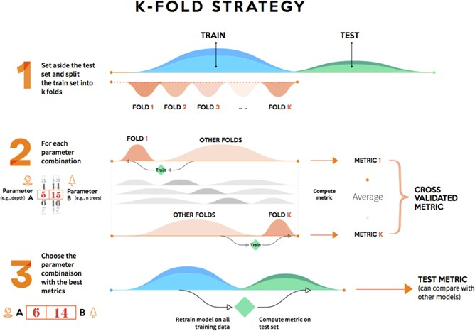<figcaption>
Holdout and cross-validation.

Credit: <a href="https://lh4.googleusercontent.com/5MFk9a4mEfSMCu4za3oxTshh4TD5X4cAvyqXuIYqJhiV7UwG4sybQWKXk-PfWpZ15lZtzEurEFH7r-LoF-kvZMqzreRCsZUf9VLoujj8sCf-4EsnIQgkuEjnhNGiYYO7AQ12mf0C">copied from the original hosted image</a>.
</figcaption></figure>

Jason Brownlee's [Train Test methodology](http://machinelearningmastery.com/how-to-choose-the-right-test-options-when-evaluating-machine-learning-algorithms/) post is about choosing test options, which can mean the difference between over-learning, a mediocre result, and a usable state-of-the-art result, and it walks the standard options below. Before that, the roles of the three sets need to be fixed, and the Stack Exchange answer on test versus validation sets puts it this way:

“[The training](https://stats.stackexchange.com/questions/19048/what-is-the-difference-between-test-set-and-validation-set) set is used to fit the models; the validation set is used to estimate prediction error for model selection; the test set is used for assessment of the generalization error of the final chosen model. Ideally, the test set should be kept in a “vault,” and be brought out only at the end of the data analysis”

The test options then build on each other, each fixing the previous one's problem. Random split tests of 66\33 have a problem: variance each time we rerun. Multiple random split tests have their own problem: samples may not be included in train\test or may be selected multiple times. Cross validation is pretty good, though a different random seed results in a different mean accuracy, with variance due to randomness. Multiple cross validation accounts for the randomness of the CV. Finally, statistical significance (t-test) on multi CV asks whether two samples are drawn from the same population (no difference); if “yes”, the result is not significant, even if the mean and std deviations differ.

Finally, when in doubt, use k-fold cross validation (k=10) and use multiple runs of k-fold cross validation with statistical significance tests. For ensembles there is one more variant: [Out of fold](https://machinelearningmastery.com/out-of-fold-predictions-in-machine-learning/) predictions - leave unseen data, do cross fold on that. Good for ensembles.

### SAMPLE SELECTION

A split only divides the rows you already have; sample selection decides how many rows you need in the first place. The same notes are in [A/B Testing](../decision-intelligence/a-b-testing.md).

The guide on [How to choose your sample size from a population based on confidence interval](https://www.checkmarket.com/blog/how-to-estimate-your-population-and-survey-sample-size/) now lands on Medallia Agile Research, the Medallia page for DIY surveys and research analytics. The figure below is the sample size from a population picture that sat with that guide.

 <figure>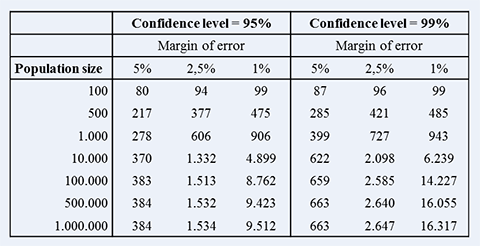<figcaption>
Sample size from a population.

Credit: <a href="https://lh3.googleusercontent.com/gzSA5OXGcheJTZbY8Vj10NOBmumc9-v87G0G1sKF8cRP8rQegw5vE_hvadFSZLNwY9p6ZQ7bgL61RIcSwv-gBUUycp_0dx6yCpDgr3G2JAKVt4-Bq9Hpqri65B0Jr57MDqUekf-d">copied from the original hosted image</a>.
</figcaption></figure>

For training data rather than surveys, MachineLearningMastery's "How Much Training Data is Required for Machine Learning?" is the [Data advice, should we get more data? How much](https://machinelearningmastery.com/much-training-data-required-machine-learning/) question answered directly.

Sometimes the problem is not how many samples but how to draw them at all. Gibbs sampling: Gibbs Sampling is a MCMC method to draw samples from a potentially really really complicated, high dimensional distribution, where analytically, it’s hard to draw samples from it. The usual suspect would be those nasty integrals when computing the normalizing constant of the distribution, especially in Bayesian inference. Now Gibbs Sampler can draw samples from any distribution, provided you can provide all of the conditional distributions of the joint distribution analytically. A Python implementation is in the reference list under dataset selection below.

###

### IMBALANCED DATASETS

Even a well-sized sample can be lopsided, and imbalance is the case where one label dominates. The same notes are in [Decision Trees](../predictive-ml/decision-trees.md) and [Unbalanced labels](../problem-framing/label-algorithms.md#unbalanced-labels).

The imbalanced-learn over-sampling guide is the place to start ([the BEST resource and a great api for python)](http://contrib.scikit-learn.org/imbalanced-learn/stable/over_sampling.html) with visual samples - it actually works well on clustering. MachineLearningMastery then covers the two main levers: Cost-Sensitive Learning for Imbalanced Classification is the [Mastery on](https://machinelearningmastery.com/cost-sensitive-learning-for-imbalanced-classification/) cost-sensitive link, and SMOTE for Imbalanced Classification with Python is the [Smote for imbalance](https://machinelearningmastery.com/smote-oversampling-for-imbalanced-classification/) walkthrough.

For deep networks the evidence is the [Systematic Investigation of imbalance effects in CNN’s](https://arxiv.org/abs/1710.05381), with several observations. This is crucial when training networks, because in real life you don’t always get a balanced DS.

They recommend the following:

1. (i) the effect of class imbalance on classification performance is detrimental;
2. (ii) the method of addressing class imbalance that emerged as dominant in almost all analyzed scenarios was oversampling;
3. (iii) oversampling should be applied to the level that totally eliminates the imbalance, whereas undersampling can perform better when the imbalance is only removed to some extent;
4. (iv) as opposed to some classical machine learning models, oversampling does not necessarily cause overfitting of CNNs;
5. (v) thresholding should be applied to compensate for prior class probabilities when overall number of properly classified cases is of interest.

Those findings reduce to a few general rules:

1. Many samples - undersampling
2. Few samples - over sampling
3. Consider random and non-random schemes
4. Different sample rations, instead of 1:1 (proof? papers?)

The full menu of balancing techniques follows. The Wikipedia entry on oversampling and undersampling in data analysis, the imbalanced-learn package for tackling the curse of imbalanced datasets, and its documentation examples are the references for balancing data sets ([wiki](https://en.wikipedia.org/wiki/Oversampling_and_undersampling_in_data_analysis), [scikit learn](https://github.com/scikit-learn-contrib/imbalanced-learn) & [examples in SKLEARN](http://contrib.scikit-learn.org/imbalanced-learn/auto_examples/index.html)):

1. Oversampling the minority class
 - (Random) duplication of samples
 - SMOTE (in weka + needs to be installed & paper) - find k nearest neighbours,

 $$\text{New\_Sample} = (\text{random num in [0,1]}) * \text{vec(ki,current\_sample)}$$

 - (in weka) The nearestNeighbors parameter says how many nearest neighbor instances (surrounding the currently considered instance) are used to build an in between synthetic instance. The default value is 5. Thus the attributes of 5 nearest neighbors of a real existing instance are used to compute a new synthetic one.
 - (in weka) The percentage parameter says how many synthetic instances are created based on the number of the class with less instances (by default - you can also use the majority class by setting the -Coption). The default value is 100. This means if you have 25 instances in your minority class, again 25 instances are created synthetically from these (using their nearest neighbours' values). With 200% 50 synthetic instances are created and so on.
 - ADASYN - shifts the classification boundary to the minority class, synthetic data generated for majority class.
2. Undersampling the majority class
 - Remove samples
 - Cluster centroids - replaces a cluster of samples (k-means) with a centroid.
 - Tomek links - cleans overlapping samples between classes in the majority class.
 - Penalizing the majority class during training
3. Combined over and under (hybrid) - i.e., SMOTE and tomek/ENN
4. Ensemble sampling
 - EasyEnsemble
 - BalanceCascade
5. Dont balance, try algorithms that perform well with unbalanced DS
 - Decision trees - C4.5\5\CART\Random Forest
 - SVM
6. Penalize Models -
 - added costs for misclassification on the minority class during training such as penalized-SVM
 - a [CostSensitiveClassifier](http://weka.sourceforge.net/doc.dev/weka/classifiers/meta/CostSensitiveClassifier.html) meta classifier in Weka that wraps classifiers and applies a custom penalty matrix for miss classification.
 - complex

##

### LEARNING CURVES

Every fix above, from more data to rebalancing, needs a way to see whether it helped, and learning curves are that view. The [Git examples](https://gist.github.com/orico/260097cb1a2926c6b6ca6f71c37c135b) gist is Learning Curves for under/overfitting evaluation, and the [Sklearn examples](https://stats.stackexchange.com/questions/283738/sklearn-learning-curve-example) thread starts from scikit-learn's learning-curve figure, where an SVM seems to need more training examples, and asks how that is justified when both the training and validation scores are near perfect. For the bias and variance reading, the Practical advice for applying machine learning post on a technology, programming, and machine learning blog is the [Understanding bias variance via learning curves](http://digitheadslabnotebook.blogspot.com/2011/12/practical-advice-for-applying-machine.html) link.

Curves can also decide how much to sample. [learning curve sampling applied to model based clustering](http://www.jmlr.org/papers/volume2/meek02a/meek02a.pdf) - seemed like active learning, i.e., sample using EM/cluster to achieve nearly as accurate on all data. That leads to predicting the sample size required for training, and the morning paper's "Deep learning scaling is predictable, empirically" is the [Advice on many things, including learning curves](https://blog.acolyer.org/2018/03/28/deep-learning-scaling-is-predictable-empirically/amp/) link:

This is a really wonderful study with far-reaching implications that could even impact company strategies in some cases. It starts with a simple question: “how can we improve the state of the art in deep learning?” We have three main lines of attack:

1. We can search for improved model architectures.
2. We can scale computation
3. We can create larger training data sets.

### DISTILLING DATA

Larger training sets are one answer; distilling asks whether a smaller, better set does as well. The same notes are in [Dataset Confidence](dataset-confidence.md).

The Medium write-up on this used to sit here and is kept at the end of the page; the paper itself is [Dataset Cartography: Mapping and Diagnosing Datasets with Training Dynamics](https://arxiv.org/abs/2009.10795). What I found interesting about this paper is that it challenges the common approach of “the more the merrier” when it comes to training data, and shifts the focus from the quantity of the data to the quality of the data.

###

### DATASET SELECTION

After deciding which rows to keep, the last choice is which dataset, or which source model, to start from. The same notes are in [Fine tuning](../deep-learning/deep-neural-nets.md#fine-tuning), [Methods](../generative-ai/methods.md), and [Transfer Learning using CNN](../deep-learning/convolutional-nets.md#transfer-learning-using-cnn).

"How to Choose the Best Source Model for Transfer Learning" on [Medium](https://medium.com/@amielmeiseles/how-to-choose-the-best-source-model-for-transfer-learning-41d5c91c1338) assumes a basic familiarity with transfer learning and points readers who need a refresher to A Comprehensive Hands-on Guide to Transfer Learning with Real-World Applications in Deep Learning; its figure is below.

<figure>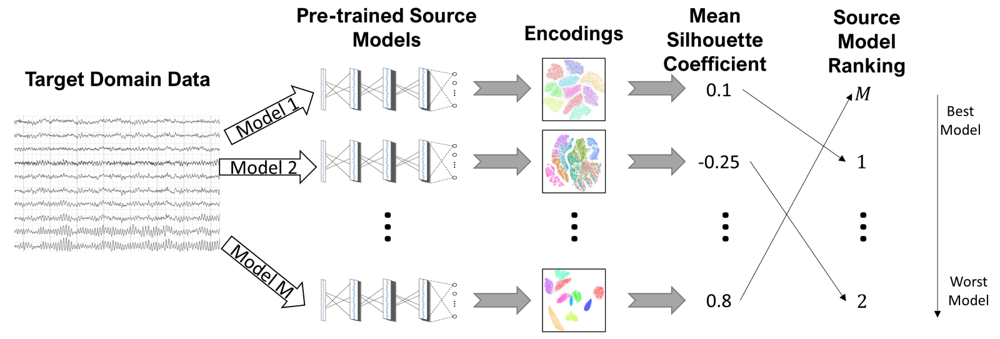<figcaption>
Dataset selection for transfer learning.

Credit: <a href="https://lh3.googleusercontent.com/J9qBdrVcRj5iz0X7-8XjFV4zqNNQpT_MNOCt2Xb1wh34kX8ui82KagDKV88iyUb4BG9Tkos8CfMTjfd25xT1D4DY9869qmaQX_fWVg6KG4qaMCMDCUfPMVQiPaRACAlQ8r40Kesh">copied from the original hosted image</a>.
</figcaption></figure>

The full addresses of the sources used across this page are collected here, each tied to the section it serves:

- The test-set overfitting warning from the bias section, Overfitting your test set, a statistican view point, a great article: [https://lukeoakdenrayner.wordpress.com/2019/09/19/ai-competitions-dont-produce-useful-models/?fbclid=IwAR1WM5U7imq-2LFPifyCoTPp-MFwPoGROMLr2TZWAp41qgVeLdT-2bkLyk&blogsub=confirming#subscribe-blog](https://lukeoakdenrayner.wordpress.com/2019/09/19/ai-competitions-dont-produce-useful-models/?fbclid=IwAR1WM5U7imq-2LFPifyCoTPp-MFwPoGROMLr2TZWAp41qgVeLdT-2bkLyk&blogsub=confirming#subscribe-blog)
- Cost-Sensitive Learning for Imbalanced Classification - MachineLearningMastery.com, the Mastery on cost sensitive sampling from the imbalance section: [https://machinelearningmastery.com/cost-sensitive-learning-for-imbalanced-classification/?fbclid=IwAR0_DeIydTAAkutypcMBfrnC4QyuyqVxDu_uej5t48AvQKShcRUqfMm8Rqo](https://machinelearningmastery.com/cost-sensitive-learning-for-imbalanced-classification/?fbclid=IwAR0_DeIydTAAkutypcMBfrnC4QyuyqVxDu_uej5t48AvQKShcRUqfMm8Rqo)
- SMOTE for Imbalanced Classification with Python - MachineLearningMastery.com, the Smote for imbalance walkthrough: [https://machinelearningmastery.com/smote-oversampling-for-imbalanced-classification/?fbclid=IwAR3W59c54ohoaIHnHLQFCcZZanFXI4QzIzuWiUtaUC851JFkwlevCAgvpbM](https://machinelearningmastery.com/smote-oversampling-for-imbalanced-classification/?fbclid=IwAR3W59c54ohoaIHnHLQFCcZZanFXI4QzIzuWiUtaUC851JFkwlevCAgvpbM)
- The paper behind the distilling section, Dataset Cartography: Mapping and Diagnosing Datasets with Training Dynamics: [https://arxiv.org/abs/2009.10795](https://arxiv.org/abs/2009.10795)
- A Comprehensive Hands-on Guide to Transfer Learning with Real-World Applications in Deep Learning, subtitled Deep Learning on Steroids with the Power of Knowledge Transfer!, for transfer learning in deep learning: [https://towardsdatascience.com/a-comprehensive-hands-on-guide-to-transfer-learning-with-real-world-applications-in-deep-learning-212bf3b2f27a](https://towardsdatascience.com/a-comprehensive-hands-on-guide-to-transfer-learning-with-real-world-applications-in-deep-learning-212bf3b2f27a)
- The archived Scikit-lego page on group-based splitting and transformation from the train/test section: [https://web.archive.org/web/2020/https://scikit-lego.readthedocs.io/en/latest/meta.html#Grouped-Prediction](https://web.archive.org/web/2020/https://scikit-lego.readthedocs.io/en/latest/meta.html#Grouped-Prediction)
- Agustinus Kristiadi's blog example of a Gibbs sampling implementation in Python to sample from a Bivariate Gaussian, for the Gibbs sampling note: [https://web.archive.org/web/2020/https://wiseodd.github.io/techblog/2015/10/09/gibbs-sampling/](https://web.archive.org/web/2020/https://wiseodd.github.io/techblog/2015/10/09/gibbs-sampling/)

#### TRANSFER LEARNING

A chosen source model ends the story where the methodologies began, with transfer learning, drawn here as it is done in deep learning.

 <figure>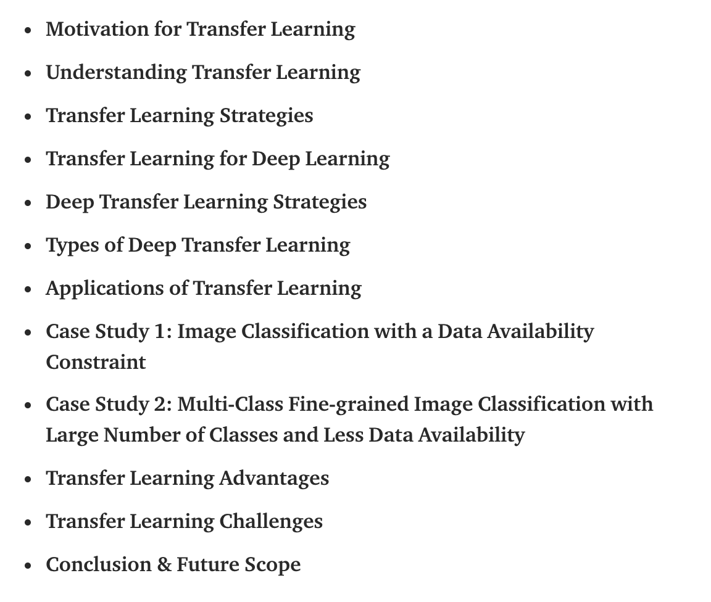<figcaption>
Transfer learning.

Credit: <a href="https://lh3.googleusercontent.com/xUFaHrHjaypItfpjfzNEZ_Zv2BZJWieQuoBGLXfEnqNJr1PjQXt6D-TJpgaSfhU-BmoMiNqVfQFXMwBFIuvnxRYM6yZS2fxLfd9RoYRto8Bm5oeQZekUqQzO1HZP203PRu3wQT07">copied from the original hosted image</a>.
</figcaption></figure>

## Deprecated links


These links and images no longer work. The original wording is kept here. A same-resource copy, when one was checked, is used above.

- Scikit-lego on group-based splitting and transformation. This address no longer opens: https://scikit-lego.readthedocs.io/en/latest/meta.html#Grouped-Prediction
- SMOTE (in weka + needs to be installed & paper). This address no longer opens: http://www.jair.org/media/953/live-953-2037-jair.pdf
- Gibbs sampling:. This address no longer opens: https://wiseodd.github.io/techblog/2015/10/09/gibbs-sampling/
- Advice on many things, including learning curves. This address no longer opens: https://blog.acolyer.org/2018/03/28/deep-learning-scaling-is-predictable-empirically/amp/?fbclid=IwAR0V1X1vuCZYmeku12YHJI7wwK7RCKEyE2Q7aRDDT58hjRPzAOrHfvo98WY
- Medium on this Dataset Cartography: Mapping and Diagnosing Datasets with Training Dynamics. This address no longer opens: https://towardsdatascience.com/data-maps-datasets-can-be-distilled-too-1991c3c260d6
