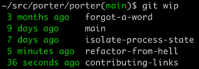

# Data Science Tools

The workbench for data science is Python and the libraries around it, plus a notebook and a way to keep environments from colliding.
The page starts with the language itself, its async, clean-code, and virtual-environment habits, then moves to Jupyter, SciPy, NumPy, Pandas and EDA, and closes with Git.

## Python

Everything else on the bench is written in Python, so the first habit is writing the language well. [How to use better OOP in python.](https://hackernoon.com/improve-your-python-python-classes-and-object-oriented-programming-d09ff461168d) is "Improve Your Python: Python Classes and Object Oriented Programming" on HackerNoon, the author's most popular post and an accessible introduction to classes and OOP. [Best practices programming python classes - a great lecture.](https://www.youtube.com/watch?v=HTLu2DFOdTg) is "Python's Class Development Toolkit", published by Next Day Video.

Once the code is organized, the next questions are what it costs and what it promises. [How to know pip packages size](https://stackoverflow.com/questions/34266159/how-to-see-pip-package-sizes-installed) is the question of how to list every installed pip package with the disk space each one takes up. [Python type checking tutorial](https://medium.com/@ageitgey/learn-how-to-use-static-type-checking-in-python-3-6-in-10-minutes-12c86d72677b) is Adam Geitgey on static type checking in Python 3.6, the answer to the complaint that Python variables are dynamically typed. For scripts other people run, [Import click - command line interface](https://zetcode.com/python/click/) is Jan Bodnar's tutorial on building command line interfaces with the click module, an alternative to optparse and argparse.

Speed is the last Python question, and it starts with a distinction. [Concurrency vs Parallelism (great)](https://stackoverflow.com/questions/1050222/what-is-the-difference-between-concurrency-and-parallelism) is the question that separates the two. [Async in python](https://medium.com/velotio-perspectives/an-introduction-to-asynchronous-programming-in-python-af0189a88bbb) introduces asynchronous programming as a unit of work that runs separately from the main thread and reports back when it completes or fails. [Coroutines vs futures](https://stackoverflow.com/questions/34753401/difference-between-coroutine-and-future-task-in-python-3-5) is the difference between a coroutine and a future or task in Python 3.5. Three notes that went with it, coroutines generators async wait, an intro to concurrent,futures, and future task event loop, used to link here; they are kept at the end of the page.

### Async io

The async note above needs one library to make it concrete, and that is asyncio. The [Intro](https://realpython.com/lessons/what-asyncio/) is Real Python's lesson on what Async IO is, how it differs from multiprocessing, and how requests are dispatched and responses handled through the event loop. The [complete](https://realpython.com/async-io-python/) version is the full Real Python walk-through that follows the lesson.

### Clean code

Fast code still has to be readable by the next person. [Clean code in python git](https://github.com/zedr/clean-code-python) is the repository of Clean Code concepts adapted for Python, :bathtub: included. [About the book](https://medium.com/@m_mcclarty/tech-book-talk-clean-code-in-python-aa2c92c6564f) is the book talk that goes with clean code in Python.

### Virtual Environments

Clean code breaks anyway when two projects need different versions of the same package, which is why the environment has to be isolated. The number of tools is the confusing part, so the first stop is [stack overflow on pyenv / venv / etc](https://stackoverflow.com/questions/41573587/what-is-the-difference-between-venv-pyvenv-pyenv-virtualenv-virtualenvwrappe), the question of how Python 3.3's standard-library venv differs from every other package matching the (py)?(v|virtual|pip)?env pattern. [Guide to pyenv & pyenv virtualenv](https://medium.com/swlh/a-guide-to-python-virtual-environments-8af34aa106ac) is Ray Johns on nearly-painless virtual Python installations with pyenv, pyenv-virtualenv, and Homebrew. [Managing virtual env with pyenv](https://medium.com/data-science/managing-virtual-environment-with-pyenv-ae6f3fb835f8) is for the point where tens of environments for different projects become daunting, and pyenv streamlines creating, managing, and activating them.

The shortest advice is: Just use venv. The article behind that advice no longer opens and is kept at the end of the page. The same stack overflow question is also the [Summary on all the *envs](https://stackoverflow.com/questions/41573587/what-is-the-difference-between-venv-pyvenv-pyenv-virtualenv-virtualenvwrappe), and [A really good primer on virtual environments](https://realpython.com/python-virtual-environments-a-primer/) is Real Python's primer. [Introduction to venv](http://cewing.github.io/training.python_web/html/presentations/venv_intro.html) is the venv presentation from Internet Programming with Python.

Pipenv is the tool that folds the environment and the dependencies into one workflow. [Pipenv](https://pipenv.readthedocs.io/en/latest/) is its documentation, "Python Development Workflow for Humans". [A great intro to pipenv](https://realpython.com/pipenv-guide/) is Real Python's guide to the packaging tool, and [A complementary to pipenv above](https://robots.thoughtbot.com/how-to-manage-your-python-projects-with-pipenv) is Murtaza Gulamali on using Pipenv to simplify dependency management in Python projects. For the side-by-side, the [Comparison between all *env](https://stackoverflow.com/questions/41573587/what-is-the-difference-between-venv-pyvenv-pyenv-virtualenv-virtualenvwrappe) is that same stack overflow thread again.

The environment then has to reach the notebook. Two sources did that work: pyenv, virtualenv and using them with Jupyter, a make sense tutorial and instructions on how to use all, and Create isolated Jupyter ipython kernels with pyenv and virtualenv by alfredo motta. Both addresses are kept at the end of the page. What still opens is [Jupyter Notebook in a virtual env](https://medium.com/data-science/jupyter-notebooks-i-getting-started-with-jupyter-notebooks-f529449797d2), which shows how to install a kernelspec so Jupyter Notebook can reach your Python data science virtual environments.

#### PYENV

Of all the tools above, pyenv is the one that also switches the Python version itself. [Installing pyenv](https://bgasparotto.com/install-pyenv-ubuntu-debian) is the install on Ubuntu and other Debian distributions, so you can quickly switch between Python versions. [Intro to pyenv](https://realpython.com/intro-to-pyenv/) is Real Python on managing multiple Python versions with it. [Pyenv tutorial and finding where it is](https://anil.io/blog/python/pyenv/using-pyenv-to-install-multiple-python-versions-tox/) covers installing, managing, and switching between versions, most commonly to test code across multiple Python environments. On a Mac the system Python gets in the way: [Pyenv override system python on mac](https://github.com/pyenv/pyenv/issues/660) is the pyenv issue about being unable to override the Python 2.7.10 that came with OSX 10.11.5 after a Homebrew install. The last step is pyenv virtualenv, which joins pyenv to the environment notes above.

## Jupyter

With the environment in place, the notebook is where the work actually happens. The same notes are in [Docker](../../ai-engineering/devops/full-stack-and-ops/docker.md) and [Docker for data science](../../ai-engineering/mlops/full-stack-and-ops.md#docker-for-data-science).

A notebook needs hardware first. [Cloud GPUS cheap](https://www.paperspace.com/gradient) is the MLops platform page, now on DigitalOcean, for building and scaling an AI project on GPUs. Inside the notebook the daily habits come next. [Importing a notebook as a module](http://jupyter-notebook.readthedocs.io/en/latest/examples/Notebook/Importing%20Notebooks.html) is the Jupyter documentation for importing notebooks as modules. The important [colaboratory commands for jupytr](https://medium.com/deep-learning-turkey/google-colab-free-gpu-tutorial-e113627b9f5d) are in the Google Colab free GPU tutorial. Timing and profiling in Jupyter used to have its own page, kept at the end. ([Debugging in Jupyter, how?)](https://kawahara.ca/how-to-debug-a-jupyter-ipython-notebook/) - put a one liner before the code and query the variables inside a function. [28 tips n tricks for jupyter](https://www.dataquest.io/blog/jupyter-notebook-tips-tricks-shortcuts/) is Celeste Grupman's list of tips, tricks, and shortcuts for turning into a Jupyter notebooks power user.

The notebook can also become the package, which is the idea of Jupyter notebooks as a module. [Nbdev](https://github.com/fastai/nbdev) is the repository for creating delightful software with Jupyter Notebooks, and its site on [fast.ai](https://nbdev.fast.ai/) puts writing, testing, documenting, and distributing packages and technical articles all in one place, your notebook. The older Nbdev announcement is kept at the end of the page. [jupytext](https://github.com/mwouts/jupytext) goes the other way and stores Jupyter Notebooks as Markdown Documents, Julia, Python or R scripts.

The environment from the Python section has to be wired into Jupyter by hand. These are the steps for virtual environments in jupyter (their original page is kept at the end):

 1. Enter your project directory
 2. $ python -m venv projectname
 3. $ source projectname/bin/activate
 4. (venv) $ pip install ipykernel
 5. (venv) $ ipython kernel install --user --name=projectname
 6. Run jupyter notebook * (not entirely sure how this works out when you have multiple notebook processes, can we just reuse the same server?)
 7. Connect to the new server at port 8889

[Virtual env with jupyter](https://janakiev.com/til/jupyter-virtual-envs/) is the page that walks the same setup.

Inside a notebook, the first array operation that confuses people is reshape. ([how does reshape work?)](http://anie.me/numpy-reshape-transpose-theano-dimshuffle/) - a shape of (2,4,6) is like a tree of 2->4 and each one has more leaves 4->6.

As far as i can tell, reshape effectively flattens the tree and divide it again to a new tree, but the total amount of inputs needs to stay the same. 2*4*6 = 4*2*3*2 for example

The code below shows it on a random array:

```python
import numpy
rng = numpy.random.RandomState(234)
a = rng.randn(2,3,10)
print(a.shape)
print(a)
b = numpy.reshape(a, (3,5,-1))
print(b.shape)
print(b)
```

When the laptop is not enough, the notebook moves to someone else's GPU. *** A tutorial for [Google Colaboratory - free Tesla K80 with Jup-notebook](https://www.kdnuggets.com/2018/02/google-colab-free-gpu-tutorial-tensorflow-keras-pytorch.html/2) shows deep learning development in Colab on the free Tesla K80 GPU with Keras, TensorFlow and PyTorch. [Jupyter on Amazon AWS](https://blog.keras.io/running-jupyter-notebooks-on-gpu-on-aws-a-starter-guide.html) is the Keras blog starter guide to running notebooks on GPU on AWS.

How to add extensions to jupyter: [extensions](https://codeburst.io/jupyter-notebook-tricks-for-data-science-that-enhance-your-efficiency-95f98d3adee4) is Nok Chan's Jupyter tricks for data science, updated with a table of contents, the %debug magic, and nbdime for notebook diffing. [Connecting from COLAB to MS AZURE](https://medium.com/@d.sakryukin/simple-cryptocurrency-trading-data-preparation-in-15-minutes-using-ms-azure-and-google-colab-44872b023d11) is Dmitriy Sakryukin's cryptocurrency trading data preparation in 15 minutes using MS Azure and Google Colab.

A notebook is also where a result first gets shown to someone, and that is where the dashboard tools compete. [Streamlit vs. Dash vs. Shiny vs. Voila vs. Flask vs. Jupyter](https://medium.com/data-science/streamlit-vs-dash-vs-shiny-vs-voila-vs-flask-vs-jupyter-24739ab5d569) is Markus Schmitt's comparison, written as Dash and Streamlit surged in popularity as all-in-one dashboarding solutions. Its older address is kept at the end of the page.

## SciPy

Beside the notebook, SciPy is the library you reach for when the question is a minimum or a maximum. [Optimization problems, a nice tutorial](http://scipy-lectures.org/advanced/mathematical_optimization/) is the Scipy lecture notes chapter on mathematical optimization, finding minima of functions. For the simpler case, [Minima / maxima](https://stackoverflow.com/questions/4624970/finding-local-maxima-minima-with-numpy-in-a-1d-numpy-array) asks for a numpy or scipy function that finds local maxima and minima in a 1D array instead of checking nearest neighbours by hand.

## NumPy

SciPy runs on NumPy arrays, and the speed of both comes from not writing loops. [Using numpy efficiently](https://speakerdeck.com/cournape/using-numpy-efficiently) - explaining why vectors work faster, through broadcasting, indexing, and basic internals.
[Fast vector calculation, a benchmark](https://medium.com/data-science/data-science-with-python-turn-your-conditional-loops-to-numpy-vectors-9484ff9c622e) between list, map, vectorize. Vectorize wins. The idea is to use vectorize and a function that does something that may involve if conditions on a vector, and do it as fast as possible.

## Pandas

NumPy gives fast arrays, and Pandas puts names, rows, and columns on top of them, which is where most exploratory work lives. The same notes are in [Multi CPU Processing](multi-cpu-processing.md).

The starting point is a [Great introductory tutorial](http://nikgrozev.com/2015/12/27/pandas-in-jupyter-quickstart-and-useful-snippets/#loading_csv_files) about using pandas, loading, loading from zip, seeing the table’s features, accessing rows & columns, boolean operations, calculating on a whole row/column with a simple function and on two columns even, dealing with time/date parsing. Once the basics are comfortable, reshaping is next: [Visualizing pandas pivoting and reshaping functions by Jay Alammar](http://jalammar.github.io/visualizing-pandas-pivoting-and-reshaping/) picks up after 10 Minutes to pandas and shows the Reshaping and Pivot Tables functions visually. [How to beautify pandas dataframe using html display](https://stackoverflow.com/questions/26873127/show-dataframe-as-table-in-ipython-notebook) is the question of why only the last DataFrame prints as a table in an iPython notebook and how to force both.

Speed is the next problem. [Speeding up pandas](https://realpython.com/fast-flexible-pandas/) is Real Python on making pandas projects fast, flexible, easy and intuitive. [The fastest way to select rows by columns, by using masked values](https://stackoverflow.com/questions/17071871/select-rows-from-a-dataframe-based-on-values-in-a-column-in-pandas) (benchmarked): is the pandas version of SQL's `SELECT * FROM table WHERE column_name = some_value`, and the winner is:

```
def mask_with_values(df): mask = df['A'].values == 'foo' return df[mask]
```

Past that, the answer is parallelism, pools, threads, dask; that source is kept at the end of the page. [Accessing dataframe rows, columns and cells](http://pythonhow.com/accessing-dataframe-columns-rows-and-cells/)- by name, by index, by python methods. When you do have to go row by row, [Looping through pandas](https://medium.com/swlh/how-to-efficiently-loop-through-pandas-dataframe-660e4660125d) is for looping through each row of a large DataFrame with complex computation. How to inject headers into a headless CSV file used to be linked here and is kept at the end.

Time is the column that needs the most care. [Dealing with time series](http://pandas.pydata.org/pandas-docs/stable/timeseries.html) in pandas, starts from the pandas date functionality documentation. To [Create a new column](https://stackoverflow.com/questions/25570147/add-new-column-based-on-boolean-values-in-a-different-column) based on a (boolean or not) column and calculation: there are three ways, using python (map), using numpy, or using a function (not as pretty). Given a DataFrame, the [shift](http://machinelearningmastery.com/convert-time-series-supervised-learning-problem-python/)() function can be used to create copies of columns that are pushed forward (rows of NaN values added to the front) or pulled back (rows of NaN values added to the end):

 1. df['t'] = [x for x in range(10)]
 2. df['t-1'] = df['t'].shift(1)
 3. df['t-1'] = df['t'].shift(-1)

[Row and column sum in pandas and numpy](http://blog.mathandpencil.com/column-and-row-sums) is the Math and Pencil note on column and row sums in Pandas and Numpy.

A dataframe that loads is not yet a dataframe you can trust, so validation comes next. [Dataframe Validation In Python](https://www.youtube.com/watch?time_continue=905&v=1fHGXOfiDO0) - A Practical Introduction - Yotam Perkal - PyCon Israel 2018. In this talk, I will present the problem and give a practical overview (accompanied by Jupyter Notebook code examples) of three libraries that aim to address it: Voluptuous - Which uses Schema definitions in order to validate data [[https://github.com/alecthomas/voluptuous](https://github.com/alecthomas/voluptuous)] Engarde - A lightweight way to explicitly state your assumptions about the data and check that they're actually true [[https://github.com/TomAugspurger/engarde](https://github.com/TomAugspurger/engarde)] * TDDA - Test Driven Data Analysis [ [https://github.com/tdda/tdda](https://github.com/tdda/tdda)]. By the end of this talk, you will understand the Importance of data validation and get a sense of how to integrate data validation principles as part of the ML pipeline. Those three repositories are Voluptuous, a Python data validation library despite the name; engarde, a library for defensive data analysis; and tdda, test-driven data analysis functions.

The same notes are in [Data & Model Tests](../../evals/data-and-model-tests.md).

With valid data, the everyday operations are iterating, grouping, and flattening. [Stop using itterows](https://medium.com/@rtjeannier/pandas-101-cont-9d061cb73bfc) use apply, because relying on the convenience of iterrows is a terrible habit when iterating over a DataFrame. [(great) Group and Aggregate by One or More Columns in Pandas](https://jamesrledoux.com/code/group-by-aggregate-pandas) is by a data scientist and armchair sabermetrician. [Pandas Groupby: Summarising, Aggregating, and Grouping data in Python](https://www.shanelynn.ie/summarising-aggregation-and-grouping-data-in-python-pandas/#applying-multiple-functions-to-columns-in-groups) shows grouping and aggregation with `groupby()` and `agg()`, applying max, min, count, and distinct to groups. The 25 pandas functions you didnt know about are kept at the end of the page. For nested data, [json_normalize()](https://medium.com/data-science/all-pandas-json-normalize-you-should-know-for-flattening-json-13eae1dfb7dd) is the pandas function for flattening JSON.

### Exploratory Data Analysis (EDA)

Once the dataframe is clean, EDA is the first look at what is in it, and these tools do that look in one line. [Pandas summary](https://github.com/mouradmourafiq/pandas-summary) now points to Polyaxon's traceml, an engine for AI/ML/Data tracking, visualization, explainability, drift detection, and dashboards. [Pandas html profiling](https://github.com/pandas-profiling/pandas-profiling) is one line of code data quality profiling and exploratory data analysis for Pandas and Spark DataFrames. [Sweetviz](https://github.com/fbdesignpro/sweetviz) - "Sweetviz is an open-source Python library that generates beautiful, high-density visualizations to kickstart EDA (Exploratory Data Analysis) with just two lines of code. Output is a fully self-contained HTML application.

The system is built around quickly visualizing target values and comparing datasets. Its goal is to help quick analysis of target characteristics, training vs testing data, and other such data characterization tasks."

The figure below is Sweetviz output, credited to Sweetviz.

<figure><figcaption><p>Sweetviz EDA output.</p><p>Credit: by Sweetviz.</p></figcaption></figure>

## GIT / Bitbucket

Closing the workbench, the notebooks, environments, and datasets above all need version control. [understanding git](https://learngitbranching.js.org/) is Peter Cottle's interactive Git visualization tool to educate and challenge. Before anything is committed, [pre-commit](https://pre-commit.com/) is the project to check. When history needs fixing, [Rewrite git history, all the commands](https://www.youtube.com/watch?v=ElRzTuYln0M) is The Modern Coder on how to amend, reword, delete, reorder, squash and split.

Datasets are too big for plain Git, which is what LFS is for. [Installing git LFS](https://askubuntu.com/questions/799341/how-to-install-git-lfs-on-ubuntu-16-04) is the question of installing git-lfs on Ubuntu when only Debian packages are offered. [Use git lfs](https://confluence.atlassian.com/bitbucket/use-git-lfs-with-bitbucket-828781636.html) is Atlassian's support page for Git LFS with Bitbucket Cloud. [Download git-lfs](https://git-lfs.github.com/) is Git Large File Storage, which replaces large files such as audio samples, videos, datasets, and graphics with text pointers inside Git while the contents live on a remote server like GitHub.com or GitHub Enterprise. With many branches in flight, [Git wip](https://carolynvanslyck.com/blog/2020/12/git-wip/) creates a git wip command that lists your branches and when you last changed them, answering "what the heck was I just doing?"

<figure><figcaption><p>Git WIP illustration.</p>
<p>Credit: by <a href="https://carolynvanslyck.com/">Carolyn Van Slyck</a>.</p>
</figcaption></figure>

The git wip illustration is by [Carolyn Van Slyck](https://carolynvanslyck.com/)

A few notes from earlier sections also had towardsdatascience.com addresses, kept here as they were. For managing virtual env with pyenv, [https://towardsdatascience.com/managing-virtual-environment-with-pyenv-ae6f3fb835f8](https://towardsdatascience.com/managing-virtual-environment-with-pyenv-ae6f3fb835f8) now opens a page titled Convolutional Neural Networks, Explained, by Mayank Mishra, so the medium.com copy in the Virtual Environments section is the one to read. Jupyter Notebook in a virtual env by Christine Egan is at [https://towardsdatascience.com/jupyter-notebooks-i-getting-started-with-jupyter-notebooks-f529449797d2](https://towardsdatascience.com/jupyter-notebooks-i-getting-started-with-jupyter-notebooks-f529449797d2). Fast vector calculation, a benchmark, is Tirthajyoti Sarkar's point that it pays to even vectorize conditional loops for speeding up the overall data transformation: [https://towardsdatascience.com/data-science-with-python-turn-your-conditional-loops-to-numpy-vectors-9484ff9c622e](https://towardsdatascience.com/data-science-with-python-turn-your-conditional-loops-to-numpy-vectors-9484ff9c622e). (good) Pandas time series manipulation covers data analysis and manipulation, plotting, resampling, and rolling: [https://towardsdatascience.com/practical-guide-for-time-series-analysis-with-pandas-196b8b46858f](https://towardsdatascience.com/practical-guide-for-time-series-analysis-with-pandas-196b8b46858f)


## Deprecated links


These links and images no longer work. The original wording is kept here. A same-resource copy, when one was checked, is used above.


- Coroutines generators async wait. This address no longer opens: https://masnun.com/2015/11/13/python-generators-coroutines-native-coroutines-and-async-await.html
- Intro to concurrent,futures. This address no longer opens: http://masnun.com/2016/03/29/python-a-quick-introduction-to-the-concurrent-futures-module.html
- Future task event loop. This address no longer opens: https://masnun.com/2015/11/20/python-asyncio-future-task-and-the-event-loop.html
- Just use venv. This address no longer opens: https://towardsdatascience.com/all-you-need-to-know-about-python-virtual-environments-9b4aae690f97
- pyenv, virtualenv and using them with Jupyter. This address no longer opens: https://albertauyeung.github.io/2020/08/17/pyenv-jupyter.html/
- Create isolated Jupyter ipython kernels with pyenv and virtualenv by alfredo motta. This address no longer opens: https://www.alfredo.motta.name/create-isolated-jupyter-ipython-kernels-with-pyenv-and-virtualenv/
- Timing and profiling in Jupyter. This address no longer opens: http://pynash.org/2013/03/06/timing-and-profiling/
- Nbdev on fast.ai. This address no longer opens: https://www.fast.ai/2019/12/02/nbdev/
- Virtual environments in jupyter. This address no longer opens: https://anbasile.github.io/programming/2017/06/25/jupyter-venv/
- Streamlit vs. Dash vs. Shiny vs. Voila vs. Flask vs. Jupyter. This address no longer opens: https://towardsdatascience.com/streamlit-vs-dash-vs-shiny-vs-voila-vs-flask-vs-jupyter-24739ab5d569
- Parallelism, pools, threads, dask. This address no longer opens: https://towardsdatascience.com/speed-up-your-algorithms-part-3-parallelization-4d95c0888748#7e6e
- How to inject headers into a headless CSV file. This address no longer opens: http://pythonforengineers.com/introduction-to-pandas/
- pandas function you didnt know about. This address no longer opens: https://towardsdatascience.com/25-pandas-functions-you-didnt-know-existed-p-guarantee-0-8-1a05dcaad5d0
- Using resample. This address no longer opens: https://towardsdatascience.com/using-the-pandas-resample-function-a231144194c4
- Basic TS manipulation. This address no longer opens: https://towardsdatascience.com/basic-time-series-manipulation-with-pandas-4432afee64ea
- Functional api for sk learn. This address no longer opens: https://scikit-lego.readthedocs.io/en/latest/preprocessing.html
