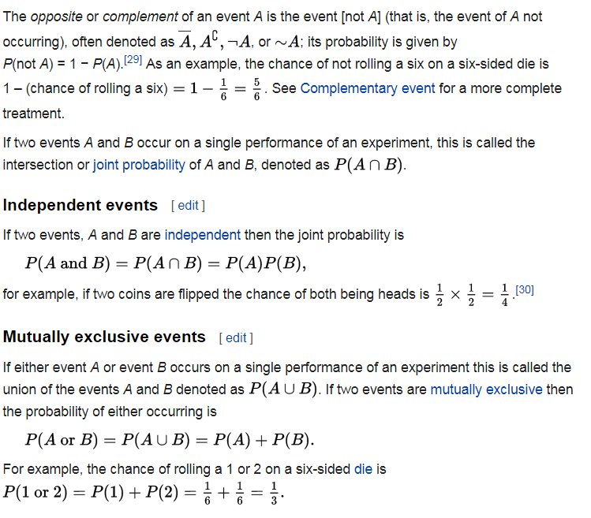
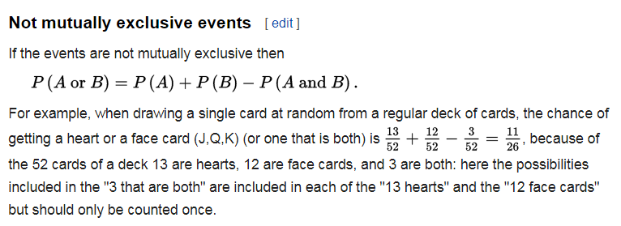
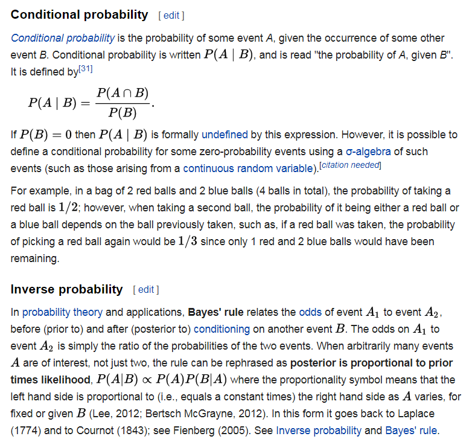
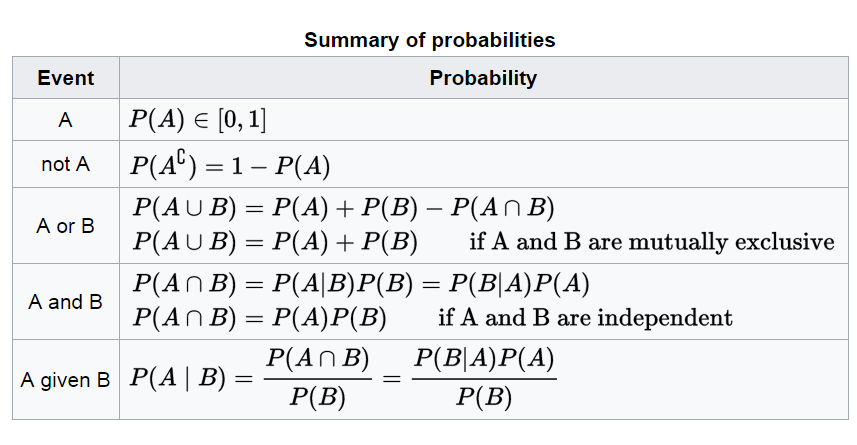

# Probability

Before a distribution or a density estimate, the page needs the basic probability pictures and the PDF that those pictures become.
This page moves from crib figures, through the probability density function, into kernel density estimation and its videos.

The same notes are in [Distribution](distribution.md) and [Probability & Statistics](probability-and-statistics.md).

## Probability crib figures

These figures are crib sheets from Wikipedia on basic probability ideas, before the PDF notes.

<figure><figcaption>
Probability crib figure.

Credit: by <a href="https://en.wikipedia.org/">en.wikipedia.org</a>.
</figcaption></figure>

<figure><figcaption>
Probability crib figure.

Credit: by <a href="https://en.wikipedia.org/">en.wikipedia.org</a>.
</figcaption></figure>

<figure><figcaption>
Probability crib figure.

Credit: by <a href="https://en.wikipedia.org/">en.wikipedia.org</a>.
</figcaption></figure>

<figure><figcaption>
Probability crib figure.

Credit: by <a href="https://en.wikipedia.org/">en.wikipedia.org</a>.
</figcaption></figure>

## PDF (probability density function)

After the crib figures, this section points at tutorials on PDFs in SciPy and related univariate methods.

- Simple statistics with SciPy | Comfort at 1 AU. [Tutorial in scipy](https://oneau.wordpress.com/2011/02/28/simple-statistics-with-scipy/)
- A blog about Statistics, Data Science and Machine Learning experiments using Python, R and Java. [Array-based tutorial in python with PDF and KDE](http://firsttimeprogrammer.blogspot.co.il/2015/01/how-to-estimate-probability-density.html)
- [Summary of univariate distribution including pdf methods](https://www.johndcook.com/blog/distributions_scipy/)

## Kernel Density Estimation

When a histogram is sparse, this section explains why KDE helps and lists tools and videos.

This tutorial actually explains why we should use KDE over a Histogram, it explains the cons of histograms and how KDE helps solve some issue that we usually encounter in ‘Sparse’ histograms where the distribution is hard to figure out.

- Supposedly a better [implementation](https://github.com/Daniel-B-Smith/KDE-for-SciPy) Supposedly better KDE than SciPy

How to use KDE? A [tutorial](http://pythonhosted.org/PyQt-Fit/KDE_tut.html) about kernel density and how to use it in python. Has several good graphs and shows use cases.

### Video tutorials about Kernel Density

These YouTube links are video tutorials on KDE and related nonparametric estimation.

- Kernel Density Estimation, by Anders Munk-Nielsen. [KDE](https://www.youtube.com/watch?v=gPWsDh59zdo)
- Nonparametric Kernel regression, by Anders Munk-Nielsen. Non parametric [Kernel Regression Estimation](https://www.youtube.com/watch?v=ncF7ArjJFqM)
- Nonparametric Sieve Estimation, by Anders Munk-Nielsen. Non parametric [Sieve Estimation](https://www.youtube.com/watch?v=cqecz-DL-jI)
- Semi-nonparametric estimation: Robinson's double residual method, by Anders Munk-Nielsen. [Semi- nonparametric estimation](https://www.youtube.com/watch?v=G1N53K530To)

[Udacity Video Tutorial](https://www.youtube.com/watch?v=MEP35FcrQGs&list=PLAwxTw4SYaPn-ttWkPiUL7NP3lLRdUniJ&index=80) - pretty good

- Kernel Density Estimation in Python | Pythonic Perambulations, by Jake VanderPlas. IMPORTANT: [Comparison and benchmarks of various KDE algo’s](https://jakevdp.github.io/blog/2013/12/01/kernel-density-estimation/)
- [Histograms and density plots](https://medium.com/data-science/histograms-and-density-plots-in-python-f6bda88f5ac0)
- Density estimation walks the line between unsupervised learning, feature engineering, and data modeling. [SK LEARN](http://scikit-learn.org/stable/modules/density.html#kernel-density-estimation)
- Inspecting Distributions - Model Building and Validation, by Udacity. [Gaussian KDE in scipy, version 2](https://www.youtube.com/watch?v=MEP35FcrQGs&list=PLAwxTw4SYaPn-ttWkPiUL7NP3lLRdUniJ&index=80)

## Deprecated links


These links and images no longer work. The original wording is kept here. A same-resource copy, when one was checked, is used above.


- This tutorial. This address no longer opens: https://mglerner.github.io/posts/histograms-and-kernel-density-estimation-kde-2.html?p=28
