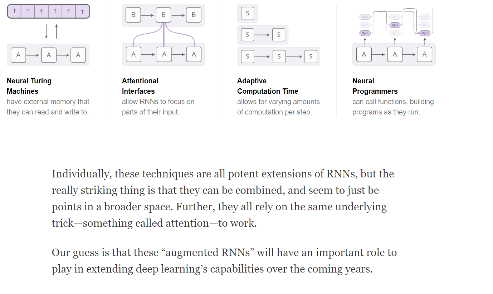
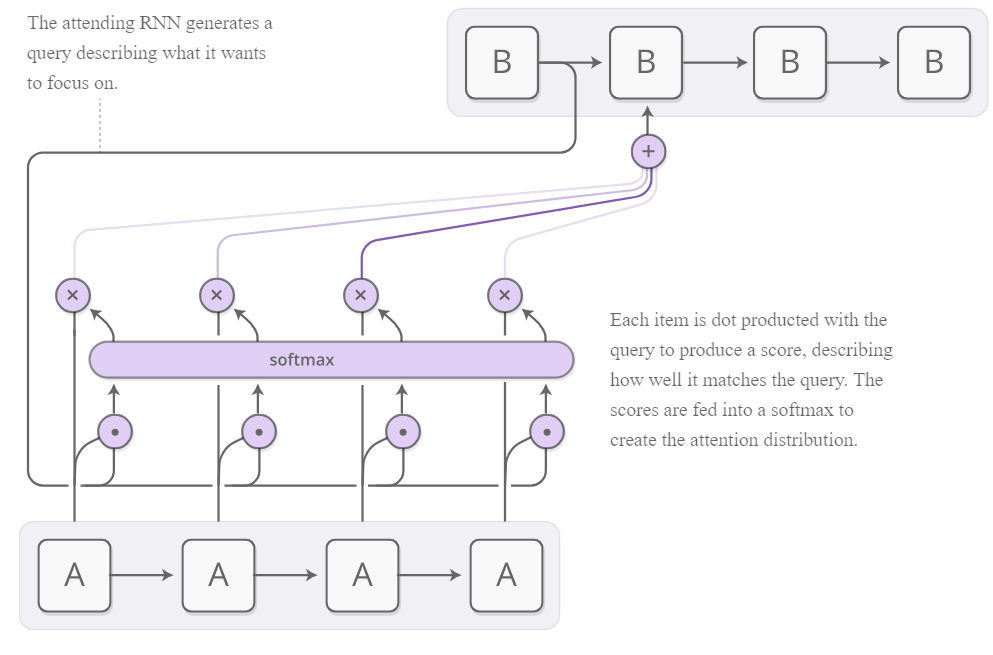
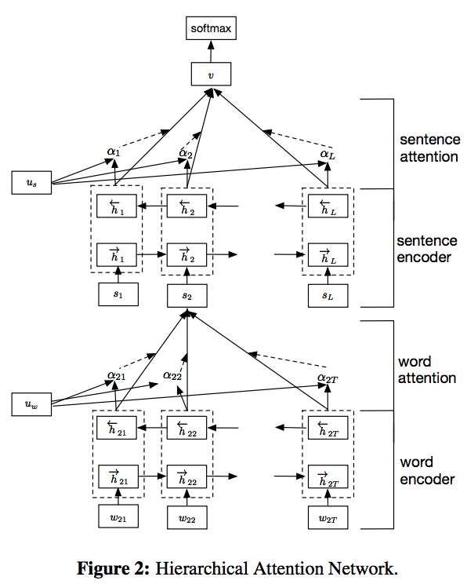

These notes moved.

- [Transformers](transformers.md)
- [Pretrained Language Models](../language-ai/pretrained-language-models.md)

# Attention

This page collects notes on attention mechanisms used in sequence models and related architectures.
Illustrated guides, papers, and Keras attention code stay below; deprecated addresses stay last.

The same notes are in [SEQ2SEQ SEQUENCE TO SEQUENCE](../language-ai/neural-nlp.md#seq2seq-sequence-to-sequence).

1. Illustrated attention- AMAZING
2. Illustrated self attention - great
- Visualizing A Neural Machine Translation Model (Mechanics of Seq2seq Models With Attention), by Jay Alammar. [Jay alamar on attention, the first one is better.](http://jalammar.github.io/visualizing-neural-machine-translation-mechanics-of-seq2seq-models-with-attention/)
- Abstract page for arXiv paper 1706.03762: Attention Is All You Need. [Attention is all you need (paper)](https://arxiv.org/abs/1706.03762)
- The Annotated Transformer. The Annotated Transformer. [The annotated transformer - reviewing the paper](http://nlp.seas.harvard.edu/2018/04/03/attention.html)
6. [Lilian weng on attention](https://lilianweng.github.io/lil-log/2018/06/24/attention-attention.html), self, soft vs hard, global vs local, neural turing machines, pointer networks, transformers, snail, self attention GAN.
7. [Understanding attention in rnns](https://medium.com/datadriveninvestor/attention-in-rnns-321fbcd64f05)
8. Another good intro with gifs to attention
- https://dennybritz.com/posts/wildml/attention-and-memory-in-deep-learning-and-nlp/. [Clear insight to what attention is, a must read](http://www.wildml.com/2016/01/attention-and-memory-in-deep-learning-and-nlp/)
- Posted by Jakob Uszkoreit, Software Engineer, Natural Language Understanding Neural networks, in particular recurrent neural networks (RNNs), are n... [Transformer NN by google](https://ai.googleblog.com/2017/08/transformer-novel-neural-network.html)
11. Intuitive explanation to attention
- Learn about Attention Mechanism, its introduction in deep learning, implementation in Python using Keras, and its applications in computer vision, by Himanshi Singh. [Attention by vidhya](https://www.analyticsvidhya.com/blog/2019/11/comprehensive-guide-attention-mechanism-deep-learning/)
13. [Augmented rnns](https://distill.pub/2016/augmented-rnns/) - including turing / attention / adaptive computation time etc. general overview, not as clear as the one below. <figure><figcaption>
Augmented RNNs overview figure.

Credit: <a href="https://lh5.googleusercontent.com/5Cxd-2INMRXvO_TsSWX6cXtx_j4moRLqJAhRMdwYFFTDEkPZ6Ph_NbKbC4dVRAP-ctYMJGQdw5RrBO4eboM6FwA4W_U4Rmwv1_wmrG6SC-2dvdF94AnDnHXcBSqKBWZwByynuFGd">copied from the original hosted image</a>.
</figcaption></figure>

<figure><figcaption>
Augmented RNNs overview figure.

Credit: <a href="https://lh3.googleusercontent.com/G7aL7maJfczYfXc-Zhg69IHeusTlQxE78b3TGHMd_nrH1f6JXUHosA3K6kg2dZEmOMqWWeF61qhcko260IGUBHUEshL2MW4ZnIh1deTY-OtXnsoluqlOmJsOGHBgsBLIRCKUbFZp">copied from the original hosted image</a>.
</figcaption></figure>

- [A really good REVIEW on attention and its many forms, historical changes, etc](https://medium.com/@joealato/attention-in-nlp-734c6fa9d983)
2. [Medium on comparing cnn / rnn / han](https://medium.com/jatana/report-on-text-classification-using-cnn-rnn-han-f0e887214d5f) - will change on other data, my impression is that the data is too good in this article
- Gentle Introduction to Global Attention for Encoder-Decoder Recurrent Neural Networks - MachineLearningMastery.com, by Jason Brownlee. Mastery on [rnn vs attention vs global attention](https://machinelearningmastery.com/global-attention-for-encoder-decoder-recurrent-neural-networks/)
4. Mastery on [attention](https://machinelearningmastery.com/how-does-attention-work-in-encoder-decoder-recurrent-neural-networks/) - this makes the whole process clear, scoring encoder vs decoder input outputs, normalizing them using softmax (annotation weights), multiplying score and the weight summed on all (i.e., context vector), and then we decode the context vector.
 1. Soft (above) and hard crisp attention
 2. Dropping the hidden output - HAN or AB BiLSTM
 3. Attention concat to input vec
 4. Global vs local attention
5. Mastery on [attention with lstm encoding / decoding](https://machinelearningmastery.com/implementation-patterns-encoder-decoder-rnn-architecture-attention/) - a theoretical discussion about many attention architectures. This adds make-sense information to everything above.
 1. Encoder: The encoder is responsible for stepping through the input time steps and encoding the entire sequence into a fixed length vector called a context vector.
 2. Decoder: The decoder is responsible for stepping through the output time steps while reading from the context vector.
 3. A problem with the architecture is that performance is poor on long input or output sequences. The reason is believed to be because of the fixed-sized internal representation used by the encoder.
 1. Enc-decoder
 2. Recursive
 3. Enc-dev with recursive<figure><figcaption>
Encoder-decoder attention architecture patterns.

Credit: <a href="https://lh6.googleusercontent.com/FcrjF3Fo9W5OeKP6E1YaGLDUBwdiB3AYr_r6-XdIO4g4t58RTe5eRFyIU5Jm3bk2mn1KOSxbPV-CF3mN6M7USCg4q_QYhwAoSoTxtJqvCzJPz0ABVwn3D3nQuXXuIWUvz8mNpMlt">copied from the original hosted image</a>.
</figcaption></figure>
6. Code on GIT:
 - Text classifier for Hierarchical Attention Networks for Document Classification. HAN - [GIT](https://github.com/richliao/textClassifier)
 - Implementations for a family of attention mechanisms, suitable for all kinds of natural language processing tasks and compatible with TensorFlow 2.0 and Keras. [Non penalized self attention](https://github.com/uzaymacar/attention-mechanisms/blob/master/examples/sentiment_classification.py)
 - Attention-based bidirectional LSTM for Classification Task (ICASSP) - gentaiscool/lstm-attention. LSTM [BiLSTM attention](https://github.com/gentaiscool/lstm-attention)
 - [paper](https://arxiv.org/pdf/1805.12307.pdf)
 - Keras Layer implementation of Attention for Sequential models - thushv89/attention_keras. Tushv89 [Keras layer attention implementation](https://github.com/thushv89/attention_keras)
 - Text classifier for Hierarchical Attention Networks for Document Classification  - textClassifier/textClassifierHATT.py at master · richliao/textClassifier. Richliao, hierarchical [Attention code for document classification using keras](https://github.com/richliao/textClassifier/blob/master/textClassifierHATT.py)
 - Collections of ideas of deep learning application, by Richard Liao. [blog](https://richliao.github.io/supervised/classification/2016/12/26/textclassifier-HATN/)
 - Redirecting to Google Groups. Redirecting to Google Groups. [group chatter](https://groups.google.com/forum/#!topic/keras-users/IWK9opMFavQ)

note: word level then sentence level embeddings.

figure= >

- Client Challenge. Client Challenge. [Self Attention pip for keras](https://pypi.org/project/keras-self-attention/)
- Attention mechanism for processing sequential data that considers the context for each timestamp. [git](https://github.com/CyberZHG/keras-self-attention)
- Keras Attention Layer (Luong and Bahdanau scores). [Phillip remy on attention in keras, not a single layer, a few of them to make it.](https://github.com/philipperemy/keras-attention-mechanism)
- [Self attention with relative positiion representations](https://medium.com/@_init_/how-self-attention-with-relative-position-representations-works-28173b8c245a)
- Abstract page for arXiv paper 1409.0473: Neural Machine Translation by Jointly Learning to Align and Translate. [nMT - jointly learning to align and translate](https://arxiv.org/abs/1409.0473)
- [Medium on attention plus code, comparison keras and pytorch](https://medium.com/huggingface/understanding-emotions-from-keras-to-pytorch-3ccb61d5a983)

- Towards Data Science: an-intuitive-explanation-of-self-attention-4f72709638e1. [https://towardsdatascience.com/an-intuitive-explanation-of-self-attention-4f72709638e1](https://towardsdatascience.com/an-intuitive-explanation-of-self-attention-4f72709638e1)
- Towards Data Science: attn-illustrated-attention-5ec4ad276ee3. [https://towardsdatascience.com/attn-illustrated-attention-5ec4ad276ee3](https://towardsdatascience.com/attn-illustrated-attention-5ec4ad276ee3)
- Towards Data Science: deconstructing-bert-part-2-visualizing-the-inner-workings-of-attention-60a16d86b5c1. [https://towardsdatascience.com/deconstructing-bert-part-2-visualizing-the-inner-workings-of-attention-60a16d86b5c1](https://towardsdatascience.com/deconstructing-bert-part-2-visualizing-the-inner-workings-of-attention-60a16d86b5c1)

## Deprecated links


These links and images no longer work. The original wording is kept here. A same-resource copy, when one was checked, is used above.


- Super fast transformers. This address no longer opens: http://transformer
- Bert multilabel classification. This address no longer opens: http://towardsdatascience
- Bert with keras, blog post. This address no longer opens: https://www.ctolib.com/Separius-BERT-keras.html
- Explain bert - bert visualization tool.. This address no longer opens: http://exbert.net/
- "GAN" using xgboost and gmm for density sampling. This address no longer opens: https://edge.skyline.ai/data-synthesizers-on-aws-sagemaker
- fine-tuning. This address no longer opens: http://wiki.fast.ai/index.php/Fine_tuning
- Towards Data Science: 2019-year-of-bert-and-transformer-f200b53d05b9. This address no longer opens: https://towardsdatascience.com/2019-year-of-bert-and-transformer-f200b53d05b9
- Towards Data Science: 3-ways-to-make-new-language-models-f3642e3a4816. This address no longer opens: https://towardsdatascience.com/3-ways-to-make-new-language-models-f3642e3a4816
- Towards Data Science: bert-is-not-good-at-7b1ca64818c5. This address no longer opens: https://towardsdatascience.com/bert-is-not-good-at-7b1ca64818c5
- Towards Data Science: beyond-word-embeddings-part-2-word-vectors-nlp-modeling-from-bow-to-bert-4ebd4711d0ec. This address no longer opens: https://towardsdatascience.com/beyond-word-embeddings-part-2-word-vectors-nlp-modeling-from-bow-to-bert-4ebd4711d0ec
- Towards Data Science: breaking-bert-down-430461f60efb. This address no longer opens: https://towardsdatascience.com/breaking-bert-down-430461f60efb
- Towards Data Science: build-a-bert-sci-kit-transformer-59d60ddd54a5. This address no longer opens: https://towardsdatascience.com/build-a-bert-sci-kit-transformer-59d60ddd54a5
- Towards Data Science: deconstructing-bert-distilling-6-patterns-from-100-million-parameters-b49113672f77. This address no longer opens: https://towardsdatascience.com/deconstructing-bert-distilling-6-patterns-from-100-million-parameters-b49113672f77
- Towards Data Science: demystifying-generative-adversarial-networks-c076d8db8f44. This address no longer opens: https://towardsdatascience.com/demystifying-generative-adversarial-networks-c076d8db8f44
- Towards Data Science: elmo-contextual-language-embedding-335de2268604. This address no longer opens: https://towardsdatascience.com/elmo-contextual-language-embedding-335de2268604
- Towards Data Science: elmo-helps-to-further-improve-your-word-embeddings-c6ed2c9df95f. This address no longer opens: https://towardsdatascience.com/elmo-helps-to-further-improve-your-word-embeddings-c6ed2c9df95f
- Towards Data Science: examining-berts-raw-embeddings-fd905cb22df7. This address no longer opens: https://towardsdatascience.com/examining-berts-raw-embeddings-fd905cb22df7
- Towards Data Science: explainable-data-efficient-text-classification-888cc7a1af05. This address no longer opens: https://towardsdatascience.com/explainable-data-efficient-text-classification-888cc7a1af05
- Towards Data Science: gan-ways-to-improve-gan-performance-acf37f9f59b. This address no longer opens: https://towardsdatascience.com/gan-ways-to-improve-gan-performance-acf37f9f59b
- Towards Data Science: identifying-the-right-meaning-of-the-words-using-bert-817eef2ac1f0. This address no longer opens: https://towardsdatascience.com/identifying-the-right-meaning-of-the-words-using-bert-817eef2ac1f0
- Towards Data Science: illustrated-self-attention-2d627e33b20a. This address no longer opens: https://towardsdatascience.com/illustrated-self-attention-2d627e33b20a
- Towards Data Science: testing-bert-based-question-answering-on-coronavirus-articles-13623637a4ff?source=email-4dde5994e6c1-1586483206529-newsletter.v2-7f60cf5620c9-----0-------------------b506d4ba_2902_4718_9c95_a36e33d638e6---48577de843eb----20200410. This address no longer opens: https://towardsdatascience.com/testing-bert-based-question-answering-on-coronavirus-articles-13623637a4ff?source=email-4dde5994e6c1-1586483206529-newsletter.v2-7f60cf5620c9-----0-------------------b506d4ba_2902_4718_9c95_a36e33d638e6---48577de843eb----20200410
- Towards Data Science: transfer-learning-using-elmo-embedding-c4a7e415103c. This address no longer opens: https://towardsdatascience.com/transfer-learning-using-elmo-embedding-c4a7e415103c
- Towards Data Science: understanding-bert-is-it-a-game-changer-in-nlp-7cca943cf3ad. This address no longer opens: https://towardsdatascience.com/understanding-bert-is-it-a-game-changer-in-nlp-7cca943cf3ad
- Towards Data Science: understanding-language-modelling-nlp-part-1-ulmfit-b557a63a672b. This address no longer opens: https://towardsdatascience.com/understanding-language-modelling-nlp-part-1-ulmfit-b557a63a672b
- paper. This address no longer opens: https://www.cs.cmu.edu/~diyiy/docs/naacl16.pdf
- A survey of long term context in transformers.. This address no longer opens: https://www.pragmatic.ml/a-survey-of-methods-for-incorporating-long-term-context/
- tutorial. This address no longer opens: https://allennlp.org/tutorials
- Elmo code on git. This address no longer opens: https://github.com/allenai/allennlp/blob/master/tutorials/how_to/elmo.md
- Medium on how - unclear. This address no longer opens: https://blog.frame.ai/learning-more-with-less-1e618a5aa160
- Fast NLP on how. This address no longer opens: http://nlp.fast.ai/classification/2018/05/15/introducting-ulmfit.html
- sparse bert. This address no longer opens: https://github.com/huggingface/transformers/tree/master/examples/movement-pruning
- post. This address no longer opens: https://www.ai21.com/pmi-masking
