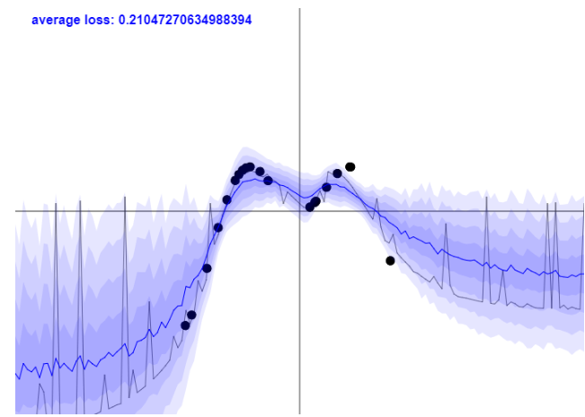
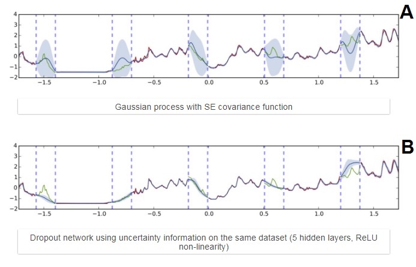
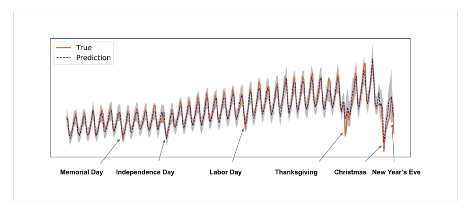

# Bayesian Neural Network (BNN)

This page collects notes on Bayesian neural networks and prediction uncertainty.
It starts from what a BNN is and how uncertainty types show up in the forecasting and anomaly settings already described below.

BNN - (what is?) [Bayesian neural network (BNN)](http://edwardlib.org/tutorials/bayesian-neural-network) according to Uber - architecture that more accurately forecasts time series predictions and uncertainty estimations at scale. “how Uber has successfully applied this model to large-scale time series anomaly detection, enabling better accommodate rider demand during high-traffic intervals.”

Under the BNN framework, prediction uncertainty can be categorized into three types:

- Model uncertainty captures our ignorance of the model parameters and can be reduced as more samples are collected.
- model misspecification
- inherent noise captures the uncertainty in the data generation process and is irreducible.

Note: in a series of articles, uber explains about time series and leads to a BNN architecture.

1. Neural networks - training on multi-signal raw data, training X and Y are window-based and the window size(lag) is determined in advance.

Vanilla LSTM did not work properly, therefore an architecture of

Regarding point 1: ‘run prediction with dropout 100 times’

 [MEDIUM with code how to do it.](https://medium.com/hal24k-techblog/how-to-generate-neural-network-confidence-intervals-with-keras-e4c0b78ebbdf)

[Why do we need a confidence measure when we have a softmax probability layer?](https://hjweide.github.io/quantifying-uncertainty-in-neural-networks) The blog post explains, for example, that with a CNN of apples, oranges, cat and dogs, a non related example such as a frog image may influence the network to decide its an apple, therefore we can’t rely on the probability as a confidence measure. The ‘run prediction with dropout 100 times’ should give us a confidence measure because it draws each weight from a bernoulli distribution.

“By applying dropout to all the weight layers in a neural network, we are essentially drawing each weight from a [Bernoulli distribution](https://en.wikipedia.org/wiki/Bernoulli_distribution). In practice, this mean that we can sample from the distribution by running several forward passes through the network. This is referred to as [Monte Carlo dropout](http://arxiv.org/abs/1506.02158).”

Taken from Yarin Gal’s blog post . In this figure we see how sporadic is the signal from a forward pass (black line) compared to a much cleaner signal from 100 dropout passes.

<figure><figcaption>
Bayesian Neural Network (BNN)

Credit: <a href="https://lh5.googleusercontent.com/FlcvG689kstX36ya8JNaeIE6C5HeXhL7IKG3wMt5zTacLqJVmb9W6kqpby_e3IMV6iWc7rrIJ8F6IMwKEM6hUiuHnLaJiLp4KBPkTird_AB4GW8i5-5n_DOOm-cZEQYUsM6TWotp">copied from the original hosted image</a>.
</figcaption></figure>

Is it applicable for time series? In the figure below he tried to predict the missing signal between each two dotted lines, A is a bad estimation, but with a dropout layer we can see that in most cases the signal is better predicted.

<figure><figcaption>
Bayesian Neural Network (BNN)

Credit: <a href="https://lh6.googleusercontent.com/eNr1VJ6ahkfVOvZ0i3HIFqng_hyCYueyZQ5jqb20mB55MtZwpd8EJ6Qhda7Ty0oRwLsNFUN4YSUN2sAUW768lA2PyAqIUiLOMULMXZtBJKlU54Me0p2CeVJIkOubgoNV-hnwD5Ip">copied from the original hosted image</a>.
</figcaption></figure>

Going back to uber, they are actually using this idea to predict time series with LSTM, using encoder decoder framework.

<figure><figcaption>
Bayesian Neural Network (BNN)

Credit: <a href="https://lh6.googleusercontent.com/OoKHnEH6OcZVOBorLKp-rvUFWueY6qjwLW_v0mHWLGKp1YSZeRscteXA59Ecqp77B-PWv5nB7v6Hyf-emOu6eABkNW6LTAGEVSUgwtPLBKKJZBSRHIy8JbiCqwcc3-RbyiFvtd8z">copied from the original hosted image</a>.
</figcaption></figure>

Note: this is probably applicable in other types of networks.

Phd Thesis by Yarin, he talks about uncertainty in Neural networks and using BNNs. he may have proved this thesis, but I did not read it. This blog post links to his full Phd.

Old note: The idea behind uncertainty is ([paper here](https://arxiv.org/pdf/1506.02142.pdf)) that in order to trust your network’s classification, you drop some of the neurons during prediction, you do this ~100 times and you average the results. Intuitively this will give you confidence in your classification and increase your classification accuracy, because only a partial part of your network participated in the classification, randomly, 100 times. Please note that Softmax doesn't give you certainty.

Medium post on prediction with drop out

The [solution for keras](https://github.com/keras-team/keras/issues/9412) says to add trainable=true for every dropout layer and add another drop out at the end of the model. Thanks sam.

“import keras

inputs = keras.Input(shape=(10,))

x = keras.layers.Dense(3)(inputs)

outputs = keras.layers.Dropout(0.5)(x, training=True)

model = keras.Model(inputs, outputs)“

## Deprecated links


These links and images no longer work. The original wording is kept here. A same-resource copy, when one was checked, is used above.

- Towards Data Science: is-your-algorithm-confident-enough-1b20dfe2db08. This address no longer opens: https://towardsdatascience.com/is-your-algorithm-confident-enough-1b20dfe2db08
- BNN. This address no longer opens: https://eng.uber.com/neural-networks-uncertainty-estimation/
- Neural networks. This address no longer opens: https://eng.uber.com/neural-networks/
- blog post. This address no longer opens: http://mlg.eng.cam.ac.uk/yarin/blog_3d801aa532c1ce.html
- Phd Thesis by Yarin. This address no longer opens: http://mlg.eng.cam.ac.uk/yarin/blog_2248.html?fref=gc&dti=999449923520287
