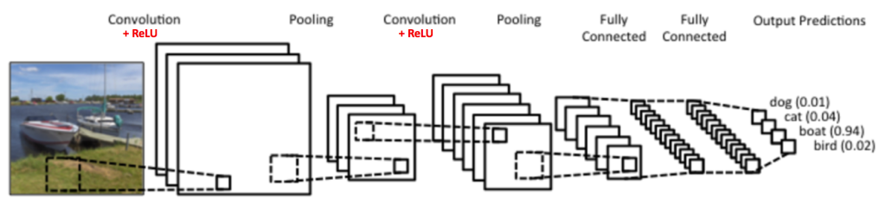
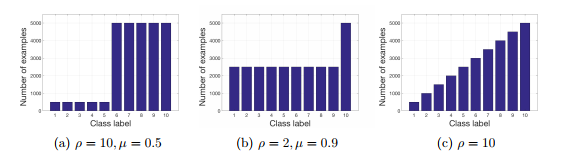

# CONVOLUTIONAL NEURAL NET

This page collects notes on convolutional neural nets for vision-style feature learning.
Later sections cover capsule nets, transfer learning with CNNs, and visualization of what CNNs learn.

The same notes are in [CONVOLUTION NEURAL NETS (CNN)](../language-ai/neural-nlp.md#convolution-neural-nets-cnn), [DETECTION](deep-neural-machine-vision.md#detection), and [Segmentation](deep-neural-machine-vision.md#segmentation).

<figure><figcaption>
CONVOLUTIONAL NEURAL NET

Credit: <a href="https://lh5.googleusercontent.com/yw2GIv_A_BJLggUjAcF7K3NFbvf9BsGiMS4PQHgLjl6H5sAziuofhepBZOlsWvJnK296FbGTOGYsOdWCmkpyesvuO9BtqcReXIVQy2xT3SOCNIH4riyTrpjL7M2tOOlG6eH_3SEN">copied from the original hosted image</a>.
</figcaption></figure>

([an excellent and thorough explanation about LeNet](https://ujjwalkarn.me/2016/08/11/intuitive-explanation-convnets/)) -

- Convolution Layer primary purpose is to extract features from the input image. Convolution preserves the spatial relationship between pixels by learning image features using small squares of input data.
- ReLU (more in the activation chapter) - The purpose of ReLU is to introduce non-linearity in our ConvNet
- Spatial Pooling (also called subsampling or downsampling) reduces the dimensionality of each feature map but retains the most important information. Spatial Pooling can be of different types: Max, Average, Sum etc.
- Dense / Fully Connected - a traditional Multi Layer Perceptron that uses a softmax activation function in the output layer to classify. The output from the convolutional and pooling layers represent high-level features of the input image. The purpose of the Fully Connected layer is to use these features for classifying the input image into various classes based on the training dataset.

The overall training process of the Convolutional Network may be summarized as below:

- Step1: We initialize all filters and parameters / weights with random values
- Step2: The network takes a single training image as input, goes through the forward propagation step (convolution, ReLU and pooling operations along with forward propagation in the Fully Connected layer) and finds the output probabilities for each class.
 - Let's say the output probabilities for the boat image above are \[0.2, 0.4, 0.1, 0.3]
 - Since weights are randomly assigned for the first training example, output probabilities are also random.
- Step3: Calculate the total error at the output layer (summation over all 4 classes)
 - (L2) Total Error = ∑ ½ (target probability – output probability) ²
- Step4: Use Backpropagation to calculate the gradients of the error with respect to all weights in the network and use gradient descent to update all filter values / weights and parameter values to minimize the output error.
 - The weights are adjusted in proportion to their contribution to the total error.
 - When the same image is input again, output probabilities might now be \[0.1, 0.1, 0.7, 0.1], which is closer to the target vector \[0, 0, 1, 0].
 - This means that the network has learnt to classify this particular image correctly by adjusting its weights / filters such that the output error is reduced.
 - Parameters like number of filters, filter sizes, architecture of the network etc. have all been fixed before Step 1 and do not change during training process – only the values of the filter matrix and connection weights get updated.
- Step5: Repeat steps 2-4 with all images in the training set.

The above steps train the ConvNet – this essentially means that all the weights and parameters of the ConvNet have now been optimized to correctly classify images from the training set.

When a new (unseen) image is input into the ConvNet, the network would go through the forward propagation step and output a probability for each class (for a new image, the output probabilities are calculated using the weights which have been optimized to correctly classify all the previous training examples). If our training set is large enough, the network will (hopefully) generalize well to new images and classify them into correct categories.

Illustrated 10 CNNS architectures

[A study that deals with class imbalance in CNN’s](https://arxiv.org/pdf/1710.05381.pdf) - we systematically investigate the impact of class imbalance on classification performance of convolutional neural networks (CNNs) and compare frequently used methods to address the issue

- Over sampling
- Undersampling
- Thresholding probabilities (ROC?)
- Cost sensitive classification -different cost to misclassification
- One class - novelty detection. This is a concept learning technique that recognizes positive instances rather than discriminating between two classes

Using several imbalance scenarios, on several known data sets, such as MNIST<figure><figcaption>
CONVOLUTIONAL NEURAL NET

Credit: <a href="https://lh5.googleusercontent.com/dsLGbR3YBUjsDjRuOiC5FSrfef4MoK2Y1J-wPzn4NmIJWxg3wP7aY8TvP1EXr8p6a4T5wjcFqv2teT11KlXaMQFh3eWOYRT-5Vn-xlAlacyckL7DDsAx4sJG5lt_tJC4rF2ytfhs">copied from the original hosted image</a>.
</figcaption></figure>

The results indication (loosely) that oversampling is usually better in most cases, and doesn't cause overfitting in CNNs.

CONV-1D

1. [How to setup a conv1d in keras, most importantly how to reshape your input vector](https://stackoverflow.com/questions/43396572/dimension-of-shape-in-conv1d/43399308#43399308)
- How to Develop a Multichannel CNN Model for Text Classification - MachineLearningMastery.com, by Jason Brownlee. [Mastery on Character ngram cnn for sentiment analysis](https://machinelearningmastery.com/develop-n-gram-multichannel-convolutional-neural-network-sentiment-analysis/)

1x1 CNN

1. [Mastery](https://machinelearningmastery.com/introduction-to-1x1-convolutions-to-reduce-the-complexity-of-convolutional-neural-networks/) on 1x1 cnn, for dim reduction, decreasing feature maps and other usages.
 - “This is the most common application of this type of filter and in this way, the layer is often called a feature map pooling layer.”
 - “In the paper, the authors propose the need for an MLP convolutional layer and the need for cross-channel pooling to promote learning across channels.”
 - “the 1×1 filter was used explicitly for dimensionality reduction and for increasing the dimensionality of feature maps after pooling in the design of the inception module, used in the GoogLeNet model”
 - “The 1×1 filter was used as a projection technique to match the number of filters of input to the output of residual modules in the design of the residual network “

MASKED R-CNN

[1. Using mask rnn for object detection](https://machinelearningmastery.com/how-to-perform-object-detection-in-photographs-with-mask-r-cnn-in-keras/)

Invariance in CNN

1. [Making cnn shift invariance](https://richzhang.github.io/antialiased-cnns/) - “Small shifts -- even by a single pixel -- can drastically change the output of a deep network (bars on left). We identify the cause: aliasing during downsampling. We anti-alias modern deep networks with classic signal processing, stabilizing output classifications (bars on right). We even observe accuracy increases (see plot below).

MAX AVERAGE POOLING

[Intuitions to the differences between max and average pooling:](https://stats.stackexchange.com/questions/291451/feature-extracted-by-max-pooling-vs-mean-pooling)

- A max-pool layer compressed by taking the maximum activation in a block. If you have a block with mostly small activation, but a small bit of large activation, you will loose the information on the low activations. I think of this as saying "this type of feature was detected in this general area".
- A mean-pool layer compresses by taking the mean activation in a block. If large activations are balanced by negative activations, the overall compressed activations will look like no activation at all. On the other hand, you retain some information about low activations in the previous example.
- MAX pooling In other words: Max pooling roughly means that only those features that are most strongly triggering outputs are used in the subsequent layers. You can look at it a little like focusing the network’s attention on what’s most characteristic for the image at hand.
- GLOBAL MAX pooling: In the last few years, experts have turned to global average pooling (GAP) layers to minimize overfitting by reducing the total number of parameters in the model. Similar to max pooling layers, GAP layers are used to reduce the spatial dimensions of a three-dimensional tensor. However, GAP layers perform a more extreme type of dimensionality reduction,
- Geoffrey Hinton, neural networks, ML, deep learning pioneer answered “Ask Me Anything” on reddit: His answers only: His most controversial answer is: The pooling operation used in convo…. [Hinton’s controversy thoughts on pooling](https://mirror2image.wordpress.com/2014/11/11/geoffrey-hinton-on-max-pooling-reddit-ama/)

Dilated CNN

1. [For improved performance](https://stackoverflow.com/questions/41178576/whats-the-use-of-dilated-convolutions)
2. [RESNET, DENSENET UNET](https://medium.com/swlh/resnets-densenets-unets-6bbdbcfdf010) - the trick behind them, concatenating both f(x) = x

## CAPSULE NEURAL NETS

This section collects capsule-net notes after the CNN basics above.

1. [The solution to CNN’s shortcomings](https://hackernoon.com/capsule-networks-are-shaking-up-ai-heres-how-to-use-them-c233a0971952), where features can be identified without relations to each other in an image, i.e. changing the location of body parts will not affect the classification, and changing the orientation of the image will. The promise of capsule nets is that these two issues are solved.
2. [Understanding capsule nets - part 2,](https://medium.com/ai%C2%B3-theory-practice-business/understanding-hintons-capsule-networks-part-ii-how-capsules-work-153b6ade9f66)

## Transfer Learning using CNN

This section collects CNN transfer-learning notes after the architecture material above.

The same notes are in [DATASET SELECTION](../data/datasets.md#dataset-selection), [Fine tuning](deep-neural-nets.md#fine-tuning), [Methods](../generative-ai/methods.md), and [TRAINING METHODOLOGIES](../data/datasets.md#training-methodologies).

1. To Add keras book chapter 5 (i think)
- Transfer Learning in Keras with Computer Vision Models - MachineLearningMastery.com, by Jason Brownlee. [Mastery](https://machinelearningmastery.com/how-to-use-transfer-learning-when-developing-convolutional-neural-network-models/)
 - Classifier: The pre-trained model is used directly to classify new images.
 - Standalone Feature Extractor: The pre-trained model, or some portion of the model, is used to pre-process images and extract relevant features.
 - Integrated Feature Extractor: The pre-trained model, or some portion of the model, is integrated into a new model, but layers of the pre-trained model are frozen during training.
 - Weight Initialization: The pre-trained model, or some portion of the model, is integrated into a new model, and the layers of the pre-trained model are trained in concert with the new model.

## VISUALIZE CNN

This section collects CNN visualization notes after transfer learning above.

1. How to

- Towards Data Science: illustrated-10-cnn-architectures-95d78ace614d. [https://towardsdatascience.com/illustrated-10-cnn-architectures-95d78ace614d](https://towardsdatascience.com/illustrated-10-cnn-architectures-95d78ace614d)

## Deprecated links


These links and images no longer work. The original wording is kept here. A same-resource copy, when one was checked, is used above.

- Towards Data Science: how-to-visualize-convolutional-features-in-40-lines-of-code-70b7d87b0030. This address no longer opens: https://towardsdatascience.com/how-to-visualize-convolutional-features-in-40-lines-of-code-70b7d87b0030
- GLOBAL MAX pooling. This address no longer opens: https://alexisbcook.github.io/2017/global-average-pooling-layers-for-object-localization/
