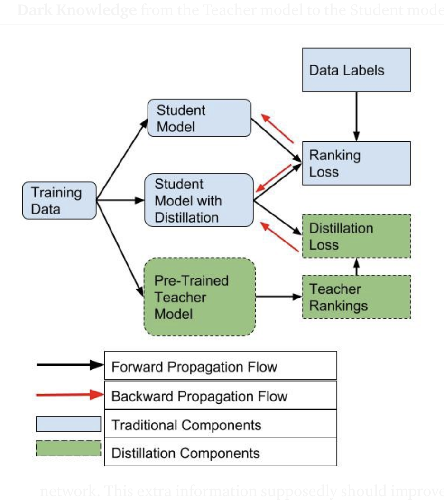
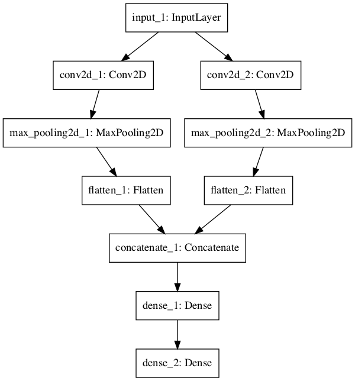

# Deep Network Optimization

A trained deep net is often too big to deploy, and an untrained one often refuses to learn at all.
This page takes those two problems in order: first making nets smaller or more teachable through pruning, knowledge distillation, and lottery tickets, then a troubleshooting checklist for dataset, normalization, implementation, and training issues.

## PRUNING / KNOWLEDGE DISTILLATION / LOTTERY TICKET

Shrinking a net comes in three related forms: pruning weights, distilling a large teacher into a small student, and finding the small "lottery ticket" subnetwork that trains as well as the whole. The same notes are in [BERT](../language-ai/pretrained-language-models.md#bert) and [TRAINING METHODOLOGIES](../data/datasets.md#training-methodologies).

The map of the whole area is [Awesome Knowledge distillation](https://github.com/dkozlov/awesome-knowledge-distillation), the dkozlov/awesome-knowledge-distillation list on GitHub.

The lottery ticket comes next. Source 1 is kept at the end of the page; [2](https://arxiv.org/pdf/1803.03635.pdf) is the paper, which starts from the fact that pruning can cut the parameter counts of trained networks by over 90%, decreasing storage and improving inference speed without compromising accuracy, while the sparse architectures that pruning produces have been hard to train from the start. Uber on Lottery ticket, masking weights retraining, is also kept at the end of the page. [Facebook article and paper](https://ai.facebook.com/blog/understanding-the-generalization-of-lottery-tickets-in-neural-networks) is Facebook AI on understanding the generalization of lottery tickets, where it reports the first definitive evidence that the ‘lottery ticket’ phenomenon found by MIT researchers generalizes across different settings.

Distillation is the other way to get a small net. [Knowledge distillation 1](https://medium.com/neuralmachine/knowledge-distillation-dc241d7c2322) is Ujjwal Upadhyay's post, which starts from the problem of deploying sophisticated, bulky models on mobile devices for instant use without relying on a cloud call and a reliable internet connection. Source 2 is kept at the end of the page, and [3](https://medium.com/neuralmachine/knowledge-distillation-dc241d7c2322) points at the same Knowledge Distillation post again. Pruning 1 and Pruning 2, and a teacher-student knowledge distillation post focusing on Knowledge & Ranking distillation, are also kept at the end of the page. The figure below follows that list.

<figure><figcaption>
PRUNING / KNOWLEDGE DISTILLATION / LOTTERY TICKET

Credit: <a href="https://lh4.googleusercontent.com/dau-y87nrdDTAGDgPw5H5ETsdU9TIum7G3vdYpdABd44O-iE3Ghp2V2Ymihe3vSowLWU5wzxD27W_N8lExEQ0ISQAKgAnbbj6SiYQ3RDXPONGJFDj-OO-XE5Bjtc-1uPfEEjUDVb">copied from the original hosted image</a>.
</figcaption></figure>

For code, [Deep network compression using teacher student](https://github.com/Zhengyu-Li/Deep-Network-Compression-based-on-Student-Teacher-Network-) is the Zhengyu-Li repository for deep neural network compression based on a student-teacher network.

The lottery ticket also holds for large pretrained models. [Lottery ticket on BERT](https://thegradient.pub/when-bert-plays-the-lottery-all-tickets-are-winning/), magnitude vs structured pruning on a various metrics, i.e., LT works on bert. The classical Lottery Ticket Hypothesis was mostly tested with unstructured pruning, specifically magnitude pruning (m-pruning) where the weights with the lowest magnitude are pruned irrespective of their position in the model. We iteratively prune 10% of the least magnitude weights across the entire fine-tuned model (except the embeddings) and evaluate on dev set, for as long as the performance of the pruned subnetwork is above 90% of the full model.

We also experiment with structured pruning (s-pruning) of entire components of BERT architecture based on their importance scores: specifically, we 'remove' the least important self-attention heads and MLPs by applying a mask. In each iteration, we prune 10% of BERT heads and 1 MLP, for as long as the performance of the pruned subnetwork is above 90% of the full model. To determine which heads/MLPs to prune, we use a loss-based approximation: the importance scores proposed by [Michel, Levy and Neubig (2019)](https://thegradient.pub/when-bert-plays-the-lottery-all-tickets-are-winning/#RefMichel) for self-attention heads, which we extend to MLPs. Please see our paper and the original formulation for more details.

## Troubleshooting Neural Nets

Compression assumes a net that already trains; when it does not, the fix is a checklist, copied from two posts. The first is [37 reasons](https://blog.slavv.com/37-reasons-why-your-neural-network-is-not-working-4020854bd607?fref=gc&dti=543283492502370), the list of reasons why your neural network is not working, and the second is [10 more](http://theorangeduck.com/page/neural-network-not-working?utm_campaign=Revue%20newsletter&utm_medium=Newsletter&utm_source=The%20Wild%20Week%20in%20AI&fref=gc&dti=543283492502370), "My Neural Network isn't working! What should I do?" from a site on computer science, machine learning, and programming. Both are copy pasted and rewritten here for convenience, it's pretty thorough, but long and extensive, you should have some sort of intuition and not go through all of these. The following list is has much more insight and information in the article itself.

The author of the original article suggests to turn everything off and then start building your network step by step, i.e., "a divide and conquer 'debug' method".

### Dataset Issues

Divide and conquer starts at the input, with mistakes in the data, the labels, and the batches.

1. Check your input data - for stupid mistakes
2. Try random input - if the error behaves the same on random data, there is a problem in the net. Debug layer by layer
3. Check the data loader - input data is possibly broken. Check the input layer.
4. Make sure input is connected to output - do samples have correct labels, even after shuffling?
5. Is the relationship between input and output too random? - the input are not sufficiently related to the output. Its pretty amorphic, just look at the data.
6. Is there too much noise in the dataset? - badly labelled datasets.
7. Shuffle the dataset - useful to counteract order in the DS, always shuffle input and labels together.
8. Reduce class imbalance - imbalance datasets may add a bias to class prediction. Balance your class, your loss, do something.
9. Do you have enough training examples? - training from scratch? ~1000 images per class, ~probably similar numbers for other types of samples.
10. Make sure your batches don't contain a single label - this is probably something you wont notice and will waste a lot of time figuring out! In certain cases shuffle the DS to prevent batches from having the same label.
11. Reduce batch size - [This paper](https://arxiv.org/abs/1609.04836) points out that having a very large batch can reduce the generalization ability of the model. However, please note that I found other references that claim a too small batch will impact performance.
12. Test on well known Datasets

### Data Normalization/Augmentation

Once the data itself is right, the next suspects are how it is scaled and augmented, and whether preprocessing was computed on the training set only. The same notes are in [Normalization & Scaling](../data/normalization-and-scaling.md).

12. Standardize the features - zero mean and unit variance, sounds like normalization.
13. Do you have too much data augmentation?

Augmentation has a regularizing effect. Too much of this combined with other forms of regularization (weight L2, dropout, etc.) can cause the net to underfit.

14. Check the preprocessing of your pretrained model - with a pretrained model make sure your input data is similar in range[0, 1], [-1, 1] or [0, 255]?
15. Check the preprocessing for train/validation/test set - CS231n points out a [common pitfall](http://cs231n.github.io/neural-networks-2/#datapre):

Any preprocessing should be computed ONLY on the training data, then applied to val/test

### Implementation issues

With clean, well-scaled inputs, the remaining bugs are in the code: the loss, custom layers, and the size of the network.

16. Try solving a simpler version of the problem -divide and conquer prediction, i.e., class and box coordinates, just use one.
17. Look for correct loss "at chance" - calculat loss for chance level, i.e 10% baseline is -ln(0.1) = 2.3 Softmax loss is the negative log probability. Afterwards increase regularization strength which should increase the loss.
18. Check your custom loss function.
19. Verify loss input - parameter confusion.
20. Adjust loss weights -If your loss is composed of several smaller loss functions, make sure their magnitude relative to each is correct. This might involve testing different combinations of loss weights.
21. Monitor other metrics -like accuracy.
22. Test any custom layers, debugging them.
23. Check for "frozen" layers or variables - accidentally frozen?
24. Increase network size - more layers, more neurons.
25. Check for hidden dimension errors - confusion due to vectors ->(64, 64, 64)
- Explore Gradient checking -does your backprop work for custon gradients? [1](http://ufldl.stanford.edu/tutorial/supervised/DebuggingGradientChecking/) is the UFLDL tutorial page on debugging with gradient checking.
- [2](http://cs231n.github.io/neural-networks-3/#gradcheck) is the gradient-check section of the course notes for Stanford CS231n: Deep Learning for Computer Vision. A third source is kept at the end of the page.

### Training issues

If the code is right and the net still does not learn, what is left is the training itself: initialization, regularization, the learning rate, and NaNs.

27. Solve for a really small dataset - can you generalize on 2 samples?
28. Check weights initialization - [Xavier](http://proceedings.mlr.press/v9/glorot10a/glorot10a.pdf) or [He](http://www.cv-foundation.org/openaccess/content_iccv_2015/papers/He_Delving_Deep_into_ICCV_2015_paper.pdf) or forget about it for networks such as RNN. The Xavier paper sets out to understand why deep multi-layer networks were hard to train before 2006; the He paper, "Delving Deep into Rectifiers", studies rectifier networks for image classification and proposes the Parametric Rectified Linear Unit (PReLU).
29. Change your hyperparameters - grid search
30. Reduce regularization - too much may underfit, try for dropout, batch norm, weight, bias , L2.
31. Give it more training time as long as the loss is decreasing.
32. Switch from Train to Test mode - not clear.
33. Visualize the training - activations, weights, layer updates, biases. [Tensorboard](https://www.tensorflow.org/get_started/summaries_and_tensorboard) and [Crayon](https://github.com/torrvision/crayon), a language-agnostic interface to TensorBoard. Tips on [Deeplearning4j](https://deeplearning4j.org/visualization#usingui), the Eclipse Deeplearning4j project. Expect gaussian distribution for weights, biases start at 0 and end up almost gaussian. Keep an eye out for parameters that are diverging to +/- infinity. Keep an eye out for biases that become very large. This can sometimes occur in the output layer for classification if the distribution of classes is very imbalanced.
34. Try a different optimizer, Check this [excellent post](http://ruder.io/optimizing-gradient-descent/) about gradient descent optimizers.
35. Exploding / Vanishing gradients - Gradient clipping may help. Tips on: [Deeplearning4j](https://deeplearning4j.org/visualization#usingui): "A good standard deviation for the activations is on the order of 0.5 to 2.0. Significantly outside of this range may indicate vanishing or exploding activations."
36. Increase/Decrease Learning Rate, or use adaptive learning
37. Overcoming NaNs, big issue for RNN - decrease LR, [how to deal with NaNs](http://russellsstewart.com/notes/0.html). evaluate layer by layer, why does it appear.

The figure below, a neural network graph with shared inputs, closes the checklist.

<figure><figcaption>
Neural Network Graph With Shared Inputs

Credit: <a href="https://lh3.googleusercontent.com/ir9UIqpUmXMNRkrggrIrxHiRj3bOTRKCacXJ6iIaK39u-xEv8LPpAh7aycuMAWObzQl3-hcGZfZO21FzXDDzSPfhwNZh69Zookju_IYOueTB-SDi1VY4NeAYG5ZcT1_BkKhtTdps">copied from the original hosted image</a>.
</figcaption></figure>

## Deprecated links


These links and images no longer work. The original wording is kept here. A same-resource copy, when one was checked, is used above.


- 1 (Lottery ticket). This address no longer opens: https://towardsdatascience.com/breaking-down-the-lottery-ticket-hypothesis-ca1c053b3e58
- 2 (Knowledge distillation). This address no longer opens: https://towardsdatascience.com/knowledge-distillation-a-technique-developed-for-compacting-and-accelerating-neural-nets-732098cde690
- Pruning 1. This address no longer opens: https://towardsdatascience.com/scooping-into-model-pruning-in-deep-learning-da92217b84ac
- Pruning 2. This address no longer opens: https://towardsdatascience.com/pruning-deep-neural-network-56cae1ec5505
- Teacher-student knowledge distillation. This address no longer opens: https://towardsdatascience.com/model-distillation-and-compression-for-recommender-systems-in-pytorch-5d81c0f2c0ec
- Uber on Lottery ticket, masking weights retraining. This address no longer opens: https://eng.uber.com/deconstructing-lottery-tickets/?utm_campaign=the_algorithm.unpaid.engagement&utm_source=hs_email&utm_medium=email&utm_content=72562707&_hsenc=p2ANqtz--3mi4IwIFWZsW8UaWeuiv2nCzXDXattjRENzdKT-7J6wc7ftReuDXbn39mxCnX5y18o3z7cXfxPXQgysBMJnVnfeYpHg&_hsmi=72562707
- 3. This address no longer opens: https://www.coursera.org/learn/machine-learning/lecture/Y3s6r/gradient-checking
