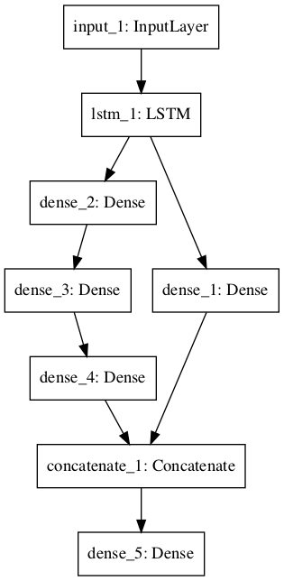
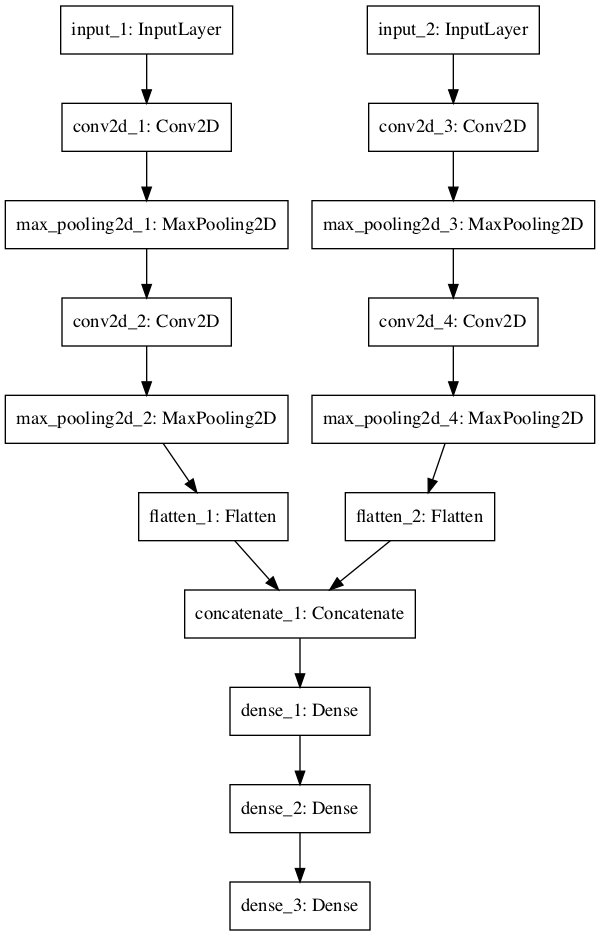
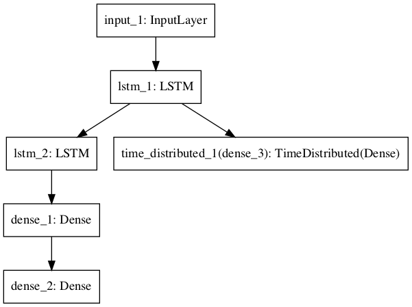

# Deep Neural Frameworks

This page collects notes on the deep learning libraries used in practice: PyTorch, fast.ai, and Keras.
It also covers the NVIDIA CUDA stack used to run TensorFlow and related GPU tooling.

## PYTORCH

This section points at the PyTorch book, Yann LeCun's course, and the official tutorials as the first framework stack.

1. Deep learning with pytorch - The book
- GitHub - Atcold/NYU-DLSP20: NYU Deep Learning Spring 2020. Pytorch DL course [git](https://github.com/Atcold/pytorch-Deep-Learning)
3. Pytorch Official
 - Welcome to PyTorch Tutorials — PyTorch Tutorials 2.14.0+cu130 documentation. [Tutorials](https://pytorch.org/tutorials/)

 <figure><figcaption>
Tutorials
</figcaption></figure>

 - Learning PyTorch with Examples — PyTorch Tutorials 2.14.0+cu130 documentation. [Learning with examples](https://pytorch.org/tutorials/beginner/pytorch_with_examples.html)
 - Learn the Basics — PyTorch Tutorials 2.14.0+cu130 documentation. [Learn the Basics](https://pytorch.org/tutorials/beginner/basics/intro.html)
 - Quickstart — PyTorch Tutorials 2.14.0+cu130 documentation. [Quickstart](https://pytorch.org/tutorials/beginner/basics/quickstart_tutorial.html)
 - Tensors — PyTorch Tutorials 2.14.0+cu130 documentation. [Tensors](https://pytorch.org/tutorials/beginner/basics/tensorqs_tutorial.html)
 - Datasets & DataLoaders — PyTorch Tutorials 2.14.0+cu130 documentation. [Datasets & DataLoaders](https://pytorch.org/tutorials/beginner/basics/data_tutorial.html)
 - Transforms — PyTorch Tutorials 2.14.0+cu130 documentation. [Transforms](https://pytorch.org/tutorials/beginner/basics/transforms_tutorial.html)
 - Build the Neural Network — PyTorch Tutorials 2.14.0+cu130 documentation. [Build Model](https://pytorch.org/tutorials/beginner/basics/buildmodel_tutorial.html)
 - Automatic Differentiation with torch.autograd — PyTorch Tutorials 2.14.0+cu130 documentation. [Autograd](https://pytorch.org/tutorials/beginner/basics/autogradqs_tutorial.html)
 - Optimizing Model Parameters — PyTorch Tutorials 2.14.0+cu130 documentation. [Optimization](https://pytorch.org/tutorials/beginner/basics/optimization_tutorial.html)
 - Save and Load the Model — PyTorch Tutorials 2.14.0+cu130 documentation. [Save & Load Model](https://pytorch.org/tutorials/beginner/basics/saveloadrun_tutorial.html)
 - Deep Learning with PyTorch: A 60 Minute Blitz — PyTorch Tutorials 2.14.0+cu130 documentation. [60 minute blitz](https://pytorch.org/tutorials/beginner/deep_learning_60min_blitz.html)
 - Introduction to PyTorch. Introduction to PyTorch. (good) - [youtube series](https://pytorch.org/tutorials/beginner/introyt.html)

## FAST.AI

This section points at the fast.ai repository and medium notes covering its courses after PyTorch above.

The same notes are in [FAST.AI](deep-neural-frameworks.md#fastai).

- GitHub - fastai/fastai: The fastai deep learning library. [git](https://github.com/fastai/fastai)

1. [Medium](https://medium.com/@hiromi_suenaga/deep-learning-2-part-1-lesson-1-602f73869197) on all fast.ai courses, 14 posts

## KERAS

This section is Keras: an introduction, metrics, the functional API, embeddings, predict versus evaluate, and training loss after fast.ai above.

[A make sense introduction into keras](https://www.youtube.com/playlist?list=PLFxrZqbLojdKuK7Lm6uamegEFGW2wki6P), has several videos on the topic, going through many network types, creating custom activation functions, going through examples.

- Two extra videos from the same author. [examples](https://www.youtube.com/watch?v=6RdflAr66-E)
- and [examples-2](https://www.youtube.com/watch?v=fDKdITMBAGk)

Didn't read:

1. [Keras cheatsheet](https://www.datacamp.com/community/blog/keras-cheat-sheet)
2. [Seq2Seq RNN](https://stackoverflow.com/questions/41933958/how-to-code-a-sequence-to-sequence-rnn-in-keras)
3. Stateful LSTM - Example script showing how to use stateful RNNs to model long sequences efficiently.
4. CONV LSTM - this script demonstrate the use of a conv LSTM network, used to predict the next frame of an artificially generated move which contains moving squares.

[How to force keras to use tensorflow](https://github.com/ContinuumIO/anaconda-issues/issues/1735) and not teano (set the .bat file)

[Callbacks - how to create an AUC ROC score callback with keras](https://keunwoochoi.wordpress.com/2016/07/16/keras-callbacks/) - with code example.

[Batch size vs. Iterations in NN Keras.](https://stats.stackexchange.com/questions/164876/tradeoff-batch-size-vs-number-of-iterations-to-train-a-neural-network)

[Keras metrics](https://machinelearningmastery.com/custom-metrics-deep-learning-keras-python/) - classification regression and custom metrics

[Keras Metrics 2](https://machinelearningmastery.com/metrics-evaluate-machine-learning-algorithms-python/) - accuracy, ROC, AUC, classification, regression r^2.

[Introduction to regression models in Keras,](https://machinelearningmastery.com/regression-tutorial-keras-deep-learning-library-python/) using MSE, comparing baseline vs wide vs deep networks.

[How does Keras calculate accuracy](https://datascience.stackexchange.com/questions/14415/how-does-keras-calculate-accuracy)? Formula and explanation

Compares label with the rounded predicted float, i.e. bigger than 0.5 = 1, smaller than = 0

For categorical we take the argmax for the label and the prediction and compare their location.

In both cases, we average the results.

[Custom metrics (precision recall) in keras](https://stackoverflow.com/questions/41458859/keras-custom-metric-for-single-class-accuracy). Which are taken from [here](https://github.com/autonomio/talos/tree/master/talos/metrics), including entropy and f1

### KERAS MULTI GPU

This part is multi-GPU training in Keras, including batch size and the last-batch pitfall.

1. [When using SGD only batches between 32-512 are adequate, more can lead to lower performance, less will lead to slow training times.](https://arxiv.org/pdf/1609.04836.pdf)
2. Note: probably doesn't reflect on adam, is there a reference?
3. [Parallel gpu-code for keras. Its a one liner, but remember to scale batches by the amount of GPU used in order to see a (non linear) scaability in training time.](https://datascience.stackexchange.com/questions/23895/multi-gpu-in-keras)
4. [Pitfalls in GPU training, this is a very important post, be aware that you can corrupt your weights using the wrong combination of batches-to-input-size](http://blog.datumbox.com/5-tips-for-multi-gpu-training-with-keras/), in keras-tensorflow. When you do multi-GPU training, it is important to feed all the GPUs with data. It can happen that the very last batch of your epoch has less data than defined (because the size of your dataset can not be divided exactly by the size of your batch). This might cause some GPUs not to receive any data during the last step. Unfortunately some Keras Layers, most notably the Batch Normalization Layer, can't cope with that leading to nan values appearing in the weights (the running mean and variance in the BN layer).
- 5 tips for multi-GPU training with Keras. [5 things to be aware of for multi gpu using keras, crucial to look at before doing anything](http://blog.datumbox.com/5-tips-for-multi-gpu-training-with-keras/)

### KERAS FUNCTIONAL API

This part is the functional API: layers in parallel, and graphs with shared features, multiple inputs, or multiple outputs.

[What is and how to use?](https://machinelearningmastery.com/keras-functional-api-deep-learning/) A flexible way to declare layers in parallel, i.e. parallel ways to deal with input, feature extraction, models and outputs as seen in the following images.

<figure><figcaption>
Neural Network Graph With Shared Feature Extraction Layer

Credit: <a href="https://lh5.googleusercontent.com/tdK7TuCAsYPfx_vLBps4HU2dLQqA2M7prppP5V7xOzuT2SGeV_T3hJ94wvJMC0gBY1XS81bK6uKzOZ2HNazaEBRtD-a1xAtPS8OtcaEtjhqRi-GjH1iFOZM_2WDCWzs73odUzTbd">copied from the original hosted image</a>.
</figcaption></figure>

<figure><figcaption>
Neural Network Graph With Multiple Inputs

Credit: <a href="https://lh6.googleusercontent.com/ptnE_MAQyTSSYyRCULQRnIx7XRa_7zVLSEbclJuebxvZPotAqJIe2ElY5SuF42UdfrEdIWFII7BwsVUrCkAXp3Ta1GCmrPLsir-duOxF5wkRn62uH0M4etHjBVNQOF7luWc4Qs9K">copied from the original hosted image</a>.
</figcaption></figure>

<figure><figcaption>
Neural Network Graph With Multiple Outputs

Credit: <a href="https://lh4.googleusercontent.com/pdU8st0CBS7qGN14dBXm6XbFJCL-hMAPtRjz__la0DN96IwABz-PV0i-xTEEAf5yBMOTBfi6QwAsnuGFnonRbSxdbQWl33bssITuR3zInVupAW0z9RSTCpqc9UwlAi6PZ0elyDLa">copied from the original hosted image</a>.
</figcaption></figure>

### KERAS EMBEDDING LAYER

This part is the Keras embedding layer, GloVe, word2vec, and fastText.

The same notes are in [Embedding](representations.md).

- How to Use Word Embedding Layers for Deep Learning with Keras - MachineLearningMastery.com, by Jason Brownlee. [Injecting glove to keras embedding layer and using it for classification + what is and how to use the embedding layer in keras.](https://machinelearningmastery.com/use-word-embedding-layers-deep-learning-keras/)
- Using pre-trained word embeddings in a Keras model. [Keras blog - using GLOVE for pretrained embedding layers.](https://blog.keras.io/using-pre-trained-word-embeddings-in-a-keras-model.html)
3. Word embedding using keras, continuous BOW - CBOW, SKIPGRAM, word2vec - really good.
4. [Fasttext - comparison of key feature against word2vec](https://www.quora.com/What-is-the-main-difference-between-word2vec-and-fastText)
- Hi Denny, Thanks very much for the great blog and the source code. [Multiclass classification using word2vec/glove + code](https://github.com/dennybritz/cnn-text-classification-tf/issues/69)
- An example on how to train supervised classifiers for multi-label text classification using sklearn pipelines - text-classification/train_classifiers.py at master · davidsbatista/text-classification. [word2vec/doc2vec/tfidf code in python for text classification](https://github.com/davidsbatista/text-classification/blob/master/train_classifiers.py)
- Explore and run AI code with Kaggle Notebooks | Using data from Spooky Author Identification. [Lda & word2vec](https://www.kaggle.com/vukglisovic/classification-combining-lda-and-word2vec)
- Text classification with Word2Vec · DS lore. [Text classification with word2vec](http://nadbordrozd.github.io/blog/2016/05/20/text-classification-with-word2vec/)
- Gensim: topic modelling for humans. Gensim: topic modelling for humans. [Gensim word2vec](https://radimrehurek.com/gensim/models/word2vec.html)
- This Word2Vec tutorial teaches you how to use the Gensim package for creating word embeddings, by Kavita Ganesan. and [another one](http://kavita-ganesan.com/gensim-word2vec-tutorial-starter-code/)
- Abstract page for arXiv paper 1607.01759: Bag of Tricks for Efficient Text Classification. [Fasttext paper](https://arxiv.org/abs/1607.01759)

### Keras: Predict vs Evaluate

This part is the difference between predict and evaluate.

[here:](https://www.quora.com/What-is-the-difference-between-keras-evaluate-and-keras-predict)

.predict() generates output predictions based on the input you pass it (for example, the predicted characters in the MNIST example)

.evaluate() computes the loss based on the input you pass it, along with any other metrics that you requested in the metrics param when you compiled your model (such as accuracy in the MNIST example)

Keras metrics

[For classification methods - how does keras calculate accuracy, all functions.](https://www.quora.com/How-does-Keras-calculate-accuracy)

### LOSS IN KERAS

This part is why training loss is higher than testing loss.

The same notes are in [Cross entropy, relative ent, KL-D, JS-D, soft max](../data/information-theory.md#cross-entropy-relative-ent-kl-d-js-d-soft-max) and [Perplexity](../evals/evaluation-metrics.md#perplexity).

[Why is the training loss much higher than the testing loss?](https://keras.io/getting-started/faq/#why-is-the-training-loss-much-higher-than-the-testing-loss) A Keras model has two modes: training and testing. Regularization mechanisms, such as Dropout and L1/L2 weight regularization, are turned off at testing time.

The training loss is the average of the losses over each batch of training data. Because your model is changing over time, the loss over the first batches of an epoch is generally higher than over the last batches. On the other hand, the testing loss for an epoch is computed using the model as it is at the end of the epoch, resulting in a lower loss.

- Word embedding using keras, continuous BOW - CBOW, SKIPGRAM, word2vec - really good. [https://towardsdatascience.com/understanding-feature-engineering-part-4-deep-learning-methods-for-text-data-96c44370bbfa](https://towardsdatascience.com/understanding-feature-engineering-part-4-deep-learning-methods-for-text-data-96c44370bbfa)

## NVIDIA TF CUDA CUDNN

This section is install notes for TensorFlow, CUDA, and cuDNN after the Keras material above.

- Install TensorFlow with pip. Install TensorFlow with pip. [Install TF](https://www.tensorflow.org/install/install_linux#NVIDIARequirements)
- Hello, 
I have troubles to understand and install the installation process for a specific cuda version that is needed as a dependency for a program that I want to run. [Install cuda on ubuntu](https://devtalk.nvidia.com/default/topic/1030495/cuda-setup-and-installation/install-a-specific-cuda-version-for-ubuntu-16-04/)
- The installation instructions for the CUDA Toolkit on Linux. [official linux](https://docs.nvidia.com/cuda/cuda-installation-guide-linux/)
- [Replace cuda version](https://askubuntu.com/questions/959835/how-to-remove-cuda-9-0-and-install-cuda-8-0-instead)
- Get CUDA Toolkit 9.0 for Windows, Linux, and Mac OSX. [Cuda 9 download](https://developer.nvidia.com/cuda-90-download-archive?target_os=Linux&target_arch=x86_64&target_distro=Ubuntu&target_version=1704&target_type=runfilelocal)
- [Install cudnn](https://askubuntu.com/questions/1033489/the-easy-way-install-nvidia-drivers-cuda-cudnn-and-tensorflow-gpu-on-ubuntu-1)
- [Installing everything easily](https://askubuntu.com/questions/1033489/the-easy-way-install-nvidia-drivers-cuda-cudnn-and-tensorflow-gpu-on-ubuntu-1)
- [Failed](https://stackoverflow.com/questions/43022843/nvidia-nvml-driver-library-version-mismatch) to initialize NVML: Driver/library version mismatch

## Deprecated links


These links and images no longer work. The original wording is kept here. A same-resource copy, when one was checked, is used above.


- The book. This address no longer opens: https://pytorch.org/assets/deep-learning/Deep-Learning-with-PyTorch.pdf
- Pytorch DL course. This address no longer opens: https://atcold.github.io/pytorch-Deep-Learning/
- Stateful LSTM. This address no longer opens: https://github.com/fchollet/keras/blob/master/examples/stateful_lstm.py
- CONV LSTM. This address no longer opens: https://github.com/fchollet/keras/blob/master/examples/conv_lstm.py
- MNIST example. This address no longer opens: https://github.com/fchollet/keras/blob/master/examples/mnist_mlp.py
