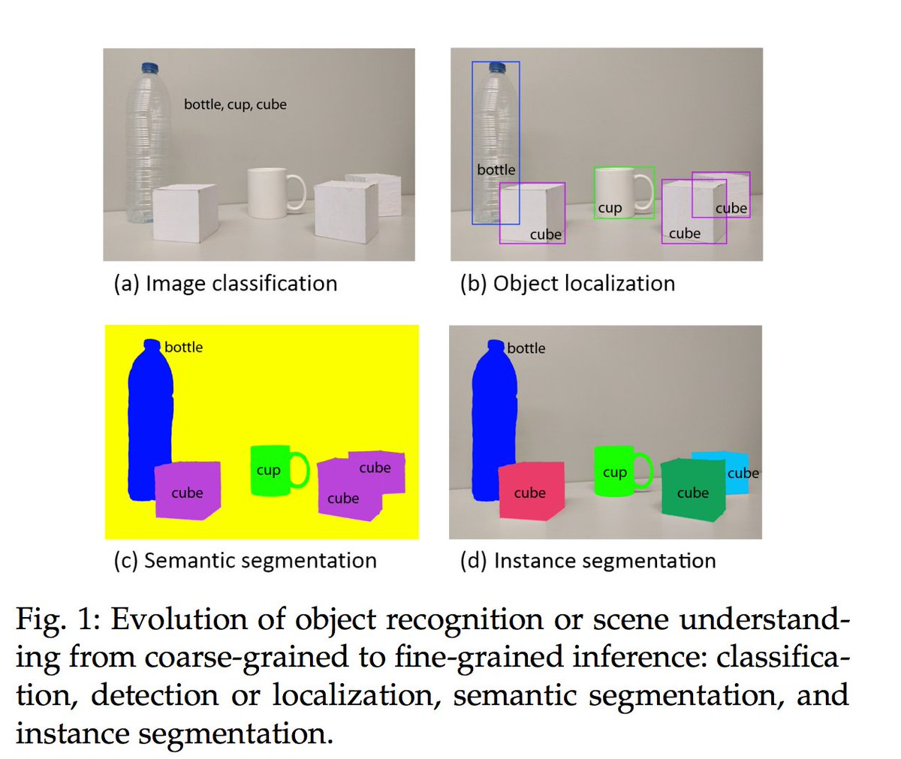
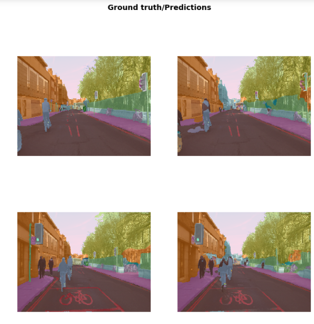
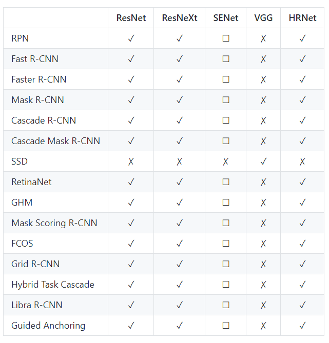

# Deep Neural Machine Vision

Machine vision asks a network to find, name, and outline what is in an image. The page starts with the tools that clean an image collection and with super resolution, then spends most of its length on detection, from the R-CNN family to YOLO, and closes with recognition and segmentation.

The same notes are in [Machine Vision annotation](../data/annotation-and-disagreement.md#machine-vision-annotation) and [Vision](../generative-ai/vision.md).

## TOOLS

Before training anything, the image set itself has to be clean. [Image deduplication](https://github.com/idealo/imagededup) is idealo/imagededup, 😎 Finding duplicate images made easy! The other tool the author lists is Segment anything by Meta, whose demo is kept at the end of the page.

## SUPER RESOLUTION

Once the images are clean, some are simply too small, and super resolution recovers detail from the image itself. [State of the art comparison](http://www.wisdom.weizmann.ac.il/~vision/zssr/) is the project page for "Zero Shot" Super-Resolution using Deep Internal Learning.

## DETECTION

With usable images in hand, detection is the core task: find each object and draw its box. The figure below sets the scene.

The same notes are in [CONVOLUTIONAL NEURAL NET](convolutional-nets.md#convolutional-neural-net) and [Mix N Match](../generative-ai/mix-n-match.md).

<figure><figcaption>
Detection

Credit: <a href="https://lh5.googleusercontent.com/Efe-9nD1W6Hes040DI2Zgm2lzh0vnkYVTB95hnK1rmv3DYtfbPt9Bia0iVnSV49xJRs8JYLggj7KvIRGZDpbz4melmLvp0uLwQ-F6wtCjHYwRKjD4rw7DH8p90Gqo-P4DZNpW8fH">copied from the original hosted image</a>.
</figcaption></figure>

The overviews come first. [Review on DL technique applied to semantic segmentation](https://arxiv.org/pdf/1704.06857.pdf) is the review by A. Garcia-Garcia, S. Orts-Escolano, and co-authors. [Mastery on obj detection](https://machinelearningmastery.com/object-recognition-with-deep-learning/) is Jason Brownlee's gentle introduction to object recognition with deep learning, written because beginners find it hard to tell image classification, object localization, and object detection apart when all three get called object recognition.

The frameworks come next. Fair [detectron](https://github.com/facebookresearch/Detectron) is FAIR's research platform for object detection research, implementing popular algorithms like Mask R-CNN and RetinaNet. [Maskrcnn benchmark](https://github.com/facebookresearch/maskrcnn-benchmark) is a fast, modular reference implementation of instance segmentation and object detection algorithms in PyTorch, and its [paper](https://arxiv.org/abs/1703.06870) is Mask R-CNN. [Simpledet - obj detection and instance recognition](https://github.com/TuSimple/simpledet) is a simple and versatile framework for both, and [Mmdetection](https://github.com/open-mmlab/mmdetection) is the OpenMMLab Detection Toolbox and Benchmark.

Detection sits next to separation and segmentation. [Blind image separation](https://www.researchgate.net/publication/3938186_Blind_image_separation_through_kurtosis_maximization) is the paper on blind image separation through kurtosis maximization. [UNET](https://heartbeat.fritz.ai/deep-learning-for-image-segmentation-u-net-architecture-ff17f6e4c1cf) is Fritz's post on U-Net for image segmentation, the process that partitions an image into regions to separate objects and textures. [U^2 Net - using a detection network for pencil drawing generation and segmentation](https://github.com/NathanUA/U-2-Net) is the code for the Pattern Recognition 2020 paper "U^2-Net: Going Deeper with Nested U-Structure for Salient Object Detection." The author's FastAI image segmentation note is kept at the end of the page. The two figures below come from the same detection notes.

<figure><figcaption>
Detection

Credit: <a href="https://lh6.googleusercontent.com/0gWJVORnNeoeKD6j3fwo1HrA9W8SN2ZHUBkX8YdhLUomtniJ8tlattamydryookCJrL3Pu35a3xZUfOpkc3jXYBsm0gAkMZl5IxCg5nijzRSX80vwvethJRbWGK662LnMfLw4lcZ">copied from the original hosted image</a>.
</figcaption></figure>

<figure><figcaption>
Detection

Credit: <a href="https://lh5.googleusercontent.com/kn9eEm1IltsrjvpNUJsS9iZ0zgFynCyqA2kk4OCN9EjFRXKqeUrKlvv7UbfbvwPfQ-kz0fOn3kpUqnE3liGs71m9945BLBPmpeFtOdzCyp6FUhA-7_AEjvzYnaDTXUnz-JEsbWHS">copied from the original hosted image</a>.
</figcaption></figure>

The single-shot line of detectors is YOLO, in three papers: [You Only Look Once: Unified, Real-Time Object Detection](https://arxiv.org/abs/1506.02640), then [YOLO9000: Better, Faster, Stronger](https://arxiv.org/abs/1612.08242), then [YOLOv3: An Incremental Improvement](https://arxiv.org/abs/1804.02767). Its code is [YOLO, GitHub](https://github.com/pjreddie/darknet/wiki/YOLO:-Real-Time-Object-Detection), the YOLO: Real Time Object Detection page in pjreddie's darknet.

The two-stage line is the R-CNN family, and its code comes in order. [R-CNN: Regions with Convolutional Neural Network Features, GitHub](https://github.com/rbgirshick/rcnn) is rbgirshick/rcnn, and [Fast R-CNN, GitHub](https://github.com/rbgirshick/fast-rcnn) is rbgirshick/fast-rcnn. For Faster R-CNN, the Python implementation -- see https://github.com/ShaoqingRen/faster_rcnn for the official MATLAB version - rbgirshick/py-faster-rcnn - is [Faster R-CNN Python Code, GitHub](https://github.com/rbgirshick/py-faster-rcnn).

The papers behind that code, in order, are [Rich feature hierarchies for accurate object detection and semantic segmentation](https://arxiv.org/abs/1311.2524), [Spatial Pyramid Pooling in Deep Convolutional Networks for Visual Recognition](https://arxiv.org/abs/1406.4729), [Fast R-CNN](https://arxiv.org/abs/1504.08083), [Faster R-CNN: Towards Real-Time Object Detection with Region Proposal Networks](https://arxiv.org/abs/1506.01497), and [Mask R-CNN](https://arxiv.org/abs/1703.06870).

To read that history as one story, [A Brief History of CNNs in Image Segmentation: From R-CNN to Mask R-CNN](https://blog.athelas.com/a-brief-history-of-cnns-in-image-segmentation-from-r-cnn-to-mask-r-cnn-34ea83205de4), 2017, walks from R-CNN to Mask R-CNN. Lil'Log covers the same ground in [Object Detection for Dummies Part 3: R-CNN Family](https://lilianweng.github.io/lil-log/2017/12/31/object-recognition-for-dummies-part-3.html) and then [Object Detection Part 4: Fast Detection Models](https://lilianweng.github.io/lil-log/2018/12/27/object-detection-part-4.html). For data to practice on, [Ikea ASM](https://ikeaasm.github.io/) is the IKEA Assembly Dataset.

## RECOGNITION

Detection finds objects; recognition names them, and labels can come from where people already put them. [Using image hashtags](https://engineering.fb.com/ml-applications/advancing-state-of-the-art-image-recognition-with-deep-learning-on-hashtags/) is Engineering at Meta on advancing state-of-the-art image recognition with deep learning on hashtags.

## Segmentation

After boxes and names, segmentation outlines each object pixel by pixel, and transformer features can do that too.

The same notes are in [CONVOLUTIONAL NEURAL NET](convolutional-nets.md#convolutional-neural-net) and [Mix N Match](../generative-ai/mix-n-match.md).

[Vit](https://dino-vit-features.github.io/) is the project page for 'Deep ViT Features as Dense Visual Descriptors.'

## Deprecated links


These links and images no longer work. The original wording is kept here. A same-resource copy, when one was checked, is used above.


- Segment anything by Meta. This address no longer opens: https://segment-anything.com/demo
- FastAI image segmentation. This address no longer opens: https://gilberttanner.com/blog/fastai-image-segmentation
