# Deep Neural Nets Basics

A deep net is a stack of simple units trained by a gradient, and almost every problem in training one comes from how that stack, its activations, and its loss interact.
The page starts with the building blocks (perceptrons, multilayer networks, activations, and loss), then follows how training runs: gradient descent, batch size, learning rate, optimizers, initializers, bias, batch normalization, and dropout, and how to read train/val accuracy and search hyperparameters.
Later sections gather optimization tricks, fine tuning, and extensions such as NLP, multi-label, siamese nets, and gMLP.

## Perceptron

Everything later on the page rests on one unit and one rule for correcting it, so the entry point is the perceptron and the chain rule. The path starts with the perceptron computing logical functions and running into XOR. Training more than one such unit needs the chain rule: [mastery on the chain rule for multi and univariate functions](https://machinelearningmastery.com/the-chain-rule-of-calculus-for-univariate-and-multivariate-functions/) is Stefania Cristina's MachineLearningMastery.com piece, which shows that the chain rule finds the derivative of composite functions and that backpropagation applies it in a specific order to calculate the error gradient of the loss when training feedforward neural networks. The derivative of a sigmoid and the derivative for ML people come next; their Towards Data Science sources, along with the perceptron and XOR one, are kept at the end of the page. [Step by step backpropagation example](https://mattmazur.com/2015/03/17/a-step-by-step-backpropagation-example/) is Matt Mazur's step-by-step backpropagation example, the point where those derivatives turn into one worked pass. Understanding backprop is the last step on this path, and its Towards Data Science link sits with the others at the end of the gMLP section.

## DNN

Once one unit and its gradient are clear, the next step is stacking them into general deep nets, and from there into autoencoders, DBNs, transfer learning, CNNs, and RNNs. Two guides give the overview first. [Deep learning notes from Andrew NG’s course.](https://www.slideshare.net/TessFerrandez/notes-from-coursera-deep-learning-courses-by-andrew-ng) are notes from the excellent Coursera specialization by Andrew Ng, downloadable as a PDF or PPTX. Jay Alammar on NN comes in two parts: [Part 1](http://jalammar.github.io/visual-interactive-guide-basics-neural-networks/) is his visual and interactive guide to the basics of neural networks, written from a software engineer's point of view, and [Part 2](http://jalammar.github.io/feedforward-neural-networks-visual-interactive/) takes another example to explore the basic mathematical ideas involved in prediction with neural networks. NN in general had five introduction tutorials, whose source is kept at the end of the page. For a look at where these nets end up, the [Segmentation examples](https://meetshah1995.github.io/semantic-segmentation/deep-learning/pytorch/visdom/2017/06/01/semantic-segmentation-over-the-years.html) page is a redirection page to semantic segmentation over the years.

The first stacked net is the MLP: fully connected, input, hidden layers, output. Gradient on the backprop takes a lot of time to calculate. Has vanishing gradient problem, because of multiplications when it reaches the first layers the loss correction is very small (0.1*0.1*0.1 = 0.001), therefore the early layers train slower than the last ones, and the early ones capture the basics structures so they are the more important ones.

The same fully connected layers can learn without labels. AutoEncoder - unsupervised, drives the input through fully connected layers, sometime reducing their neurons amount, then does the reverse and expands the layer’s size to get to the input (images are multiplied by the transpose matrix, many times over), Comparing the predicted output to the input, correcting the cost using gradient descent and redoing it, until the networks learns the output. Its variants are:

- Convolutional auto encoder
- Denoiser auto encoder - masking areas in order to create an encoder that understands noisy images
- Variational autoencoder - doesnt rely on distance between pixels, rather it maps them to a function (gaussian), eventually the DS should be explained by this mapping, uses 2 new layers added to the network. Gaussian will create blurry images, but similar. Please note that it also works with CNN.

Whatever the architecture, a classifier ends in raw scores before any probabilities. What are [logits](https://stackoverflow.com/questions/41455101/what-is-the-meaning-of-the-word-logits-in-tensorflow) in neural net - the vector of raw (non-normalized) predictions that a classification model generates, which is ordinarily then passed to a normalization function. If the model is solving a multi-class classification problem, logits typically become an input to the softmax function. The softmax function then generates a vector of (normalized) probabilities with one value for each possible class.

The autoencoder idea also explains word embeddings. [WORD2VEC](http://mccormickml.com/2016/04/19/word2vec-tutorial-the-skip-gram-model/) is the tutorial on the skip-gram neural network architecture for Word2Vec - based on autoencode, we keep only the hidden layer. [Part 2](http://mccormickml.com/2017/01/11/word2vec-tutorial-part-2-negative-sampling/) covers negative sampling, the modifications to the basic skip-gram model that make it feasible to train.

A different way to learn features without labels is the RBM - restricted (no 2 nodes share a connection) boltzman machine. An Autoencoder of features, tries to encode its own structure. Works best on pics, video, voice, sensor data. 2 layers, visible and hidden, error and bias calculated via KL Divergence. It is also known as a shallow network: two layers, input and output, goes back and forth until it learns its output.

Stacking RBMs gives the DBN - deep belief networks, similar structure to multi layer perceptron. fully connected, input, hidden(s), output layers. Can be thought of as stacks of RBM. training using GPU optimization, accurate and needs smaller labelled data set to complete the training.

Solves the ‘vanishing gradient’ problem, imagine a fully connected network, advancing each 2 layers step by step until each boltzman network (2 layers) learns the output, keeps advancing until finished.. Each layer learns the entire input.

Next step is to fine tune using a labelled test set, improves performance and alters the net. So basically using labeled samples we fine tune and associate features and pattern with a name. Weights and biases are altered slightly and there is also an increase in performance. Unlike CNN which learns features then high level features.

Accurate and reasonable in time, unlike fully connected that has the vanishing gradient problem.

That fine-tuning step leads straight into reusing a whole trained net. Transfer Learning = like Inception in Tensor flow, use a prebuilt network to solve many problems that “work” similarly to the original network. The [CS course definition](http://cs231n.github.io/transfer-learning/) is also very good explanation of the common use cases:

- Feature extraction from the CNN part (removing the fully connected layer)
- Fine-tuning, everything or partial selection of the hidden layers, mainly good to keep low level neurons that know what edges and color blobs are, but not dog breeds or something not as general.

The [CNN checkpoints](https://github.com/BVLC/caffe/wiki/Model-Zoo#cascaded-fully-convolutional-networks-for-biomedical-image-segmentation) in the Caffe Model Zoo are there for many problems with transfer learning. The Model Zoo has several relevant references, such as this arXiv paper: [How transferable are features in deep neural networks?](http://arxiv.org/abs/1411.1792) A worked example, noted here as from "the indian guy on facebook", is [IMDB transfer learning using cnn vgg and word2vec](https://spandan-madan.github.io/DeepLearningProject/), the word2vec is interesting, the cnn part is very informative. With python code, keras.

Transfer learning in vision mostly means reusing a CNN, Convolutional Neural Net. [this link explains CNN quite well](https://ujjwalkarn.me/2016/08/11/intuitive-explanation-convnets/): it is an intuitive explanation of what ConvNets are and why they have proven very effective. The [2nd tutorial](https://hackernoon.com/deep-learning-cnns-in-tensorflow-with-gpus-cba6efe0acc2) runs deep learning CNNs in TensorFlow with GPUs, building on a complex network made from a pre-trained inception v3 model - both explain about convolution, padding, relu - sparsity, max and avg pooling. The layer pattern they describe is:

- Common Layers: input->convolution->relu activation->pooling to reduce dimensionality ->fully connected layer
- repeat several times over as this discover patterns but needs another layer -> fully connected layer
- Then we connect at the end a fully connected layer (fcl) to classify data samples.
- Good for face detection, images etc.
- Requires lots of data, not always possible in a real world situation
- Relu is quite resistant to vanishing gradient & allows for deactivating neurons and for sparsity.

Where a CNN looks at space, an RNN looks at time. What is RNN by Andrej Karpathy - [The Unreasonable Effectiveness of Recurrent Neural Networks](http://karpathy.github.io/2015/05/21/rnn-effectiveness/), basically a lot of information about RNNs and their usage cases. The shapes it covers:

- basic NN node with a loop, previous output is merged with current input. for the purpose of remembering history, for time series, to predict the next X based on the previous Y.
- 1 to N = frame captioning
- N to 1 = classification
- N to N = predict frames in a movie
- N\2 with time delay to N\2 = predict supply and demand
- Vanishing gradient is 100 times worse.
- Gate networks like LSTM solves vanishing gradient.

The [WIKI](https://en.wikipedia.org/wiki/Recurrent_neural_network#Long_short-term_memory) article on recurrent neural networks, opened at its long short-term memory section, has many types of RNN networks.

For plain feedforward nets, the activation itself can fix part of the training problem. [SNN](https://medium.com/@eliorcohen/selu-make-fnns-great-again-snn-8d61526802a9) - SELU activation function is inside not outside, results converge better. Probably useful for feedforward networks.

The same building blocks also learn from reward instead of labels. [DEEP REINFORCEMENT LEARNING COURSE](https://www.youtube.com/watch?v=QDzM8r3WgBw&t=2958s) is Lex Fridman's MIT 6.S094 lecture on deep reinforcement learning (for motion planning), or [DEEP RL COURSE](https://www.youtube.com/watch?v=PtAIh9KSnjo) (Q-LEARNING?) - using unlabeled data, reward, and probably a CNN to solve games beyond human level. A [brief survey of DL for Reinforcement learning](https://arxiv.org/abs/1708.05866) is the arXiv survey of deep reinforcement learning.

Unread and potentially good tutorials:

1. [deep learning python](https://www.datacamp.com/community/tutorials/deep-learning-python), the DataCamp Keras tutorial on deep learning in Python

EXAMPLES of Using NN on images: [Deep image prior / denoiser/ high res/ remove artifacts/ etc..](https://dmitryulyanov.github.io/deep_image_prior) is the Deep Image Prior project page.

## ACTIVATION FUNCTIONS

Every architecture above passes its sums through a nonlinearity, and the choice of that function changes what the net can learn and how well the gradient survives. The same notes are in [Softmax](../data/information-theory.md#softmax) and [Temperature](../responsible-ai/calibration.md#temperature).

The first source is [a bunch of observations, seems like a personal list](http://sentiment-mining.blogspot.co.il/2015/08/the-difference-of-activation-function.html), a sentiment-mining blog post on the difference of activation function in neural network. Its rules of thumb:

 1. Output layer - linear for regression, softmax for classification
 2. Hidden layers - hyperbolic tangent for shallow networks (less than 3 hidden layers), and ReLU for deep networks

ReLU gets the most attention. The purpose of ReLU is to introduce non-linearity, since most of the real-world data we would want our network to learn would be nonlinear (e.g. convolution is a linear operation – element wise matrix multiplication and addition, so we account for nonlinearity by introducing a nonlinear function like ReLU, e.g [here](https://ujjwalkarn.me/2016/08/11/intuitive-explanation-convnets/) - search for ReLU). Relu is quite resistant to vanishing gradient & allows for deactivating neurons and for sparsity. Other nonlinear functions such as tanh or sigmoid can also be used instead of ReLU, but ReLU has been found to perform better in most situations.

For the full set side by side, [Visual + description of activation functions](https://medium.com/the-theory-of-everything/understanding-activation-functions-in-neural-networks-9491262884e0) is Avinash Sharma's answer to why there are so many activation functions, why one works better than another, and how to know which to use, written for readers who know neural networks only at a basic level. It is a very good explanation + figures about activations functions.

Newer activations keep appearing. [Selu](https://medium.com/data-science/selu-make-fnns-great-again-snn-8d61526802a9) is Elior Cohen's "SELU — Make FNNs Great Again (SNN)", better than RELU Possibly. [Mish](https://github.com/digantamisra98/Mish) is the official repository for "Mish: A Self Regularized Non-Monotonic Neural Activation Function" (BMVC 2020), and [yam peleg’s code](https://gist.github.com/ypeleg/3af35d07d7f659f387952c9843849772) is a mish.py gist. Mish, Medium, Keras Code, with benchmarks, computationally expensive; that Medium post is kept at the end of the page. [Gelu](https://paperswithcode.com/method/gelu), used by OpenAI, is the GELU method page, which now opens on Hugging Face's Trending Papers, a daily dose of AI research. For the activations inside transformers, [Deep Learning 101: Transformer Activation Functions Explainer - Sigmoid, ReLU, GELU, Swish](https://www.saltdatalabs.com/blog/deep-learning-101-transformer-activation-functions-explainer-relu-leaky-relu-gelu-elu-selu-softmax-and-more) is the Salt Data Labs post that explains the purpose and use of activation functions and gives an overview of several popular transformer activation functions.

## LOSS

The activation at the output decides what the loss sees, and the loss curve is the first thing to read while a net trains. The same notes are in [Cross entropy, relative ent, KL-D, JS-D, soft max](../data/information-theory.md#cross-entropy-relative-ent-kl-d-js-d-soft-max) and [Perplexity](../evals/evaluation-metrics.md#perplexity).

[Very Basic advice](https://stats.stackexchange.com/questions/232754/reference-to-learn-how-to-interpret-learning-curves-of-deep-convolutional-neural) on interpreting learning curves: You should probably switch train/validation repartition to something like 80% training and 20% validation. In most cases it will improve the classifier performance overall (more training data = better performance)

+If Training error and test error are too close (your system is unable to overfit on your training data), this means that your model is too simple. Solution: more layers or more neurons per layer.

Early stopping

The curves also say when to stop. If you have never heard about "early-stopping" you should look it up, it's an important concept in the neural network domain : [https://en.wikipedia.org/wiki/Early_stopping](https://en.wikipedia.org/wiki/Early_stopping) . To summarize, the idea behind early-stopping is to stop the training once the validation loss starts plateauing. Indeed, when this happens it almost always mean you are starting to overfitt your classifier. The training loss value in itself is not something you should trust, beacause it will continue to increase event when you are overfitting your classifier.

Loss and accuracy do not always move together. With [cross entropy](https://www.quora.com/Loss-cross-entropy-is-decreasing-but-accuracy-remains-the-same-while-training-convolutional-neural-networks-How-can-it-happen) there can be an issue where the accuracy is the same for two cases, one where the loss is decreasing and the other when the loss is not changing much. The figure below shows that case.

<figure>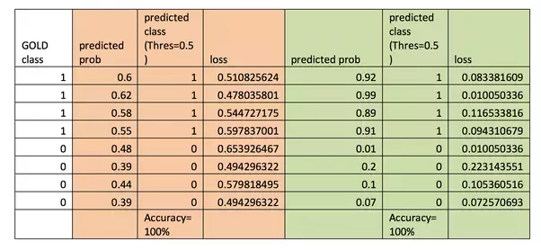<figcaption><p>LOSS</p><p>Credit: <a href="https://lh3.googleusercontent.com/f2R8DVu5A9g6LOGbNcmyIfayuVBYnpScO_kNsAcuJ8lsiM-hnYwlqD04qyI1wPYTwmsr2KpFKJa19gMkkJd67y03iJquhRftQdBpfGEdw5OQHficHqgkxudLfgpZsSS7Cc2p9qDS">copied from the original hosted image</a>.</p></figcaption></figure>


How to read LOSS graphs (and accuracy on top): the Keras issue that explained it is kept at the end of the page, and its two plots follow.

<figure>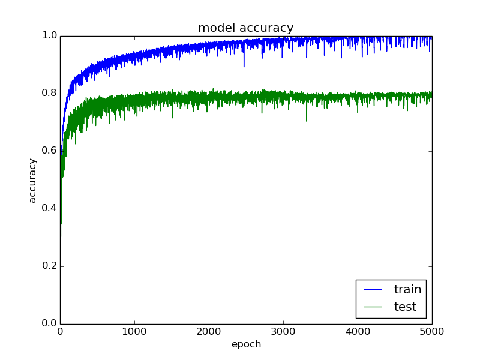<figcaption><p>LOSS</p><p>Credit: <a href="https://lh6.googleusercontent.com/blj3natUcvqK-nEmNjv90zAIM74QbA4x7hQ_F_oPGcHxQcdhc0_NrcPZhWDne2EEnUnJKNDOw4Xt_cUkhv3cFTFMcqzzBT4NeOPPnmoTfTXLFrEnVwkrlc5PEsZDNCZXdOr0GRZj">copied from the original hosted image</a>.</p></figcaption></figure> <figure>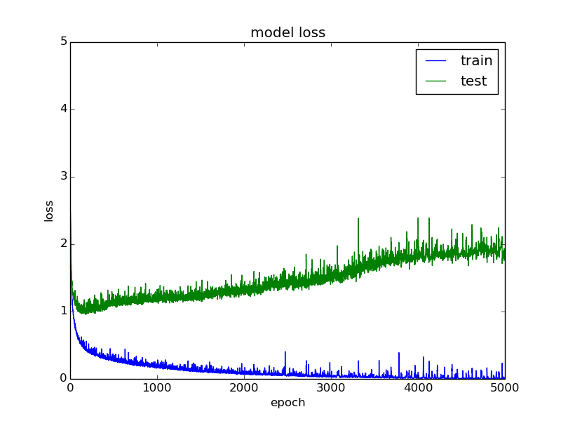<figcaption><p>LOSS</p><p>Credit: <a href="https://lh4.googleusercontent.com/o39Jcw1o7JeSsKuD_q-9xGukmT6pWLGs-9sVIumxLRF7dPpf25w8o9e2OBnWbpPc_p6t9e03D46r34N-8CYZa6fvfcWBVp_7N06xE0kbrvIzBC5sGWcMymN_KtPTfRKwHk1-gRcQ">copied from the original hosted image</a>.</p></figcaption></figure>

This indicates that the model is overfitting. It continues to get better and better at fitting the data that it sees (training data) while getting worse and worse at fitting the data that it does not see (validation data).

[This is a very good example of a train/test loss and an accuracy behavior.](https://machinelearningmastery.com/display-deep-learning-model-training-history-in-keras/) It is Jason Brownlee's post on displaying a Keras model's training history, on the idea that you learn a lot about a network by observing its performance over time during training; the two plots below are that behavior.

<figure>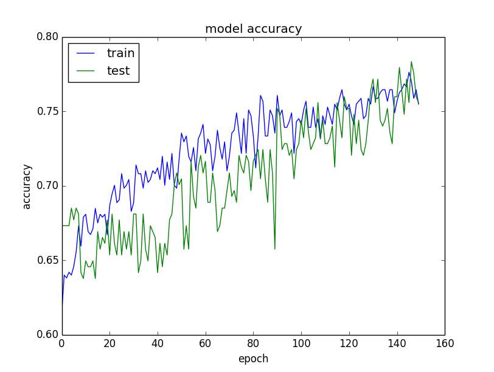<figcaption><p>LOSS</p><p>Credit: <a href="https://lh6.googleusercontent.com/GK_rvndJY76-cgBbBetgSZfwTD7RTZW2UsXUtsEZRUvFW1ACpJw9FMhNwj3LBERvmmPvcuTkkwb5HUcXgi7ua42WqJwAZgFP-3NsyF1qEo9GmACXGQGWGSYh3AR7yY765Qm9QfiO">copied from the original hosted image</a>.</p></figcaption></figure> <figure>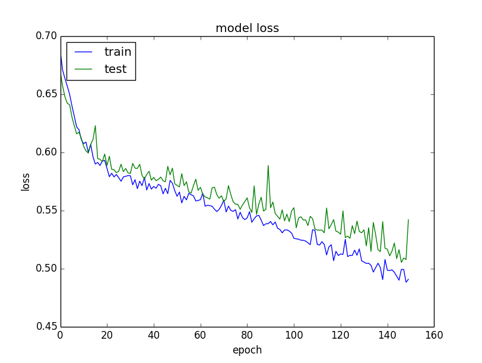<figcaption><p>LOSS</p><p>Credit: <a href="https://lh4.googleusercontent.com/Q46fiZLm9mMhuQnOVJjyZWstXj6Aq1Ctev1cvIUsdrOWiOqxfvNlkJjcW08waf8qCERvvt1AkW-HjDrLvjHiVxKTFzxfX0BmVq4hRUERqrGsNLALeJb75Geb06X21Bgb8z2dA6iw">copied from the original hosted image</a>.</p></figcaption></figure>

The loss itself can be bent to the problem. [Cross entropy formula with soft labels (probability) rather than classes.](https://stats.stackexchange.com/questions/206925/is-it-okay-to-use-cross-entropy-loss-function-with-soft-labels) is the question of whether a sigmoid cross entropy loss still works when pixels carry soft labels that denote probabilities instead of hard 0/1 labels. [Mastery on cross entropy, brier, roc auc, how to ‘game’ them and calibrate them](https://machinelearningmastery.com/how-to-score-probability-predictions-in-python/) is Jason Brownlee's introduction to probability scoring: predicting probabilities instead of class labels adds nuance and uncertainty, which lets more sophisticated metrics interpret the predictions. [Game changer paper - a general adaptive loss search in nn](https://www.reddit.com/r/computervision/comments/bsd82j/a_general_and_adaptive_robust_loss_function/?utm_medium=android_app&utm_source=share) is the r/computervision thread on a general and adaptive robust loss function; Reddit may show a block notice instead of the thread.

## GRADIENT DESCENT

A loss only helps if something walks it downhill, and that walk is gradient descent. ([What are](http://machinelearningmastery.com/gentle-introduction-mini-batch-gradient-descent-configure-batch-size/)?) batch, stochastic, and mini-batch gradient descent are and the benefits and limitations of each method. [What is gradient descent, how to use it, local minima okay to use, compared to global. Saddle points, learning rate strategies and research points](https://blog.paperspace.com/intro-to-optimization-in-deep-learning-gradient-descent/) is the Paperspace (now DigitalOcean) in-depth explanation of gradient descent and how to avoid the problems of local minima and saddle points.

The idea in three steps: gradient descent is an optimization algorithm often used for finding the weights or coefficients of machine learning algorithms, such as artificial neural networks and logistic regression. The model makes predictions on training data, then use the error on the predictions to update the model to reduce the error. The goal of the algorithm is to find model parameters (e.g. coefficients or weights) that minimize the error of the model on the training dataset. It does this by making changes to the model that move it along a gradient or slope of errors down toward a minimum error value. This gives the algorithm its name of “gradient descent.”

### Stochastic

The three variants differ only in how often the model is updated, and the most frequent is stochastic gradient descent, which updates weights after every training example: it calculates error and updates the model after every training sample.

### Batch

At the other extreme, batch gradient descent waits until all examples are evaluated before one update. It calculates the error for each example in the training dataset, but only updates the model after all training examples have been evaluated.

### Mini batch (most common)

Between the two, mini-batch methods update on small subsets of the training data. Mini-batch splits the training dataset into small batches, used to calculate model error and update model coefficients. Implementations may choose to sum the gradient over the mini-batch or take the average of the gradient (reduces variance of gradient) (unclear?). Tips on how to choose and train using mini batch in the link above.

Batch size and learning rate are tied together, which is the point of [Dont decay the learning rate, increase batchsize - paper](https://arxiv.org/abs/1711.00489) (optimization of a network), the arXiv paper "Don't Decay the Learning Rate, Increase the Batch Size". The two figures below compare the variants.

<figure>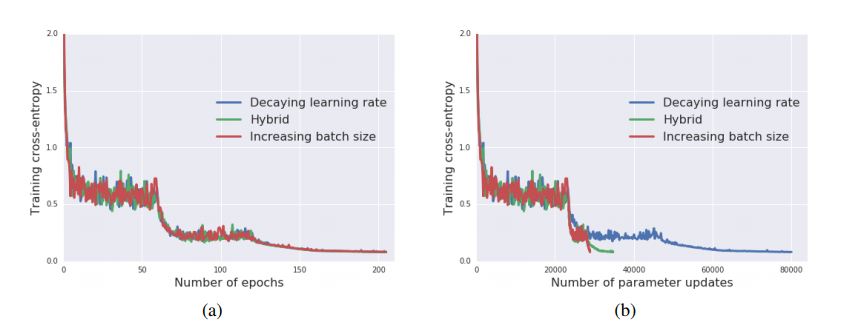<figcaption><p>Mini batch (most common)</p><p>Credit: <a href="https://lh5.googleusercontent.com/3UX6uh_X7IhUv9gwKopvsWRTICf9T2Xm8xWHTZuetYCUQiVRCP7mvIRxfns8Rmx3vuUFMXHiW5x8pVLWhNsUP9h1ZFzkFi9YUZRZjEuugZ3urEAAoRrMNt78hX6wIyIYvZAINiGw">copied from the original hosted image</a>.</p></figcaption></figure>


<figure>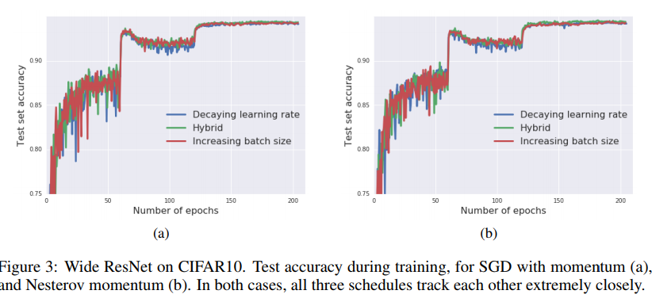<figcaption><p>Mini batch (most common)</p><p>Credit: <a href="https://lh5.googleusercontent.com/u6LIUt6HFxzUbztSkBRv5R6Sk53OdmC9R5_BsSkci96Lr0VVDqrx7VW3UTCkPqz0GX7P4NV4GwKxvaZEQ1XEkVDUTdGFnyA_GU4rSPeFs601g7HPtUZzVfiTQWiCW5rv4d3JggDU">copied from the original hosted image</a>.</p></figcaption></figure>


Large batches get blamed for worse generalization. The arXiv paper "Train longer, generalize better: closing the generalization gap in large batch training of neural networks" argues otherwise: [Big batches are not the cause for the ‘generalization gap’ between mini and big batches, it is not advisable to use large batches because of the low update rate, however if you change that, authors claim its okay](https://arxiv.org/abs/1705.08741). [So what is a batch size in NN (another source)](https://stats.stackexchange.com/questions/153531/what-is-batch-size-in-neural-network) - and how to find the “right” number. In general terms a good mini bach between 1 and all samples is a good idea. Figure it out empirically. The terms it uses:

- one epoch = one forward pass and one backward pass of all the training examples
- batch size = the number of training examples in one forward/backward pass. The higher the batch size, the more memory space you'll need.
- number of iterations = number of passes, each pass using \[batch size] number of examples. To be clear, one pass = one forward pass + one backward pass (we do not count the forward pass and backward pass as two different passes).

Example: if you have 1000 training examples, and your batch size is 500, then it will take 2 iterations to complete 1 epoch.

[How to balance and what is the tradeoff between batch size and the number of iterations.](https://stats.stackexchange.com/questions/164876/tradeoff-batch-size-vs-number-of-iterations-to-train-a-neural-network) asks, for the same number of training examples, how to set the batch size against the number of iterations; the figure below goes with it.

<figure>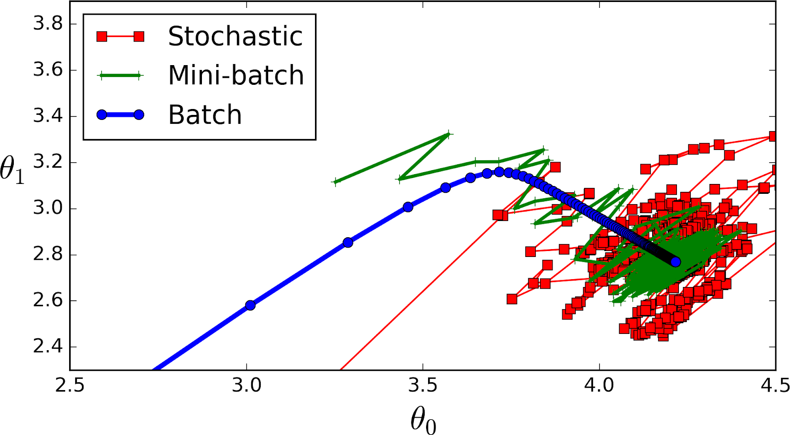<figcaption><p>Mini batch (most common)</p><p>Credit: <a href="https://lh6.googleusercontent.com/pFXmWXcOcfu1WkWxG17RlPrLsRIh6Ve2cFU0pYD8S2V4cRThGzQV98n_tRcLkeSqAweAZ30K9p7n1iViaVunIzHeVUHBkzdZSoIKf3Gta4OpxBOk6a4MStFoLQET89X84i9nXtSn">copied from the original hosted image</a>.</p></figcaption></figure>


Plain descent can be sped up with momentum. [GD with Momentum](https://medium.com/data-science/stochastic-gradient-descent-with-momentum-a84097641a5d) - explain: it is part 2 of Vitaly Bushaev's series on the optimization algorithms used for training neural networks, and presumes basic knowledge of gradient descent.

## Batch size

Mini-batch is the default, so the practical question becomes how big a batch should be. ([a good read)](https://machinelearningmastery.com/use-different-batch-sizes-training-predicting-python-keras/) about batch sizes in keras, specifically LSTM, read this first! It is Jason Brownlee's post on why Keras backends need the shape and size of the data fixed up front for both training and prediction, and what that means for sequence prediction.

A sequence prediction problem makes a good case for a varied batch size as you may want to have a batch size equal to the training dataset size (batch learning) during training and a batch size of 1 when making predictions for one-step outputs.

power of 2: have some advantages with regards to vectorized operations in certain packages, so if it's close it might be faster to keep your batch_size in a power of 2.

The mechanics of ([pushing batches of samples to memory in order to train)](https://stats.stackexchange.com/questions/153531/what-is-batch-size-in-neural-network) - come from the same question on what batch size means in a Keras network:

Batch size defines number of samples that going to be propagated through the network.

For instance, let's say you have 1050 training samples and you want to set up batch_size equal to 100. Algorithm takes first 100 samples (from 1st to 100th) from the training dataset and trains network. Next it takes second 100 samples (from 101st to 200th) and train network again. We can keep doing this procedure until we will propagate through the networks all samples. The problem usually happens with the last set of samples. In our example we've used 1050 which is not divisible by 100 without remainder. The simplest solution is just to get final 50 samples and train the network.

Advantages:

- It requires less memory. Since you train network using less number of samples the overall training procedure requires less memory. It's especially important in case if you are not able to fit dataset in memory.
- Typically networks trains faster with mini-batches. That's because we update weights after each propagation. In our example we've propagated 11 batches (10 of them had 100 samples and 1 had 50 samples) and after each of them we've updated network's parameters. If we used all samples during propagation we would make only 1 update for the network's parameter.

Disadvantages:

- The smaller the batch the less accurate estimate of the gradient. In the figure below you can see that mini-batch (green color) gradient's direction fluctuates compare to the full batch (blue color).

<figure><figcaption><p>Batch size</p><p>Credit: <a href="https://lh3.googleusercontent.com/In_QJSs_c5iIJCuUmnaPJZSjeOIu3HvqOldEtdryCh4TKTNwru6LjdVRq6A02IzwCBYxWNyesrVZn462HHXPfoZUZCOJjZh1cg2qz2tzJ93khr4hYc20vz-8goU9JRyqFI8GIFmp">copied from the original hosted image</a>.</p></figcaption></figure>


That noisier gradient shows up in validation. [Small batch size has an effect on validation accuracy.](http://forums.fast.ai/t/batch-size-effect-on-validation-accuracy/413) is the fast.ai forum thread from someone running VGG16 on Cats vs Dogs (Lesson 1) on a laptop with a small NVIDIA GPU and experimenting with batch sizes because of its limited memory.

<figure>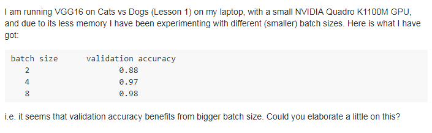<figcaption><p>Batch size</p><p>Credit: <a href="https://lh6.googleusercontent.com/-eOGc8ZDsqSJWbu8J18jTRZUHxNuPbvBpvImJVK_zsYsk4GNtC7u-I0puhNbgIg0LzDS_v3-ySi519U8uWOyPv0qcvbLsaeHS3JaVt8jrjGygT2S608ON2d_QPZ2guCuqvwPq0Wq">copied from the original hosted image</a>.</p></figcaption></figure>
IMPORTANT: batch size in ‘.prediction’ is needed for some models, only for technical reasons as seen here, in keras. The Keras issue that showed it is kept at the end of the page.

Two sources are still ( [unread](https://www.quora.com/Intuitively-how-does-mini-batch-size-affect-the-performance-of-stochastic-gradient-descent) about mini batches and performance, the Quora question on how mini-batch size intuitively affects stochastic gradient descent, and ([unread](https://stats.stackexchange.com/questions/164876/tradeoff-batch-size-vs-number-of-iterations-to-train-a-neural-network)) tradeoff between bath size and number of iterations, the same tradeoff question as above.

[Another observation, probably empirical](https://stackoverflow.com/questions/35050753/how-big-should-batch-size-and-number-of-epochs-be-when-fitting-a-model-in-keras) - to answer your questions on Batch Size and Epochs:

In general: Larger batch sizes result in faster progress in training, but don't always converge as fast. Smaller batch sizes train slower, but can converge faster. It's definitely problem dependent.

In general, the models improve with more epochs of training, to a point. They'll start to plateau in accuracy as they converge. Try something like 50 and plot number of epochs (x axis) vs. accuracy (y axis). You'll see where it levels out.

## LEARNING RATE REDUCTION

The batch sets how noisy each step is; the learning rate sets how long it is, and reducing it over time is the next lever. [Intro to Learning Rate methods](https://medium.com/@chengweizhang2012/quick-notes-on-how-to-choose-optimizer-in-keras-9d3d12d09039) - what they are doing and what they are fixing in other algos. In Keras the simplest schedule is a callback: [Callbacks](https://keras.io/callbacks/), especially ReduceLROnPlateau - this callback monitors a quantity and if no improvement is seen for a 'patience' number of epochs, the learning rate is reduced. [Cs123](http://cs231n.github.io/neural-networks-3/) (very good): explains about many things related to CNN, but also about LR and adaptive methods.

To choose between schedules and adaptive methods, [An excellent comparison of several learning rate schedule methods and adaptive methods:](https://medium.com/towards-data-science/learning-rate-schedules-and-adaptive-learning-rate-methods-for-deep-learning-2c8f433990d1) is Suki Lau's experiment, which starts from the point that it is often useful to reduce the learning rate as training progresses, either with pre-defined schedules or with adaptive methods, and trains a convolutional network on CIFAR-10 with each. ([same here but not as good](https://machinelearningmastery.com/using-learning-rate-schedules-deep-learning-models-python-keras/)) is Jason Brownlee's Keras version, on how a learning rate that changes during training can give better performance and faster training than classical stochastic gradient descent. The figure below is from that comparison.

<figure>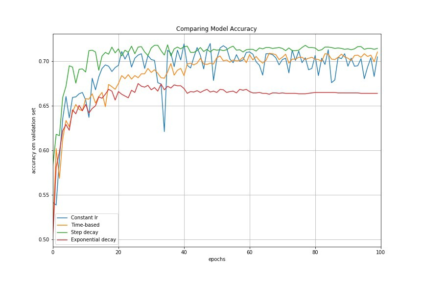<figcaption><p>LEARNING RATE REDUCTION</p><p>Credit: <a href="https://lh5.googleusercontent.com/UtrDKeqV_UfuPuot937svdmi-fzHp3K_eRS5xFAgQI7CAXPFchkFCQO4YPYOFkWMG6tYDlAeATR0YUwOLKqLlDq17T-Row_iBknUXchk9zT2_0KBzE7BMipHBKPds-sFw_0NDAjF">copied from the original hosted image</a>.</p></figcaption></figure>


Adaptive gradient descent algorithms such as [Adagrad](https://en.wikipedia.org/wiki/Stochastic_gradient_descent#AdaGrad), Adadelta, [RMSprop](https://en.wikipedia.org/wiki/Stochastic_gradient_descent#RMSProp), [Adam](https://en.wikipedia.org/wiki/Stochastic_gradient_descent#Adam), provide an alternative to classical SGD; each link opens that method's section of the Wikipedia article on stochastic gradient descent.

These per-parameter learning rate methods provide heuristic approach without requiring expensive work in tuning hyperparameters for the learning rate schedule manually.

- Adagrad performs larger updates for more sparse parameters and smaller updates for less sparse parameter. It has good performance with sparse data and training large-scale neural network. However, its monotonic learning rate usually proves too aggressive and stops learning too early when training deep neural networks.
- Adadelta is an extension of Adagrad that seeks to reduce its aggressive, monotonically decreasing learning rate.
- RMSprop adjusts the Adagrad method in a very simple way in an attempt to reduce its aggressive, monotonically decreasing learning rate.
- [Adam](https://machinelearningmastery.com/adam-optimization-algorithm-for-deep-learning/) is an update to the RMSProp optimizer which is like RMSprop with momentum.

<figure>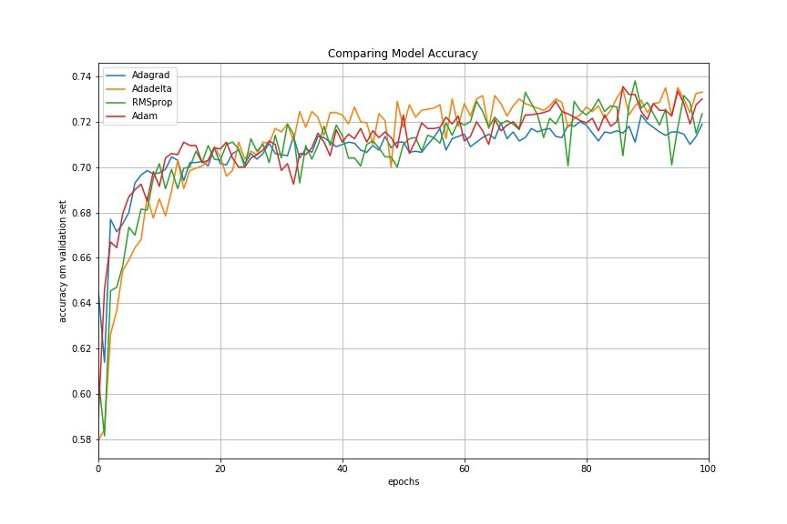<figcaption><p>LEARNING RATE REDUCTION</p><p>Credit: <a href="https://lh6.googleusercontent.com/ixb189Iy_Z4PuSCZHn48vmBvRDNchESvmANzapkuTNMt5zYp7vl9NLznUzNQYaMuyUQzhLiQgpCPUho9klBdd4W09dcjsdx8D_yIDvOcOK8Jo2_p6nDMmLv3QL5ohm07-pJmIo48">copied from the original hosted image</a>.</p></figcaption></figure>


The comparison's result: adaptive learning rate methods demonstrate better performance than learning rate schedules, and they require much less effort in hyperparamater settings.

<figure>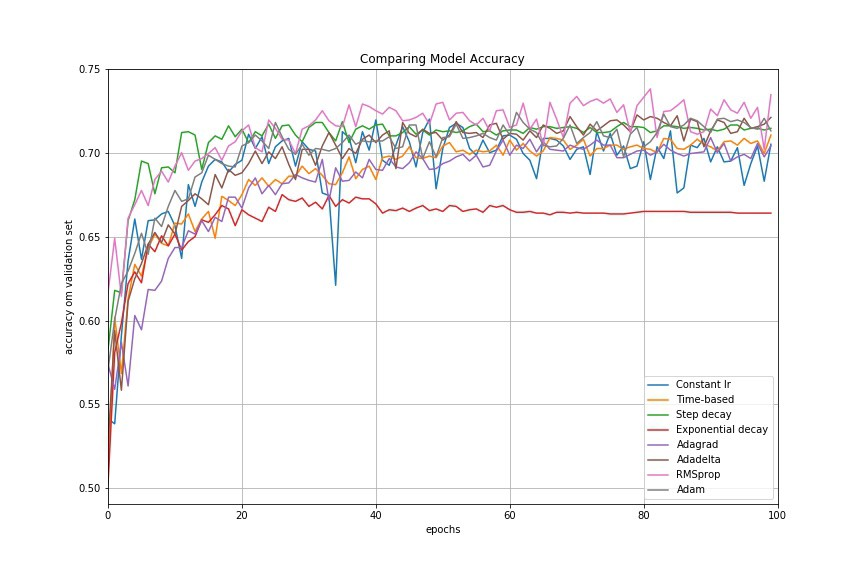<figcaption><p>LEARNING RATE REDUCTION</p><p>Credit: <a href="https://lh3.googleusercontent.com/rYknk8vLbQKYuLSKeItX59a6rdi84U5QaeNJoardmv_jLgXqIMHj1BGbZsMh4l0Pli-mKYg29dNGDMKHS341t94fUScWELjPsIXWy7i1-_zXiCOSR1J46gMODzPQrrX4x64P1ato">copied from the original hosted image</a>.</p></figcaption></figure>


Two papers back this up. The [Recommended paper](https://arxiv.org/pdf/1206.5533v2.pdf): practical recommendation for gradient based DNN, a practical guide with recommendations for the most commonly used hyper-parameters, the bells and whistles of deep learning training. Another great comparison - [pdf paper](https://arxiv.org/abs/1609.04747) and webpage link - is "An overview of gradient descent optimization algorithms"; the webpage version is kept at the end of the page. Its conclusions:

- if your input data is sparse, then you likely achieve the best results using one of the adaptive learning-rate methods.
- An additional benefit is that you will not need to tune the learning rate but will likely achieve the best results with the default value.
- In summary, RMSprop is an extension of Adagrad that deals with its radically diminishing learning rates. It is identical to Adadelta, except that Adadelta uses the RMS of parameter updates in the numerator update rule. Adam, finally, adds bias-correction and momentum to RMSprop. Insofar, RMSprop, Adadelta, and Adam are very similar algorithms that do well in similar circumstances. Kingma et al. \[10] show that its bias-correction helps Adam slightly outperform RMSprop towards the end of optimization as gradients become sparser. Insofar, Adam might be the best overall choice

## OPTIMIZERS

Adam and its relatives are only the best-known members of a longer list of optimizers. There are several optimizers, each had his 15 minutes of fame, some optimizers are recommended for CNN, Time Series, etc..

There are also what I call ‘experimental’ optimizers, it seems like these pop every now and then, with or without a formal proof. It is recommended to follow the literature and see what are the ‘supposedly’ state of the art optimizers atm.

[Adamod](https://medium.com/@lessw/meet-adamod-a-new-deep-learning-optimizer-with-memory-f01e831b80bd) is one such deeplearning optimizer with memory: it builds on Adam with an automatic warmup heuristic and long-term learning rate buffering, and its announcement reports it as a top 5 optimizer in initial testing that is much less sensitive to the learning rate hyperparameter, trains more smoothly, and needs no warmup mode.

Backstitch - September 17 - supposedly an improvement over SGD for speech recognition using DNN. Note: it wasnt tested with other datasets or other network types. Its paper is kept at the end of the page.

(how does it work?) take a negative step back, then a positive step forward. I.e., When processing a minibatch, instead of taking a single SGD step, we first take a step with −α times the current learning rate, for α > 0 (e.g. α = 0.3), and then a step with 1 + α times the learning rate, with the same minibatch (and a recomputed gradient). So we are taking a small negative step, and then a larger positive step. This resulted in quite large improvements – around 10% relative improvement \[37] – for our best speech recognition DNNs. The recommended hyper parameters are in the paper.

Drawbacks: takes twice to train, momentum not implemented or tested, dropout is mandatory for improvement, slow starter.

For everyday use, the [Documentation about optimizers](https://keras.io/optimizers/) in keras is the reference: SGD can be fine tuned, and for others Leave most parameters as they were.

Best description on optimizers with momentum etc, from sgd to nadam, formulas and intuition: the Towards Data Science post is kept at the end of the page, and its summary figure follows.

<figure>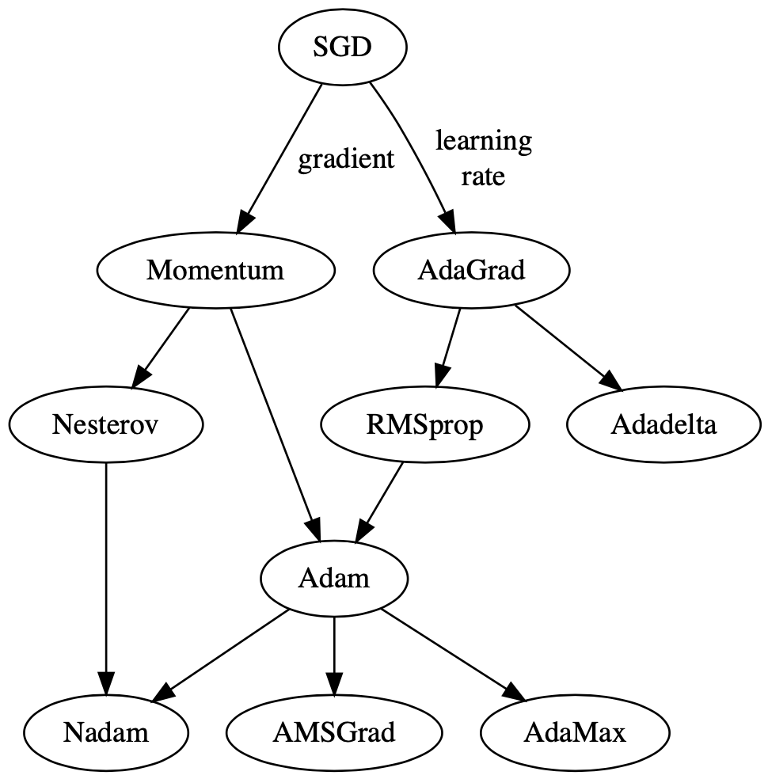<figcaption><p>OPTIMIZERS</p><p>Credit: <a href="https://lh6.googleusercontent.com/-quQMukoMffONyGh-R-nuGssirsDgFz6YQyZAjQ22FyQFglTbpnN0kA7VNQ3UH_o2DSus3SJs2ThnwMS0rnH3iIZN1cK8OzKb39oBj4c2lU-dE9k3c_MDuiMr51IeghvAHLZh2t9">copied from the original hosted image</a>.</p></figcaption></figure>


## INITIALIZERS

Any optimizer starts from some set of weights, and a bad start can stop the signal before training begins. The first scheme is XAVIER GLOROT.

[Why’s Xavier initialization important?](http://andyljones.tumblr.com/post/110998971763/an-explanation-of-xavier-initialization) is an explanation of Xavier initialization. In short, it helps signals reach deep into the network. If the weights in a network start too small, then the signal shrinks as it passes through each layer until it’s too tiny to be useful. If the weights in a network start too large, then the signal grows as it passes through each layer until it’s too massive to be useful.

Xavier initialization makes sure the weights are ‘just right’, keeping the signal in a reasonable range of values through many layers.

To go any further than this, you’re going to need a small amount of statistics - specifically you need to know about random distributions and their variance.

The next question is which distribution to draw from. [When to use glorot uniform-over-normal initialization?](https://datascience.stackexchange.com/questions/13061/when-to-use-he-or-glorot-normal-initialization-over-uniform-init-and-what-are) asks when He or Glorot normal initialization beats uniform, noting that ResNet made He normal initialization popular while its papers never compare normal and uniform, and how this interacts with batch normalization.

However, i am still not seeing anything empirical that says that glorot surpesses everything else under certain conditions ([except the glorot paper](http://proceedings.mlr.press/v9/glorot10a/glorot10a.pdf)), most importantly, does it really help in LSTM where the vanishing gradient is ~no longer an issue? That paper sets out to understand why deep multi-layer networks were not successfully trained before 2006 and why new initialization or training mechanisms changed that.

He-et-al Initialization

This method of initializing became famous through a paper submitted in 2015 by He et al, and is similar to Xavier initialization, with the factor multiplied by two. In this method, the weights are initialized keeping in mind the size of the previous layer which helps in attaining a global minimum of the cost function faster and more efficiently. In code:

```
w=np.random.randn(layer_size[l],layer_size[l-1])*np.sqrt(2/layer_size[l-1])
```

## BIAS

Next to the weights, each unit has one more parameter that is easy to forget. [The role of bias in NN](https://stackoverflow.com/questions/2480650/role-of-bias-in-neural-networks) - similarly to the ‘b’ in linear regression. The question behind it is when a bias matters, using the example of mapping the AND function, which only gets the correct weights once a bias input is added. The two figures below show it.

<figure>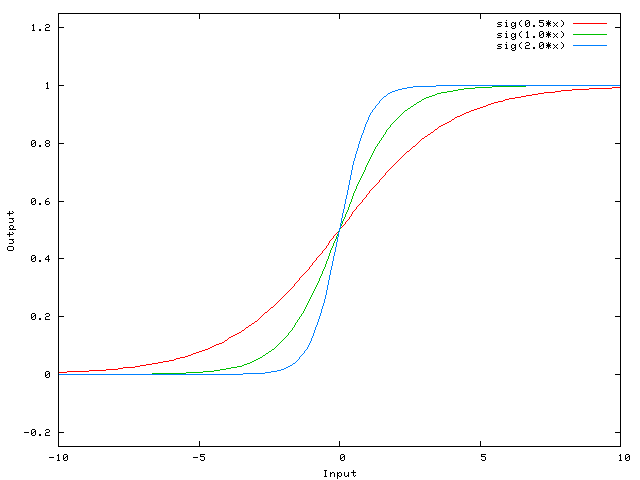<figcaption><p>BIAS</p><p>Credit: <a href="https://lh4.googleusercontent.com/J2OMsHkzsj_c2GqMXdumCZkCNLWbSB2oRlodc9kXts2gko4L8Uf92t46HCG4C4nh5KJAvStQ-o3syY5jAiDTMNZM8fX98xEyaKPCtWtnR5sXKMAsALwVrlLeQzt8zkFVtR1bso3Z">copied from the original hosted image</a>.</p></figcaption></figure>


<figure>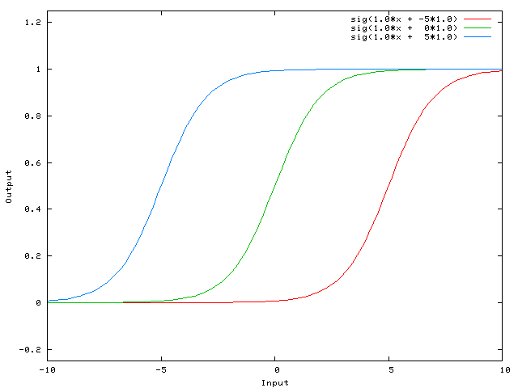<figcaption><p>BIAS</p><p>Credit: <a href="https://lh6.googleusercontent.com/MfRZSVTUDmh1sHI5lmQG1rgf9mDaF6X5EmqRCncUcq7zG24M457rg2OZwVBi33RH6ImIIJshLg3z1NJ7nw-YCwrwTXATOMYgXpCxh-CDA8awb9wXRvWBJlknfZV_9klTROdNr99F">copied from the original hosted image</a>.</p></figcaption></figure>


## BATCH NORMALIZATION

Initialization sets the scale of the signal once; normalization keeps it in range while training, per batch, layer, instance, or weight. The same notes are in [Normalization & Scaling](../data/normalization-and-scaling.md).

The [best explanation](https://blog.paperspace.com/busting-the-myths-about-batch-normalization/) to what is BN and why to use it, including busting the myth that it solves internal covariance shift - shifting input distribution, and saying that it should come after activations as it makes more sense (it does),also a nice quote on where a layer ends is really good - it can end at the activation (or not). How to use BN in the test, hint: use a moving window. Bn allows us to use 2 parameters to control the input distribution instead of controlling all the weights.

Two Medium on BN posts, and a Medium #2 - a better one on BN, and adding to VGG, are kept at the end of the page. The video below sat between them in the original list.



Where BN goes is still argued. [Reddit on BN, mainly on the paper saying to use it before, but best practice is to use after](https://www.reddit.com/r/MachineLearning/comments/67gonq/d_batch_normalization_before_or_after_relu/) is the r/MachineLearning thread on batch normalization before or after ReLU; Reddit may show a block notice instead. [Diff between batch and norm (weak explanation)](https://www.quora.com/What-are-the-practical-differences-between-batch-normalization-and-layer-normalization-in-deep-neural-networks) is the Quora question on the practical differences between batch normalization and layer normalization.

The other normalizations have Keras implementations. [Weight normalization for keras and TF](http://krasserm.github.io/2018/11/10/weightnorm-implementation-options/) is Martin Krasser's post on weight normalization options for Keras and TensorFlow. [Layer normalization keras](https://pypi.org/project/keras-layer-normalization/) is the keras-layer-normalization package, layer normalization implemented in Keras. [Instance normalization keras](https://github.com/keras-team/keras-contrib/blob/master/keras_contrib/layers/normalization/instancenormalization.py) is the instance normalization layer in keras-contrib, the Keras community contributions repo. Batch/layer/instance in TF with code is kept at the end of the page, and so is the post on layer norm for rnn’s or whatever name it is in this post with [code](https://gist.github.com/udibr/7f46e790c9e342d75dcbd9b1deb9d940), the gist that implements it.

To tell those methods apart, [What is the diff between batch/layer/recurrent batch and back rnn normalization](https://datascience.stackexchange.com/questions/12956/paper-whats-the-difference-between-layer-normalization-recurrent-batch-normal) asks what separates Layer Normalization, Recurrent Batch Normalization (2016), and Batch Normalized RNN (2015). The answer:

- Layer normalization (Ba 2016): Does not use batch statistics. Normalize using the statistics collected from all units within a layer of the current sample. Does not work well with ConvNets.
- Recurrent Batch Normalization (BN) (Cooijmans, 2016; also proposed concurrently by Qianli Liao & Tomaso Poggio, but tested on Recurrent ConvNets, instead of RNN/LSTM): Same as batch normalization. Use different normalization statistics for each time step. You need to store a set of mean and standard deviation for each time step.
- Batch Normalized Recurrent Neural Networks (Laurent, 2015): batch normalization is only applied between the input and hidden state, but not between hidden states. i.e., normalization is not applied over time.
- Streaming Normalization (Liao et al. 2016) : it summarizes existing normalizations and overcomes most issues mentioned above. It works well with ConvNets, recurrent learning and online learning (i.e., small mini-batch or one sample at a time):
- Weight Normalization (Salimans and Kingma 2016): whenever a weight is used, it is divided by its L2 norm first, such that the resulting weight has L2 norm 1. That is, output y=x∗(w/|w|), where x and w denote the input and weight respectively. A scalar scaling factor g is then multiplied to the output y=y∗g. But in my experience g seems not essential for performance (also downstream learnable layers can learn this anyway).
- Cosine Normalization (Luo et al. 2017): weight normalization is very similar to cosine normalization, where the same L2 normalization is applied to both weight and input: y=(x/|x|)∗(w/|w|). Again, manual or automatic differentiation can compute appropriate gradients of x and w.
- Note that both Weight and Cosine Normalization have been extensively used (called normalized dot product) in the 2000s in a class of ConvNets called HMAX (Riesenhuber 1999) to model biological vision. You may find them interesting.

More about Batch/layer/instance/group norm are different methods for normalizing the inputs to the layers of deep neural networks (that post is kept at the end of the page):

- Layer normalization solves the rnn case that batch couldnt - Is done per feature within the layer and normalized features are replaced
- Instance does it for (cnn?) using per channel normalization
- Group does it for group of channels
- <figure>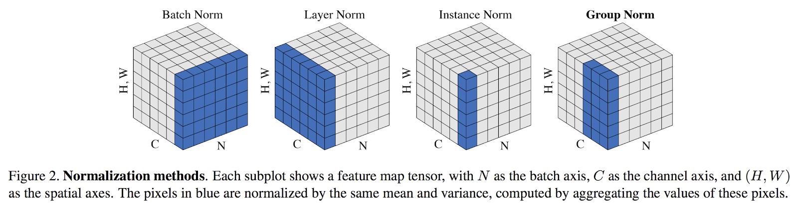<figcaption><p>BATCH NORMALIZATION</p><p>Credit: <a href="https://lh3.googleusercontent.com/P3AL20iV863GBbN_D07g1PBh2T3nEVrR0CYd_MXi5Gecozo-dc4CzbPemj5Bbyl4SbiZXtu-k8Q4hBXyh6c8SC8jOu4fU9B2G1vi0UT5nyGjDGAxURHqyre9NNmCnm5SVZpuHskF">copied from the original hosted image</a>.</p></figcaption></figure>

A two-part mlexplained series closes the section. Part 1, the intuitive explanation to batch normalization, used to sit here and is kept at the end of the page. Part2: [batch/layer/weight normalization](http://mlexplained.com/2018/01/13/weight-normalization-and-layer-normalization-explained-normalization-in-deep-learning-part-2/) - This is a good resource for advantages for every layer: Layer, per feature in a batch, and weight - divided by the norm.

<figure>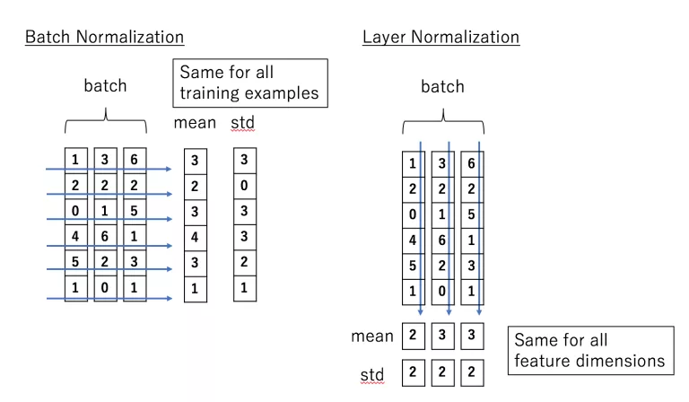<figcaption><p>BATCH NORMALIZATION</p><p>Credit: <a href="https://lh3.googleusercontent.com/IqvjdZcCmsI-rAJ4ye0aUIoyrYLXLJTE2XMeRAAMIi0MxRoSzpRaZ6Op6dWgZ1VkjvBNUcuS8Xr0V9jo7jIpE46-7ktlS9QTDf6vmM8LI4N9juxa3CaLY4B5Gkl9oNPd44DjN5Bs">copied from the original hosted image</a>.</p></figcaption></figure>


## DROPOUT LAYERS IN KERAS AND GENERAL

Normalization keeps training stable; dropout is the regularizer that keeps it from overfitting. The same notes are in [Regularization](../predictive-ml/regularization.md).

The starting point is [A very influential paper about dropout and how beneficial it is - bottom line always use it.](http://jmlr.org/papers/volume15/srivastava14a/srivastava14a.pdf)

OPEN QUESTIONs:

1. does a dropout layer improve performance even if an lstm layer has dropout or recurrent dropout.
2. What is the diff between a separate layer and inside the lstm layer.
3. What is the diff in practice and intuitively between drop and recurrentdrop

[Dropout layers in keras, or dropout regularization:](https://machinelearningmastery.com/dropout-regularization-deep-learning-models-keras/) is Jason Brownlee's post on dropout as a simple and powerful regularization technique and how to apply it in Keras. Dropout is a technique where randomly selected neurons are ignored RANDOMLY during training. Their contribution to the activation of downstream neurons is temporally removed on the forward pass and any weight updates are not applied to the neuron on the backward pass. As a neural network learns, neuron weights settle into their context within the network. Weights of neurons are tuned for specific features providing some specialization. Neighboring neurons become to rely on this specialization, which if taken too far can result in a fragile model too specialized to the training data (overfitting). This reliant on context for a neuron during training is referred to complex co-adaptations. After dropout, other neurons will have to step in and handle the representation required to make predictions for the missing neurons, which is believed to result in multiple independent internal representations being learned by the network. Thus, the effect of dropout is that the network becomes less sensitive to the specific weights of neurons. This in turn leads to a network with better generalization capability and less likely to overfit the training data.

[Another great answer about drop out](https://www.quora.com/In-Keras-what-is-a-dense-and-a-dropout-layer) - the Quora answer to what a dense and a dropout layer are in Keras - adds that as a consequence of the 50% dropout, the neural network will learn different, redundant representations; the network can’t rely on the particular neurons and the combination (or interaction) of these to be present. Another nice side effect is that training will be faster. Rules:

 - Dropout is only applied during training,
 - Need to rescale the remaining neuron activations. E.g., if you set 50% of the activations in a given layer to zero, you need to scale up the remaining ones by a factor of 2.
 - if the training has finished, you’d use the complete network for testing (or in other words, you set the dropout probability to 0).

That rescaling is where Keras differs. [Implementation of drop out in keras](https://datascience.stackexchange.com/questions/18088/convolutional-layer-dropout-layer-in-keras/18098) is “inverse dropout” - n the Keras implementation, the output values are corrected during training (by dividing, in addition to randomly dropping out the values) instead of during testing (by multiplying). This is called "inverted dropout".

Inverted dropout is functionally equivalent to original dropout (as per your link to Srivastava's paper), with a nice feature that the network does not use dropout layers at all during test and prediction. This is explained a little in this Keras issue, which is kept at the end of the page.

Dropout notes and rules of thumb aka “best practice” - (the source is kept at the end of the page):

- dropout value of 20%-50% of neurons with 20% providing a good starting point. (A probability too low has minimal effect and a value too high results in underlearning by the network.)
- Use a large network for better performance, i.e., when dropout is used on a larger network, giving the model more of an opportunity to learn independent representations.
- Use dropout on VISIBLE AND HIDDEN. Application of dropout at each layer of the network has shown good results.
- Unclear ? Use a large learning rate with decay and a large momentum. Increase your learning rate by a factor of 10 to 100 and use a high momentum value of 0.9 or 0.99.
- Unclear ? Constrain the size of network weights. A large learning rate can result in very large network weights. Imposing a constraint on the size of network weights such as max-norm regularization with a size of 4 or 5 has been shown to improve results.

Recurrent layers have two kinds of dropout, which is what the open questions above were about. [Difference between LSTM ‘dropout’ and ‘recurrent_dropout’](https://stackoverflow.com/questions/44924690/keras-the-difference-between-lstm-dropout-and-lstm-recurrent-dropout) - vertical vs horizontal. The question quotes the Keras documentation, where dropout is the fraction of units to drop for the linear transformation of the inputs and recurrent_dropout the fraction for the recurrent state, and asks where each one happens. The answer:

I suggest taking a look at (the first part of) [this paper](https://arxiv.org/pdf/1512.05287.pdf). Regular dropout is applied on the inputs and/or the outputs, meaning the vertical arrows from x_t and to h_t. In you add it as an argument to your layer, it will mask the inputs; you can add a Dropout layer after your recurrent layer to mask the outputs as well. Recurrent dropout masks (or "drops") the connections between the recurrent units; that would be the horizontal arrows in your picture.

This picture is taken from the paper above. On the left, regular dropout on inputs and outputs. On the right, regular dropout PLUS recurrent dropout:

<figure>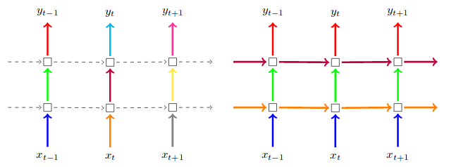<figcaption><p>This picture is taken from the paper above. On the left, regular dropout on inputs and outputs. On the right, regular dropout PLUS recurrent dropout.</p><p>Credit: <a href="https://lh3.googleusercontent.com/RF9eawLdYCty8TSrEBsd3NvaxpFbQNG9s551Q-sX1OVlsC3MRZZ1q5s-xYZVv81Z_-3SvK4JwtAwUirZuCE8MPIISw0ebchNTqY3IMEpc76jalJG-0oeRpDGrWMTnYtAELhs0c3-">copied from the original hosted image</a>.</p></figcaption></figure>


## TRAIN / VAL accuracy in NN

After regularization, the way to know whether it was enough is the gap between training and validation accuracy. The second important quantity to track while training a classifier is the validation/training accuracy. This plot can give you valuable insights into the amount of overfitting in your model:

<figure>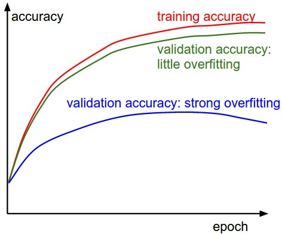<figcaption><p>TRAIN / VAL accuracy in NN</p><p>Credit: <a href="https://lh5.googleusercontent.com/K8KuSlFCGaOO9qihQGVQf3Cckcy5A2V98Tt_OKbscmv-ZmmemEVJFs2V9eeydc8Aa_dk-TXXjsJhiPCD7UAqKcvaMc4xsP0RIJNl0EiZ7ybQ5HsrINup7AYJjSfayQELeOA3WS_-">copied from the original hosted image</a>.</p></figcaption></figure>


The gap between the training and validation accuracy indicates the amount of overfitting. Two possible cases are shown in the diagram on the left. The blue validation error curve shows very small validation accuracy compared to the training accuracy, indicating strong overfitting (note, it's possible for the validation accuracy to even start to go down after some point). NOTE: When you see this in practice you probably want to increase regularization:

 - stronger L2 weight penalty
 - Dropout
 - collect more data.

The other possible case is when the validation accuracy tracks the training accuracy fairly well. This case indicates that your model capacity is not high enough: make the model larger by increasing the number of parameters.

## HYPER PARAM GRID SEARCHES

Reading those curves by hand for every setting does not scale, so the next step is a disciplined search over the hyperparameters. The same notes are in [Hyper param optimization](meta-learning.md#hyper-param-optimization) and [Hyper Parameter Optimization](../evals/hyper-parameter-optimization.md).

The arXiv paper [A disciplined approach to neural network hyper-parameters: Part 1 -- learning rate, batch size, momentum, and weight decay](https://arxiv.org/abs/1803.09820) covers the four settings this page has already discussed one at a time.

## NEURAL NETWORK OPTIMIZATION TECHNIQUES

Once the hyperparameters are set, a few tricks improve a network that already trains. Basically do these after you have a working network. The first is again [Dont decay the learning rate, increase batchsize - paper](https://arxiv.org/abs/1711.00489), the arXiv paper "Don't Decay the Learning Rate, Increase the Batch Size" (optimization of a network). The second is the arXiv paper "Adding One Neuron Can Eliminate All Bad Local Minima": [Add one neuron with skip connection, or to every layer in a binary classification network to get global minimum](https://arxiv.org/abs/1805.08671).

That skip connection is the idea behind whole families of architectures. [RESNET, DENSENET UNET](https://medium.com/swlh/resnets-densenets-unets-6bbdbcfdf010) - the trick behind them, concatenating both f(x) = x. [skip connections](https://www.analyticsvidhya.com/blog/2021/08/all-you-need-to-know-about-skip-connections/) by Siravam / Vidhya- "Skip Connections (or Shortcut Connections) as the name suggests skips some of the layers in the neural network and feeds the output of one layer as the input to the next layers.

 Skip Connections were introduced to solve different problems in different architectures. In the case of ResNets, skip connections solved the _degradation problem_ that we addressed earlier whereas, in the case of DenseNets, it ensured feature reusability. We’ll discuss them in detail in the following sections.

 Skip connections were introduced in literature even before residual networks. For example, [Highway Networks](https://arxiv.org/abs/1505.00387) (Srivastava et al.) had skip connections with gates that controlled and learned the flow of information to deeper layers. This concept is similar to the gating mechanism in LSTM. Although ResNets is actually a special case of Highway networks, the performance isn’t up to the mark comparing to ResNets. This suggests that it’s better to keep the gradient highways clear than to go for any gates – simplicity wins here!"

## Fine tuning

A working network is also the starting point for someone else's problem, which is where fine tuning comes in. The same notes are in [DATASET SELECTION](../data/datasets.md#dataset-selection), [Methods](../generative-ai/methods.md), [TRAINING METHODOLOGIES](../data/datasets.md#training-methodologies), and [Transfer Learning using CNN](convolutional-nets.md#transfer-learning-using-cnn).

[3 methods to fine tune, cut softmax layer, smaller learning rate, freeze layers](https://flyyufelix.github.io/2016/10/03/fine-tuning-in-keras-part1.html) is Felix Yu's comprehensive overview of fine-tuning in Keras, a common practice in deep learning. [Fine tuning on a sunset of data](https://stats.stackexchange.com/questions/289036/fine-tuning-with-a-subset-of-the-same-data) starts from the usual definition, taking a model pre-trained on a similar but separate dataset and updating a portion of its weights on your own, and asks whether it makes sense to fine-tune on a subset of the same data when that data varies by some internal category.

## Deep Learning for NLP

Fine tuning and the architectures above carry over to language, where the material is mostly course syllabi. The same notes are in [Neural NLP](../language-ai/neural-nlp.md).

(did not fully read) [Yoav Goldberg’s course](https://docs.google.com/document/d/1Xf_dqjf7mWmSoYX0HTKnml2mssP5BjrKUs-4E17CbNo/edit) syllabus with lots of relevant topics on DL4NLP, including bidirectional RNNS and tree RNNs. (did not fully read) [CS224d](http://cs224d.stanford.edu/index.html) is Stanford University CS224d: Deep Learning for Natural Language Processing, with its [slides etc.](http://cs224d.stanford.edu/syllabus.html) on the syllabus page.

One output-layer result from this line of work: Deep Learning using Linear Support Vector Machines - 1-3% decrease in error by replacing the softmax layer with a linear support vector machine. That paper is kept at the end of the page.

## MULTI LABEL/OUTPUT

Replacing the output layer is one change; giving a net several outputs or several labels per sample is another. The same notes are in [Multi Label Classification](../problem-framing/multi-label-classification.md).

On the sklearn side, scikit-multiflow is a machine learning package for streaming data in Python and the other ancestor of River: A machine learning framework for [multi-output/multi-label](https://github.com/scikit-multiflow/scikit-multiflow) and stream data. Inspired by MOA and MEKA, following scikit-learn's philosophy. Its site is [https://scikit-multiflow.github.io/](https://scikit-multiflow.github.io/). A Medium on MO, sklearn and keras is kept at the end of the page. On the Keras side, [MO in keras, see functional API on how.](https://www.pyimagesearch.com/2018/06/04/keras-multiple-outputs-and-multiple-losses/) is Adrian Rosebrock's PyImageSearch tutorial on using multiple fully-connected heads and multiple loss functions to build a multi-output network.

### FUZZY MULTI LABEL

Multi-label targets do not have to be hard either. [Ie., probabilities or soft values instead of hard labels](https://datascience.stackexchange.com/questions/48111/multilabel-classifcation-in-sklearn-with-soft-fuzzy-labels) is the question about a 5-way sklearn classifier whose real-life samples are likely linear combinations of classes, such as 70% class A and 30% class B.

## SIAMESE NETWORKS

Beyond labels, a net can learn similarity between inputs, which is where siamese and self-supervised representation learning come in. The same notes are in [N-Shot Learning](../problem-framing/n-shot-learning.md) and [SIAMESE NETWORKS (one shot)](siamese-nets.md#siamese-networks-one-shot).

The first use here is Siamese for conveyor belt fault prediction; its Towards Data Science post is at the end of the gMLP section. The second is Barlow Twins, self-supervised learning via redundancy reduction: the [Burlow](https://arxiv.org/abs/2103.03230) arXiv paper and Yann LeCun's [fb post](https://www.facebook.com/yann.lecun/posts/10157682573642143) - Self-supervised learning (SSL) is rapidly closing the gap with supervised methods on large computer vision benchmarks. A successful approach to SSL is to learn representations which are invariant to distortions of the input sample. However, a recurring issue with this approach is the existence of trivial constant solutions. Most current methods avoid such solutions by careful implementation details. We propose an objective function that naturally avoids such collapse by measuring the cross-correlation matrix between the outputs of two identical networks fed with distorted versions of a sample, and making it as close to the identity matrix as possible. This causes the representation vectors of distorted versions of a sample to be similar, while minimizing the redundancy between the components of these vectors.

## Gated Multi-Layer Perceptron (GMLP)

The page ends where it started, with the MLP, now gated and compared against Transformers. The [paper](https://arxiv.org/abs/2105.08050) is "Pay Attention to MLPs"; [git1](https://github.com/jaketae/g-mlp) is a PyTorch implementation of it and [git2](https://github.com/lucidrains/g-mlp-pytorch) is an implementation of gMLP as an all-MLP replacement for Transformers in PyTorch - "a simple network architecture, gMLP, based on MLPs with gating, and show that it can perform as well as Transformers in key language and vision applications. Our comparisons show that self-attention is not critical for Vision Transformers, as gMLP can achieve the same accuracy."

.png>)

Four Towards Data Science posts tie back to earlier sections. [https://towardsdatascience.com/activation-functions-neural-networks-1cbd9f8d91d6](https://towardsdatascience.com/activation-functions-neural-networks-1cbd9f8d91d6) goes with the activation functions. [https://towardsdatascience.com/predictive-maintenance-with-lstm-siamese-network-51ee7df29767](https://towardsdatascience.com/predictive-maintenance-with-lstm-siamese-network-51ee7df29767) is predictive maintenance with an LSTM siamese network, for the siamese section. [https://towardsdatascience.com/stochastic-gradient-descent-with-momentum-a84097641a5d](https://towardsdatascience.com/stochastic-gradient-descent-with-momentum-a84097641a5d) is the stochastic gradient descent with momentum post from the gradient descent section. [https://towardsdatascience.com/understanding-backpropagation-algorithm-7bb3aa2f95fd](https://towardsdatascience.com/understanding-backpropagation-algorithm-7bb3aa2f95fd) is "Understanding Backpropagation", the last step of the perceptron path: a network maps input data to an output, sees only numbers whether they come from images, words, or raw data, and filters them through a matrix of weights that are the parameters of the network.

## Deprecated links


These links and images no longer work. The original wording is kept here. A same-resource copy, when one was checked, is used above.


- NN in general. This address no longer opens: http://briandolhansky.com/blog/?tag=neural+network#show-archive
- only for technical reasons as seen here. This address no longer opens: https://github.com/fchollet/keras/issues/3027
- norm for rnn’s or whatever name it is in this post. This address no longer opens: https://twimlai.com/new-layer-normalization-technique-speeds-rnn-training/
- More about Batch/layer/instance/group norm are different methods for normalizing the inputs to the layers of deep neural networks. This address no longer opens: https://nealjean.com/ml/neural-network-normalization/
- How to read LOSS graphs (and accuracy on top). This address no longer opens: https://github.com/fchollet/keras/issues/3755
- webpage link. This address no longer opens: http://ruder.io/optimizing-gradient-descent/
- Keras issue. This address no longer opens: https://github.com/fchollet/keras/issues/3305
- Dropout notes and rules of thumb aka “best practice” -. This address no longer opens: http://blog.mrtanke.com/2016/10/09/Keras-Study-Notes-3-Dropout-Regularization-for-Deep-Networks/
- Deep Learning using Linear Support Vector Machines. This address no longer opens: http://deeplearning.net/wp-content/uploads/2013/03/dlsvm.pdf
- Towards Data Science: 10-gradient-descent-optimisation-algorithms-86989510b5e9. This address no longer opens: https://towardsdatascience.com/10-gradient-descent-optimisation-algorithms-86989510b5e9
- Towards Data Science: a-quick-introduction-to-derivatives-for-machine-learning-people-3cd913c5cf33. This address no longer opens: https://towardsdatascience.com/a-quick-introduction-to-derivatives-for-machine-learning-people-3cd913c5cf33
- Towards Data Science: an-alternative-to-batch-normalization-2cee9051e8bc. This address no longer opens: https://towardsdatascience.com/an-alternative-to-batch-normalization-2cee9051e8bc
- Towards Data Science: batch-normalization-in-neural-networks-1ac91516821c. This address no longer opens: https://towardsdatascience.com/batch-normalization-in-neural-networks-1ac91516821c
- Towards Data Science: batch-normalization-theory-and-how-to-use-it-with-tensorflow-1892ca0173ad. This address no longer opens: https://towardsdatascience.com/batch-normalization-theory-and-how-to-use-it-with-tensorflow-1892ca0173ad
- Towards Data Science: implementing-spatial-batch-instance-layer-normalization-in-tensorflow-manual-back-prop-in-tf-77faa8d2c362. This address no longer opens: https://towardsdatascience.com/implementing-spatial-batch-instance-layer-normalization-in-tensorflow-manual-back-prop-in-tf-77faa8d2c362
- Towards Data Science: mish-8283934a72df. This address no longer opens: https://towardsdatascience.com/mish-8283934a72df
- Towards Data Science: perceptrons-logical-functions-and-the-xor-problem-37ca5025790a. This address no longer opens: https://towardsdatascience.com/perceptrons-logical-functions-and-the-xor-problem-37ca5025790a
- Towards Data Science: random-initialization-for-neural-networks-a-thing-of-the-past-bfcdd806bf9e. This address no longer opens: https://towardsdatascience.com/random-initialization-for-neural-networks-a-thing-of-the-past-bfcdd806bf9e
- Towards Data Science: selu-make-fnns-great-again-snn-8d61526802a9. This address no longer opens: https://towardsdatascience.com/selu-make-fnns-great-again-snn-8d61526802a9
- Towards Data Science: understanding-the-derivative-of-the-sigmoid-function-cbfd46fb3716. This address no longer opens: https://towardsdatascience.com/understanding-the-derivative-of-the-sigmoid-function-cbfd46fb3716
- Towards Data Science: what-data-scientists-should-know-about-multi-output-and-multi-label-training-b9d4be620e11. This address no longer opens: https://towardsdatascience.com/what-data-scientists-should-know-about-multi-output-and-multi-label-training-b9d4be620e11
- Backstitch. This address no longer opens: http://www.danielpovey.com/files/2017_nips_backstitch.pdf
- Part1: intuitive explanation to batch normalization. This address now points to an unrelated site: http://mlexplained.com/2018/01/10/an-intuitive-explanation-of-why-batch-normalization-really-works-normalization-in-deep-learning-part-1/
