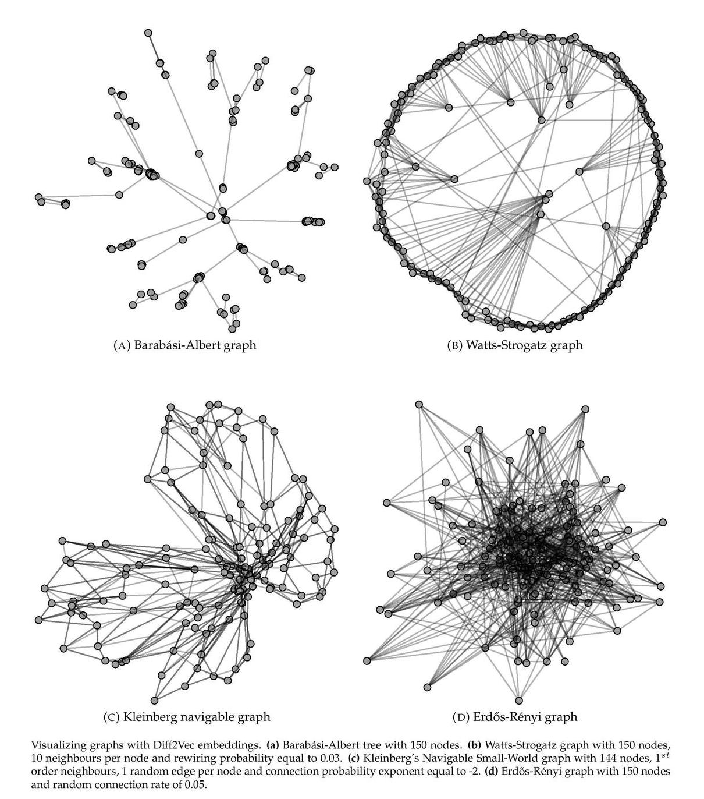
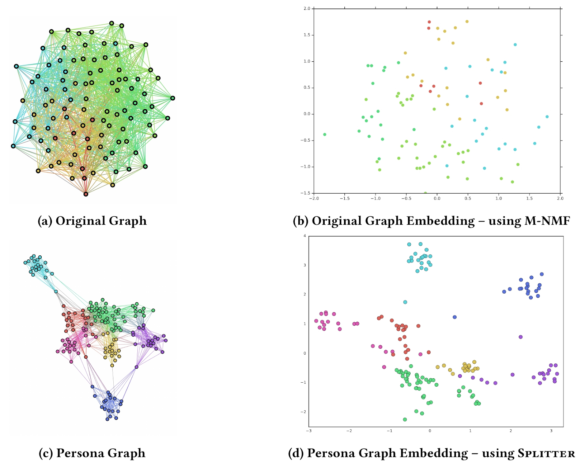
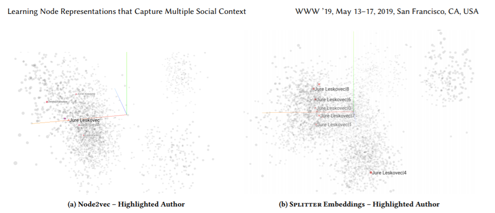
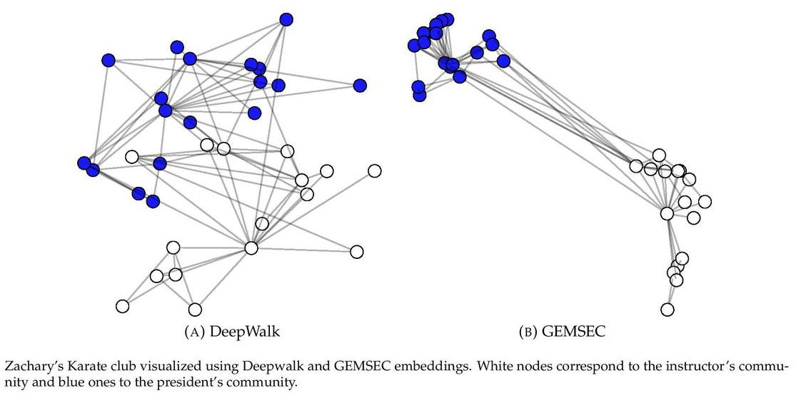
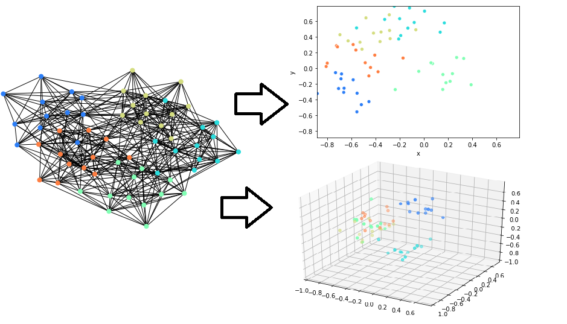

## Graph Convolutional Networks

This section collects notes on graph convolutional networks.

[Explaination here, with some examples](https://tkipf.github.io/graph-convolutional-networks/)

## GRAPH NEURAL NETWORKS (GNN)

This section collects notes on graph neural networks (gnn).

The same notes are in [Graph Theory](../predictive-ml/graph-theory.md).

1. (amazing) [Why i am luke warm about GNN’s](https://www.singlelunch.com/2020/12/28/why-im-lukewarm-on-graph-neural-networks/) - really good insight to what they do (compressing data, vs adjacy graphs, vs graphs, high dim relations, etc.)
2. (amazing) [Graphical intro to GNNs](https://distill.pub/2021/gnn-intro/)
3. [Learning on graphs youtube - uriel singer](https://www.youtube.com/watch?v=snLsWos_1WU&feature=youtu.be)
4. [Benchmarking GNN’s, methodology, git, the works.](https://graphdeeplearning.github.io/post/benchmarking-gnns/)
5. [Awesome graph classification on github](https://github.com/benedekrozemberczki/awesome-graph-classification)
6. Octavian in medium on graphs, [A really good intro to graph networks, too long too summarize](https://medium.com/octavian-ai/deep-learning-with-knowledge-graphs-3df0b469a61a), clever, mcgraph, regression, classification, embedding on graphs.
7. Application of graph networks
8. Recommender systems using GNN, w2v, pytorch w2v, networkx, sparse matrices, matrix factorization, dictionary optimization, part 1 here (how to find product relations, important: creating negative samples)
9. Transformers are GNN, original: [Transformers are graphs, not the typical embedding on a graph, but a more holistic approach to understanding text as a graph.](https://thegradient.pub/transformers-are-graph-neural-networks/)
10. Cnn for graphs
11. [Staring with gnn](https://medium.com/octavian-ai/how-to-get-started-with-machine-learning-on-graphs-7f0795c83763)
12. Really good - Basics deep walk and graphsage
13. Application of gnn
14. Michael Bronstein’s Central page for Graph deep learning articles on Medium (worth reading)
15. [GAT graphi attention networks](https://petar-v.com/GAT/), paper, examples - The graph attentional layer utilised throughout these networks is computationally efficient (does not require costly matrix operations, and is parallelizable across all nodes in the graph), allows for (implicitly) assigning different importances to different nodes within a neighborhood while dealing with different sized neighborhoods, and does not depend on knowing the entire graph structure upfront—thus addressing many of the theoretical issues with approaches.
16. Medium on Intro, basics, deep walk, graph sage
17. [Struc2vec](https://leoribeiro.github.io/struc2vec.html), [youtube](https://www.youtube.com/watch?v=lu0xMOO48Xo&embeds_euri=https%3A%2F%2Fleoribeiro.github.io%2F&source_ve_path=MjM4NTE&feature=emb_title): Learning Node Representations from Structural Identity- The _struc2vec_ algorithm learns continuous representations for nodes in any graph. struc2vec captures structural equivalence between nodes.

### GNN courses

This section collects notes on gnn courses.

The same notes are in [Graph/GNN courses](../predictive-ml/graph-theory.md#graphgnn-courses).

1. [machine learning with graphs by Stanford](http://web.stanford.edu/class/cs224w/), from ML to GNN.
2. [Graph deep learning course](https://geometricdeeplearning.com/lectures/) - graphs, sets, groups, GNNs. [youtube](https://www.youtube.com/watch?app=desktop&v=w6Pw4MOzMuo)

### Deep walk

This section collects notes on deep walk.

The same notes are in [Graph Theory](../predictive-ml/graph-theory.md).

1. [Git](https://github.com/phanein/deepwalk)
2. [Paper](https://arxiv.org/abs/1403.6652)
3. [Medium](https://medium.com/@_init_/an-illustrated-explanation-of-using-skipgram-to-encode-the-structure-of-a-graph-deepwalk-6220e304d71b) and medium on W2v, deep walk, graph2vec, n2v

### Node2vec

This section collects notes on node2vec.

The same notes are in [Graph Topics](../predictive-ml/graph-theory.md#graph-topics).

1. [Git](https://github.com/eliorc/node2vec)
2. [Stanford](https://snap.stanford.edu/node2vec/)
3. Elior on medium, [youtube](https://www.youtube.com/watch?v=828rZgV9t1g)
4. [Paper](https://cs.stanford.edu/~jure/pubs/node2vec-kdd16.pdf)

### Graphsage

This section collects notes on graphsage.

1. medium

### SDNE - structural deep network embedding

This section collects notes on sdne - structural deep network embedding.

1. medium

### Diff2vec

This section collects notes on diff2vec.

1. [Git](https://github.com/benedekrozemberczki/diff2vec)
2. <figure><figcaption>
Diff2vec

Credit: <a href="https://lh6.googleusercontent.com/otaXffQv-FribLSm922jhO-904l0ZHD4QcWRJ0dgc7u4vW0HMP1cGP-QU63ohhJSLiUxpz5DTB9L6DsK1ettM0S1MRg76sZZhEjzezQpTDDrrXI6pnh5B-2aRrA8FxJrAJK_fufn">copied from the original hosted image</a>.
</figcaption></figure>

### Splitter

This section collects notes on splitter.

, [git](https://github.com/benedekrozemberczki/Splitter), [paper](http://epasto.org/papers/www2019splitter.pdf), “Is a Single Embedding Enough? Learning Node Representations that Capture Multiple Social Contexts”

Recent interest in graph embedding methods has focused on learning a single representation for each node in the graph. But can nodes really be best described by a single vector representation? In this work, we propose a method for learning multiple representations of the nodes in a graph (e.g., the users of a social network). Based on a principled decomposition of the ego-network, each representation encodes the role of the node in a different local community in which the nodes participate. These representations allow for improved reconstruction of the nuanced relationships that occur in the graph a phenomenon that we illustrate through state-of-the-art results on link prediction tasks on a variety of graphs, reducing the error by up to 90%. In addition, we show that these embeddings allow for effective visual analysis of the learned community structure.

<figure><figcaption>
Splitter

Credit: <a href="https://lh3.googleusercontent.com/ZWvxCQ72uAo6J-nr2uojE4KYzqOvgm3dzzXSuKlP0nbry-qFhEbQVZIG4om_SPLZpWZti3--aG1a6dYmOMnot--vFx0dnimMZDLz4LrjJQkRgAZY8ZospzEPKA9MrW__We61ylD9">copied from the original hosted image</a>.
</figcaption></figure>

<figure><figcaption>
Splitter

Credit: <a href="https://lh5.googleusercontent.com/asBPQZ90fcBXUYlz3tT2uV2LbELCjHVm56nhjbvRFuW7UXFBDX8fy353dF_6_OFGHo7ioBmFOl5wwxsyfSJHhA2LIOS0LkOTIdI23WnTjHFIf-PFdr6tp5RG_GaJF7BACv2RrJcK">copied from the original hosted image</a>.
</figcaption></figure>

16. [Self clustering graph embeddings](https://github.com/benedekrozemberczki/GEMSEC)

<figure><figcaption>
Splitter

Credit: <a href="https://lh5.googleusercontent.com/xLcNkor6PpkcSUl1sW9Ws36NxIrNr9kmdoBuhlPYnfCKlrC7zkaJwNIlSlIBDiXvL9OPi62lQ8q3ZA6oLXr_pJfUJvUTmelHnEy7z2hivhQJxQN4Ppz8ZRCErtlLQzROyIoyZaV-">copied from the original hosted image</a>.
</figcaption></figure>

17. [Walklets](https://github.com/benedekrozemberczki/walklets), similar to deep walk with node skips. - lots of improvements, works in scale due to lower size representations, improves results, etc.

Nodevectors

[Git](https://github.com/VHRanger/nodevectors), The fastest network node embeddings in the west<figure><figcaption>
Splitter

Credit: <a href="https://lh3.googleusercontent.com/DwKfPhonL4At5xRePfv77SdSDjSZBYo_Z0Qm1hAFNpLLEYtiGMQhN8QPLO_5tNRr0NYvg3JRyYEECOUhjJkR6sK77k0M-Z1VVYcEwbBLU7cLqjlVN41IV5nGPt1yX8kYP-NlrqO9">copied from the original hosted image</a>.
</figcaption></figure>

