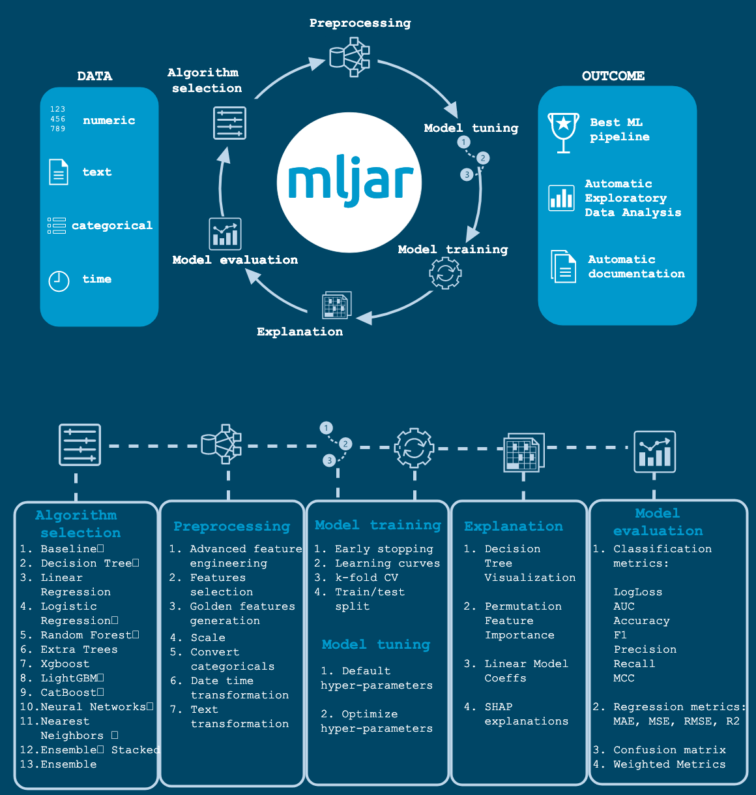

# Meta Learning

This page is about AutoML: automating model choice, hyperparameters, architecture search, and related steps.
It keeps personal caveats up front, then curated systems from automl.org, and places PyCaret after auto feature engineering.

The same notes are in [Model Families](../problem-framing/model-families.md).

[What is?](https://www.automl.org/) Automated Machine Learning provides methods and processes to make Machine Learning available for non-Machine Learning experts, to improve efficiency of Machine Learning and to accelerate research on Machine Learning.

Personal note: automl algorithms in this field will bridge the gap and automate several key processes, but it will not allow a practitioner to do serious research or solve business or product problems easily. The importance of this field is to advance each subfield, whether HPO, NAS, etc. these selective novelties can help us solve specific issues, i.e, lets take HPO, we can use it to save time and money on redundant parameter searches, especially when it comes to resource heavy algorithms such as Deep learning (think GPU costs).

Personal thoughts on optimizations: be advised that optimizing problems will not guarantee a good result, you may over fit your problem in ways you are not aware of, beyond traditional overfitting and better accuracy doesn't guarantee a better result (for example if your dataset is unbalanced, needs imputing, cleaning, etc.).

Always examine the data and results in order to see if they are correct.

[Automl.org’s github — it has a backup for the following projects.](https://github.com/automl)

[Automl.org](https://www.automl.org/) is a joint effort between two universitie, freiburg and hannover, their website curates information regarding:

1. HPO — hyper parameter optimization
2. NAS — neural architecture search
3. Meta Learning — learning across datasets, warmstarting of HPO and NAS etc.

Automl aims to automate these processes:

- Preprocess and clean the data.
- Select and construct appropriate features.
- Select an appropriate model family.
- Optimize model hyperparameters.
- Postprocess machine learning models.
- Critically analyze the results obtained.

Historically, AFAIK AutoML’s birth started with several methods to optimize each one of the previous processes in ml. IINM, [weka’s paper (2012](https://arxiv.org/abs/1208.3719)) was the first step in aggregating these ideas into a first public working solution.

The following is referenced from AutoML.org:

### ML Systems

This section lists AutoWEKA, auto-sklearn, TPOT, H2O, TransmogrifAI, MLBox, and MLJar.

The same notes are in [Genetic Algorithms & Genetic Programming](../predictive-ml/genetic-algorithms-and-genetic-programming.md).

- [AutoWEKA](http://www.cs.ubc.ca/labs/beta/Projects/autoweka/) is an approach for the simultaneous selection of a machine learning algorithm and its hyperparameters; combined with the [WEKA](http://www.cs.waikato.ac.nz/ml/weka/) package it automatically yields good models for a wide variety of data sets.
- [Auto-sklearn](https://automl.github.io/auto-sklearn/master/) is an extension of AutoWEKA using the Python library [scikit-learn](http://scikit-learn.org/stable/) which is a drop-in replacement for regular scikit-learn classifiers and regressors.
- [TPOT](http://epistasislab.github.io/tpot/) is a data-science assistant which optimizes machine learning pipelines using genetic programming.
- H2O AutoML: Automatic machine learning — H2O 3.46.0.12 documentation. (google) [H2O AutoML](https://docs.h2o.ai/h2o/latest-stable/h2o-docs/automl.html)
- provides automated model selection and ensembling for the. [H2O machine learning and data analytics platform](https://docs.h2o.ai/h2o/latest-stable/h2o-docs/welcome.html)
- GitHub - google/automl: Google Brain AutoML. ( [git](https://github.com/google/automl)
- [TransmogrifAI](https://github.com/salesforce/TransmogrifAI) is an AutoML library running on top of Spark.
- [MLBoX](https://github.com/AxeldeRomblay/MLBox) is an AutoML library with three components: preprocessing, optimisation and prediction
- [MLJar](https://mljar.com/) ([git](https://github.com/mljar/mljar-supervised)) [medium](https://medium.com/@MLJARofficial/mljar-supervised-automl-with-explanations-and-markdown-reports-36d5104e117), 2 — Automated Machine Learning for tabular data mljar builds a complete Machine Learning Pipeline. Perform exploratory analysis, search for a signal in the data, and discover relationships between features in your data with AutoML. Train top ML models with advanced feature engineering, many algorithms, hyper-parameters tuning, Ensembling, and Stacking. Stay ahead of competitors and predict the future with advanced ML. Deploy your models in the cloud or use them locally
 - + advanced feature engineering
 - + algorithms selection and tuning
 - + automatic documentation
 - + ML explanations

<figure><figcaption>
MLJar AutoML.

Credit: <a href="https://lh3.googleusercontent.com/duUZ_u8kLJ9fhJ1AtGodADX6n3aV4CB9hsLhCV4yANEA0_Rui8yQBAtBe_DxHsJP0s-I8mCCRlyMgvZwJFkc0hy0TtejPLqq_AYmOMXyE73xph8YhEjVQnYeR0lDqI0LTf5YnSOG">copied from the original hosted image</a>.
</figcaption></figure>

### Hyper param optimization

This section lists Hyperopt, SMAC, Spearmint, BOHB, RoBO, and SMAC3.

The same notes are in [HYPER PARAM GRID SEARCHES](deep-neural-nets.md#hyper-param-grid-searches) and [Hyper Parameter Optimization](../evals/hyper-parameter-optimization.md).

- Hyperopt by jaberg. including the TPE algorithm [Hyperopt](http://jaberg.github.io/hyperopt/)
- SMAC. SMAC. [Sequential Model-based Algorithm Configuration (SMAC)](http://aclib.net/SMAC/)
- Spearmint is a package to perform Bayesian optimization according to the algorithms outlined in the paper: Practical Bayesian Optimization of Machine Learning Algorithms. [Spearmint](https://github.com/JasperSnoek/spearmint)
- BOHB: Bayesian Optimization combined with HyperBand
- RoBO – Robust Bayesian Optimization framework
- [SMAC3](https://github.com/automl/SMAC3) – a python re-implementation of the SMAC algorithm

### Architecture Search

This section lists Auto-PyTorch, AutoKeras, DEvol, HyperAS, and talos.

- Automatic architecture search and hyperparameter optimization for PyTorch - automl/Auto-PyTorch. [Auto-PyTorch](https://github.com/automl/Auto-PyTorch)
- The page covers autoKeras. The page covers autoKeras. [AutoKeras](https://autokeras.com/)
- Early POC of genetic neural architecture search. [DEvol](https://github.com/joeddav/devol)
- Keras + Hyperopt: A very simple wrapper for convenient hyperparameter optimization - maxpumperla/hyperas. [HyperAS](https://github.com/maxpumperla/hyperas)
- Hyperparameter Experiments with TensorFlow and Keras - autonomio/talos. [talos](https://github.com/autonomio/talos)

### Auto Feature Engineering

This section points at automated feature engineering reading by Will Koehrsen.

The same notes are in [FEATURE ENGINEERING](../data/feature-engineering.md#feature-engineering).

1. automated feature engineering on medium by will koehrsen

- automated feature engineering on medium by will koehrsen. [https://towardsdatascience.com/automated-feature-engineering-in-python-99baf11cc219](https://towardsdatascience.com/automated-feature-engineering-in-python-99baf11cc219)

## PYCARET

This section defines PyCaret as a one-line ML library from prep to deploy, after the AutoML system notes above.

[1. What is? by vidhaya](https://www.analyticsvidhya.com/blog/2020/05/pycaret-machine-learning-model-seconds/) - [PyCaret](https://pycaret.org/) is an open-source, machine learning library in Python that helps you from data preparation to model deployment. It is easy to use and you can do almost every data science project task with just one line of code.

## Deprecated links


These links and images no longer work. The original wording is kept here. A same-resource copy, when one was checked, is used above.


- Auto-sklearn. This address no longer opens: http://automl.github.io/auto-sklearn/stable/
- H2O AutoML. This address no longer opens: http://docs.h2o.ai/h2o/latest-stable/h2o-docs/automl.html
- H2O machine learning and data analytics platform. This address no longer opens: http://docs.h2o.ai/h2o/latest-stable/h2o-docs/welcome.html
- 2 (MLJar TDS). This address no longer opens: https://towardsdatascience.com/automating-eda-machine-learning-6ddb76c1eb4d
- BOHB: Bayesian Optimization combined with HyperBand. This address no longer opens: https://www.automl.org/automl/bohb/
- RoBO – Robust Bayesian Optimization framework. This address no longer opens: http://www.automl.org/automl/robo/
