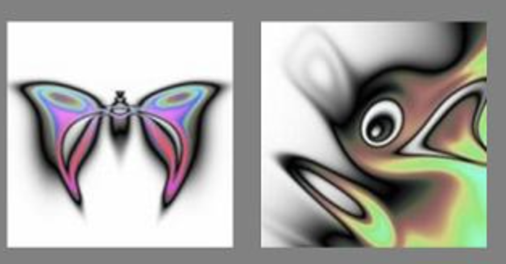
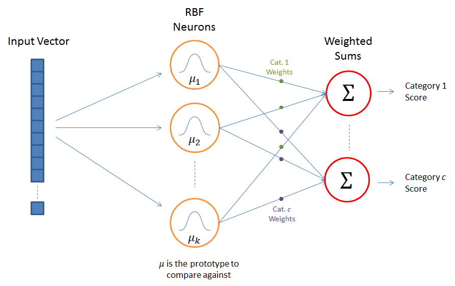

# Other Architectures

This page collects notes on other neural architectures beyond standard deep nets: self-organizing maps, neuro-evolution, RBFNs, and signal-processing networks.
Each section below stands on its own for that family of models.

Each section below stands on its own for that family of models.

## SELF ORGANIZING MAPS (SOM)

This section collects self-organizing map notes as the first alternate architecture on this page.

1. Git
 - A Python Library for Self Organizing Map (SOM). [Sompy](https://github.com/sevamoo/SOMPY)
 - :red_circle: MiniSom is a minimalistic implementation of the Self Organizing Maps - JustGlowing/minisom. [minisom!](https://github.com/JustGlowing/minisom)
 - [Many graph examples](https://medium.com/@s.ganjoo96/self-organizing-maps-b2cf58b74fdb)
 - Contribute to lightsalsa251/Self-Organizing-Map development by creating an account on GitHub. [example](https://github.com/lightsalsa251/Self-Organizing-Map)
2. Step by step with examples, calculations
3. Adds intuition regarding “magnetism”’
4. [Implementation and faces](https://medium.com/@navdeepsingh_2336/self-organizing-maps-for-machine-learning-algorithms-ad256a395fc5), intuition towards each node and what it represents in a vision. I.e., each face resembles one of K clusters.
5. Medium on kohonen networks, i.e., SOM
6. Som on iris, explains inference - averaging, and cons of the method.
- [Simple explanation](https://medium.com/@valentinerutto/selforganizingmaps-in-english-35574f95b0ac)
8. Algorithm, formulas

## NEURO EVOLUTION (GA/GP based)

This section collects neuro-evolution notes after the SOM material above.

The same notes are in [Genetic Algorithms & Genetic Programming](../predictive-ml/genetic-algorithms-and-genetic-programming.md).

NEAT

[NEAT](http://www.cs.ucf.edu/~kstanley/neat.html) stands for NeuroEvolution of Augmenting Topologies. It is a method for evolving artificial neural networks with a genetic algorithm.

NEAT implements the idea that it is most effective to start evolution with small, simple networks and allow them to become increasingly complex over generations.

That way, just as organisms in nature increased in complexity since the first cell, so do neural networks in NEAT.

This process of continual elaboration allows finding highly sophisticated and complex neural networks.

[A great article about NEAT](http://hunterheidenreich.com/blog/neuroevolution-of-augmenting-topologies/)

HYPER-NEAT

HyperNEAT computes the connectivity of its neural networks as a function of their geometry.

HyperNEAT is based on a theory of representation that hypothesizes that a good representation for an artificial neural network should be able to describe its pattern of connectivity compactly.

The encoding in HyperNEAT, called [compositional pattern producing networks](http://en.wikipedia.org/wiki/Compositional_pattern-producing_network), is designed to represent patterns with regularities such as symmetry, repetition, and repetition with variationץ

(WIKI) [Compositional pattern-producing networks](https://en.wikipedia.org/wiki/Compositional_pattern-producing_network) (CPPNs) are a variation of artificial neural networks (ANNs) that have an architecture whose evolution is guided by genetic algorithms

<figure><figcaption>
NEURO EVOLUTION (GA/GP based)

Credit: <a href="https://lh6.googleusercontent.com/cAbcsLDWcDOMlX4K53ROOLyiAw6EhJ9ZRDuZmURFtBaje8JtwzU_KsOh4aeiC8ukdYgBYEm6zqWd7jZ3tStib3JJGYrmxM4wlrgyBJFhlnMHd_kIcxgO2reEsoE4RPjJLXr3O-R_">copied from the original hosted image</a>.
</figcaption></figure>

A great HyperNeat tutorial on Medium.

## Radial Basis Function Network (RBFN)

This section collects RBFN notes after neuro-evolution above.

- rbf_keras/test.py at master · PetraVidnerova/rbf_keras. [RBF layer in Keras.](https://github.com/PetraVidnerova/rbf_keras/blob/master/test.py)

The [RBFN](http://mccormickml.com/2013/08/15/radial-basis-function-network-rbfn-tutorial/) approach is more intuitive than the MLP.

- An RBFN performs classification by measuring the input’s similarity to examples from the training set.
- Each RBFN neuron stores a “prototype”, which is just one of the examples from the training set.
- When we want to classify a new input, each neuron computes the Euclidean distance between the input and its prototype.
- Roughly speaking, if the input more closely resembles the class A prototypes than the class B prototypes, it is classified as class A.

<figure><figcaption>
Architecture\_Simple

Credit: <a href="https://lh6.googleusercontent.com/5oVVPw02w2Pv1kqAGvQ6drOX6Nh7lA72cBDplTbqgd78u25ceNdjufDe8h4pKWNPKC350_r4V_TPUn1ionjck1IPJiW0Q4rwivL4sH4LJGaj7V7WZBss8eLSuqpZb5Rv525M4sQ1">copied from the original hosted image</a>.
</figcaption></figure>

## SIGNAL PROCESSING NN (FFT, WAVELETS, SHAPELETS)

This section collects signal-processing network notes after RBFN above.

The same notes are in [Feature Engineering](../predictive-ml/audio-feature-engineering.md).

1. [Fourier Transform](https://www.youtube.com/watch?v=spUNpyF58BY) - decomposing frequencies
2. [WAVELETS On youtube (4 videos)](https://www.youtube.com/watch?v=QX1-xGVFqmw):
 1. [used for denoising](https://www.youtube.com/watch?v=veCvP1mYpww), compression, detect edges, detect features with various orientation, analyse signal power, detect and localize transients, change points in time series data and detect optimal signal representation (peaks etc) of time freq analysis of images and data.
 2. Can also be used to [reconstruct time and frequencies](https://www.youtube.com/watch?v=veCvP1mYpww), analyse images in space, frequencies, orientation, identifying coherent time oscillation in time series
 3. Analyse signal variability and correlation

## Deprecated links


These links and images no longer work. The original wording is kept here. A same-resource copy, when one was checked, is used above.

- Towards Data Science: hyperneat-powerful-indirect-neural-network-evolution-fba5c7c43b7b. This address no longer opens: https://towardsdatascience.com/hyperneat-powerful-indirect-neural-network-evolution-fba5c7c43b7b
- Towards Data Science: kohonen-self-organizing-maps-a29040d688da. This address no longer opens: https://towardsdatascience.com/kohonen-self-organizing-maps-a29040d688da
- Towards Data Science: self-organizing-maps-1b7d2a84e065. This address no longer opens: https://towardsdatascience.com/self-organizing-maps-1b7d2a84e065
- Towards Data Science: self-organizing-maps-ff5853a118d4. This address no longer opens: https://towardsdatascience.com/self-organizing-maps-ff5853a118d4
- Step by step with examples, calculations. This address no longer opens: https://mc.ai/self-organizing-mapsom/
- HyperNEAT. This address no longer opens: http://eplex.cs.ucf.edu/hyperNEATpage/
