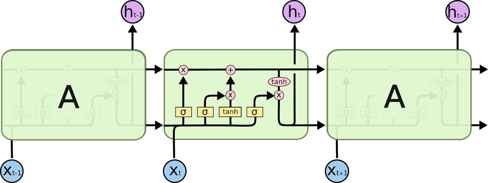
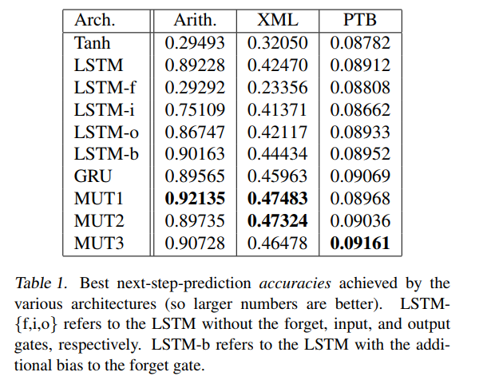
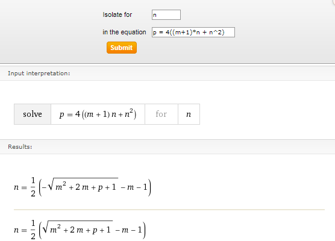
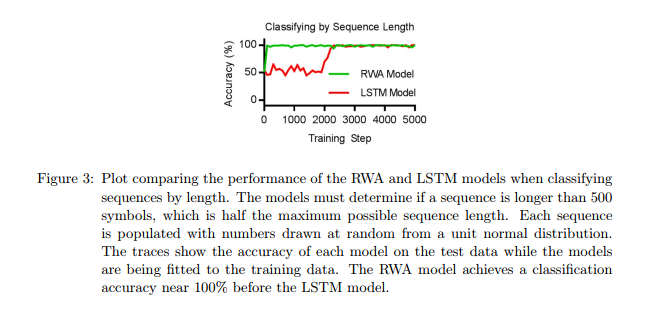

# Recurrent Neural Net (RNN)

Sequences and time series need a network that remembers what it has already seen, and a recurrent net does that by feeding its previous output back into itself. This page starts with the basic recurrent loop and masking, then back propagation, then the LSTM and GRU cells that fix the vanishing gradient, and ends with unsupervised LSTM, QRNN, hierarchical RNNs, and sequence analysis.

The same loop is the encoder and decoder of sequence-to-sequence models. The same notes are in [SEQ2SEQ SEQUENCE TO SEQUENCE](../language-ai/neural-nlp.md#seq2seq-sequence-to-sequence).

## RNN

Everything later on the page is built on one idea: a basic NN node with a loop, previous output is merged with current input (using tanh?), for the purpose of remembering history, for time series - to predict the next X based on the previous Y.

(What is RNN?) by Andrej Karpathy - [The Unreasonable Effectiveness of Recurrent Neural Networks](http://karpathy.github.io/2015/05/21/rnn-effectiveness/), basically a lot of information about RNNs and their usage cases. The shapes of input and output give the use cases:

- 1 to N = frame captioning
- N to 1 = classification
- N to N = predict frames in a movie
- N\2 with time delay to N\2 = predict supply and demand

The price of the loop is that the vanishing gradient is 100 times worse. Gate networks like LSTM solves vanishing gradient, which is why the LSTM and GRU sections below exist.

Before the cells, the setup question is (how to initialize?). Benchmarking RNN networks for text - don't worry about initialization, use normalization and GRU for big networks; that benchmark is kept at the end of the page.

 Experimental improvements came next, around speed. [Ref](https://arxiv.org/abs/1709.02755) - ”Simplified RNN, with pytorch implementation” - is Simple Recurrent Units for Highly Parallelizable Recurrence, changing the underlying mechanism in RNNs for the purpose of parallelizing calculation, seems to work nicely in terms of speed, not sure about state of the art results. There is a [Controversy regarding said work](https://www.facebook.com/cho.k.hyun/posts/10208564563785149), a post by Kyunghyun Cho: the author claims he already mentioned these ideas (QRNN) [first](https://www.reddit.com/r/MachineLearning/comments/6zduh2/r_170902755_training_rnns_as_fast_as_cnns/dmv9gnh/), a year before, however it seems like his ideas have also been reviewed as [incremental](https://openreview.net/forum?id=H1zJ-v5xl) (PixelRNN). Its probably best to read all 3 papers in chronological order and use the most optimal solution.

To try such cells yourself, [RNNCELLS - recurrent shop](https://github.com/farizrahman4u/recurrentshop), enables you to build complex rnns with keras. Details on their significance are inside the link.

Real sequences have different lengths, which is what masking handles. Masking for RNNs - the ideas is simple, we want to use variable length inputs, although rnns do use that, they require a fixed size input. So masking of 1’s and 0’s will help it understand the real size or where the information is in the input. Motivation: Padded inputs are going to contribute to our loss and we dont want that. [Source 1](https://www.quora.com/What-is-masking-in-a-recurrent-neural-network-RNN) is the question of what masking in a recurrent neural network is, and [source 2](https://r2rt.com/recurrent-neural-networks-in-tensorflow-iii-variable-length-sequences.html) is R2RT on variable length sequences in TensorFlow RNNs.

Visual attention RNNS - Same idea as masking but on a window-based cnn. [Paper](https://papers.nips.cc/paper/5542-recurrent-models-of-visual-attention.pdf) is the recurrent models of visual attention paper.

## BACK PROPAGATION

Training that loop still comes down to back propagation, and it is easiest to see on a small net after the RNN basics above.

[A great Slide about back prop, on a simple 3 neuron network, with very easy to understand calculations.](https://www.slideshare.net/AhmedGadFCIT/backpropagation-understanding-how-to-update-anns-weights-stepbystep) The slides walk how to update the weights step by step.

## LSTM

Once back propagation is clear, the vanishing gradient explains why the LSTM cell exists, and this section covers the cell and its Keras usage. The same notes are in [LTSM for time series](../predictive-ml/forecasting.md#ltsm-for-time-series).

The best, hands down, lstm post out there is colah's. LSTM - [what is?](http://colah.github.io/posts/2015-08-Understanding-LSTMs/) the first reference for LSTM on the web, but you should know the background before reading.

<figure><figcaption>
LSTM

Credit: <a href="https://lh3.googleusercontent.com/7KJz_beT-3kClxvDJHNVZP4gEMtn0oUK08yzh_foRMwqjtrWh8EpC3Yp9oCmH0LOcBzBbA-8E9D-4Dd1TXdWipGjSHXW0GjgMBo4gs-1f8XLpXRjnwN29zhzpJPe2uKIyNXkkqy-">copied from the original hosted image</a>.
</figcaption></figure>

The cell in the figure carries two states. [Hidden state vs cell state](https://www.quora.com/How-is-the-hidden-state-h-different-from-the-memory-c-in-an-LSTM-cell) - you have to understand this concept before you dive in. i.e, Hidden state is overall state of what we have seen so far. Cell state is selective memory of the past. The hidden state (h) carries the information about what an RNN cell has seen over the time and supply it to the present time such that a loss function is not just dependent upon the data it is seeing in this time instant, but also, data it has seen historically. Illustrated rnn lstm gru is linked at the end of the sequence analysis section.

With the cell understood, the variants can be compared. [Paper](https://arxiv.org/pdf/1503.04069.pdf) - a comparison of many LSTMs variants and they are pretty much the same performance wise. The same [Paper](https://arxiv.org/pdf/1503.04069.pdf) - comparison of lstm variants, vanilla is mostly the best, forget and output gates are the most important in terms of performance. Other conclusions in the paper..

Then comes practice in Keras, mostly from Jason Brownlee's Machine Learning Mastery. Master on [unrolling RNN’s introductory post](https://machinelearningmastery.com/rnn-unrolling/) is A Gentle Introduction to RNN Unrolling, which explains how the cycles in the network graph are unrolled so you can see how information moves through time. Mastery on [under/over fitting lstms](https://machinelearningmastery.com/diagnose-overfitting-underfitting-lstm-models/) - but makes sense for all types of networks. Mastery on r [eturn\_sequence and return\_state in keras LSTM](https://machinelearningmastery.com/return-sequences-and-return-states-for-lstms-in-keras/) is the Difference Between Return Sequences and Return States for LSTMs in Keras, and its three conclusions are:

 - That return sequences return the hidden state output for each input time step.
 - That return state returns the hidden state output and cell state for the last input time step.
 - That return sequences and return state can be used at the same time.

State across batches is the next question. Mastery on [understanding stateful vs stateless](https://machinelearningmastery.com/understanding-stateful-lstm-recurrent-neural-networks-python-keras/) explains that LSTM networks maintain state, and [stateful stateless for time series](https://machinelearningmastery.com/stateful-stateless-lstm-time-series-forecasting-python/) shows the fine-grained control over when the internal state is reset when forecasting.

Connecting an LSTM to a dense output is where time can get lost. Mastery on   Mastery and seq2seq [timedistributed layer](https://machinelearningmastery.com/timedistributed-layer-for-long-short-term-memory-networks-in-python/) is How to Use the TimeDistributed Layer in Keras. The TimeDistributed Layer - used to connect 3d inputs from lstms to dense layers, in order to utilize the time element. Otherwise it gets flattened when the connection is direct, nulling the lstm purpose. Note: nice trick that doesn't increase the dense layer structure multiplied by the number of dense neurons. It loops for each time step! I.e., The TimeDistributed achieves this trick by applying the same Dense layer (same weights) to the LSTMs outputs for one time step at a time. In this way, the output layer only needs one connection to each LSTM unit (plus one bias).

For this reason, the number of training epochs needs to be increased to account for the smaller network capacity. I doubled it from 500 to 1000 to match the first one-to-one example

The tutorial walks these problems in order:

- Sequence Learning Problem
- One-to-One LSTM for Sequence Prediction
- Many-to-One LSTM for Sequence Prediction (without TimeDistributed)
- Many-to-Many LSTM for Sequence Prediction (with TimeDistributed)

The same wrapper works around a whole CNN: Mastery on [wrapping cnn-lstm with time distributed](https://machinelearningmastery.com/cnn-long-short-term-memory-networks/), as a whole model wrap, or on every layer in the model which is equivalent and preferred. For the shapes of sequence problems themselves, Master on [visual examples](https://machinelearningmastery.com/sequence-prediction/) is Making Predictions with Sequences, on why the order of observations must be preserved. Unread - sentiment classification of IMDB movies using [Keras and LSTM](http://machinelearningmastery.com/sequence-classification-lstm-recurrent-neural-networks-python-keras/), a sequence classification tutorial for inputs of varying length. [Very important - how to interpret LSTM neurons in keras](https://yerevann.github.io/2017/06/27/interpreting-neurons-in-an-LSTM-network/) is YerevaNN on interpreting neurons in an LSTM network. [LSTM for time-series](http://www.jakob-aungiers.com/articles/a/LSTM-Neural-Network-for-Time-Series-Prediction) - (jakob) single point prediction, sequence prediction and shifted-sequence prediction with code.

Stateful vs Stateless: crucial for understanding how to leverage LSTM networks. On the Keras users Google Group, [A good description on what it is and how to use it.](https://groups.google.com/forum/#!topic/keras-users/l1RV_tthjoY) The [ML mastery](https://machinelearningmastery.com/stateful-stateless-lstm-time-series-forecasting-python/) post is the stateful and stateless forecasting tutorial again. Philippe remy on stateful vs stateless, intuition mostly with code, but not 100% clear; that post is kept at the end of the page.

Machine Learning mastery also has [A good tutorial on LSTM:](https://machinelearningmastery.com/time-series-forecasting-long-short-term-memory-network-python/) for one-step univariate time series forecasting, with these important notes:

1. Scale to -1,1, because the internal activation in the lstm cell is tanh.

2.[stateful](https://machinelearningmastery.com/understanding-stateful-lstm-recurrent-neural-networks-python-keras/) - True, needs to reset internal states, False =stateless. Great info & results [HERE](https://machinelearningmastery.com/stateful-stateless-lstm-time-series-forecasting-python/), with seeding, with training resets (and not) and predicting resets (and not) - note: empirically matching the shampoo input, network config, etc.

Another explanation/tutorial about stateful lstm, should be thorough.

3. [what is return\_sequence, return\_states](https://machinelearningmastery.com/return-sequences-and-return-states-for-lstms-in-keras/), and how to use each one and both at the same time.

Return\_sequence is needed for stacked LSTM layers.

4.[stacked LSTM](https://machinelearningmastery.com/stacked-long-short-term-memory-networks/) - each layer has represents a higher level of abstraction in TIME!

Stacking makes input shapes easy to get wrong. [Keras Input shape](https://stackoverflow.com/questions/44747343/keras-input-explanation-input-shape-units-batch-size-dim-etc) - a good explanation about differences between input\_shape, dim, and what is. Additionally about layer calculation of inputs and output based on input shape, and sequence model vs API model.

Which cell to pick is still open. A comparison of LSTM/GRU/MGU with batch normalization and various initializations, GRu/Xavier/Batch are the best and recommended for RNN; that comparison is kept at the end of the page. [Benchmarking LSTM variants](http://proceedings.mlr.press/v37/jozefowicz15.pdf): - An Empirical Exploration of Recurrent Network Architectures - it looks like LSTM and GRU are competitive to mutation (i believe its only in pytorch) adding a bias to LSTM works (a bias of 1 as recommended in the [paper](https://pdfs.semanticscholar.org/1154/0131eae85b2e11d53df7f1360eeb6476e7f4.pdf), Learning to Forget: Continual Prediction with LSTM), but generally speaking there is no conclusive empirical evidence that says one type of network is better than the other for all tests, but the mutated networks tend to win over lstm\gru variants.

That forget-gate bias is one flag in Keras. [BIAS 1 in keras](https://keras.io/layers/recurrent/#lstm) - unit\_forget\_bias: Boolean. If True, add 1 to the bias of the forget gate at initializationSetting it to true will also force bias\_initializer="zeros". This is recommended in Jozefowicz et al.

<figure><figcaption>
LSTM

Credit: <a href="https://lh3.googleusercontent.com/fiS0-IpAswRrHvrmnmFA-rrfd1h0rzoxmiZlPHQmBpcOrkbQXxzm9Z-5Q5HPsW26D_qsxzmriQ2tMWCmlG6jP0W5riP-yKjME1vjX-empGjSgycHKyxZZgt916uqiUmuLk4aecb2">copied from the original hosted image</a>.
</figcaption></figure>

The rest are the Keras training arguments that bite in practice. [Validation\_split arg](https://www.quora.com/What-is-the-importance-of-the-validation-split-variable-in-Keras) - The validation split variable in Keras is a value between \[0..1]. Keras proportionally split your training set by the value of the variable. The first set is used for training and the 2nd set for validation after each epoch.

This is a nice helper add-on by Keras, and most other Keras examples you have seen the training and test set was passed into the fit method, after you have manually made the split. The value of having a validation set is significant and is a vital step to understand how well your model is training. Ideally on a curve you want your training accuracy to be close to your validation curve, and the moment your validation curve falls below your training curve the alarm bells should go off and your model is probably busy over-fitting.

Keras is a wonderful framework for deep learning, and there are many different ways of doing things with plenty of helpers.

[Return\_sequence](https://stackoverflow.com/questions/42755820/how-to-use-return-sequences-option-and-timedistributed-layer-in-keras): unclear. That question asks how to use the return\_sequences option together with the TimeDistributed layer.

Variable-length input comes back here too. [Sequence.pad\_sequences](https://stackoverflow.com/questions/42943291/what-does-keras-io-preprocessing-sequence-pad-sequences-do) - using maxlength it will either pad with zero if smaller than, or truncate it if bigger. Batch size is fixed up front by the backend, so [Using batch size for LSTM in Keras](https://machinelearningmastery.com/use-different-batch-sizes-training-predicting-python-keras/) shows how to use different batch sizes when training and predicting.

Imbalanced classes? Use [class\_weight](https://stackoverflow.com/questions/43459317/keras-class-weight-vs-sample-weights-in-the-fit-generator)s, another explanation [here](https://stackoverflow.com/questions/43459317/keras-class-weight-vs-sample-weights-in-the-fit-generator) about class\_weights and sample\_weights, for a huge, highly imbalanced dataset fed through fit\_generator. SKlearn Formula for balanced class weights and why it works, [example](https://stackoverflow.com/questions/50152377/in-sklearn-logistic-regression-class-balanced-helps-run-the-model-with-imbala/50154388)

Sizing the layer is last. [number of units in LSTM](https://www.quora.com/What-is-the-meaning-of-%E2%80%9CThe-number-of-units-in-the-LSTM-cell) asks what "the number of units" in the LSTM cell means, and [Calculate how many params are in an LSTM layer?](https://stackoverflow.com/questions/38080035/how-to-calculate-the-number-of-parameters-of-an-lstm-network) counts the parameters that follow from it.

<figure><figcaption>
LSTM

Credit: <a href="https://lh5.googleusercontent.com/niwCPHMxrR83JzXNLWT8J4dr9S_GJ4_Z4SEDMwPQFv6OghMu9S2X2A5cy9wUwTnaAehXU18IIVM4s--tRnANN8AxnMUOogOt6WjF5azZc0ootq5EIHgj9hfxL253oMCWaAm8ftQj">copied from the original hosted image</a>.
</figcaption></figure>

Back to output shapes: [Understanding timedistributed in Keras](https://machinelearningmastery.com/timedistributed-layer-for-long-short-term-memory-networks-in-python/), but with focus on lstm one to one, one to many and many to many - here the timedistributed is applying a dense layer to each output neuron from the lstm, which returned\_sequence = true for that purpose.

This tutorial clearly shows how to manipulate input construction, lstm output neurons and the target layer for the purpose of those three problems (1:1, 1:m, m:m).

A one-directional LSTM only sees the past, which is what BIDIRECTIONAL LSTM changes. (what is?) Wiki - The basic idea of BRNNs is to connect two hidden layers of opposite directions to the same output. By this structure, the output layer can get information from past and future states.

BRNN are especially useful when the context of the input is needed. For example, in handwriting recognition, the performance can be enhanced by knowledge of the letters located before and after the current letter.

[Another](https://machinelearningmastery.com/develop-bidirectional-lstm-sequence-classification-python-keras/) explanation- It involves duplicating the first recurrent layer in the network so that there are now two layers side-by-side, then providing the input sequence as-is as input to the first layer and providing a reversed copy of the input sequence to the second.

.. It allows you to specify the merge mode, that is how the forward and backward outputs should be combined before being passed on to the next layer. The options are:

- ‘sum‘: The outputs are added together.
- ‘mul‘: The outputs are multiplied together.
- ‘concat‘: The outputs are concatenated together (the default), providing double the number of outputs to the next layer.
- ‘ave‘: The average of the outputs is taken.

The default mode is to concatenate, and this is the method often used in studies of bidirectional LSTMs.

[Another simplified example](https://stackoverflow.com/questions/43035827/whats-the-difference-between-a-bidirectional-lstm-and-an-lstm) asks what the advantage of the forward and backward pass is over a unidirectional LSTM, and what each is better suited for.

## GRU

After the LSTM, the GRU is a lighter recurrent cell built from just two gates.

A tutorial about GRU - To solve the vanishing gradient problem of a standard RNN, GRU uses, so called, update gate and reset gate. Basically, these are two vectors which decide what information should be passed to the output. The special thing about them is that they can be trained to keep information from long ago, without washing it through time or remove information which is irrelevant to the prediction. The update gate helps the model to determine how much of the past information (from previous time steps) needs to be passed along to the future. Reset gate essentially, this gate is used from the model to decide how much of the past information to forget.

Another cell in this family is the RECURRENT WEIGHTED AVERAGE (RNN-WA). What is? (a type of cell that converges to higher accuracy faster than LSTM. It implements attention into the recurrent neural network. The keras implementation is available at [https://github.com/keisuke-nakata/rwa](https://github.com/keisuke-nakata/rwa), and the whitepaper is at [https://arxiv.org/pdf/1703.01253.pdf](https://arxiv.org/pdf/1703.01253.pdf).

<figure><figcaption>
GRU

Credit: <a href="https://lh6.googleusercontent.com/OgNIg0_EssPKTLuvrFf2cz3R89QeP4FYh7kLrk0J-_AIDjcgaVirW_d668aFDlPXW8mSF2CBtHDgCpiQoFDgc12bChOeePfbyWq1-ybMDdZSga6ezEdr16dKjiFEok8Oajn5XLFm">copied from the original hosted image</a>.
</figcaption></figure>

## UNSUPERVISED LSTM

Every cell above was trained with labels; these papers train an LSTM without them.

The first is the [Paper](ftp://ftp.idsia.ch/pub/juergen/icann2001unsup.pdf), then [paper2](https://arxiv.org/pdf/1502.04681.pdf). [paper3](https://arxiv.org/abs/1709.02081) is An unsupervised long short-term memory neural network for event detection in cell videos. For code, see the Reddit thread on unsupervised LSTM [In keras](https://www.reddit.com/r/MachineLearning/comments/4adrie/unsupervised_lstm_using_keras/).

## QRNN

After the gated recurrent cells above, the QRNN (the idea from the controversy in the RNN section) comes back as a potential competitor to the transformer. The post that made that case is kept at the end of the page.

## HIERARCHICAL RNN

After the cell-level notes above, the hierarchical RNN is the one entry left without a working source. Its example was githubcode, kept at the end of the page.

## NN-Sequence Analysis

Once the recurrent architectures above make predictions, the last question is why they made them.

(did not read) [A causal framework for explaining the predictions of black-box sequence-to-sequence models](http://people.csail.mit.edu/tommi/papers/AlvJaa_EMNLP2017.pdf) - can this be applied to other time series prediction?

For a visual recap of the cells on this page, the Towards Data Science post animated-rnn-lstm-and-gru-ef124d06cf45 is at [https://towardsdatascience.com/animated-rnn-lstm-and-gru-ef124d06cf45](https://towardsdatascience.com/animated-rnn-lstm-and-gru-ef124d06cf45). The Illustrated rnn lstm gru guide, illustrated-guide-to-lstms-and-gru-s-a-step-by-step-explanation-44e9eb85bf21, is at [https://towardsdatascience.com/illustrated-guide-to-lstms-and-gru-s-a-step-by-step-explanation-44e9eb85bf21](https://towardsdatascience.com/illustrated-guide-to-lstms-and-gru-s-a-step-by-step-explanation-44e9eb85bf21). The GRU tutorial, understanding-gru-networks-2ef37df6c9be, is Saul Dobilas's visual explanation of Gated Recurrent Units with an end to end Python example, at [https://towardsdatascience.com/understanding-gru-networks-2ef37df6c9be](https://towardsdatascience.com/understanding-gru-networks-2ef37df6c9be).

## Deprecated links


These links and images no longer work. The original wording is kept here. A same-resource copy, when one was checked, is used above.

- Towards Data Science: qrnn-a-potential-competitor-to-the-transformer-86b5aef6c137. This address no longer opens: https://towardsdatascience.com/qrnn-a-potential-competitor-to-the-transformer-86b5aef6c137
- Benchmarking RNN networks for text. This address no longer opens: https://danijar.com/benchmarking-recurrent-networks-for-language-modeling
- Philippe remy. This address no longer opens: http://philipperemy.github.io/keras-stateful-lstm/
- comparison. This address no longer opens: https://danijar.com/language-modeling-with-layer-norm-and-gru/
- Jozefowicz et al.. This address no longer opens: http://www.jmlr.org/proceedings/papers/v37/jozefowicz15.pdf
- githubcode. This address no longer opens: https://github.com/keras-team/keras/blob/master/examples/mnist_hierarchical_rnn.py
