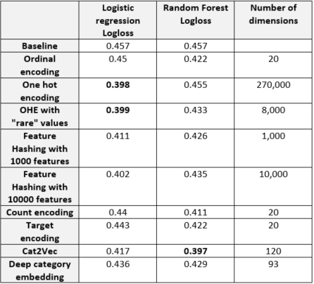

# Embedding

An embedding turns a word, a category, a user, or an emoji into a dense vector a model can compare and learn from. The page starts from a from-scratch intro, moves through the embedding models (entity embeddings for tabular data, Cat2vec, and the long run of *2vec ideas), then to vector similarity search for finding neighbors among those vectors, and ends with the tools, Flair and Hugging Face, that ship ready-made embeddings.

The same notes are in [Augmentation](../language-ai/augmentation.md), [Image embeddings and others](../predictive-ml/audio-algorithms.md#image-embeddings-and-others), [KERAS EMBEDDING LAYER](deep-neural-frameworks.md#keras-embedding-layer), [LDA2VEC](../language-ai/topics-modeling.md#lda2vec), [NLP embedding repositories](../language-ai/nlp.md#nlp-embedding-repositories), and [Recommender Systems](../ai-product/recommender-systems.md).

## Intro

The place to begin is the author's pick for building the idea from nothing: (amazing) embeddings from the ground up Single Lunch.

## Embedding Models

With the idea in place, the models differ mainly in what they embed: tabular entities, categories, or anything else that can be given a *2vec treatment.

### ENTITY EMBEDDINGS

Entity embeddings are the tabular case: each categorical value gets a learned vector instead of a one-hot column.

The same notes are in [Deep Neural Tabular](deep-neural-tabular.md).

The general version is Star - [General purpose embedding paper with code somewhere](https://arxiv.org/pdf/1709.03856.pdf), the StarSpace paper, a general-purpose neural embedding model for labeling tasks such as text classification, ranking tasks such as web search, and collaborative filtering or content-based recommendation.

For tabular data specifically, fast.ai has [Using embeddings on tabular data, specifically categorical - introduction](http://www.fast.ai/2018/04/29/categorical-embeddings/), using fastai without limiting ourselves to pytorch - the material from this post is covered in much more detail starting around 1:59:45 in the Lesson 3 video and continuing in Lesson 4 of our free, online [Practical Deep Learning for Coders](http://course.fast.ai/) course, a free course for people with some coding experience who want to apply deep learning and machine learning to practical problems. To see example code of how this approach can be used in practice, check out our Lesson 3 jupyter notebook. Perhaps Saturday and Sunday have similar behavior, and maybe Friday behaves like an average of a weekend and a weekday. Similarly, for zip codes, there may be patterns for zip codes that are geographically near each other, and for zip codes that are of similar socio-economic status. The jupyter notebook doesn't seem to have the embedding example they are talking about. The lesson videos and that notebook are kept at the end of the page.

The method became known through a competition. [Rossman on kaggle](http://blog.kaggle.com/2016/01/22/rossmann-store-sales-winners-interview-3rd-place-cheng-gui/) is the 3rd-place winners' interview for Rossmann Store Sales, the challenge to forecast sales using store, promotion, and competitor data, and the discussion thread where they used entity-embeddings is [here](https://www.kaggle.com/c/rossmann-store-sales/discussion/17974). The code is on [github](https://github.com/entron/entity-embedding-rossmann) as entron/entity-embedding-rossmann, and the [paper](https://arxiv.org/abs/1604.06737) is "Entity Embeddings of Categorical Variables". The author also rated a Medium on rossman - good, kept at the end of the page.

[Embedder](https://github.com/dkn22/embedder) - git code for a simplified entity embedding above, which embeds categorical variables via neural networks. Finally what they do is label encode each feature using labelEncoder into an int-based feature, then push each feature into its own embedding layer of size 1 with an embedding size defined by a rule of thumb (so it seems), merge all layers, train a synthetic regression/classification and grab the weights of the corresponding embedding layer.

Beyond categories, [Entity2vec](https://github.com/ot/entity2vec) is ot/entity2vec for semantic embeddings of entities. [Categorical using keras](https://medium.com/@satnalikamayank12/on-learning-embeddings-for-categorical-data-using-keras-165ff2773fc9) is a breakdown of Joe Eddy's solution to Kaggle's Safe Driver Prediction Challenge, on learning embeddings for categorical data using Keras.

### Cat2vec

Entity embeddings are one answer to categorical data; Cat2vec puts them next to the classic encodings. The two-part series behind this note starts in Part1: Label encoder/ ordinal, One hot, one hot with a rare bucket, hash, then continues in Part2: cat2vec using w2v, and entity embeddings for categorical data. Both parts are kept at the end of the page. The figure below is from that series.

<figure><figcaption>
Cat2vec

Credit: <a href="https://lh6.googleusercontent.com/BJjrzp0YPmsy2_OKecufELzNU_AO2I2kSAx9ekSbGmGYNJ27AGkbdhwPv45iMVub_6q0AHF91N6BYdxA4l-eAUspOIat-QMU8xHQrSYYpWmu7TEO8NmRPIcrPItwq1TgkJN-LTd3">copied from the original hosted image</a>.
</figcaption></figure>

### ALL2VEC EMBEDDINGS

Once categories have vectors, the same trick spreads to almost anything, and this is the collection of those *2vec repositories and competitions.

The index is [ALL ???-2-VEC ideas](https://github.com/MaxwellRebo/awesome-2vec), a curated list of 2vec-type embedding models. For tabular data, the Fast.ai [post](http://www.fast.ai/2018/04/29/categorical-embeddings/) regarding embedding for tabular data, i.e., cont and categorical data is the same entity-embedding idea as above, and the author's note on entity embedding for categorical data + notebook points the same way.

Competitions show it working. [Kaggle taxi competition + code](http://blog.kaggle.com/2015/07/27/taxi-trajectory-winners-interview-1st-place-team-%F0%9F%9A%95/) is the taxi trajectory 1st-place interview. [Ross man competition - entity embeddings, code missing](http://blog.kaggle.com/2016/01/22/rossmann-store-sales-winners-interview-3rd-place-cheng-gui/) is the Rossmann interview again, with the entron/entity-embedding-rossmann repo as the [alternative code](https://github.com/entron/entity-embedding-rossmann), and [CODE TO CREATE EMBEDDINGS straight away, based onthe ideas by cheng guo in keras](https://github.com/dkn22/embedder) is the embedder repo that embeds categorical variables via neural networks.

The same idea moved into products and text. [PIN2VEC - pinterest embeddings using the same idea](https://medium.com/the-graph/applying-deep-learning-to-related-pins-a6fee3c92f5e) is Pinterest Engineering on applying deep learning to Related Pins, their item-to-item recommendation system that used to rely on board co-occurrence. [Tweet2Vec](https://github.com/soroushv/Tweet2Vec) is code for the implementation of Tweet2Vec, and its [paper](https://dl.acm.org/citation.cfm?doid=2911451.2914762) comes with code theano. For grouping tweets, [Clustering](https://github.com/svakulenk0/tweet2vec_clustering) is the svakulenk0/tweet2vec_clustering repo, with its arXiv [paper](https://arxiv.org/abs/1703.05123) of tweet2vec clustering and the PDF, [Character neural embeddings for tweet clustering](https://arxiv.org/pdf/1703.05123.pdf), from the Vienna University of Economics and Business and MODUL Technology.

Graphs and characters get the same treatment. Diff2vec - might be useful on social network graphs, paper, [code](https://github.com/benedekrozemberczki/diff2vec), the reference implementation of Diffusion2Vec built on Gensim and NetworkX. emoji 2vec is below. [Char2vec](https://hackernoon.com/chars2vec-character-based-language-model-for-handling-real-world-texts-with-spelling-errors-and-a3e4053a147d) describes the open source character-based language model <a href="https://github.com/IntuitionEngineeringTeam/chars2vec" target="_blank"><strong>chars2vec</strong></a>, built with Keras for real world texts with spelling errors; the [Git](https://github.com/IntuitionEngineeringTeam/chars2vec) repo is that character-based word embeddings model based on RNN. A similarity measure for words with types is at [https://arxiv.org/abs/1708.00524](https://arxiv.org/abs/1708.00524).

EMOJIS

Emojis are the next thing to embed, because they carry emotion in a single token. [Deepmoji](http://datadrivenjournalism.net/featured_projects/deepmoji_using_emojis_to_teach_ai_about_emotions) is the DeepMoji project page on DataDrivenJournalism, the data journalism learning community. [hugging face on emotions](https://medium.com/huggingface/understanding-emotions-from-keras-to-pytorch-3ccb61d5a983) is Thomas Wolf's "Understanding emotions — from Keras to pyTorch", from moving HuggingFace's emotion, sentiment, and sarcasm detection onto an NLP model from the MIT Media Lab. It shows:

 1. how to make a custom pyTorch LSTM with custom activation functions,
 2. how the PackedSequence object works and is built,
 3. how to convert an attention layer from Keras to pyTorch,
 4. how to load your data in pyTorch: DataSets and smart Batching,
 5. how to reproduce Keras weights initialization in pyTorch.

[Another great emoji paper, how to get vector representations from](https://aclweb.org/anthology/S18-1039) is PlusEmo2Vec at SemEval-2018, exploiting emotion knowledge from emoji and hashtags. [3. What can we learn from emojis (deep moji)](https://www.media.mit.edu/posts/what-can-we-learn-from-emojis/) is Iyad Rahwan's MIT Media Lab post: the model learns an understanding of emotions by finding millions of tweets with one of the top 64 emojis. The paper is [Learning millions of](https://arxiv.org/pdf/1708.00524.pdf), from Bjarke Felbo, Iyad Rahwan, and their co-authors, and the [medium](https://medium.com/@bjarkefelbo/what-can-we-learn-from-emojis-6beb165a5ea0) post covers it for emoji sentiment sarcasm. [EMOJI2VEC](https://tech.instacart.com/deep-learning-with-emojis-not-math-660ba1ad6cdc) is a medium article with keras code, a. [nother paper on classifying tweets using emojis](https://arxiv.org/abs/1708.00524) is the same emoji-occurrence paper.

Categories can also be embedded in groups. [Group2vec](https://github.com/cerlymarco/MEDIUM_NoteBook/tree/master/Group2Vec) git and medium, which is a multi input embedding network using a-f below. plus two other methods that involve groupby and applying entropy and join/countvec per class. Really interesting. The medium half is [https://towardsdatascience.com/group2vec-for-advance-categorical-encoding-54dfc7a08349](https://towardsdatascience.com/group2vec-for-advance-categorical-encoding-54dfc7a08349). The steps are:

 1. Initialize embedding layers for each categorical input;
 2. For each category, compute dot-products among other embedding representations. These are our ‘groups’ at the categorical level;
 3. Summarize each ‘group’ adopting an average pooling;
 4. Concatenate ‘group’ averages;
 5. Apply regularization techniques such as BatchNormalization or Dropout;
 6. Output probabilities.

## VECTOR SIMILARITY SEARCH

Every model above produces vectors, and a vector is only useful if you can find its neighbors fast, so the next step is similarity search.

The same notes are in [A metric learning reality check](../evals/evaluation-metrics.md#a-metric-learning-reality-check), [Question Answering](../language-ai/question-answering.md), [Search](../language-ai/search.md), and [Vector databases](../data/engineering/lakes-and-warehouses.md#vector-databases).

The base library is [Faiss](https://github.com/facebookresearch/faiss) - a library for efficient similarity search and clustering of dense vectors. To choose among libraries, [Benchmarking](https://github.com/erikbern/ann-benchmarks) is erikbern/ann-benchmarks, benchmarks of approximate nearest neighbor libraries in Python. On the database side, [Singlestore](https://www.singlestore.com/solutions/predictive-ml-ai/) offers a performant vector database together with an enterprise-grade data platform, delivering hybrid search that includes keyword match, vector similarity, and semantic search for generative AI applications. Elastic search - [dense vector](https://www.elastic.co/guide/en/elasticsearch/reference/7.6/query-dsl-script-score-query.html#vector-functions) is the vector functions part of the script score query in the Elasticsearch Guide 7.6.

Google cloud vertex matching engine [NN search](https://cloud.google.com/blog/products/ai-machine-learning/vertex-matching-engine-blazing-fast-and-massively-scalable-nearest-neighbor-search) is Google's blazing fast and massively scalable nearest neighbor search, built on the vector embeddings that are among the handiest tools an ML engineer has. The author's notes list its uses and features:

 1. search
 1. Recommendation engines
 2. Search engines
 3. Ad targeting systems
 4. Image classification or image search
 5. Text classification
 6. Question answering
 7. Chat bots
 2. Features
 1. Low latency
 2. High recall
 3. managed
 4. Filtering
 5. scale

Managed services take the tuning away. Pinecone - managed [vector similarity search](https://www.pinecone.io/) - Pinecone is a fully managed vector database that makes it easy to add vector search to production applications. No more hassles of benchmarking and tuning algorithms or building and maintaining infrastructure for vector search.

The open libraries and engines are the other route. [Nmslib](https://github.com/nmslib/nmslib) ([benchmarked](https://github.com/erikbern/ann-benchmarks) - Benchmarks of approximate nearest neighbor libraries in Python) is a Non-Metric Space Library (NMSLIB): An efficient similarity search library and a toolkit for evaluation of k-NN methods for generic non-metric spaces. The author also lists scann. [Vespa.ai](https://vespa.ai/) - Make AI-driven decisions using your data, in real time. At any scale, with unbeatable performance. [Weaviate](https://weaviate.io/developers/weaviate) - Weaviate is an [open source](https://github.com/semi-technologies/weaviate) vector search engine and vector database. Weaviate uses machine learning to vectorize and store data, and to find answers to natural language queries, or any other media type.

Vectors can also live inside the search engines teams already run. [Neural Search with BERT and Solr](https://dmitry-kan.medium.com/list/vector-search-e9b564d14274) - Indexing BERT vector data in Solr and searching with full traversal. [Fun With Apache Lucene and BERT Embeddings](https://medium.com/swlh/fun-with-apache-lucene-and-bert-embeddings-c2c496baa559) - This post goes much deeper -- to the similarity search algorithm on Apache Lucene level. It upgrades the code from 6.6 to 8.0. Speeding up BERT Search in Elasticsearch - Neural Search in Elasticsearch: from vanilla to KNN to hardware acceleration, at [https://towardsdatascience.com/speeding-up-bert-search-in-elasticsearch-750f1f34f455](https://towardsdatascience.com/speeding-up-bert-search-in-elasticsearch-750f1f34f455). Ask Me Anything about Vector Search - In the Ask Me Anything: Vector Search! session Max Irwin and Dmitry Kan discussed major topics of vector search, ranging from its areas of applicability to comparing it to good ol’ sparse search (TF-IDF/BM25), to its readiness for prime time and what specific engineering elements need further tuning before offering this to users; it is at [https://towardsdatascience.com/ask-me-anything-about-vector-search-4252a01f3889](https://towardsdatascience.com/ask-me-anything-about-vector-search-4252a01f3889). [Search with BERT vectors in Solr and Elasticsearch](https://github.com/DmitryKey/bert-solr-search) - GitHub repository used for experiments with Solr and Elasticsearch using DBPedia abstracts comparing Solr, vanilla Elasticsearch, elastiknn enhanced Elasticsearch, OpenSearch, and GSI APU.

To compare the engines side by side, Not All Vector Databases Are Made Equal - A detailed comparison of Milvus, Pinecone, Vespa, Weaviate, Vald, GSI and Qdrant, at [https://towardsdatascience.com/milvus-pinecone-vespa-weaviate-vald-gsi-what-unites-these-buzz-words-and-what-makes-each-9c65a3bd0696](https://towardsdatascience.com/milvus-pinecone-vespa-weaviate-vald-gsi-what-unites-these-buzz-words-and-what-makes-each-9c65a3bd0696). To keep up with the field, [Vector Podcast](https://dmitry-kan.medium.com/vector-podcast-e27d83ecd0be) - Podcast hosted by Dmitry Kan, interviewing the makers in the Vector / Neural Search industry. Available on YouTube, Spotify, Apple Podcasts and RSS. [Players in Vector Search: Video](https://dmitry-kan.medium.com/players-in-vector-search-video-2fd390d00d6) -Video recording and slides of the talk presented on London IR Meetup on the topic of players, algorithms, software and use cases in Vector Search.

Pure vector search is rarely the end state. The (paper) [Hybrid retrieval using search and semantic search](https://arxiv.org/abs/2210.11934) is "An Analysis of Fusion Functions for Hybrid Retrieval".

## TOOLS

After building and searching vectors by hand, the tools below ship the embeddings ready to use.

### FLAIR

Flair provides NER, PoS tagging, text classification, and combined embeddings.

The same notes are in [Named Entity Recognition (NER)](../language-ai/named-entity-recognition-ner.md).

Its features, as the author listed them:

1. Name-Entity Recognition (NER): It can recognise whether a word represents a person, location or names in the text.
2. Parts-of-Speech Tagging (PoS): Tags all the words in the given text as to which “part of speech” they belong to.
3. Text Classification: Classifying text based on the criteria (labels)
4. Training Custom Models: Making our own custom models.
5. It comprises of popular and state-of-the-art word embeddings, such as GloVe, BERT, ELMo, Character Embeddings, etc. There are very easy to use thanks to the Flair API
6. Flair’s interface allows us to combine different word embeddings and use them to embed documents. This in turn leads to a significant uptick in results
7. ‘Flair Embedding’ is the signature embedding provided within the Flair library. It is powered by contextual string embeddings. We’ll understand this concept in detail in the next section
8. Flair supports a number of languages – and is always looking to add new ones

### HUGGING FACE

Flair combines embeddings; Hugging Face is where the pretrained transformer models behind many of them live, with the tutorials to fine-tune them.

The [Git](https://github.com/huggingface/transformers) repo is 🤗 Transformers, the model-definition framework for state-of-the-art machine learning models in text, vision, audio, and multimodal models, for both inference and training; [Hugging face pytorch transformers](https://github.com/huggingface/pytorch-transformers) is its older address. [Hugging face nlp pretrained](https://huggingface.co/models?search=Helsinki-NLP%2Fopus-mt) is the Models page on Hugging Face, here searched for the Helsinki-NLP translation models.

The emotion walkthrough from the emoji notes belongs here too: [hugging face on emotions](https://medium.com/huggingface/understanding-emotions-from-keras-to-pytorch-3ccb61d5a983) teaches

 1. how to make a custom pyTorch LSTM with custom activation functions,
 2. how the PackedSequence object works and is built,
 3. how to convert an attention layer from Keras to pyTorch,
 4. how to load your data in pyTorch: DataSets and smart Batching,
 5. how to reproduce Keras weights initialization in pyTorch.

For BERT specifically, the BERT Fine-Tuning Tutorial with PyTorch by Chris McCormick and Nick Ryan is a [thorough tutorial on bert](http://mccormickml.com/2019/07/22/BERT-fine-tuning/), and its fine tuning using hugging face transformers package runs in the [Code](https://colab.research.google.com/drive/1Y4o3jh3ZH70tl6mCd76vz_IxX23biCPP) notebook. The same material in video form is the InnerWorkingsAI BERT Research series on Youtube: [ep1](https://www.youtube.com/watch?v=FKlPCK1uFrc) on key concepts and sources, [2](https://www.youtube.com/watch?v=zJW57aCBCTk) on WordPiece embeddings, and [3](https://www.youtube.com/watch?v=x66kkDnbzi4) and [3b](https://www.youtube.com/watch?v=Hnvb9b7a_Ps) on fine tuning.

## Deprecated links


These links and images no longer work. The original wording is kept here. A same-resource copy, when one was checked, is used above.

- Weaviate. This address no longer opens: https://www.semi.technology/developers/weaviate/current/
- Label encoder/ ordinal, One hot, one hot with a rare bucket, hash. This address no longer opens: https://blog.myyellowroad.com/using-categorical-data-in-machine-learning-with-python-from-dummy-variables-to-deep-category-66041f734512
- Part2: cat2vec using w2v. This address no longer opens: https://blog.myyellowroad.com/using-categorical-data-in-machine-learning-with-python-from-dummy-variables-to-deep-category-42fd0a43b009
- Towards Data Science: deep-learning-structured-data-8d6a278f3088. This address no longer opens: https://towardsdatascience.com/deep-learning-structured-data-8d6a278f3088
- the Lesson 3 video. This address no longer opens: http://course.fast.ai/lessons/lesson3.html
- Lesson 4. This address no longer opens: http://course.fast.ai/lessons/lesson4.html
- Lesson 3 jupyter notebook. This address no longer opens: https://github.com/fastai/fastai/blob/master/courses/dl1/lesson3-rossman.ipynb
