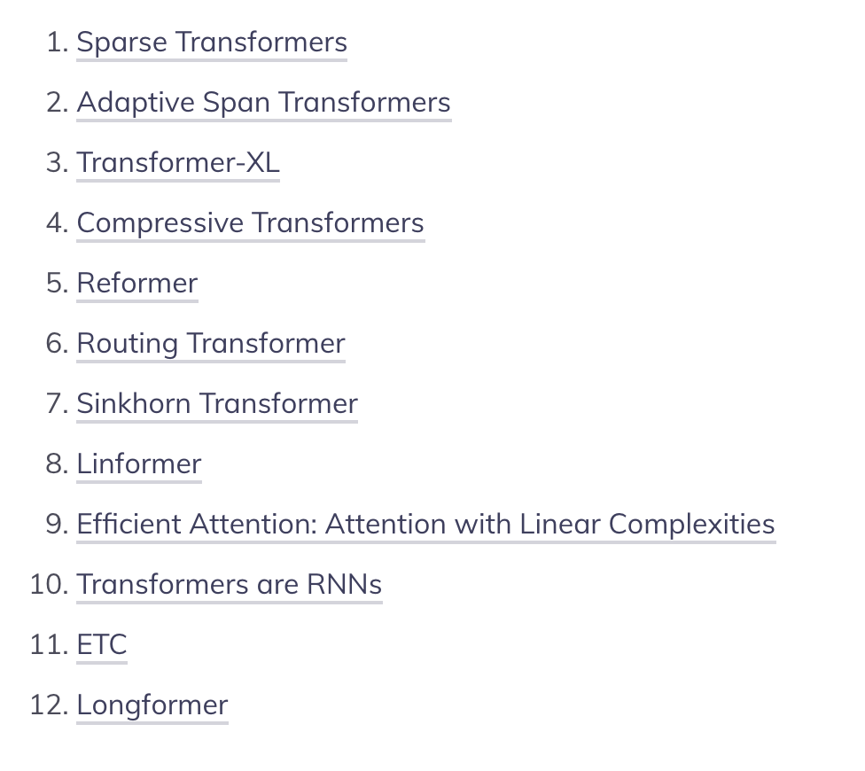
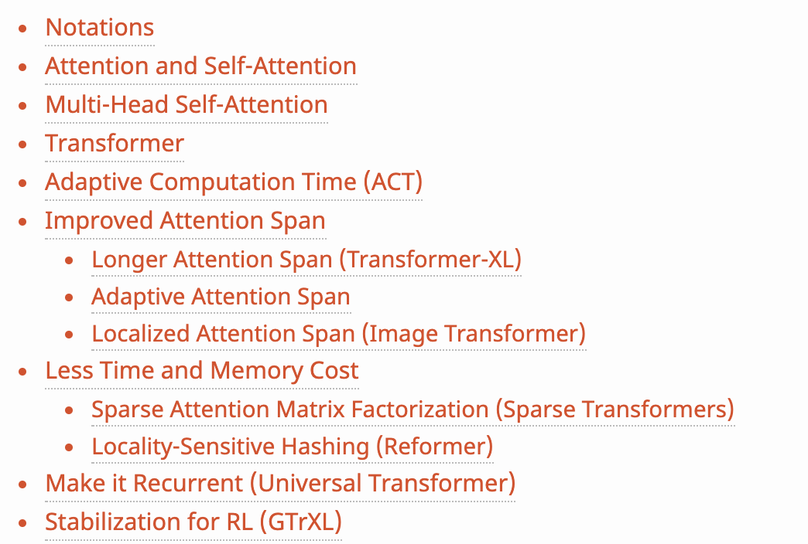

1. TRANSFORMERS
2. [Jay alammar on transformers](http://jalammar.github.io/illustrated-transformer/) (amazing)
3. [J.A on Bert Elmo](http://jalammar.github.io/illustrated-bert/) (amazing)
4. [Jay alammar on a visual guide of bert for the first time](http://jalammar.github.io/a-visual-guide-to-using-bert-for-the-first-time/)
5. [J.A on GPT2](http://jalammar.github.io/illustrated-bert/)
6. Super fast transformers
7. A survey of long term context in transformers.

<figure><figcaption>
A survey of long-term context in transformers.

Credit: <a href="https://lh5.googleusercontent.com/KwcoMe_TwrkQYdxBuSZcd8HROwg3R5jB78OUMFd0Y7AwzL7R-4Wy_Eqfb0IfPyWvbIzCt_4NJjKPcjEjL8crrKcwXIgSxzq2KcCjbtzbJCq541efBKxF9swVTevNo97lJ5uBTIus">copied from the original hosted image</a>.
</figcaption></figure>
8. [Lilian Wang on the transformer family](https://lilianweng.github.io/lil-log/2020/04/07/the-transformer-family.html) (seems like it is constantly updated)
9. <figure><figcaption>
The transformer family.

Credit: <a href="https://lh6.googleusercontent.com/t2dHec2TFYJhdgHx0k9tuxlIRJ1rqpKLzUfJFwrUOxp1ju-yxBzy7Ho1tx04GaZRUk-Op4FmA9wSFUhC9xsRxcbiX3jmV-Is39iXtpqNypOydikXkeZJJW-GfYOSLHhl6LyhW0e3">copied from the original hosted image</a>.
</figcaption></figure>
10. Hugging face, [encoders decoders in transformers for seq2seq](https://medium.com/huggingface/encoder-decoders-in-transformers-a-hybrid-pre-trained-architecture-for-seq2seq-af4d7bf14bb8)
11. [The annotated transformer](http://nlp.seas.harvard.edu/2018/04/03/attention.html)
12. [Large memory layers with product keys](https://arxiv.org/abs/1907.05242) - This memory layer allows us to tackle very large scale language modeling tasks. In our experiments we consider a dataset with up to 30 billion words, and we plug our memory layer in a state-of-the-art transformer-based architecture. In particular, we found that a memory augmented model with only 12 layers outperforms a baseline transformer model with 24 layers, while being twice faster at inference time.
13. [Adaptive sparse transformers](https://arxiv.org/abs/1909.00015) - This sparsity is accomplished by replacing softmax with

α-entmax: a differentiable generalization of softmax that allows low-scoring words to receive precisely zero weight. Moreover, we derive a method to automatically learn the

α parameter -- which controls the shape and sparsity of

α-entmax -- allowing attention heads to choose between focused or spread-out behavior. Our adaptively sparse Transformer improves interpretability and head diversity when compared to softmax Transformers on machine translation datasets.

