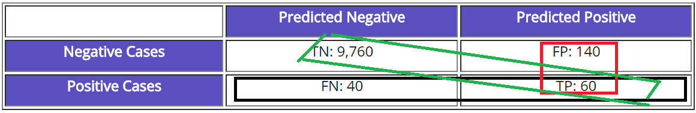

# Evaluation Metrics

A trained model needs a number that says whether it is any good, and accuracy alone is rarely that number. The page starts with supervised measures, from accuracy through precision and recall, F1, ROC and AUC, RMSE, and kappa, then moves to perplexity and to choosing the number of clusters when there are no labels, and ends with a reality check on metric-learning benchmarks.

The same notes are in [Calibration](../responsible-ai/calibration.md) and [Evaluating Recommender Systems](../ai-product/recommender-systems.md#evaluating-recommender-systems).

## SUPERVISED

Supervised metrics compare predictions with known labels, so they come first. The order is accuracy, then the measures that split its errors apart, then ROC, RMSE, and kappa.

### Accuracy

The simplest of them is accuracy, the share of predictions that are correct. It is the first metric anyone reports, and the rest of this section is about why it is not enough on its own.

### Precision \ Recall \ ROC \ AUC

Accuracy hides which kind of mistake the model makes, and precision and recall are the two numbers that separate them. The same notes are in [Methods and metrics](../problem-framing/multi-label-classification.md#methods-and-metrics).

Jason Brownlee's [Performance Measures](http://machinelearningmastery.com/classification-accuracy-is-not-enough-more-performance-measures-you-can-use/) on MachineLearningMastery makes the case: classification accuracy, the number of correct predictions out of all predictions made, is not enough, and he lists more performance measures you can use. The point to keep from it is about the confusion matrix. A balanced confusion matrix is better than one that is either one row of numbers and one of zeros, or a column of numbers and a column of zeros. Therefore an algorithm that outputs a lower classification accuracy but has a better confusion matrix wins.

Precision is the # of positive predictions divided by the total number of positive class values predicted:

$$\text{Precision} = \frac{\text{True Positives}}{\text{True Positives} + \text{False Positives}}$$

Low precision can be thought of as many false positives. Recall looks from the other side: the # of positive predictions divided by the number of positive class values in the test data.

$$\text{Recall (sensitivity)} = \frac{\text{True Positives}}{\text{True Positives} + \text{False Negatives}}$$

Low recall can be thought of as many false negatives.

#### F1 Harmonic Mean Score

Precision and recall pull against each other, so choosing between two models needs one number that balances them. F1 is their harmonic mean:

$$\text{F1\_Score} = 2 * \frac{\text{Precision} * \text{Recall}}{\text{Precision} + \text{Recall}}$$

F1 helps select a model based on a balance between precision and recall. In a multi-class problem, there are many methods to calculate F1, some are more appropriate for balanced data, others are not. [**The best link yet**](https://simonhessner.de/why-are-precision-recall-and-f1-score-equal-when-using-micro-averaging-in-a-multi-class-problem/) on those methods covers micro, macro, and weighted averaging (macro balanced, micro imbalanced, weighted imbalanced). [**Micro vs macro** ](https://datascience.stackexchange.com/questions/15989/micro-average-vs-macro-average-performance-in-a-multiclass-classification-settin/16001) is Shashank Gupta's question on micro- versus macro-averaged performance in a multiclass setting with three classes and a skewed class distribution. [**Micro vs weighted (not a good link**](https://stats.stackexchange.com/questions/169439/micro-vs-weighted-f1-score)**)** is Franck Dernoncourt's question on what to take into account when choosing between a micro and a weighted F1 score, given that macro gives a sense of effectiveness on small classes. [**What is weighted**](https://stats.stackexchange.com/questions/283961/where-does-sklearns-weighted-f1-score-come-from) is Abhishek Divekar's question on where scikit-learn's weighted F1 comes from: the 'weighted' option of f1_score and fbeta_score multiplies the classwise F1-scores by the support, the number of examples in that class. [**Micro is accuracy**](https://stackoverflow.com/questions/37358496/is-f1-micro-the-same-as-accuracy) in multi class, and that question asks whether it is always true after many scikit-learn examples where F1 micro came out the same as accuracy.

The same ideas have older names from diagnostic testing, where the population is split into diseased and disease-free individuals:

- **Accuracy = (1 – Error) = (TP + TN)/(PP + NP) = Pr(C), the probability of a correct classification.**
- **Sensitivity (recall) = TP/(TP + FN) = TP/PP = the ability of the test to detect disease in a population of diseased individuals.**
- **Specificity = TN/(TN + FP) = TN / NP = the ability of the test to correctly rule out the disease in a disease-free population.**

Sensitivity and specificity against ROC and AUC is the question behind [What are ?)](http://machinelearningmastery.com/assessing-comparing-classifier-performance-roc-curves-2/), Jason Brownlee's post on assessing and comparing classifier performance with ROC curves. Accuracy, the percent of correct classifications, is easy to understand and makes comparing classifiers trivial, but it ignores many of the factors that should be taken into account when honestly assessing performance. [**ROC curve and AUC in weka**](https://www.youtube.com/watch?v=j97h_-b0gvw&list=PLJbE6j2EG1pZnBhOg3_Rb63WLCprtyJag) explains how the curve should look like for the negative or positive predictions, against what is actually plotted.

Averaging F1 across runs raises its own question: mean F1, how do we calculate it? [**How**](https://datascience.stackexchange.com/questions/16179/what-is-the-correct-way-to-compute-mean-f1-score) is Pinkesh Badjatiya's question for ten experiments: average the ten F1 scores, or compute F1 from the average precision and average recall. [**it**](http://rushdishams.blogspot.com/2011/08/micro-and-macro-average-of-precision.html) is the post on micro- and macro-average of precision, recall and F-score, where the F-Score is the equally weighted harmonic mean of the two.

For more than two classes, Boaz Shmueli's Multi-Class Metrics Made Simple series is the walkthrough. [**Multiclass Precision / Recall**](https://shmueli.medium.com/multi-class-metrics-made-simple-part-ii-the-f1-score-ebe8b2c2ca1) is Part II, the F1-score, and [**part 1**](https://shmueli.medium.com/multi-class-metrics-made-simple-part-i-precision-and-recall-9250280bddc2) explains how precision and recall are used and calculated in multi-class classification, starting from a recap of the binary case.

Ranking needs the same measures cut off at the top of the list. [**Precision at K**](https://medium.com/@m_n_malaeb/recall-and-precision-at-k-for-recommender-systems-618483226c54) is Maher Malaeb on how precision and recall, classical metrics for binary classification and document retrieval, were translated to evaluate recommendation systems. The [**formulas, examples**](https://surprise.readthedocs.io/en/latest/FAQ.html#how-to-compute-precision-k-and-recall-k) are in the Surprise documentation FAQ. [**git 1**](https://github.com/scikit-learn/scikit-learn/pull/14859) is the work-in-progress scikit-learn pull request for precision and recall at k by leonardbinet, [**git 2**](https://gist.github.com/mblondel/7337391) is a gist of learning to rank metrics, and [**git 3**](https://github.com/scikit-learn/scikit-learn/issues/7343) is the scikit-learn issue to add precision at K, since average_precision_score exists but average precision at k does not seem possible. All three are suggestive, written for a recommendation application.

#### RECALL, PRECISION AND F1

The formulas say what the numbers are. The tutorials here are about moving them, mostly by moving the decision threshold. [**Medium on Controling the decision threshold using the probabilities any model gives, code, samples, tutorial**](https://medium.com/data-science/fine-tuning-a-classifier-in-scikit-learn-66e048c21e65) is Kevin Arvai's fine-tuning of a classifier in scikit-learn: many problems benefit from either precision or recall as the optimal metric, but implementing that takes a detailed process, and his first attempts to fine-tune for recall (sensitivity) were difficult. [**Another good medium explanation on precision / recall / fpr/ tpr etc**](https://medium.com/data-science/beyond-accuracy-precision-and-recall-3da06bea9f6c) is Will Koehrsen's Beyond Accuracy: Precision and Recall, which opens with a model that identifies terrorists boarding flights with greater than 99% accuracy by labeling every passenger as not a terrorist. A third tutorial, Scikit lego on choosing the threshold using grid search, used to sit here; that address no longer opens and is kept at the end of the page. [**Best explanation ever** ](https://www.quora.com/What-is-the-best-way-to-understand-the-terms-precision-and-recall) is the Quora question on the best way to understand the terms "precision" and "recall", with an answer from a Ph.D in Computational Linguistics & Machine Learning, University of Lethbridge (2013).

The intuition that sticks is a memory test. For **recall**, one day, your girlfriend asks you: ‘Sweetie, do you remember all birthday surprises from me?’ This simple question makes your life in danger. To extend your life, you need to recall all 10 surprising events from your memory. So, recall is the ratio of a number of events you can correctly recall to a number of all correct events. If you can recall all 10 events correctly, then, your recall ratio is 1.0 (100%). If you can recall 7 events correctly, your recall ratio is 0.7 (70%).

**Precision** is the other half of the same story. For example, you answers 15 times, 10 events are correct and 5 events are wrong. This means you can recall all events but it’s not so precise. So, precision is the ratio of a number of events you can correctly recall to a number all events you recall (mix of correct and wrong recalls). In other words, it is how precise of your recall. From the previous example (10 real events, 15 answers: 10 correct answers, 5 wrong answers), you get 100% recall but your precision is only 66.67% (10 / 15).

The same two ratios can be read straight off the table. [**Confusion matrix wise**](http://www.kdnuggets.com/faq/precision-recall.html): bottom line is recall (% correct out of positive cases), right column is precision (% of POS predictions) & % accuracy in diagonal. The figure shows that layout.

<figure><figcaption>
Confusion matrix and precision/recall layout.

Credit: <a href="https://lh3.googleusercontent.com/xAvUjAvpotqqKDPeYNxtjt6l0rfO4aPwtDsmDNFHhZs_mXEcTiyeRX7vquZ6Uxd5a9m_aGRIbMPFV1kjIdcpLZ3HZERmqQXY_LysMA8lFXfuFRc1pqV18mpTCdKnDqnOiHKUQgCt">copied from the original hosted image</a>.
</figcaption></figure>

The figure is copied from the original hosted image. Back to one number: the [**F1 score**](http://machinelearningmastery.com/classification-accuracy-is-not-enough-more-performance-measures-you-can-use/), from the same performance-measures post, conveys the balance between the precision and the recall:

$$2*((precision*recall)/(precision+recall))$$

Yet another(pretty good) source, and another (bad) source for explaining precision, recall, accuracy, true positive rate etc., used to sit here. Both addresses no longer open and are kept at the end of the page, and an archived copy of the first is further down.

How to use precision and recall comes down to the threshold, and the answer by aurelien geron walks through it:

- **In a binary classifier, the decision function is the function that produces a score for the positive class.**
- **In a logistic regression classifier, that decision function is simply a linear combination of the input features.**
- **If that score is greater than some threshold that you choose, then the classifier "predicts" the positive class, or else it predicts the negative class.**
- **If you want your model to have high precision (at the cost of a low recall), then you must set the threshold pretty high. This way, the model will only predict the positive class when it is absolutely certain. For example, you may want this if the classifier is selecting videos that are safe for kids: it's better to err on the safe side.**
- **Conversely, if you want high recall (at the cost of a low precision) then you must use a low threshold. For example, if the classifier is used to detect intruders in a nuclear plant, then you probably want to detect all actual intruders, even if it means getting a lot of false alarms (called "false positives").**
- **If you make a few assumptions about the distribution of the data (i.e., the positive and negative class are separated by a linear boundary plus Gaussian noise), then computing the logistic of the score gives you the probability that the instance belongs to the positive class. A score of 0 corresponds to the 50% probability. So by default, a LogisticClassifier predicts the positive class if it estimates the probability to be greater than 50%. In general, this sounds like a reasonable default threshold, but really it all depends on what you want to do with the classifier.**
- **If the assumptions I mentioned above were perfect, then if the Logistic Classifier outputs a probability of X% for an instance, it means there is exactly X% chance that it's positive. But in practice, the assumptions are imperfect, so I try to always make it clear that we are talking about an "estimated probability", not an actual probability.**

#### ROC CURVES

Sweeping that threshold draws a curve, and the question becomes which curve to read. [**Diff between precision recall to roc curve**](https://www.quora.com/What-is-the-difference-between-a-ROC-curve-and-a-precision-recall-curve-When-should-I-use-each) is the comparison of the two. The rule of thumb is in "What is ROC AUC and PR AUC and when to use then (i.e for imbalanced data use PRAUC)"; its original address no longer opens, and an archived copy is further down. [**What is AUC (AUROC)**](https://stats.stackexchange.com/questions/132777/what-does-auc-stand-for-and-what-is-it) is the question from someone who searched high and low for what AUC, as related to prediction, stands for and means.

Regression has no threshold to move, so its errors are measured directly. [**(RMSE - what is?)**](https://stats.stackexchange.com/questions/56302/what-are-good-rmse-values): it is important to recall that RMSE has the same unit as the dependent variable (DV). It means that there is no absolute good or bad threshold, however you can define it based on your DV. For a datum which ranges from 0 to 1000, an RMSE of 0.7 is small, but if the range goes from 0 to 1, it is not that small anymore. However, although the smaller the RMSE, the better, what counts as small depends on that range.

[**(R^2 vs RMSE)**](https://stats.stackexchange.com/questions/142248/difference-between-r-square-and-rmse-in-linear-regression): R-squared is conveniently scaled between 0 and 1, whereas RMSE is not scaled to any particular values. This can be good or bad; obviously R-squared can be more easily interpreted, but with RMSE we explicitly know how much our predictions deviate, on average, from the actual values in the dataset. So in a way, RMSE tells you more. I also found this [**video**](https://www.youtube.com/watch?v=aq8VU5KLmkY) really helpful: zedstatistics' Introduction to REGRESSION!, on SSE, SSR, SST, R-squared, and errors (ε vs. e).

Back on classifiers, one more measure corrects for class balance. [**Kappa**](https://stats.stackexchange.com/questions/82162/cohens-kappa-in-plain-english) measures accuracy while considering imbalanced datasets; the question is Cohen's kappa in plain English, from a reader of a data mining book who could not see how kappa evaluates the prediction performance of classifiers.

**References:** [**A Survey on Deep Learning in Medical Image Analysis**](https://arxiv.org/abs/1702.05747) reviews the major deep learning concepts pertinent to medical image analysis and summarizes over 300 contributions to the field, surveying deep learning for image classification, object detection, and more.

### Perplexity

Classification scores come from a loss, and so does the main score for language models. The same notes are in [LOSS](../deep-learning/deep-neural-nets.md#loss), [LOSS IN KERAS](../deep-learning/deep-neural-frameworks.md#loss-in-keras), and [Metrics](../generative-ai/large-language-models-llms.md#metrics).

[perplexity and accuracy in classification](https://medium.com/unpackai/perplexity-and-accuracy-in-classification-114b57bd820d) starts from perplexity as a metric used essentially for language models. Since it is defined as the exponential of the model's cross entropy, the piece asks what perplexity can mean for classification, the basic case that also uses cross entropy as a loss.

### UNSUPERVISED

Without labels, the score is about structure, and the first question for k-means is how many clusters to ask for. The same notes are in [Clustering Algorithms](../predictive-ml/clustering-algorithms.md).

The comparison to read is Silhouette Analysis vs Elbow Method vs Davies-Bouldin Index: Selecting the optimal number of clusters for KMeans clustering. Its original address no longer opens, and an archived copy is in the next section.

##

The notes kept after this separator are mostly the same sources as above, at other addresses. The Towards Data Science address of Multiclass Precision / Recall, [https://towardsdatascience.com/multi-class-metrics-made-simple-part-ii-the-f1-score-ebe8b2c2ca1](https://towardsdatascience.com/multi-class-metrics-made-simple-part-ii-the-f1-score-ebe8b2c2ca1), now opens Vinicius Trevisan's multiclass classification evaluation with ROC curves and ROC AUC, which adapts the most used classification evaluation metric to the multiclass classification problem with OvR and OvO strategies. The part 1 address on the same site, [https://towardsdatascience.com/multi-class-metrics-made-simple-part-i-precision-and-recall-9250280bddc2](https://towardsdatascience.com/multi-class-metrics-made-simple-part-i-precision-and-recall-9250280bddc2), opens Towards Data Science, the publication that calls itself a home for data science and AI. Another good medium explanation on precision / recall / fpr/ tpr etc. is also at [https://towardsdatascience.com/beyond-accuracy-precision-and-recall-3da06bea9f6c](https://towardsdatascience.com/beyond-accuracy-precision-and-recall-3da06bea9f6c).

Yet another(pretty good) source survives as an archived copy, [https://web.archive.org/web/2020/http://blog.exsilio.com/all/accuracy-precision-recall-f1-score-interpretation-of-performance-measures/](https://web.archive.org/web/2020/http://blog.exsilio.com/all/accuracy-precision-recall-f1-score-interpretation-of-performance-measures/), the Exsilio Blog post on accuracy, precision, recall and F1 score as an interpretation of performance measures: how to evaluate the performance of a model in Azure ML and understanding “Confusion Metrics”. What is ROC AUC and PR AUC and when to use then (i.e for imbalanced data use PRAUC) is archived at [https://web.archive.org/web/2020/http://www.chioka.in/differences-between-roc-auc-and-pr-auc/](https://web.archive.org/web/2020/http://www.chioka.in/differences-between-roc-auc-and-pr-auc/), and Silhouette Analysis vs Elbow Method vs Davies-Bouldin Index: Selecting the optimal number of clusters for KMeans clustering is archived at [https://web.archive.org/web/2020/https://gdcoder.com/silhouette-analysis-vs-elbow-method-vs-davies-bouldin-index-selecting-the-optimal-number-of-clusters-for-kmeans-clustering/](https://web.archive.org/web/2020/https://gdcoder.com/silhouette-analysis-vs-elbow-method-vs-davies-bouldin-index-selecting-the-optimal-number-of-clusters-for-kmeans-clustering/).

## A metric learning reality check

Every metric above assumes the benchmark it is reported on is fair, and metric learning is where that assumption was checked. The same notes are in [A Reality Check](../language-ai/a-reality-check.md) and [VECTOR SIMILARITY SEARCH](../deep-learning/representations.md#vector-similarity-search).

The [**Medium**](https://medium.com/@tkm45/updates-to-a-metric-learning-reality-check-730b6914dfe7) post is the updates to "A Metric Learning Reality Check". The [**Git**](https://github.com/KevinMusgrave/pytorch-metric-learning) repo is pytorch-metric-learning, billed as the easiest way to use deep metric learning in your application: modular, flexible, and extensible, written in PyTorch. The [**Website**](https://kevinmusgrave.github.io/powerful-benchmarker/papers/mlrc/) is the reality-check paper's page on Powerful Benchmarker.

## Deprecated links


These links and images no longer work. The original wording is kept here. A same-resource copy, when one was checked, is used above.


- Medium on Controling the decision threshold using the probabilities any model gives, code, samples, tutorial. This address no longer opens: https://towardsdatascience.com/fine-tuning-a-classifier-in-scikit-learn-66e048c21e65
- Scikit lego on choosing the threshold using grid search. This address no longer opens: https://scikit-lego.readthedocs.io/en/latest/meta.html#Thresholder
- Yet another(pretty good) source. This address no longer opens: http://blog.exsilio.com/all/accuracy-precision-recall-f1-score-interpretation-of-performance-measures/
- Another (bad) source **for explaining, precision, recall, accuracy, true positive rate etc.** This address no longer opens: https://chrisalbon.com/machine-learning/precision_recall_and_F1_scores.html
- What is ROC AUC and PR AUC and when to use then (i.e for imbalanced data use PRAUC). This address no longer opens: http://www.chioka.in/differences-between-roc-auc-and-pr-auc/
- Silhouette Analysis vs Elbow Method vs Davies-Bouldin Index: Selecting the optimal number of clusters for KMeans clustering. This address no longer opens: https://gdcoder.com/silhouette-analysis-vs-elbow-method-vs-davies-bouldin-index-selecting-the-optimal-number-of-clusters-for-kmeans-clustering/
