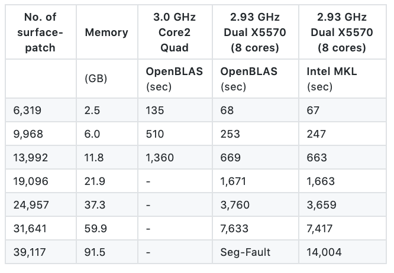
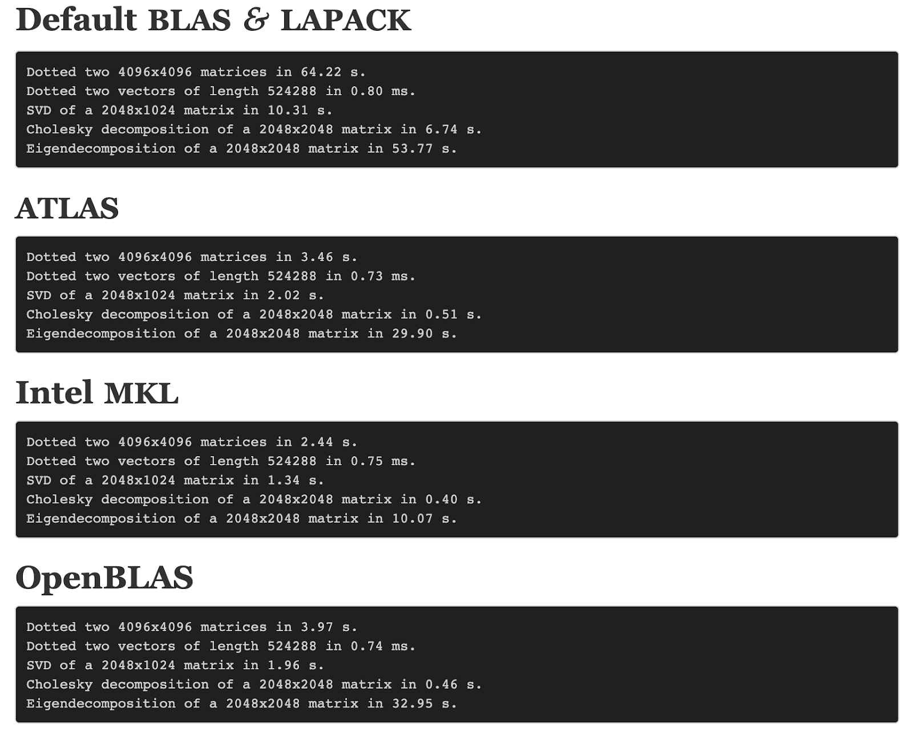
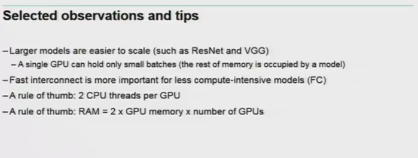

# Benchmarking

This page collects algorithm, hardware, cloud, and multi-task learning benchmarks.

## Algorithms

This section points at scikit-learn_bench and related algorithm comparisons.

1. [scikit bench](https://github.com/IntelPython/scikit-learn_bench) - "scikit-learn_bench benchmarks various implementations of machine learning algorithms across data analytics frameworks. It currently support the scikit-learn, DAAL4PY, cuML, and XGBoost frameworks for commonly used machine learning algorithms."

### Numpy Blas

This subsection is which BLAS NumPy uses and how they compare.

1. [How do i know which version of blas is installed](https://stackoverflow.com/questions/37184618/find-out-if-which-blas-library-is-used-by-numpy)
2. [Benchmark OpenBLAS, Intel MKL vs ATLAS](https://github.com/tmolteno/necpp/issues/18)

<figure><figcaption>
OpenBLAS, Intel MKL vs ATLAS benchmark.

Credit: <a href="https://lh5.googleusercontent.com/podTyc9Z0eDjObB4aW6-2AVWxhlG3pE8M3ccWBUj3oIGDgB6uWmXlt96aiuVAm9vvw33iShedQ1Gn_w6J3qhRGKThnZH-Puy5ZfoYmHL3GFTMxxUh_EIXOCtOTqjQHdqrjCZzh3N">copied from the original hosted image</a>.

</figcaption></figure>

1. Another comparison
2. <figure><figcaption>
Another NumPy BLAS comparison.

Credit: <a href="https://lh5.googleusercontent.com/6tufYNKWkxO5azzf07erA8QIeXhDuWpz8VRaWVw1x16rHahEbj5PRyZ4e6Dr_65ccBGDxj18EKXljVgl1DiO4SAqw_pZqGDlzTs5zsjInsRut8ebtQFgDXkoDnpskD9JbYApijwK">copied from the original hosted image</a>.

</figcaption></figure>

### GLUE

This subsection points at the GLUE / SuperGLUE leaderboard.

1. [Glue / super glue](https://gluebenchmark.com/leaderboard/)

### State of the art in AI

This subsection points at domain × dataset SOTA tracking.

1. In terms of [domain X datasets](https://www.stateoftheart.ai/)

### Cloud providers

This subsection is hardware benchmarks across cloud providers (gensim series).

- [Part 1](https://rare-technologies.com/machine-learning-hardware-benchmarks/), [part 2 y gensim](https://rare-technologies.com/machine-learning-benchmarks-hardware-providers-gpu-part-2/)

### Datasets

This subsection points at EFF AI metrics benchmarks.

- EFF FF Benchmarks in AI

### Hardware

This subsection compares GPUs and CPU vs GPU for deep learning.

- [Nvidia](https://www.phoronix.com/scan.php?page=article&item=nvidia-rtx2080ti-tensorflow&num=1) 1070 vs 1080 vs 2080
- [Cpu vs GPU benchmarking for CNN/Test/LTSM/BDLTSM](http://minimaxir.com/2017/07/cpu-or-gpu/) - google and amazon vs gpu
- [Nvidia GPUs](https://www.pugetsystems.com/labs/hpc/TitanXp-vs-GTX1080Ti-for-Machine-Learning-937/) - titax Xp/1080TI/1070 on googlenet
- March/17 - [Nvidia GPUs for desktop](https://medium.com/@timcamber/deep-learning-pc-build-5cffa71ad97), in terms of price and cuda units, the bottom line is 1060-1080.
- [Another bench up to 2013](http://timdettmers.com/2017/04/09/which-gpu-for-deep-learning/) - regarding many GPUS vs CPUs in terms of BW

### Platforms

This subsection compares deep-learning frameworks on CPU and GPU.

- Cntk vs tensorflow
- [CNTK, TEnsor, torch, etc on cpu and gpu](https://arxiv.org/pdf/1608.07249.pdf)

### Algorithms (classifiers)

This subsection compares classifier accuracy, speed, memory, and 2D visualization.

- [Comparing](https://martin-thoma.com/comparing-classifiers/) accuracy, speed, memory and 2D visualization of classifiers:

[SVM,](http://scikit-learn.org/stable/modules/generated/sklearn.svm.SVC.html) [k-nearest neighbors,](http://scikit-learn.org/stable/modules/generated/sklearn.neighbors.KNeighborsClassifier.html) [Random Forest,](http://scikit-learn.org/stable/modules/generated/sklearn.ensemble.RandomForestClassifier.html) [AdaBoost Classifier,](http://scikit-learn.org/stable/modules/generated/sklearn.ensemble.AdaBoostClassifier.html) [Gradient Boosting,](http://scikit-learn.org/stable/modules/generated/sklearn.ensemble.GradientBoostingClassifier.html) [Naive, Bayes,](http://scikit-learn.org/stable/modules/generated/sklearn.naive_bayes.GaussianNB.html) [LDA,](http://scikit-learn.org/0.16/modules/generated/sklearn.lda.LDA.html) [QDA,](http://scikit-learn.org/0.16/modules/generated/sklearn.qda.QDA.html) [RBMs,](http://scikit-learn.org/stable/modules/generated/sklearn.neural_network.BernoulliRBM.html) [Logistic Regression,](http://scikit-learn.org/stable/modules/generated/sklearn.linear_model.LogisticRegression.html) [RBM](http://scikit-learn.org/stable/modules/generated/sklearn.neural_network.BernoulliRBM.html) + Logistic Regression Classifier

- [LSTM vs cuDNN LSTM](https://chainer.org/general/2017/03/15/Performance-of-LSTM-Using-CuDNN-v5.html) - batch size of power 2 matters, the latter is faster.

### Scaling networks and predicting performance of NN

This subsection is about predicting train time and accuracy when scaling networks across GPUs.

- [A great overview of NN types](https://www.youtube.com/watch?v=lgK0BlXdOCw&feature=youtu.be), but the idea behind the video is to create a system that can predict train time and possibly accuracy when scaling networks using multiple GPUs, there is also a nice slide about general hardware recommendations.

<figure><figcaption>
Hardware recommendations when scaling networks across GPUs.

Credit: <a href="https://lh4.googleusercontent.com/mmxNCa6J3W7s3h1LUkxzEBzKxvSOlCFTzEYgaE1zcOFJV59SCQ4j5jKWMvP9JZGmaGE29VJiALogJlgK8x_V_nUo2fvBPRaXA41K1t9w39WDLM_aKVHh-yithcHZE-A0x9zSvBAy">copied from the original hosted image</a>.

</figcaption></figure>

### NLP

This subsection points at the XTREME multilingual multi-task benchmark.

- [XTREME: A Massively Multilingual Multi-task Benchmark for Evaluating Cross-lingual Generalization](https://github.com/google-research/xtreme/blob/master/README.md)

#### Multi-Task Learning

This part is multi-task learning loss weighting and shared representations.

1. [Multi-Task Learning Using Uncertainty to Weigh Losses for Scene Geometry and Semantics](https://arxiv.org/abs/1705.07115) (Yarin Gal) [GitHub](https://github.com/ranandalon/mtl) - "In this paper we make the observation that the performance of such systems is strongly dependent on the relative weighting between each task’s loss. Tuning these weights by hand is a difficult and expensive process, making multi-task learning prohibitive in practice. We propose a principled approach to multi-task deep learning which weighs multiple loss functions by considering the homoscedastic uncertainty of each task. "
2. [Ruder on Multi Task Learning](https://ruder.io/multi-task/) - "By sharing representations between related tasks, we can enable our model to generalize better on our original task. This approach is called Multi-Task Learning (MTL) and will be the topic of this blog post."

## Deprecated links


These links and images no longer work. The original wording is kept here. A same-resource copy, when one was checked, is used above.


- Another comparison (NumPy BLAS). This address no longer opens: http://markus-beuckelmann.de/blog/boosting-numpy-blas.html
- EFF FF Benchmarks in AI. This address no longer opens: https://www.eff.org/ai/metrics
- Cntk vs tensorflow. This address no longer opens: http://minimaxir.com/2017/06/keras-cntk/
