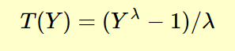
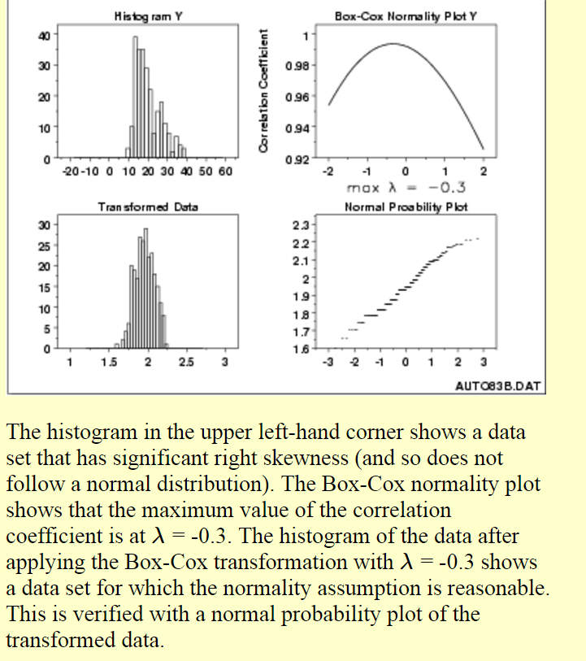
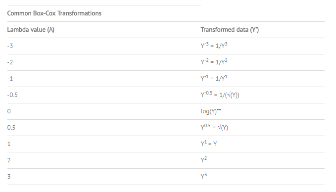
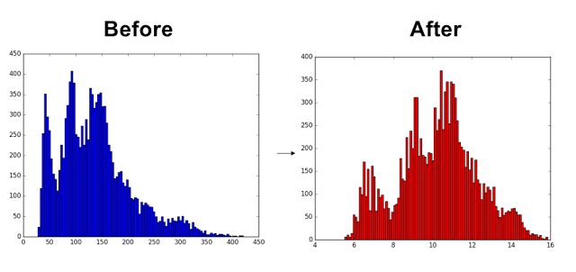

# Distribution Transformation

This page is about transforming skewed data toward normality, especially Box-Cox, plus related nonparametric tests.

[Top 3 methods for handling skewed data](https://medium.com/data-science/top-3-methods-for-handling-skewed-data-1334e0debf45). Log, square root, box cox transformations

## Box Cox

This section is the Box-Cox power transformation: what lambda does, and how to check normality after.

[Power transformations](https://machinelearningmastery.com/power-transforms-with-scikit-learn/)

(What is the Box-Cox Power Transformation?)

- A procedure to identify an appropriate exponent (Lambda = l) to use to transform data into a “normal shape.”
- The Lambda value indicates the power to which all data should be raised.

<figure><figcaption>
Box-Cox power transformation.
</figcaption></figure>

[The Box-Cox transformation is a useful family of transformations.](http://www.itl.nist.gov/div898/handbook/eda/section3/eda336.htm)

- Many statistical tests and intervals are based on the assumption of normality.
- The assumption of normality often leads to tests that are simple, mathematically tractable, and powerful compared to tests that do not make the normality assumption.
- Unfortunately, many real data sets are in fact not approximately normal.
- However, an appropriate transformation of a data set can often yield a data set that does follow approximately a normal distribution.
- This increases the applicability and usefulness of statistical techniques based on the normality assumption.

<figure><figcaption>
An appropriate transformation can yield an approximately normal distribution.
</figcaption></figure>

IMPORTANT:!! After a transformation (c), we need to measure the normality of the resulting transformation (d).

- One measure is to compute the correlation coefficient of a [normal probability plot](http://www.itl.nist.gov/div898/handbook/eda/section3/normprpl.htm) => (d).
- The correlation is computed between the vertical and horizontal axis variables of the probability plot and is a convenient measure of the linearity of the probability plot
- In other words: the more linear the probability plot, the better a normal distribution fits the data!

[*NOTE: another useful link that explains it with figures, but i did not read it.](http://blog.minitab.com/blog/applying-statistics-in-quality-projects/how-could-you-benefit-from-a-box-cox-transformation)

### Guaranteed normality?

This subsection answers whether Box-Cox guarantees a normal result.

- NO!
- This is because it actually does not really check for normality;
- The method checks for the smallest standard deviation.
- The assumption is that among all transformations with Lambda values between -5 and +5, transformed data has the highest likelihood – but not a guarantee – to be normally distributed when standard deviation is the smallest.
- It is absolutely necessary to always check the transformed data for normality using a probability plot. (d)

+ Additionally, the Box-Cox Power transformation only works if all the data is positive and greater than 0.

+ Achieved easily by adding a constant ‘c’ to all data such that it all becomes positive before it is transformed. The transformation equation is then:

[COMMON TRANS: FORMULAS (based on the actual formula)](http://www.statisticshowto.com/box-cox-transformation/)

<figure><figcaption>
Common transformation formulas.
</figcaption></figure>

Finally: An awesome tutorial (dead), here is a new one in python with [code examples](https://github.com/kentmacdonald2/Box-Cox-Transformation-Python-Example), there is also another code example [here](https://stackoverflow.com/questions/33944129/python-library-for-data-scaling-centering-and-box-cox-transformation)

> “Simply pass a 1-D array into the function and it will return the Box-Cox transformed array and the optimal value for lambda. You can also specify a number, alpha, which calculates the confidence interval for that value. (For example, alpha = 0.05 gives the 95% confidence interval).”

<figure><figcaption>
Box-Cox transformed array and lambda.
</figcaption></figure>

* Maybe there is a slight problem in the python vs R code, details here, but needs investigating.

## Mann-Whitney U test

This section defines the Mann–Whitney U test as a nonparametric comparison of two samples.

([what is?](https://en.wikipedia.org/wiki/Mann%E2%80%93Whitney_U_test)) - the Mann–Whitney U test is a [nonparametric](https://en.wikipedia.org/wiki/Nonparametric_statistics) [test](https://en.wikipedia.org/wiki/Statistical_hypothesis_test) of the [null hypothesis](https://en.wikipedia.org/wiki/Null_hypothesis) that it is equally likely that a randomly selected value from one sample will be less than or greater than a randomly selected value from a second sample.

In other words: This test can be used to determine whether two independent samples were selected from populations having the same distribution.

Unlike the [t-test](https://en.wikipedia.org/wiki/T-test) it does not require the assumption of [normal distributions](https://en.wikipedia.org/wiki/Normal_distribution). It is nearly as efficient as the t-test on normal distributions.

## Null hypothesis

This section points at chi-square, t-tests, and ANOVA notes tied to the null hypothesis.

1. [What is chi-square and what is a null hypothesis, and how do we calculate observed vs expected and check if we can reject the null and get significant difference.](https://medium.com/greyatom/goodness-of-fit-using-chi-square-be5bba375caf)
2. Analytics vidhya
   1. [What is hypothesis testing](https://www.analyticsvidhya.com/blog/2015/09/hypothesis-testing-explained/)
   2. [Intro to t-tests analytics vidhya](https://www.analyticsvidhya.com/blog/2019/05/statistics-t-test-introduction-r-implementation/?utm_source=facebook.com&utm_medium=social) - always good
   3. [Anova analysis of variance](https://www.analyticsvidhya.com/blog/2018/01/anova-analysis-of-variance/?utm_source=facebook.com&utm_medium=social), one way, two way, manova
      1. If the means of two or more groups are significantly different from each other. ANOVA checks the impact of one or more factors by comparing the means of different samples.
      2. A one-way ANOVA tells us that at least two groups are different from each other. But it won’t tell us which groups are different.
      3. For such cases, when the outcome or dependent variable (in our case the test scores) is affected by two independent variables/factors we use a slightly modified technique called two-way ANOVA.
3. Multivariate case and the technique we will use to solve it is known as MANOVA.

## Deprecated links


These links and images no longer work. The original wording is kept here. A same-resource copy, when one was checked, is used above.


- tutorial (dead). This address no longer opens: http://www.kmdatascience.com/2017/07/box-cox-transformations-in-python.html
- here is a new one. This address no longer opens: https://towardsdatascience.com/box-cox-transformation-explained-51d745e34203
- details here. This address no longer opens: http://shahramabyari.com/2015/12/21/data-preparation-for-predictive-modeling-resolving-skewness/
