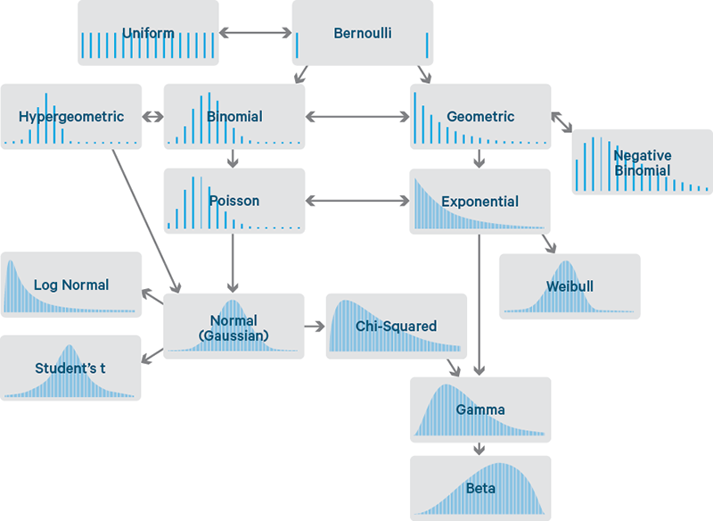
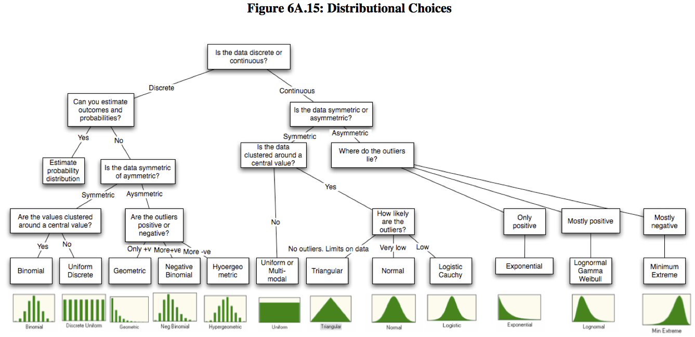

# Distribution

This page is about probability distributions: types, the normal, and ways to compare them.

## Types

This section is what a distribution is, with crib figures and links to overviews.

(What are?) probabilities in a distribution always add up to 1.

- [More distribution explanations](https://machinelearningmastery.com/statistical-data-distributions/)
- A very good explanation (Cloudera crib sheet)

<figure><figcaption>
Common probability distributions crib sheet.
</figcaption></figure>

- [A very wordy explanation](http://people.stern.nyu.edu/adamodar/New_Home_Page/StatFile/statdistns.htm) (figure2)

<figure><figcaption>
Figure 2 from the wordy distribution explanation.
</figcaption></figure>

1. Poisson and Poisson process

### Comparing distributions

This list is links on how to compare two distributions.

1. [Kolmogorov Smirnov not good for categoricals.](https://en.wikipedia.org/wiki/Kolmogorov%E2%80%93Smirnov_test)
2. [Comparing two](https://math.stackexchange.com/questions/159940/comparing-distribution-of-two-data-sets)
3. [Khan academy](https://www.khanacademy.org/math/ap-statistics/quantitative-data-ap/describing-comparing-distributions/v/comparing-distributions)
4. [Visually](https://www.stat.auckland.ac.nz/~ihaka/787/lectures-distrib.pdf)
5. [When they are not normal](https://www.quora.com/Which-statistical-test-to-use-to-quantify-the-similarity-between-two-distributions-when-they-are-not-normal)
6. [Using train / test trick](https://medium.com/data-science/how-dis-similar-are-my-train-and-test-data-56af3923de9b)
7. [Code for Identifying distribution type and params, based on best fit.](https://stackoverflow.com/questions/37487830/how-to-find-probability-distribution-and-parameters-for-real-data-python-3)

## Gaussian / Normal Distribution

This section is why the normal is popular, and what that buys you in tests.

“ if you collect data and it is not normal, “you need to collect more data”

[Beautiful graphs](https://stats.stackexchange.com/questions/116550/why-do-we-have-to-assume-normality-for-a-one-sample-t-test)

[The normal distribution is popular for two reasons:](https://www.quora.com/Why-do-we-use-the-normal-distribution-The-normal-is-an-approximation-Why-dont-we-use-a-simpler-distribution-with-simpler-numbers-to-memorize-If-it-is-an-approximation-does-it-have-to-be-so-specific)

1. It is the most common distribution in nature (as distributions go)
2. An enormous number of statistical relationships become clear and tractable if one assumes the normal.

Sure, nothing in real life exactly matches the Normal. But it is uncanny how many things come close.

This is partly due to the Central Limit Theorem, which says that if you average enough unrelated things, you eventually get the Normal.

- The Normal distribution in statistics is a special world in which the math is straightforward and all the parts fit together in a way that is easy to understand and interpret.
- It may not exactly match the real world, but it is close enough that this one simplifying assumption allows you to predict lots of things, and the predictions are often pretty reasonable.
- Statistically convenient.
- Represented by basic statistics
  - Average
  - Variance (or standard deviation) - the average of what's left when you take away the average, but to the power of 2.

In a statistical test, you need the data to be normal to guarantee that your p-values are accurate with your given sample size.

If the data are not normal, your sample size may or may not be adequate, and it may be difficult for you to know which is true.

## Comparing distributions (distance methods)

This section is distance-based comparison: histograms, earth mover’s distance, and related papers.

1. Categorical data can be transformed to a histogram i.e., #class / total and then measured for distance between two histograms’, e.g., train and production. Using earth mover distance [python](https://jeremykun.com/2018/03/05/earthmover-distance/) [git wrapper to c](https://github.com/pdinges/python-emd), linear programming, so its slow.
2. [Earth movers](https://medium.com/data-science/earth-movers-distance-68fff0363ef2).
3. [EMD paper](http://infolab.stanford.edu/pub/cstr/reports/cs/tr/99/1620/CS-TR-99-1620.ch4.pdf)
4. Also check KL DIVERGENCE in the information theory section.
5. [Bengio](https://arxiv.org/abs/1901.10912) et al, transfer objective for learning to disentangle casual mechanisms - We propose to meta-learn causal structures based on how fast a learner adapts to new distributions arising from sparse distributional changes

## Deprecated links


These links and images no longer work. The original wording is kept here. A same-resource copy, when one was checked, is used above.


- “ if you collect data and it is not normal, “you need to collect more data”. This address no longer opens: https://www.isixsigma.com/topic/normal-distributions-why-does-it-matter/
- Using train / test trick. This address no longer opens: https://towardsdatascience.com/how-dis-similar-are-my-train-and-test-data-56af3923de9b
- Earth movers. This address no longer opens: https://towardsdatascience.com/earth-movers-distance-68fff0363ef2
- Poisson and Poisson process. This address no longer opens: https://towardsdatascience.com/the-poisson-distribution-and-poisson-process-explained-4e2cb17d459
- A very good explanation. This address no longer opens: https://blog.cloudera.com/blog/2015/12/common-probability-distributions-the-data-scientists-crib-sheet/
