# Information Theory

This page is about entropy, information gain, cross-entropy, KL divergence, softmax, and related tools.

## Entropy / Information Gain

This section points at Shannon entropy implementations and definitions.

1. Shannon entropy in python, basically entropy(value counts)
2. [Mastery on plogp entropy function](https://machinelearningmastery.com/what-is-information-entropy/)
3. [Entropy functions](https://gist.github.com/jaradc/eeddf20932c0347928d0da5a09298147)

## Tools

This section lists Python libraries for information-theoretic measures.

1. [EntroPy](https://raphaelvallat.com/entropy/build/html/index.html) / [AntroPy](https://raphaelvallat.com/antropy/) [[Git](https://github.com/raphaelvallat/antropy)]
2. [PyInform](https://github.com/ELIFE-ASU/PyInform) [[Docs](https://elife-asu.github.io/PyInform/index.html)]- PyInform is a python library of information-theoretic measures for time series data. PyInform is backed by the [Inform](https://github.com/elife-asu/inform) C library.
3. [PyEntropy](https://github.com/nikdon/pyEntropy)

## Tutorials

This section walks entropy, cross-entropy, information gain, and Gini for decision trees.

[Great tutorial on all of these topics](https://www.bogotobogo.com/python/scikit-learn/scikt_machine_learning_Decision_Tree_Learning_Informatioin_Gain_IG_Impurity_Entropy_Gini_Classification_Error.php)

[Entropy](https://www.techleer.com/articles/496-a-short-introduction-to-entropy-cross-entropy-and-kl-divergence-aurelien-geron/) - lack of order or lack of predictability ([excellent slide lecture by Aurelien Geron](https://www.youtube.com/watch?time_continue=3&v=ErfnhcEV1O8))

<figure>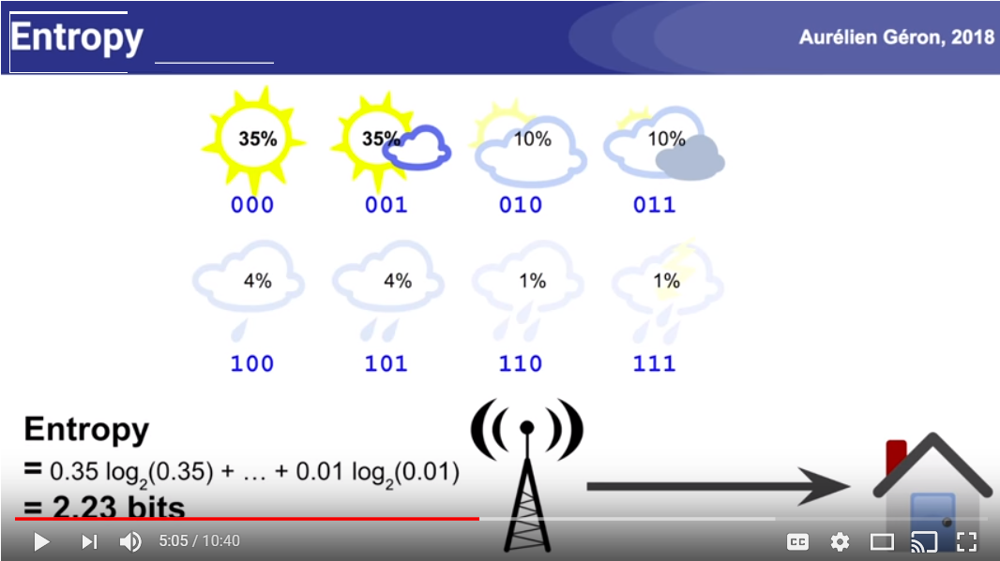<figcaption><p>Entropy, cross-entropy, and KL divergence (Aurelien Geron).</p><p>Credit: <a href="https://lh6.googleusercontent.com/_MSZGPguSXitn80COZLJ3rOIScBmTXNR6LIOLt3UiyfwNYeTQHUOAVzK1bpaSeoHRPImGnJiHFqsS8Tl3ETkGs32KNgDWwVpJ3nTfxJ7gfzambo0AwY8VBvAKwDKK-7GWoOLdONT">copied from the original hosted image</a>.</p></figcaption></figure>

<figure>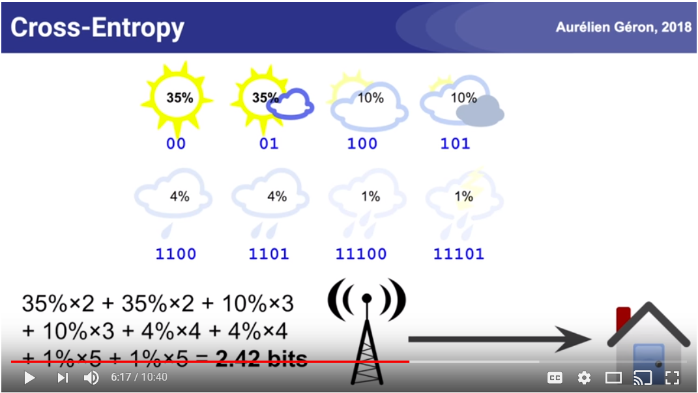<figcaption><p>Entropy, cross-entropy, and KL divergence continued.</p><p>Credit: <a href="https://lh3.googleusercontent.com/2c0wvDS4SFXYjHPKiPCtwyW488sV1aMN8MGdUavZ64n1bVlxvJPPqG5oaodPIRgHk-sMNO46s57c8yoqtiMu_kLG6LPbe4SrK--bt9ro6Kc7WQpiaMukMV04wsOFXfa6wliDhff8">copied from the original hosted image</a>.</p></figcaption></figure>


Cross entropy will be equal to entropy if the probability distributions of p (true) and q(predicted) are the same. However, if cross entropy is bigger (known as relative_entropy or kullback leibler divergence)

<figure>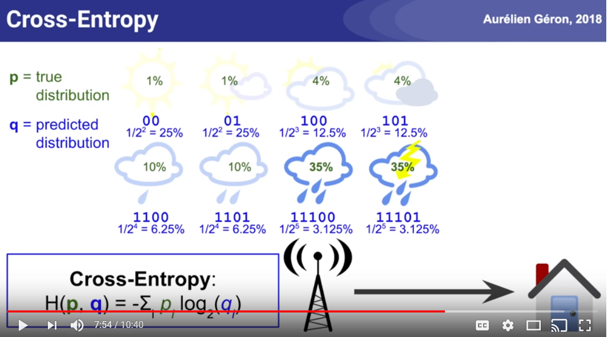<figcaption><p>Relative entropy / Kullback–Leibler divergence when p and q differ.</p><p>Credit: <a href="https://lh5.googleusercontent.com/JwW1SuPBqCiI0G-NG2V24DysK-j_ND-xSXHVimiNfq4cCzrTR47qcyHJLcngywO6_tVLd9wLVAHucSMBbm3Cluxkybv1Jj6icXyEvt4o3tmfnx2jZe1H9Z7Hvp-4Mqfr0ifvQAtK">copied from the original hosted image</a>.</p></figcaption></figure>

<figure>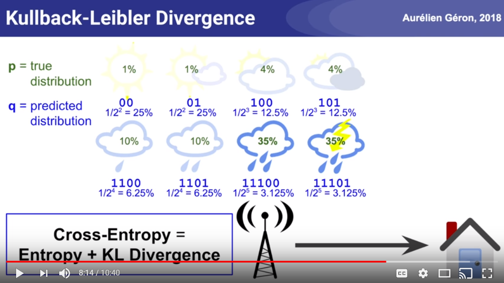<figcaption><p>Cross-entropy versus entropy illustration.</p><p>Credit: <a href="https://lh4.googleusercontent.com/OGcrihHtrOv1-dODvqwJjsOXbP9fB_t8EIYmj11l8qJL61_I2gg1h9wW0kiEiRDaDoBT6QXxqk5oZncfXK5_un44bYXWa9iTjjsuw8R2t5l5YyrNnQ6fADE1txRRRKvOc7n8KtOQ">copied from the original hosted image</a>.</p></figcaption></figure>


In this example we want the cross entropy loss to be zero, i.e., when we have a one hot vector and a predicted vector which are identical, i.e., 100% in the same class for predicted and true, we get 0. In all other cases we get some number that gets larger if the predicted class probability is lower than zero as seen here:

<figure>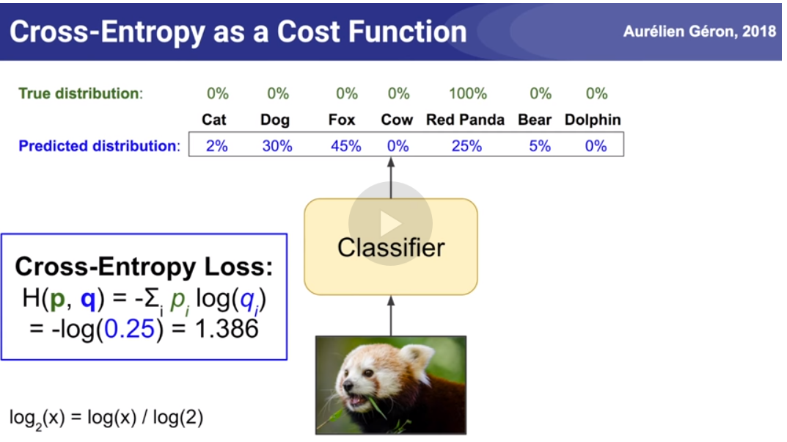<figcaption><p>Cross-entropy loss with one-hot true and predicted class probabilities.</p><p>Credit: <a href="https://lh4.googleusercontent.com/BJTEdxhb4RSPIib7CEIm0-ti8vcZtbEL0metallPrMltfR4WC2ADmx6oUaPp67akBGXiyF-7mHL_tQRSucIsVLy-8LXCmEwz5euV4c0lqJhqzgg6XR09Zpv9PBJ7wT4QAmMMrBcd">copied from the original hosted image</a>.</p></figcaption></figure>


Formula for 2 classes:

<figure>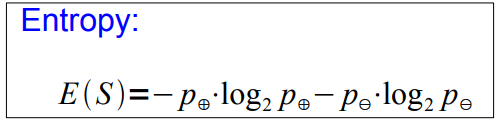<figcaption><p>Cross-entropy formula for 2 classes.</p><p>Credit: <a href="https://lh4.googleusercontent.com/8OIzaeni1DtdFjaoyA3K0hAM_cnkgLiwiDFI3FC1iUNIx6sQfq0yum1TR4dV93282q-lBUgf6jWVfHWovjtlvQ9CjKFa2vRN_xyZGuUnasnuniv2FNx6uDmJwpaEAjs-BGOjYO8b">copied from the original hosted image</a>.</p></figcaption></figure>


NOTE: Entropy can be generalized as a formula for N > 2 classes:

<figure>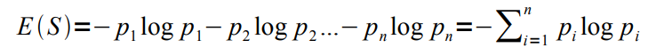<figcaption><p>Entropy generalized as a formula for N > 2 classes.</p><p>Credit: <a href="https://lh6.googleusercontent.com/N-CK4gLV67dfxLjDbty1SnsWsNlBm2GLM2TXL8HXef2EzsFZxvY4urwUnFiSE2A4SSBRQrFKuluQzb7cm0mTKUIUuwxbqj1NbC-4igh3pGIMrBjSFN7lppKJAktDvLNNJGflwo_A">copied from the original hosted image</a>.</p></figcaption></figure>


(We want to grow a simple tree) awesome pdf tutorial→ a good attribute prefers attributes that split the data so that each successor node is as pure as possible

- i.e., the distribution of examples in each node is so that it mostly contains examples of a single class
- In other words: We want a measure that prefers attributes that have a high degree of „order“:
- Maximum order: All examples are of the same class
- Minimum order: All classes are equally likely → Entropy is a measure for (un-)orderedness Another interpretation:
- Entropy is the amount of information that is contained
- all examples of the same class → no information

<figure>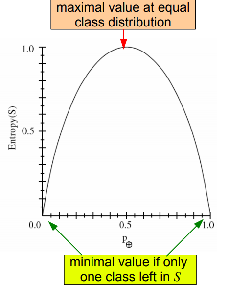<figcaption><p>Entropy as unorderedness in the class distribution of S.</p><p>Credit: <a href="https://lh3.googleusercontent.com/s4tfIeHpR4H9GimwTPjFVoV0nCKwEUQYRFpz93x-d5jZCxDFIub8jiK7PFbkSNU1X__OXHK7XLSH_BO0xUQIjS6HEnHfUEiuY0KWJpb1ZX0NowqyKG4A2guA3wN_b52UKeVluv9f">copied from the original hosted image</a>.</p></figcaption></figure>


Entropy is the amount of unorderedness in the class distribution of S

IMAGE above:

- Maximal value when the equal class distribution
- Minimal value when only one class is in S

So basically if we have the outlook attribute and it has 3 categories, we calculate the entropy for E(feature=category) for all 3.

<figure>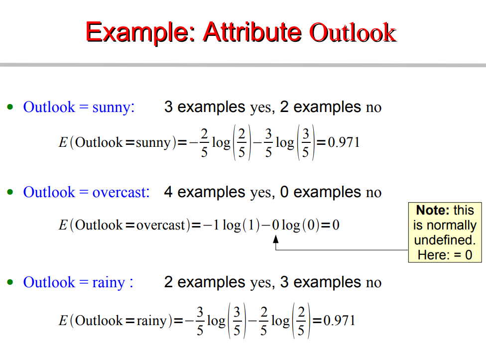<figcaption><p>Entropy for each category of an attribute such as Outlook.</p><p>Credit: <a href="https://lh5.googleusercontent.com/aTcovXALgA4bT15GabT1Z3ce7GpKoMkAUVAly_v7Jn2EgcKmSr2eq18ANSU1TxHJt2-_Lfk-fSoiF9DimirF57D0-bNQrAtfBp3hT3205e-C4XQEn87w2lu8m8LZl3f7RYlCtnIn">copied from the original hosted image</a>.</p></figcaption></figure>


INFORMATION: The I(S,A) formula below.

What we actually want is the average entropy of the entire split, that corresponds to an entire attribute, i.e., OUTLOOK (sunny & overcast & rainy)

<figure>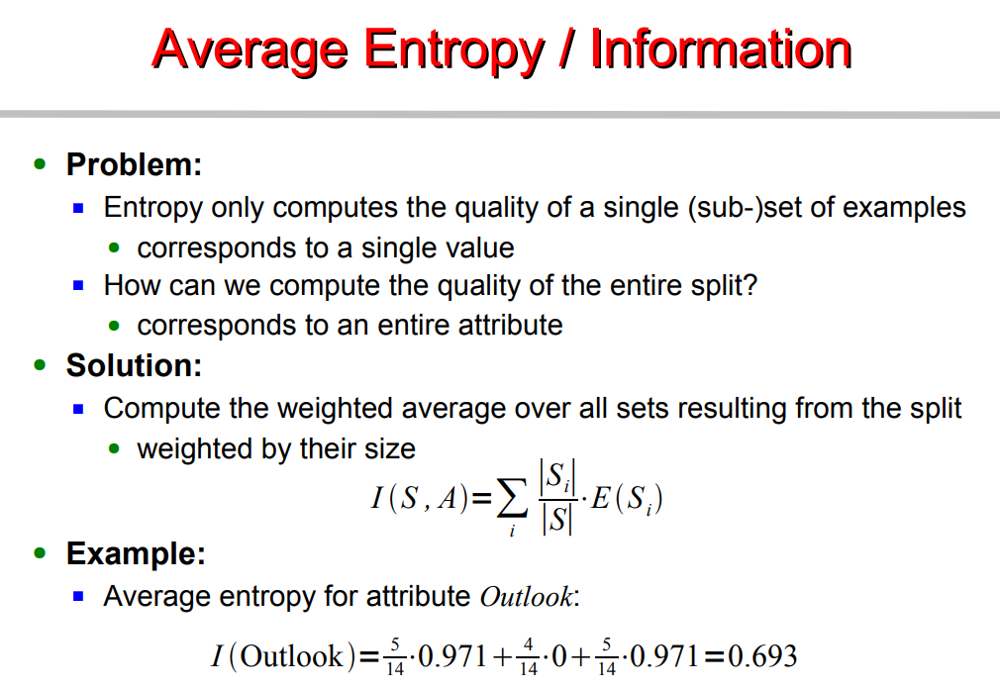<figcaption><p>The I(S,A) average entropy of an entire attribute split.</p><p>Credit: <a href="https://lh6.googleusercontent.com/DikgymC_A5YqhfvObk9JcAMdHrnVIhNksx20IMI7yMZKxI-vLQeU2lAQOxY8tu78cEq_DgpkeMW63UBaL-2fkjpF-J5HHSo5BirtthZou8KUFqHwF6vHFOj7426FMgcRjZk_-Ran">copied from the original hosted image</a>.</p></figcaption></figure>


Information Gain: is actually what we gain by subtracting information from the entropy.

In other words we find the attributes that maximizes that difference, in other other words, the attribute that reduces the unorderness / lack of order / lack of predictability.

The BIGGER GAIN is selected.

<figure>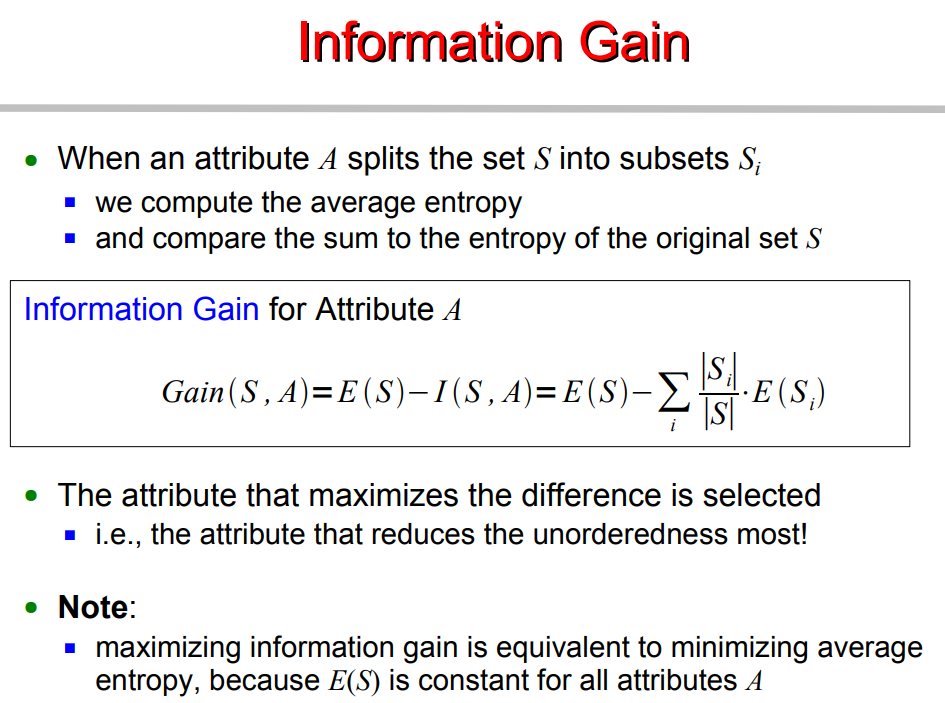<figcaption><p>Information Gain as entropy minus information.</p><p>Credit: <a href="https://lh6.googleusercontent.com/7Jalf8E7EozkxR_lUjJ9RFlpoh8BcOy0Vojxjjxa8Us5pOOF6uRpXK6_ddm2PkG5azDfDcDfgZLDrpaFNUye343EJ8xpro8AS9uoPxK6hGyHsCIkEzwAnEe74xtRzZUz9ph9v_Mz">copied from the original hosted image</a>.</p></figcaption></figure>


There are some properties to Entropy that influence INFO GAIN (?):

<figure>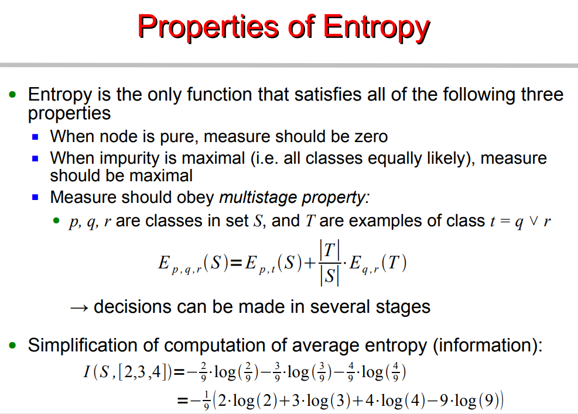<figcaption><p>Properties of Entropy that influence Information Gain.</p><p>Credit: <a href="https://lh4.googleusercontent.com/36h-4HJT2n9WqgzSVKAqlDF55qzxHEGhUJCMR80bXjQ-pfShcmxDZhegYKVugG-uQwmIal_jUWyhU0GWdqtfNIg9su1pY0HIXCt517e8-HpJRllCoInM_TeI3cctpNUKxI6yY455">copied from the original hosted image</a>.</p></figcaption></figure>


There are some disadvantages with INFO GAIN, done use it when an attribute has many number values, such as “day” (date wise) 05/07, 06/07, 07/07..31/07 etc.

Information gain is biased towards choosing attributes with a large number of values and causes:

- Overfitting
- fragmentation

<figure>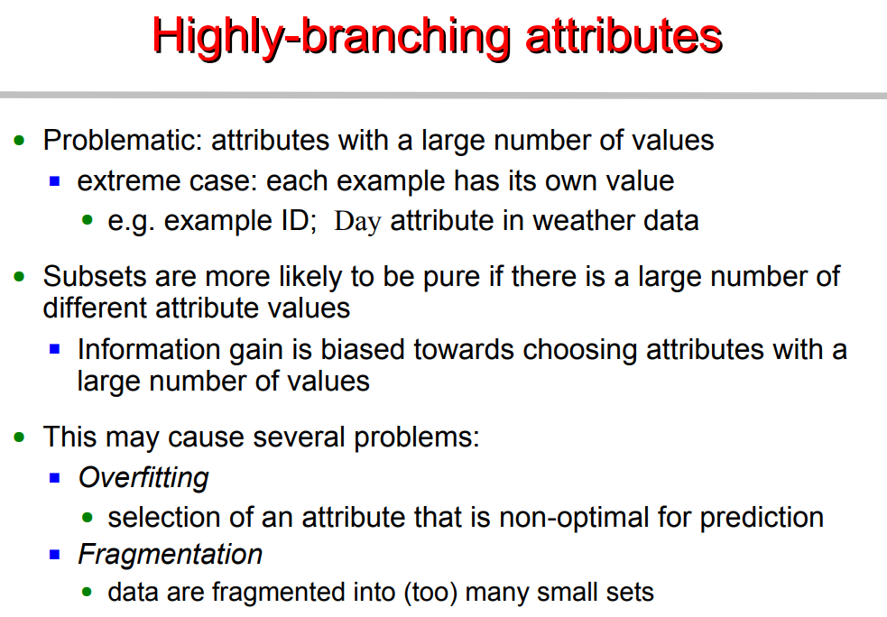<figcaption><p>Information Gain bias toward attributes with many values.</p><p>Credit: <a href="https://lh5.googleusercontent.com/vGjXAG-G2hmkJkt4xhcxycm5BG6LM-sRPOWnXOrXuCFpSGOQSBcL2mZUoVRhsqRTrr83wXKRDp5rF2hqYn1DGnJdIGvWezoSxy9zOmy2e5Yqc_OIJ6sXXA1YAbZksmY4-f0JWaDp">copied from the original hosted image</a>.</p></figcaption></figure>


We measure Intrinsic information of an attribute, i.e., Attributes with higher intrinsic information are less useful.

We define Gain Ratio as info-gain with less bias toward multi value attributes, ie., “days”

NOTE: Day attribute would still win with the Gain Ratio, Nevertheless: Gain ratio is more reliable than Information Gain

<figure>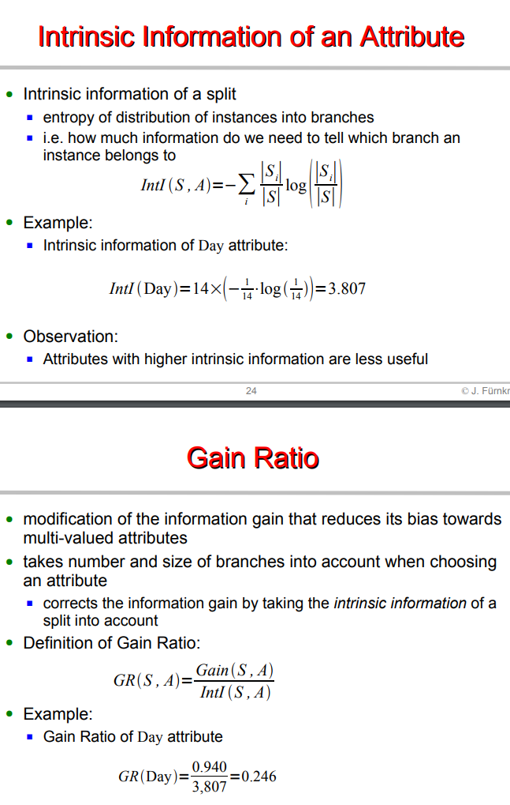<figcaption><p>Gain Ratio as information gain with less multi-value bias.</p><p>Credit: <a href="https://lh3.googleusercontent.com/iGhWawPGmntKD_u8zSa0IPkDggMDrKh6NupAR_acmknUxDWiFfJIfOuZTtXYuMAJq6wX7-lCLBAxVXkqQFbVAElFpoXd1WZfGlZgpch0aeBU87EQxQMf8g3RrFOGL8fuYtrrxBX0">copied from the original hosted image</a>.</p></figcaption></figure>


Therefore, we define the alternative, which is the GINI INDEX. It measures impurity, we define the average Gini, and the Gini Gain.

<figure>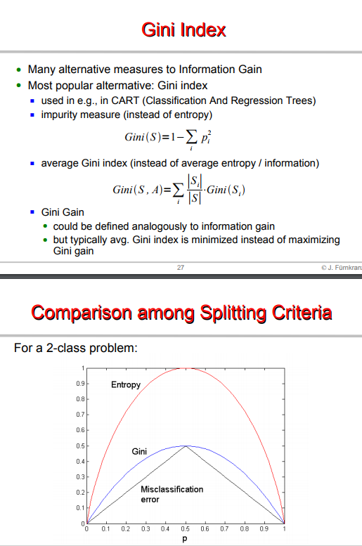<figcaption><p>Gini index, average Gini, and Gini Gain.</p><p>Credit: <a href="https://lh4.googleusercontent.com/RbRnfwnEtsIcgYsZah90PVP-DoX0E2qEqBImKmyQGxEMMegWenzsMa2rNa18_F_jXTsscGVFK5X_FX9Vs6pWizuiXOgzSvCxy57a5_ny_48XzB09CWARY7wvbl6O3tYoho_ykza8">copied from the original hosted image</a>.</p></figcaption></figure>


FINALLY, further reading about decision trees and examples of INFOGAIN and GINI here.

[Variational bounds on mutual information](https://arxiv.org/abs/1905.06922v1)

## Cross entropy, relative ent, KL-D, JS-D, soft max

This section collects explanations of cross-entropy, KL, JS divergence, and related losses.

1. [A really good explanation on all of them](https://www.countbayesie.com/blog/2017/5/9/kullback-leibler-divergence-explained)
2. [Another good one on all of them](https://gombru.github.io/2018/05/23/cross_entropy_loss/)
3. [mastery on a gentle intro to CE](https://machinelearningmastery.com/cross-entropy-for-machine-learning/)
4. [Mastery on entropy](https://machinelearningmastery.com/divergence-between-probability-distributions/), kullback leibler divergence (asymmetry), jensen-shannon divergence (symmetry) (has code)
5. [Entropy, mutual information and KL Divergence by AurelienGeron](https://www.techleer.com/articles/496-a-short-introduction-to-entropy-cross-entropy-and-kl-divergence-aurelien-geron/)
6. Gensim on divergence metrics such as KL jaccard etc, pros and cons, lda is a mess on small data.
7. [Advise on KLD](https://datascience.stackexchange.com/questions/9262/calculating-kl-divergence-in-python)ivergence
8. Neural machine translation using pytorch and CE

## Softmax

This section explains softmax, NLL, and how they relate to cross-entropy.

1. [Understanding softmax](https://medium.com/data-science-bootcamp/understand-the-softmax-function-in-minutes-f3a59641e86d)
2. [Softmax and negative likelihood (NLL)](https://ljvmiranda921.github.io/notebook/2017/08/13/softmax-and-the-negative-log-likelihood/)
3. [Softmax vs cross entropy](https://www.quora.com/Is-the-softmax-loss-the-same-as-the-cross-entropy-loss) - Softmax loss and cross-entropy loss terms are used interchangeably in industry. Technically, there is no term as such Softmax loss. people use the term "softmax loss" when referring to "cross-entropy loss". The softmax classifier is a linear classifier that uses the cross-entropy loss function. In other words, the gradient of the above function tells a softmax classifier how exactly to update its weights using some optimization like [gradient descent](https://en.wikipedia.org/wiki/Gradient_descent).

The softmax() part simply normalises your network predictions so that they can be interpreted as probabilities. Once your network is predicting a probability distribution over labels for each input, the log loss is equivalent to the cross entropy between the true label distribution and the network predictions. As the name suggests, softmax function is a “soft” version of max function. Instead of selecting one maximum value, it breaks the whole (1) with maximal element getting the largest portion of the distribution, but other smaller elements getting some of it as well.

This property of softmax function that it outputs a probability distribution makes it suitable for probabilistic interpretation in classification tasks.

Cross entropy indicates the distance between what the model believes the output distribution should be, and what the original distribution is. Cross entropy measure is a widely used alternative of squared error. It is used when node activations can be understood as representing the probability that each hypothesis might be true, i.e. when the output is a probability distribution. Thus it is used as a loss function in neural networks which have softmax activations in the output layer.

## Time series entropy

This section is entropy measures for one-dimensional time series, including EntroPy examples.

1. [entroPY](https://raphaelvallat.com/entropy/build/html/index.html) - EntroPy is a Python 3 package providing several time-efficient algorithms for computing the complexity of one-dimensional time-series. It can be used for example to extract features from EEG signals.

[Approximate entropy paper](https://journals.physiology.org/doi/pdf/10.1152/ajpheart.2000.278.6.H2039)

```python
print(perm_entropy(x, order=3, normalize=True))                 # Permutation entropy
print(spectral_entropy(x, 100, method='welch', normalize=True)) # Spectral entropy
print(svd_entropy(x, order=3, delay=1, normalize=True))         # Singular value decomposition entropy
print(app_entropy(x, order=2, metric='chebyshev'))              # Approximate entropy
print(sample_entropy(x, order=2, metric='chebyshev'))           # Sample entropy
print(lziv_complexity('01111000011001', normalize=True))        # Lempel-Ziv complexity
```

1. [PyInform](https://elife-asu.github.io/PyInform/index.html)

<figure>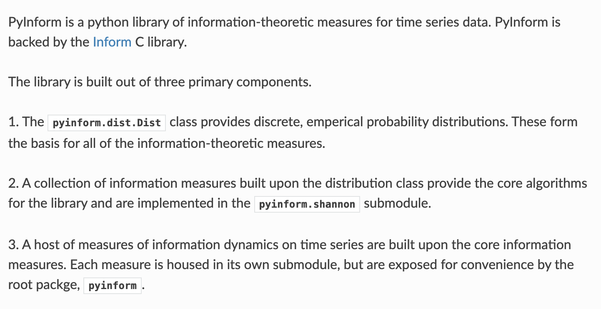<figcaption><p>PyInform information-theoretic measures.</p><p>Credit: <a href="https://lh3.googleusercontent.com/2XcbUSTQe6BCTd2Hgmj-VU_ErIDRzSbfUucWtiqXRSaPdoYVKtcEs4AwvIjKYoFteF_Ndl5yhdvy24vFX-4x24Bap21_hAyYwDeX0Xh0u5PHUqj9Jc2KacINx6HtckWwNAHEcsMM">copied from the original hosted image</a>.</p></figcaption></figure>

<figure>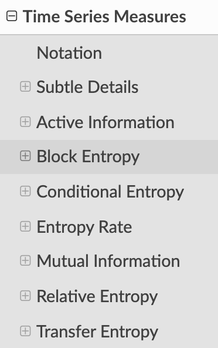<figcaption><p>PyInform measures continued.</p><p>Credit: <a href="https://lh4.googleusercontent.com/_bAbXFL9VqcqZHmyR8z_MJvV_u6PD_7_AOollUOFLHACmDegc-NeseoJcoBbZw6rBXZJx0NLDqYFwGk6wSs1WBfZ3QWuRN5J_Mq9hL-aSD-UuQi-depGzdPFNqOE07QHGAZ4SAdy">copied from the original hosted image</a>.</p></figcaption></figure>


## Complement Objective Training

This section explains COT as a second training step beside cross-entropy.

1. Article by [LightTag](https://www.lighttag.io/blog/complement-objective-training-with-pytorch-lightning/), [paper](https://arxiv.org/pdf/1903.01182.pdf) -

COT is a technique to effectively provide explicit negative feedback to our model. The technique gives us non-zero gradients with respect to incorrect classes, which are used to update the model's parameters.

COT doesn't replace cross-entropy. It's used as a second training step as follows: We run cross-entropy, and then we do a COT step. We minimize the cross-entropy between our target distribution. That's equivalent to maximizing the likelihood of the correct class. During the COT step, we maximize the entropy of the complement distribution. We pretend that the correct class isn't an option and make the remaining classes equally likely.

But, since the true class is an option, and we're training for it explicitly, maximizing the true classes probability and pushing the remaining classes to be equally likely is actually pushing their probabilities to 0 explicitly, which provides explicit gradients to propagate through our model.

## Deprecated links


These links and images no longer work. The original wording is kept here. A same-resource copy, when one was checked, is used above.


- Entropy. This address no longer opens: https://www.techleer.com/articles/496-a-short-introduction-to-entropy-cross-entropy-and-kl-divergence-aurelien-geron/
- awesome pdf tutorial. This address no longer opens: http://www.ke.tu-darmstadt.de/lehre/archiv/ws0809/mldm/dt.pdf
- FINALLY, further reading about decision trees and examples of INFOGAIN and GINI here.. This address no longer opens: http://www.ke.tu-darmstadt.de/lehre/archiv/ws0809/mldm/dt.pdf
