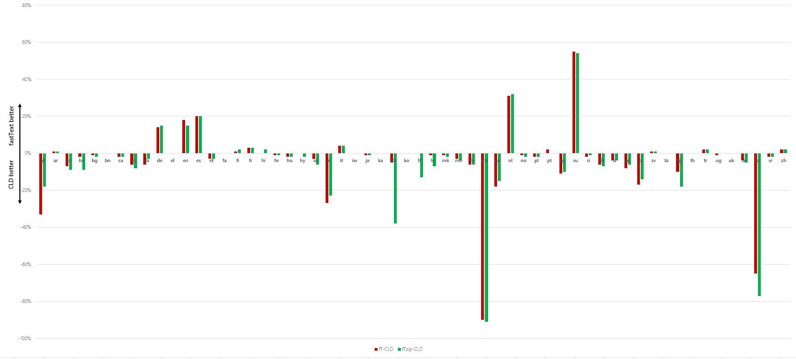
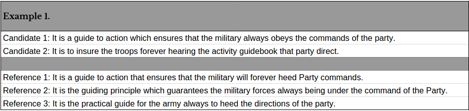

# Language Detection Identification Generation (NLD, NLI, NLG)

This page covers language models, generation, language ID, translation, BLEU, and transliteration.
The sections below cover language ID tools, neural LMs, generation, and translation metrics such as BLEU.

## LANGUAGE DETECTION / IDENTIFICATION

This section compares CLD, fastText, and cloud language-ID APIs.

The same notes are in [Language detection](foundation-nlp.md#language-detection).

- [A qualitative comparison of google, azure, amazon, ibm LD LI](https://medium.com/activewizards-machine-learning-company/comparison-of-the-most-useful-text-processing-apis-e4b4c1e6626a)
- cld2/docs at master · CLD2Owners/cld2. [CLD2](https://github.com/CLD2Owners/cld2/tree/master/docs)
- Contribute to google/cld3 development by creating an account on GitHub. [CLD3](https://github.com/google/cld3)
- Contribute to aboSamoor/pycld2 development by creating an account on GitHub. [PYCLD](https://github.com/aboSamoor/pycld2)
- Language Detection — polyglot 16.07.04 documentation. 2 [POLYGLOT wraps CLD](https://polyglot.readthedocs.io/en/latest/Detection.html)
- Data related to language detection evaluation. [alex ott cld stats](https://gist.github.com/alexott/dd43fa8d1db4b8202d55c6325b2c69c2)
- To get a sense of the accuracy and performance of Google's Compact Language Detector , I ran some tests against two other packages: ... [cld comparison vs tika langid](http://blog.mikemccandless.com/2011/10/accuracy-and-performance-of-googles.html)
- ## Fast and accurate language identification using fastText. [Fast text LI](https://fasttext.cc/blog/2017/10/02/blog-post.html)
- Rafael Oliveira. Rafael Oliveira. [facebook post](https://www.facebook.com/groups/1174547215919768/permalink/1702123316495486/?comment_id=1704414996266318&reply_comment_id=1705159672858517&notif_id=1507280476710677&notif_t=group_comment)
4. OPENNLP
- Shows how to detect language using the Advanced and Basic APIs. [Google detect language](https://cloud.google.com/translate/docs/detecting-language)
- Shows how to detect language using the Advanced and Basic APIs. github code [v3beta](https://cloud.google.com/translate/docs/detecting-language-v3)
- An overview of language detection in Azure Language, which helps you detect the language that text is written in by returning language codes. [Microsoft azure LD,](https://docs.microsoft.com/en-us/azure/cognitive-services/text-analytics/how-tos/text-analytics-how-to-language-detection)
- IBM® is announcing the deprecation of the Watson® Language Translator service for IBM Cloud® in all regions. [Ibm watson](https://cloud.ibm.com/apidocs/language-translator)
- The page you requested cannot be displayed (HTTP response code 403). [2](https://www.ibm.com/support/knowledgecenter/SS8NLW_11.0.1/com.ibm.swg.im.infosphere.dataexpl.engine.doc/c_vse_language_detection.html)
- You can use Amazon Comprehend to examine text to determine the dominant language. [Amazon,](https://docs.aws.amazon.com/comprehend/latest/dg/how-languages.html)
- Amazon Comprehend is a natural language processing (NLP) service that uses machine learning (ML) to uncover information in unstructured data and text within documents. [ 2](https://aws.amazon.com/comprehend/)
- The most accurate natural language detection library for Java and the JVM, suitable for long and short text alike - pemistahl/lingua. [Lingua - most accurate for java… doesn't seem like its accurate enough](https://github.com/pemistahl/lingua)
- Language Detection for twitter with 99.1% Accuracy – Shuyo's Weblog. [LD with infinity gram 99.1 on a lot of data a benchmark for this 2012 method](https://shuyo.wordpress.com/2012/02/21/language-detection-for-twitter-with-99-1-accuracy/)
- GitHub - shuyo/ldig: Language Detection with Infinity-gram. [LD with infinity gram](https://github.com/shuyo/ldig)
11. [WiLI dataset for LD, comparison of CLD vs others ](https://arxiv.org/pdf/1801.07779.pdf)
12. [Comparison of CLD vs FT vs OPEN NLP](http://alexott.blogspot.com/2017/10/evaluating-fasttexts-models-for.html) - beware based on 200 samples per language!!

Full results for every language that I tested are in table at the end of blog post & on [Github](https://gist.github.com/alexott/dd43fa8d1db4b8202d55c6325b2c69c2). From them I can make following conclusions:

- all detectors are equally good on some languages, such as, Japanese, Chinese, Vietnamese, Greek, Arabic, Farsi, Georgian, etc. - for them the accuracy of detection is between 98 & 100%;
- CLD is much better in detection of "rare" languages, especially for languages, that are similar to more frequently used - Afrikaans vs Dutch, Azerbaijani vs. Turkish, Malay vs. Indonesian, Nepali vs. Hindi, Russian vs Bulgarian, etc. (it could be result of imbalance of training data - I need to check the source dataset);
- for "major" languages not mentioned above (English, French, German, Spanish, Portuguese, Dutch) the fastText results are much better than CLD's, and in many cases lingid.py's & OpenNLP's;
- for many languages results for "compressed" fastText model are slightly worse than results from "full" model (mostly only by 1-2%, but could be higher, like for Kazakh when difference is 33%), but there are languages where the situation is different - results for compressed are slight better than for full (for example, for German or Dutch);

OpenNLP has many misclassifications for Cyrillic languages - Russian/Ukrainian, ...

Rafael Oliveira [posted on FB](https://www.facebook.com/groups/1174547215919768/permalink/1702123316495486/?comment_id=1704414996266318&reply_comment_id=1705159672858517&notif_id=1507280476710677&notif_t=group_comment) a simple diagram that shows what languages are detected better by CLD & what is better handled by fastText

Here are some additional notes about differences in behavior of detectors that I observe during analyzing results:

- fastText is more reliable than CLD on the short texts;
- fastText models & langid.py detect language as Hebrew instead of Jewish as in CLD. Similarly, CLD uses 'in' for Indonesian language instead of standard 'id' used by fastText & langid.py;
- fastText distinguish between Cyrillic- & Latin-based versions of Serbian;
- CLD tends to incorporate geographical & person's names into detection results - for example, blog post in German about travel to Iceland is detected as Icelandic, while fastText detects it as German;
- In extended detection mode CLD tends to select more rare language, like, Galician or Catalan over Spanish, Serbian instead of Russian, etc.
- OpenNLP isn't very good in detection for short texts.

The models released by fastText development team provides very good alternative to existing language detection tools, like, Google's CLD & langid.py - for most of "popular" languages, these models provides higher detection accuracy comparing to other tools, combined with high speed of detection (drawback of langid.py). Even using "compressed" model it's possible to reach good detection accuracy. Although for some less frequently used languages, CLD & langid.py may show better results.

Performance-wise, the langid.py is much slower than both CLD & fastText. On average, CLD requires 0.5-1 ms to perform language detection. For fastText & langid.py I don't have precise numbers yet, only approximates based on speed of execution of corresponding programs.

<figure><figcaption>
CLD versus fastText language detection comparison.

Credit: <a href="https://lh6.googleusercontent.com/GPH9qBy-b9g1ReVRsuBhFdWR94wSFJ_FLOOci3YFVHUHcc7PiCyEMZHkzgNwuN5x4vzvW5QR1AwqrnJrRgKSukh_WSc83GLeyCG3BaTvVVh8uY5ODjmSBl_h_arIwBmlfvFdM1cT">copied from the original hosted image</a>.
</figcaption></figure>

GIT: 

- GitHub - shuyo/ldig: Language Detection with Infinity-gram. [LD with infinity gram](https://github.com/shuyo/ldig)

Articles:

- [Medium on training LI models](https://medium.com/data-science/how-i-trained-a-language-detection-ai-in-20-minutes-with-a-97-accuracy-fdeca0fb7724)

Papers: 

- Client Challenge. Client Challenge. [A comparison of lang ident approaches](https://link.springer.com/chapter/10.1007/978-3-642-12275-0_59)
- Deepthi Mave, Suraj Maharjan, Thamar Solorio. [lI on code switch social media](https://www.aclweb.org/anthology/W18-3206)
3. [Comparing LI methods, has 6 big languages](http://citeseerx.ist.psu.edu/viewdoc/download?doi=10.1.1.149.630&rep=rep1&type=pdf)
4. [Comparing LI techniques](https://dbs.cs.uni-duesseldorf.de/lehre/bmarbeit/barbeiten/ba_panich.pdf)
- Analyze personal data and sensitive information at scale with PII Tools, sensitive data discovery tools for internal PII compliance and MSPs. [Radim rehurek LI on the web extending the dictionary](https://radimrehurek.com/cicling09.pdf)
- [Comparative study of LI methods](https://pdfs.semanticscholar.org/c422/3cc3765a1ac2e085b420e771d8022e6c244f.pdf)
- Opens in a new window Opens an external website Opens an external website in a new window. [2](https://www.semanticscholar.org/paper/A-Comparative-Study-on-Language-Identification-Grothe-Luca/3f47b38b434f614d0cbf9af94cb4d74aa2bfe759)

## Neural Language Models

This section links word-based neural language models.

- How to Develop Word-Based Neural Language Models in Python with Keras - MachineLearningMastery.com. [Mastery on Word-based ](https://machinelearningmastery.com/develop-word-based-neural-language-models-python-keras/)

## NEURAL LANGUAGE GENERATION

This section compares char-based and word-based neural generation.

The same notes are in [Large Language Models (LLMs)](../generative-ai/large-language-models-llms.md).

- Raghav Goyal, Marc Dymetman, Eric Gaussier. [Using RNN](https://www.aclweb.org/anthology/C16-1103)
- [Using language modeling](https://medium.com/@shivambansal36/language-modelling-text-generation-using-lstms-deep-learning-for-nlp-ed36b224b275)
3. [Word based vs char based](https://datascience.stackexchange.com/questions/13138/what-is-the-difference-between-word-based-and-char-based-text-generation-rnns) - Word-based LMs display higher accuracy and lower computational cost than char-based LMs. However, char-based RNN LMs better model languages with a rich morphology such as Finish, Turkish, Russian etc. Using word-based RNN LMs to model such languages is difficult if possible at all and is not advised. Char-based RNN LMs can mimic grammatically correct sequences for a wide range of languages, require bigger hidden layer and computationally more expensive while word-based RNN LMs train faster and generate more coherent texts and yet even these generated texts are far from making actual sense.
- [mediu m on Char based with code, leads to better grammer](https://medium.com/data-science/besides-word-embedding-why-you-need-to-know-character-embedding-6096a34a3b10)
- Keras implementations of three language models: character-level RNN, word-level RNN and Sentence VAE (Bowman, Vilnis et al 2016). [Git, keras language models, char level word level and sentence using VAE](https://github.com/pbloem/language-models)

## LANGUAGE TRANSLATION

This section covers neural MT, LASER, BLEU, and transliteration.

The same notes are in [Augmentation](augmentation.md) and [Metrics](../generative-ai/large-language-models-llms.md#metrics).

1. [State of the art methods for neural machine translation](https://www.topbots.com/ai-nlp-research-neural-machine-translation/) - a review of papers
- Our natural language processing toolkit, LASER, performs zero-shot cross-lingual transfer with more than 90 languages and is now open source. LASER: [Zero shot multi lang-translation by facebook](https://code.fb.com/ai-research/laser-multilingual-sentence-embeddings/)
- Language-Agnostic SEntence Representations. [github](https://github.com/facebookresearch/LASER)

The same notes are in [Multi Language](multi-language.md).

- [How to use laser on medium](https://medium.com/the-artificial-impostor/multilingual-similarity-search-using-pretrained-bidirectional-lstm-encoder-e34fac5958b0)
4. Stanford coreNLP language POS/NER/DEP PARSE etc for [53 languages](https://www.analyticsvidhya.com/blog/2019/02/stanfordnlp-nlp-library-python)
- Analyze personal data and sensitive information at scale with PII Tools, sensitive data discovery tools for internal PII compliance and MSPs. [Using embedding spaces](https://rare-technologies.com/translation-matrix-in-gensim-python/)
- [The risk of using bleu](https://medium.com/data-science/evaluating-text-output-in-nlp-bleu-at-your-own-risk-e8609665a213)
- Really good: [BLUE - what is it, how it is calculated?](https://slator.com/technology/how-bleu-measures-translation-and-why-it-matters/)

“\[BLEU] looks at the presence or absence of particular words, as well as the ordering and the degree of distortion—how much they actually are separated in the output.”

BLEU’s evaluation system requires two inputs: (i) a numerical translation closeness metric, which is then assigned and measured against (ii) a corpus of human reference translations.

BLEU averages out various metrics using an [n-gram method](https://en.wikipedia.org/wiki/N-gram), a probabilistic language model often used in computational linguistics.

<figure><figcaption>
BLEU sample

Credit: <a href="https://lh4.googleusercontent.com/lSpgGLtUzukIldm3nDRFBlAigfv_vggMinKuKjeVtIpFSR5r8VnJ6u8sZ9KkrrTuzpzO42tPjfrRlcwQVj9IAbrP6ou6pzd2XzFzxAzqlYSrCmFODdI4WvhMg7CASMk7ybANtrFw">copied from the original hosted image</a>.
</figcaption></figure>

The result is typically measured on a 0 to 1 scale, with 1 as the hypothetical “perfect” translation. Since the human reference, against which MT is measured, is always made up of multiple translations, even a human translation would not score a 1, however. Sometimes the score is expressed as multiplied by 100 or, as in the case of Google mentioned above, by 10.

a BLEU score offers more of an intuitive rather than an absolute meaning and is best used for relative judgments: “If we get a BLEU score of 35 (out of 100), it seems okay, but it actually has no correlation to the quality of the output in any meaningful sense. If it’s less than 15, we can probably safely say it’s very bad. If it’s greater than 60, we probably have some mistake in our testing! So it will generally fall in there.”

 “Typically, if you have multiple \[human translation] references, the BLEU score tends to be higher. So if you hear a very large BLEU score—someone gives you a value that seems very high—you can ask them if there are multiple references being used; because, then, that is the reason that the score is actually higher.”

1. [General talk](https://slator.com/technology/google-facebook-amazon-neural-machine-translation-just-had-its-busiest-month-ever/) about FAMG (fb, ama, micro, goog) and research direction atm, including some info about BLUE scores and the comparison issues with reports of BLUE (boils down to diff unmentioned parameters)
- One proposed solution is [sacreBLUE](https://arxiv.org/pdf/1804.08771.pdf) One proposed solution pip install sacreblue

Named entity language transliteration

- [Paper](https://arxiv.org/pdf/1808.02563.pdf)
- Amazon (Alexa). Amazon (Alexa). [blog post](https://developer.amazon.com/blogs/alexa/post/ec66406c-094c-4dbc-8e9f-01050b27d43d/automatic-transliteration-can-help-alexa-find-data-across-language-barriers)
- : English russian, hebrew, arabic, japanese, with data set and. [github](https://github.com/steveash/NETransliteration-COLING2018)

- The fundamentals — Part 1 of a deep dive into LLMs, by Clara Chong. Medium on training LI models [https://towardsdatascience.com/how-i-trained-a-language-detection-ai-in-20-minutes-with-a-97-accuracy-fdeca0fb7724](https://towardsdatascience.com/how-i-trained-a-language-detection-ai-in-20-minutes-with-a-97-accuracy-fdeca0fb7724)
- Towards Data Science. The risk of using bleu [https://towardsdatascience.com/evaluating-text-output-in-nlp-bleu-at-your-own-risk-e8609665a213](https://towardsdatascience.com/evaluating-text-output-in-nlp-bleu-at-your-own-risk-e8609665a213)

## Deprecated links


These links and images no longer work. The original wording is kept here. A same-resource copy, when one was checked, is used above.


- mediu m on Char based with code, leads to better grammer This address no longer opens: https://towardsdatascience.com/besides-word-embedding-why-you-need-to-know-character-embedding-6096a34a3b10
- github code This address no longer opens: https://github.com/GoogleCloudPlatform/python-docs-samples/blob/master/translate/cloud-client/snippets.py
- 2 This address no longer opens: https://westcentralus.dev.cognitive.microsoft.com/docs/services/TextAnalytics-v2-1/operations/56f30ceeeda5650db055a3c7
