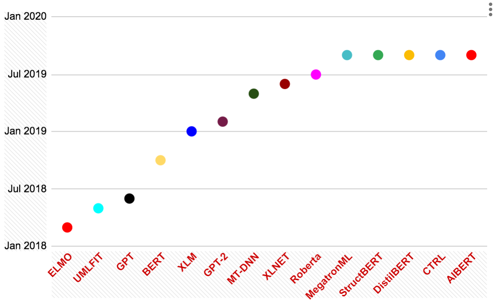
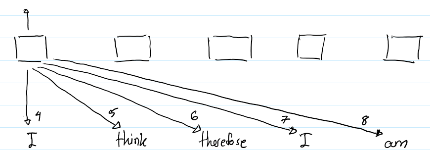
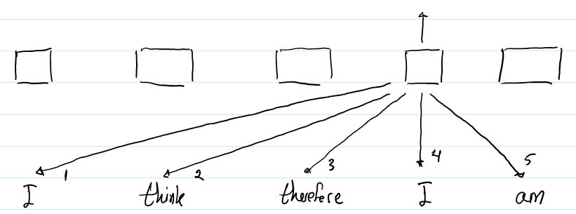
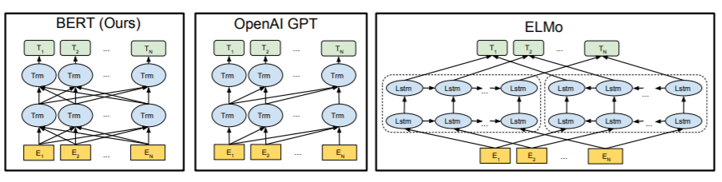
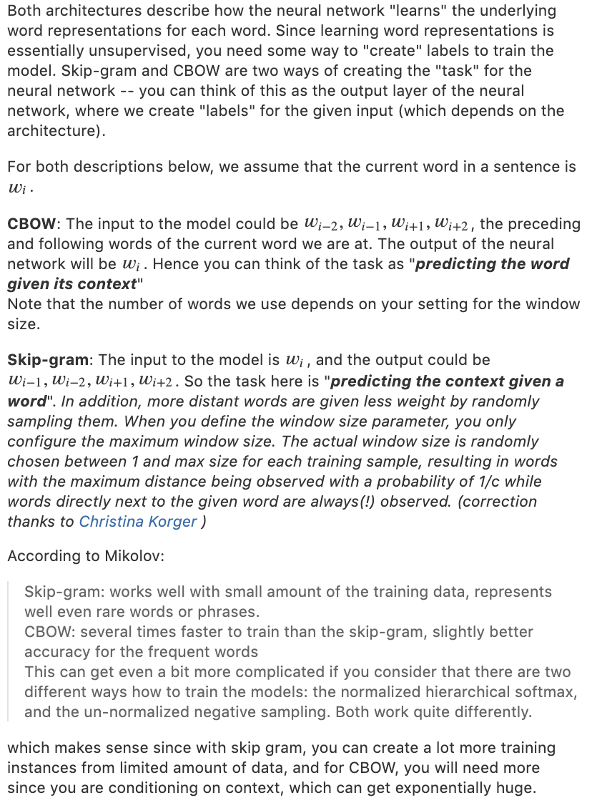

## LANGUAGE EMBEDDINGS

A model can only work with text once words, sentences, and documents are turned into vectors, and there are many ways to do that. The page starts with the history that led to transformers and pretrained models, then the foundation knowledge on word and sentence embeddings, language modelling as pretraining, the embedding spaces and how they compare, and then one family at a time: word2vec, GloVe, fastText, sentence embeddings, paragraph vectors, and doc2vec.

The same notes are in [Multi Language](multi-language.md).

The figure below is the BERT picture the rest of the page builds toward.

<figure><figcaption>
BERT

Credit: <a href="https://lh6.googleusercontent.com/aibqScGzh66aJK9E5Rho61W_pX8Kw82vJrrUkvRZrRN7vaRBOWnDOz0k29szquWdU3i4cwFFUj6b4-rPZvU2AUIlP5ouxwS7Kq2RwxDwFxtm9fpJZcnVXCMHY3SJ43FEsWj_GTcT">copied from the original hosted image</a>.
</figcaption></figure>

### History

Modern embeddings come out of the transformer, so the story starts with how attention replaced recurrence. [Google’s intro to transformers and multi-head self attention](https://ai.googleblog.com/2017/08/transformer-novel-neural-network.html) is Jakob Uszkoreit's post on the Transformer, a novel neural network architecture for language understanding, written against the recurrent networks that came before it.

Attention alone loses word order, and [How self attention and relative positioning work](https://medium.com/@_init_/how-self-attention-with-relative-position-representations-works-28173b8c245a) explains the fix from Shaw et al's paper on self-attention with relative position representations. Rnns are sequential, so the same word in a different position gets a different encoding, because the input from the previous word is inherently different. Attention without positional information will have distinct (Same) encoding: the same word gets the same vector wherever it sits. Relative attention looks at a window around each word and adds a distance vector in terms of how many words are before and after, which fixes the problem. The two figures below show that relative-position setup.

<figure><figcaption>
BERT

Credit: <a href="https://lh3.googleusercontent.com/XmFsG2XDB2sLXNkRwmsc90iPfXPBWDgr4AzO-u8lejinMcwb5XzTppAZ5oekBjUjIsJ8u8IBA83Z31bP3rgMjdkvq0qZAteTE2VvxSOa79AUH4KqsRQb0w1Eworanxxm7zFuo494">copied from the original hosted image</a>.
</figcaption></figure>

<figure><figcaption>
BERT

Credit: <a href="https://lh6.googleusercontent.com/JNAgD9NAJQzXCtfZ3ekWddZ1m8nzgMwXoqoQ3rjLsKfHl2NdqVrdrYexDnXCUzik2ZYalllJhm7Hp5Zl1_L5EHumNGN0NAfFHHH0RM6gqBZc4bPkg7Bd4D5ea5gmV1_hXtMXW_9K">copied from the original hosted image</a>.
</figcaption></figure>

The authors hypothesized that precise relative position information is not useful beyond a certain distance. Clipping the maximum distance enables the model to generalize to sequence lengths not seen during training.

From the transformer came the pretrained models. [From bert to albert](https://medium.com/@hamdan.hussam/from-bert-to-albert-pre-trained-langaug-models-5865aa5c3762) walks the pre-trained language models from BERT to ALBERT. [All the latest buzz algos](https://www.topbots.com/most-important-ai-nlp-research/#ai-nlp-paper-2018-12) is the TOPBOTS list of the most important NLP research of 2018, and a [Summary of them](https://www.topbots.com/ai-nlp-research-pretrained-language-models/?utm_source=facebook&utm_medium=group_post&utm_campaign=pretrained) is the TOPBOTS follow-up on pretrained language models. [8 pretrained language embeddings](https://www.analyticsvidhya.com/blog/2019/03/pretrained-models-get-started-nlp/) is Pranav Dar's set of pretrained models to get started with natural language processing. To use them, [Hugging face pytorch transformers](https://github.com/huggingface/pytorch-transformers) is the Transformers repository, now the model-definition framework for text, vision, audio, and multimodal models, for both inference and training, and [Hugging face nlp pretrained](https://huggingface.co/models?search=Helsinki-NLP%2Fopus-mt) is the Hugging Face model hub, searched for the Helsinki-NLP opus-mt translation models.

### Embedding Foundation Knowledge

Pretrained transformers make more sense once the older embedding families are clear, from bag of words to word, sentence, and document vectors.

The overview to start with is a Medium introduction to word embeddings, sentence embeddings, and trends in the field, by dipanjanS, with a [git](https://nbviewer.jupyter.org/github/dipanjanS/data_science_for_all/blob/master/tds_deep_transfer_learning_nlp_classification/Deep%20Transfer%20Learning%20for%20NLP%20-%20Text%20Classification%20with%20Universal%20Embeddings.ipynb) notebook, and [his git](https://github.com/dipanjanS) profile for the rest of his code. It covers, in order:

1. Baseline Averaged Sentence Embeddings
2. Doc2Vec
3. Neural-Net Language Models (Hands-on Demo!)
4. Skip-Thought Vectors
5. Quick-Thought Vectors
6. InferSent
7. Universal Sentence Encoder

[Shay palachy on word embedding covering everything from bow to word/doc/sent/phrase.](https://medium.com/@shay.palachy/document-embedding-techniques-fed3e7a6a25d) is Shay Palachy Affek's document embedding techniques, starting from word embedding, the mapping of words into numerical vector spaces that gives models richer representations of text. [Another intro, not as good as the one above](https://medium.com/huggingface/universal-word-sentence-embeddings-ce48ddc8fc3a) is Thomas Wolf's current best of universal word embeddings and sentence embeddings.

The simplest embeddings are counts, and they can be customized. Using sklearn vectorizer to create custom ones, i.e. a vectorizer that does preprocessing and tfidf and other things, had its own post, now kept at the end of the page. [TFIDF - n-gram based top weighted tfidf words](https://stackoverflow.com/questions/25217510/how-to-see-top-n-entries-of-term-document-matrix-after-tfidf-in-scikit-learn) is the StackOverflow question on seeing the top n entries of the term-document matrix after TfidfVectorizer in scikit-learn.

The same notes are in [TF-IDF](tf-idf.md).

Counting single words misses phrases, which is what [Gensim bi-gram phraser/phrases analyser/converter](https://radimrehurek.com/gensim/models/phrases.html) handles in Gensim. A countvectorizer, stemmer, and lemmatization code tutorial used to sit here; that address no longer opens and is kept at the end of the page.

From counts the field moved to learned vectors. [Current 2018 best universal word and sentence embeddings -> elmo](https://medium.com/huggingface/universal-word-sentence-embeddings-ce48ddc8fc3a) is the same Thomas Wolf post, read for its answer at the time: ELMo. A 5-part series on word embeddings, part 2, 3, 4 - cross lingual review, and 5-future trends, is kept at the end of the page. [Word embedding posts](https://datawarrior.wordpress.com/2016/05/15/word-embedding-algorithms/) is the Word Embedding Algorithms entry on Everything about Data Analytics, on embedding being hot partly due to the success of Word2Vec although the idea is more than a decade old. [Facebook github for embedings called starspace](https://github.com/facebookresearch/StarSpace) is StarSpace, learning embeddings for classification, retrieval and ranking. [Medium on Fast text / elmo etc](https://medium.com/huggingface/universal-word-sentence-embeddings-ce48ddc8fc3a) is the Thomas Wolf post a third time, for its fastText and ELMo parts.

### Language modeling

The step from fixed embeddings to BERT is language modelling as pretraining: train a model to predict text, then reuse what it learned.

The same notes are in [BERT](pretrained-language-models.md#bert), [ELMO](pretrained-language-models.md#elmo), [GPT2](pretrained-language-models.md#gpt2), [GPT3](pretrained-language-models.md#gpt3), and [ULMFIT](pretrained-language-models.md#ulmfit).

Ruder on language modelling as the next imagenet makes the case (the post itself is kept at the end of the page): Language modelling, the last approach mentioned, has been shown to capture many facets of language relevant for downstream tasks, such as [long-term dependencies](https://arxiv.org/abs/1611.01368) , [hierarchical relations](https://arxiv.org/abs/1803.11138) , and [sentiment](https://arxiv.org/abs/1704.01444) . Compared to related unsupervised tasks such as skip-thoughts and autoencoding, [language modelling performs better on syntactic tasks even with less training data](https://openreview.net/forum?id=BJeYYeaVJ7). Those three links are, in order, Assessing the Ability of LSTMs to Learn Syntax-Sensitive Dependencies, Colorless green recurrent networks dream hierarchically, and Learning to Generate Reviews and Discovering Sentiment.

A tutorial about w2v skipthought - with code! (kept at the end of the page) explains why language modelling is important here - Our second method is training a language model to represent our sentences. A language model describes the probability of a text existing in a language. For example, the sentence “I like eating bananas” would be more probable than “I like eating convolutions.” We train a language model by slicing windows of n words and predicting what the next word will be in the text

The first model to make this transfer routine for classification was ULMFiT. [Universal language model fine tuning for text-classification](https://arxiv.org/abs/1801.06146) is the paper: inductive transfer learning had greatly impacted computer vision, but NLP still needed task-specific modifications and training from scratch, so ULMFiT is a transfer learning method for any NLP task, with techniques that are key for fine-tuning a language model.

The ULMFiT paper (Howard and Ruder) proposes pretraining a language model on a large corpus, then fine-tuning it on a target text-classification task with discriminative learning rates and gradual unfreezing, reporting strong results with limited labeled data.

ELMO had a Medium post of its own. Then came [Bert](https://arxiv.org/abs/1810.04805v1), Pre-training of Deep Bidirectional Transformers for Language Understanding, with a [python git](https://github.com/CyberZHG/keras-bert) that can load the official pre-trained models for feature extraction and prediction - We introduce a new language representation model called BERT, which stands for Bidirectional Encoder Representations from Transformers. Unlike recent language representation models, BERT is designed to pre-train deep bidirectional representations by jointly conditioning on both left and right context in all layers. As a result, the pre-trained BERT representations can be fine-tuned with just one additional output layer to create state-of-the-art models for a wide range of tasks, such as question answering and language inference, without substantial task-specific architecture modifications. BERT is conceptually simple and empirically powerful. It obtains new state-of-the-art results on eleven natural language processing tasks.

<figure><figcaption>
BERT

Credit: <a href="https://lh4.googleusercontent.com/anFY63RxhdYt82bb_XUGDLRUmj2vuR1I0iJye66cOqgC2gQegXVf2ibkC64LRPIfgUj8Brl7VYUFfxw3gG0KBnwTuqJ2NCohd6mi9YzCkZmHGuDz1QxXl7JUtMv5BpiBJXGnC-Zc">copied from the original hosted image</a>.
</figcaption></figure>

OpenAI took the same route with a generative model. [Open.ai on language modelling](https://blog.openai.com/language-unsupervised/) - We’ve obtained state-of-the-art results on a suite of diverse language tasks with a scalable, task-agnostic system, which we’re also releasing. Our approach is a combination of two existing ideas: [transformers](https://arxiv.org/abs/1706.03762) and [unsupervised pre-training](https://arxiv.org/abs/1511.01432). [READ PAPER](https://s3-us-west-2.amazonaws.com/openai-assets/research-covers/language-unsupervised/language_understanding_paper.pdf), [VIEW CODE](https://github.com/openai/finetune-transformer-lm). The two ideas are the papers Attention Is All You Need and Semi-supervised Sequence Learning.

Scikit-learn inspired model finetuning for natural language processing is the practical wrapper around that model: [finetune](https://finetune.indico.io/#module-finetune) ships with a pre-trained language model from [“Improving Language Understanding by Generative Pre-Training”](https://s3-us-west-2.amazonaws.com/openai-assets/research-covers/language-unsupervised/language_understanding_paper.pdf) and builds off the [OpenAI/finetune-language-model repository](https://github.com/openai/finetune-transformer-lm).

To see inside the transformer itself, the note is honest that it did not fully read - [The annotated Transformer](http://nlp.seas.harvard.edu/2018/04/03/attention.html) - jupyter on transformer with annotation. Medium on [Dissecting Bert](https://medium.com/dissecting-bert/dissecting-bert-part-1-d3c3d495cdb3) is Miguel Romero and Francisco Ingham's part 1 on the encoder, and its [appendix](https://medium.com/dissecting-bert/dissecting-bert-appendix-the-decoder-3b86f66b0e5f) covers the decoder and assumes part 1. A Medium post on distilling 6 patterns from bert is kept at the end of the page.

### Embedding spaces

With so many ways to embed text, the next question is how the resulting spaces compare, especially for whole sentences.

A good overview of sentence embedding methods used to open this list; that address now points to an unrelated site and is kept at the end of the page. [A very good overview of word embeddings](http://sanjaymeena.io/tech/word-embeddings/) is Meanings are Vectors, on the recent big idea in NLP that meanings are vectors. An intro to word embeddings with lots of images is kept at the end of the page. [A very long and extensive thesis about embeddings](http://ad-publications.informatik.uni-freiburg.de/theses/Bachelor_Jon_Ezeiza_2017.pdf) is Jon Ezeiza Alvarez's bachelor thesis at Freiburg.

The simplest sentence embedding averages word vectors, and sent2vec builds on that. [Sent2vec by gensim](https://rare-technologies.com/sent2vec-an-unsupervised-approach-towards-learning-sentence-embeddings/) - sentence embedding is defined as the average of the source word embeddings of its constituent words. This model is furthermore augmented by also learning source embeddings for not only unigrams but also n-grams of words present in each sentence, and averaging the n-gram embeddings along with the words. [Sent2vec vs fasttext - with info about s2v parameters](https://github.com/epfml/sent2vec/issues/19) is the issue on comparing Sent2Vec performance with FastText, opened while benchmarking a native Gensim implementation, which found Sent2Vec outperforms Doc2Vec.

Other comparisons set the word-level models side by side. [Wordrank vs fasttext vs w2v comparison](https://en.wikipedia.org/wiki/Automatic_summarization#TextRank_and_LexRank) now leads to the Wikipedia article on automatic summarization, at its TextRank and LexRank section. [W2v vs glove vs sppmi vs svd by gensim](https://rare-technologies.com/making-sense-of-word2vec/) was the gensim post on making sense of word2vec; the address now opens a PII Tools page instead.

Documents get their own models. [Medium on a gentle intro to d2v](https://medium.com/scaleabout/a-gentle-introduction-to-doc2vec-db3e8c0cce5e) is Gidi Shperber on what doc2vec is, how it is built, and how it relates to word2vec, with no mathematic formulas. [Doc2vec tutorial by gensim](https://rare-technologies.com/doc2vec-tutorial/) - Doc2vec (aka paragraph2vec, aka sentence embeddings) modifies the word2vec algorithm to unsupervised learning of continuous representations for larger blocks of text, such as sentences, paragraphs or entire documents. - Most importantly this tutorial has crucial information about the implementation parameters that should be read before using it. [Lbl2Vec](https://github.com/sebischair/Lbl2Vec), medium, is an algorithm for unsupervised document classification and unsupervised document retrieval. It automatically generates jointly embedded label, document and word vectors and returns documents of categories modeled by manually predefined keywords. [Git for word embeddings - taken from mastery’s nlp course](https://github.com/IshayTelavivi/nlp_crash_course) is a crash course repository for learning and practicing NLP with deep learning.

Sentence-level methods differ mainly in what they predict. Skip-thought has its [git](https://github.com/ryankiros/skip-thoughts), the encoder and training code from the paper Skip-Thought Vectors - Where word2vec attempts to predict surrounding words from certain words in a sentence, skip-thought vector extends this idea to sentences: it predicts surrounding sentences from a given sentence. NOTE: Unlike the other methods, skip-thought vectors require the sentences to be ordered in a semantically meaningful way. This makes this method difficult to use for domains such as social media text, where each snippet of text exists in isolation.

Fastsent - Skip-thought vectors are slow to train. FastSent attempts to remedy this inefficiency while expanding on the core idea of skip-thought: that predicting surrounding sentences is a powerful way to obtain distributed representations. Formally, FastSent represents sentences as the simple sum of its word embeddings, making training efficient. The word embeddings are learned so that the inner product between the sentence embedding and the word embeddings of surrounding sentences is maximized. NOTE: FastSent sacrifices word order for the sake of efficiency, which can be a large disadvantage depending on the use-case.

Weighted sum of words - In this method, each word vector is weighted by the factor $$\frac{a}{a + p(w)}$$ where $$a$$ is a hyperparameter and $$p(w)$$ is the (estimated) word frequency. This is similar to tf-idf weighting, where more frequent terms are weighted downNOTE: Word order and surrounding sentences are ignored as well, limiting the information that is encoded.

The supervised alternative trains on inference data instead. [Infersent by facebook](https://github.com/facebookresearch/InferSent) - [paper](https://arxiv.org/abs/1705.02364) InferSent is a sentence embeddings method that provides semantic representations for English sentences. It is trained on natural language inference data and generalizes well to many different tasks. ABSTRACT: we show how universal sentence representations trained using the supervised data of the Stanford Natural Language Inference datasets can consistently outperform unsupervised methods like SkipThought vectors on a wide range of transfer tasks. Much like how computer vision uses ImageNet to obtain features, which can then be transferred to other tasks, our work tends to indicate the suitability of natural language inference for transfer learning to other NLP tasks.

Google's encoder is the one most often used off the shelf. [Universal sentence encoder - google](https://tfhub.dev/google/universal-sentence-encoder/1) - [notebook](https://colab.research.google.com/github/tensorflow/hub/blob/master/examples/colab/semantic_similarity_with_tf_hub_universal_encoder.ipynb#scrollTo=8OKy8WhnKRe_), git The Universal Sentence Encoder encodes text into high dimensional vectors that can be used for text classification, semantic similarity, clustering and other natural language tasks. The model is trained and optimized for greater-than-word length text, such as sentences, phrases or short paragraphs. It is trained on a variety of data sources and a variety of tasks with the aim of dynamically accommodating a wide variety of natural language understanding tasks. The input is variable length English text and the output is a 512 dimensional vector. We apply this model to the [STS benchmark](http://ixa2.si.ehu.es/stswiki/index.php/STSbenchmark) for semantic similarity, and the results can be seen in the [example notebook](https://colab.research.google.com/github/tensorflow/hub/blob/master/examples/colab/semantic_similarity_with_tf_hub_universal_encoder.ipynb) made available. The universal-sentence-encoder model is trained with a deep averaging network (DAN) encoder. For more than English, [Multi language universal sentence encoder](https://ai.googleblog.com/2019/07/multilingual-universal-sentence-encoder.html) is Yinfei Yang and Amin Ahmad's Multilingual Universal Sentence Encoder for semantic retrieval.

Word pairs can be embedded too. Pair2vec - [paper](https://arxiv.org/abs/1810.08854) - paper proposes new methods for learning and using embeddings of word pairs that implicitly represent background knowledge about such relationships. I.e., using p2v information with existing models to increase performance. Experiments show that our pair embeddings can complement individual word embeddings, and that they are perhaps capturing information that eludes the traditional interpretation of the Distributional Hypothesis

To put any of these into a classifier, [Fast text python tutorial](http://ai.intelligentonlinetools.com/ml/fasttext-word-embeddings-text-classification-python-mlp/) is fastText word embeddings for text classification with an MLP in Python.

### WORD2VEC

Word2vec is the model most of the above is compared to, so it gets the longest reading list: training, cleaning, bias, tutorials, negative sampling, and analogies.

The same notes are in [ZERO SHOT LEARNING](../problem-framing/n-shot-learning.md#zero-shot-learning).

Training comes first. Monitor [train loss](https://stackoverflow.com/questions/52038651/loss-does-not-decrease-during-training-word2vec-gensim) Monitor using callbacks for word2vec; the StackOverflow question asks why the loss from get_latest_training_loss increases on each epoch. The vectors can also clean data: cleaning datasets using weighted w2v sentence encoding, then pca and isolation forest to remove outlier sentences. The same PCA idea handles bias: [Removing ‘gender bias using pair mean pca](https://stackoverflow.com/questions/48019843/pca-on-word2vec-embeddings) is the question on reproducing the paper that takes ten gender pair difference vectors and computes their principal components to find the gender subspace.

Variants of the model change the math under it. [KPCA w2v approach on a very small dataset](https://medium.com/@vishwanigupta/kpca-skip-gram-model-improving-word-embedding-a6a0cb7aad49) is Vishwani Gupta on improving word embedding with a kernel PCA skip gram model. [similar git](https://github.com/niitsuma/wordca) is niitsuma/wordca, distributed word representations using correspondence analysis, and the paper for correspondence analysis [paper](https://arxiv.org/abs/1605.05087) is Word2Vec is a special case of Kernel Correspondence Analysis and Kernels for Natural Language Processing.

The tutorials explain the model itself. [The best w2v/tfidf/bow/ embeddings post ever](https://www.analyticsvidhya.com/blog/2017/06/word-embeddings-count-word2veec/) is the Analytics Vidhya post on count-based and word2vec embeddings. [Chris mccormick ml on w2v,](http://mccormickml.com/2016/04/19/word2vec-tutorial-the-skip-gram-model/) is the skip-gram tutorial, and [post #2](http://mccormickml.com/2017/01/11/word2vec-tutorial-part-2-negative-sampling/) - negative sampling “Negative sampling addresses this by having each training sample only modify a small percentage of the weights, rather than all of them. With negative sampling, we are instead going to randomly select just a small number of “negative” words (let’s say 5) to update the weights for. (In this context, a “negative” word is one for which we want the network to output a 0 for). We will also still update the weights for our “positive” word (which is the word “quick” in our current example). The “negative samples” (that is, the 5 output words that we’ll train to output 0) are chosen using a “unigram distribution”. Essentially, the probability for selecting a word as a negative sample is related to its frequency, with more frequent words being more likely to be selected as negative samples.

[Chris mccormick on negative sampling and hierarchical soft max](https://www.youtube.com/watch?v=pzyIWCelt_E) training, i.e., huffman binary tree for the vocabulary, learning internal tree nodes ie.,, the path as the probability vector instead of having len(vocabulary) neurons. A great W2V tutorial was also on the list. Another [gensim-based w2v tutorial](http://kavita-ganesan.com/gensim-word2vec-tutorial-starter-code/), with starter code and some usage examples of similarity, is Kavita Ganesan's end-to-end example with working code and a dataset. [Clustering using gensim word2vec](http://ai.intelligentonlinetools.com/ml/k-means-clustering-example-word2vec/) is a k-means clustering example with Word2Vec. The list also noted yet another w2v medium explanation, mean w2v, and sequential w2v embeddings. [Negative sampling, why does it work in w2v - didnt read](https://www.quora.com/How-does-negative-sampling-work-in-Word2vec-models) is the Quora question on how negative sampling works in Word2vec models.

Embeddings capture similarity well and opposites badly, which is the semantic contrast problem. [Semantic contract using w2v/ft - he chose a good food category and selected words that worked best in order to find similar words to good bad etc. lior magen](https://groups.google.com/forum/#!topic/gensim/wh7B00cc80w) is a gensim Google Groups thread. [Semantic contract, syn-antonym DS, using w2v, a paper that i havent read](http://anthology.aclweb.org/P16-2074) is Integrating Distributional Lexical Contrast into Word Embeddings for Antonym-Synonym Distinction by Kim Anh Nguyen, Sabine Schulte im Walde, and Ngoc Thang Vu at ACL 2016.

The same vectors can be played with directly. [Amazing w2v most similar tutorial, examples for vectors, misspellings, semantic contrast and relations that may or may not be captured in the network.](https://quomodocumque.wordpress.com/2016/01/15/messing-around-with-word2vec/) is Messing around with word2vec on Quomodocumque, and [Followup tutorial about genderfying words using ‘he’ ‘she’ similarity](https://quomodocumque.wordpress.com/2016/01/15/gendercycle-a-dynamical-system-on-words/) is its follow-up, Gendercycle: a dynamical system on words, which looks for gender-neutralized synonyms. [W2v Analogies using predefined anthologies of the](https://gist.github.com/kylemcdonald/9bedafead69145875b8c) form x:y::a:b, plus code, plus insights of why it works and doesn't. presence : absence :: happy : unhappy absence : presence :: happy : proud abundant : scarce :: happy : glad refuse : accept :: happy : satisfied accurate : inaccurate :: happy : disappointed admit : deny :: happy : delighted never : always :: happy : Said_Hirschbeck modern : ancient :: happy : ecstatic

A bow and w2v embeddings post with code on how to use it used to sit here; that address now points to an unrelated site and is kept at the end of the page. For Hebrew, [Hebrew word embeddings with w2v, ron shemesh, on wiki/twitter](https://drive.google.com/drive/folders/1qBgdcXtGjse9Kq7k1wwMzD84HH_Z8aJt) is the Hebrew-Word2Vec Google Drive folder.

GLOVE

GloVe is word2vec's main rival, and the comparisons ask what it does differently. [W2v vs glove vs fasttext, in terms of overfitting and what is the idea behind](https://www.kaggle.com/sbongo/do-pretrained-embeddings-give-you-the-extra-edge) is the Kaggle notebook Do Pretrained Embeddings Give You The Extra Edge?. [W2v against glove performance](http://dsnotes.com/post/glove-enwiki/) is GloVe vs word2vec revisited on Data Science notes. [How glove and w2v work, but the following has a very good description](https://geekyisawesome.blogspot.com/2017/03/word-embeddings-how-word2vec-and-glove.html) - “GloVe takes a different approach. Instead of extracting the embeddings from a neural network that is designed to perform a surrogate task (predicting neighbouring words), the embeddings are optimized directly so that the dot product of two word vectors equals the log of the number of times the two words will occur near each other (within 5 words for example). For example if "dog" and "cat" occur near each other 10 times in a corpus, then vec(dog) dot vec(cat) = log(10). This forces the vectors to somehow encode the frequency distribution of which words occur near them.” [Glove vs w2v, concise explanation](https://www.quora.com/What-is-the-difference-between-fastText-and-GloVe/answer/Ajit-Rajasekharan) gives the key difference: GloVe treats each word in the corpus like an atomic entity and generates a vector for each word, and in that sense it is very much like word2vec.

### FastText

fastText breaks the atomic-word assumption by working on subwords, and the notes cover training it, using it in gensim, and why it wins on syntactic analogies.

[Fasttext - using fast text and upsampling/oversapmling on twitter data](https://medium.com/@media_73863/fasttext-sentiment-analysis-for-tweets-a-straightforward-guide-9a8c070449a2) is Charles Malafosse's straightforward guide to fastText sentiment analysis for tweets, with training data generated by AWS Comprehend. The video below goes with it.



[A thorough tutorial about what is FT and how to use it, performance, pros and cons.](https://www.analyticsvidhya.com/blog/2017/07/word-representations-text-classification-using-fasttext-nlp-facebook/) is the Analytics Vidhya tutorial on fastText, the very fast NLP library created by Facebook for word representations and text classification. The [Docs](https://fasttext.cc/blog/2016/08/18/blog-post.html) start from the Releasing fastText post, faster, better text classification. A Medium post on word embeddings with w2v and fast text in gensim, data cleaning and word similarity, is kept at the end of the page. Gensim - [fasttext docs](https://radimrehurek.com/gensim/models/fasttext.html) are the Gensim model page. [Alternative to gensim](https://github.com/plasticityai/magnitude#benchmarks-and-features) - promises speed and out of the box support for many embeddings. [Comparison of usage w2v fasttext](http://ai.intelligentonlinetools.com/ml/fasttext-word-embeddings-text-classification-python-mlp/) is the fastText and MLP classification post from above. A note on using gensim fast text, with a recommendation against using the fb version, is kept at the end of the page.

The comparison that explains the difference is gensim's own. [A comparison of w2v vs ft using gensim](https://rare-technologies.com/fasttext-and-gensim-word-embeddings/) - “Word2Vec embeddings seem to be slightly better than fastText embeddings at the semantic tasks, while the fastText embeddings do significantly better on the syntactic analogies. Makes sense, since fastText embeddings are trained for understanding morphological nuances, and most of the syntactic analogies are morphology based. The two task types it names are defined in a StackOverflow answer:

1. [Syntactic](https://stackoverflow.com/questions/48356421/what-is-the-difference-between-syntactic-analogy-and-semantic-analogy) means syntax, as in tasks that have to do with the structure of the sentence, these include tree parsing, POS tagging, usually they need less context and a shallower understanding of world knowledge
2. [Semantic](https://stackoverflow.com/questions/48356421/what-is-the-difference-between-syntactic-analogy-and-semantic-analogy) tasks mean meaning related, a higher level of the language tree, these also typically involve a higher level understanding of the text and might involve tasks s.a. question answering, sentiment analysis, etc...
3. As for analogies, he is referring to the mathematical operator like properties exhibited by word embedding, in this context a syntactic analogy would be related to plurals, tense or gender, those sort of things, and semantic analogy would be word meaning relationships s.a. man + queen = king, etc... See for instance [this article](http://www.aclweb.org/anthology/W14-1618) (and many others)

Both word2vec and fastText come in two architectures, [Skip gram vs CBOW](https://www.quora.com/What-are-the-continuous-bag-of-words-and-skip-gram-architectures), shown in the figure below.

<figure><figcaption>
BERT

Credit: <a href="https://lh5.googleusercontent.com/lnuntHia-uXCNiGbmw0bWYski3uPkeryHj3Rf8si9E9GUCyUi1aXsMv3sKgY_YLjqWbRRWjGLzCZymjWwRlMquDTsQdcd05PcSJ74ZEOmd1QW59SaZlC3XCzTGpyPdPjVDUljOvG">copied from the original hosted image</a>.
</figcaption></figure>

A paper on fasttext vs glove vs w2v on a single DS, a performance comparison where Ft wins by a small margin, is kept at the end of the page, and the list also noted a Medium post on w2v/fast text ‘most similar’ words with code. [keras/tf code for a fast text implementation](http://debajyotidatta.github.io/nlp/deep/learning/word-embeddings/2016/09/28/fast-text-and-skip-gram/) is Debajyoti Datta's Fast Text and Skip-Gram. [Medium on fast text and imbalance data](https://medium.com/@yeyrama/fasttext-and-imbalanced-classification-1f9543f9e0ce) tests fastText's claim that it exploits the fact that classes are imbalanced. Medium on universal [Sentence encoder, w2v, Fast text for sentiment](https://medium.com/@jatinmandav3/opinion-mining-sometimes-known-as-sentiment-analysis-or-emotion-ai-refers-to-the-use-of-natural-874f369194c0) Medium universal with code, comparing Word2Vec, FastText, and the Universal Sentence Encoder for sentiment analysis in Keras.

### SENTENCE EMBEDDING

Word vectors stop at the word; the tools below produce one vector per sense, per sentence, or per pair of models.

#### Sense2vec

Sense2vec augments tokens with POS or entity tags for finer similarity. The [Blog](https://explosion.ai/blog/sense2vec-with-spacy), [github](https://github.com/explosion/sense2vec): Using spacy or not, with w2v using POS/ENTITY TAGS to find similarities.based on reddit. “We follow Trask et al in adding part-of-speech tags and named entity labels to the tokens. Additionally, we merge named entities and base noun phrases into single tokens, so that they receive a single vector.” Explosion's post describes Sense2vec (Trask et. al, 2015) as a twist on word2vec for more detailed, context-sensitive word vectors, and the repository is contextually-keyed word vectors. The effect shows in the similarities:

`>>> model.similarity('fair_game|NOUN', 'game|NOUN') 0.034977455677555599 >>> model.similarity('multiplayer_game|NOUN', 'game|NOUN') 0.54464530644393849`

#### SENT2VEC aka “skip-thoughts”

Sense2vec still works per token; sent2vec and skip-thoughts give one vector per sentence. [Gensim implementation of sent2vec](https://rare-technologies.com/sent2vec-an-unsupervised-approach-towards-learning-sentence-embeddings/) - usage examples, parallel training, a detailed comparison against gensim doc2vec. [Git implementation](https://github.com/ryankiros/skip-thoughts) is the Skip-Thought Vectors encoder and training code. [Another git - worked](https://github.com/epfml/sent2vec) is epfml/sent2vec, general purpose unsupervised sentence representations.

#### USE - Universal sentence encoder

The Universal Sentence Encoder from the embedding spaces section had a git notebook for usage and a sentence similarity benchmark and visualization; that notebook is kept at the end of the page.

#### BERT+W2V

Mixing BERT and word2vec for sentence similarity had its own post, also kept at the end of the page.

### PARAGRAPH2Vec

Sentence vectors extend to paragraphs. [Paragraph2VEC by stanford](https://cs.stanford.edu/~quocle/paragraph_vector.pdf) is the paragraph vector paper, written because fixed-length bag-of-words features lose the ordering of the words and ignore their semantics: “powerful,” “strong” and “Paris” come out equally distant.

### Doc2Vec

Paragraph vectors are what gensim ships as doc2vec, and the one training tip here matters: [Shuffle before training each](https://groups.google.com/forum/#!topic/gensim/IVQBUF5n6aI) epoch, from the gensim Google Group.

The Towards Data Science copies of two notes above keep their original addresses. The deep transfer learning with universal embeddings post from the foundation section is [https://towardsdatascience.com/deep-transfer-learning-for-natural-language-processing-text-classification-with-universal-1a2c69e5baa9](https://towardsdatascience.com/deep-transfer-learning-for-natural-language-processing-text-classification-with-universal-1a2c69e5baa9), and the Lbl2Vec medium post is [https://towardsdatascience.com/unsupervised-text-classification-with-lbl2vec-6c5e040354de](https://towardsdatascience.com/unsupervised-text-classification-with-lbl2vec-6c5e040354de).

## Deprecated links


These links and images no longer work. The original wording is kept here. A same-resource copy, when one was checked, is used above.

- A tutorial about w2v skipthought - with code!. This address no longer opens: https://blog.myyellowroad.com/unsupervised-sentence-representation-with-deep-learning-104b90079a93
- Towards Data Science: beyond-word-embeddings-part-2-word-vectors-nlp-modeling-from-bow-to-bert-4ebd4711d0ec. This address no longer opens: https://towardsdatascience.com/beyond-word-embeddings-part-2-word-vectors-nlp-modeling-from-bow-to-bert-4ebd4711d0ec
- Towards Data Science: deconstructing-bert-distilling-6-patterns-from-100-million-parameters-b49113672f77. This address no longer opens: https://towardsdatascience.com/deconstructing-bert-distilling-6-patterns-from-100-million-parameters-b49113672f77
- Towards Data Science: hacking-scikit-learns-vectorizers-9ef26a7170af. This address no longer opens: https://towardsdatascience.com/hacking-scikit-learns-vectorizers-9ef26a7170af
- Towards Data Science: how-to-compute-sentence-similarity-using-bert-and-word2vec-ab0663a5d64. This address no longer opens: https://towardsdatascience.com/how-to-compute-sentence-similarity-using-bert-and-word2vec-ab0663a5d64
- Towards Data Science: word-embedding-with-word2vec-and-fasttext-a209c1d3e12c. This address no longer opens: https://towardsdatascience.com/word-embedding-with-word2vec-and-fasttext-a209c1d3e12c
- Towards Data Science: word-embeddings-exploration-explanation-and-exploitation-with-code-in-python-5dac99d5d795. This address no longer opens: https://towardsdatascience.com/word-embeddings-exploration-explanation-and-exploitation-with-code-in-python-5dac99d5d795
- Towards Data Science: word2vec-skip-gram-model-part-1-intuition-78614e4d6e0b. This address no longer opens: https://towardsdatascience.com/word2vec-skip-gram-model-part-1-intuition-78614e4d6e0b
- embeddings from the ground up Single Lunch. This address no longer opens: https://www.singlelunch.com/2020/02/16/embeddings-from-the-ground-up/
- 5-part series on word embeddings. This address no longer opens: http://ruder.io/word-embeddings-1/
- part 2. This address no longer opens: http://ruder.io/word-embeddings-softmax/index.html
- 3. This address no longer opens: http://ruder.io/secret-word2vec/index.html
- 4 - cross lingual review. This address no longer opens: http://ruder.io/cross-lingual-embeddings/index.html
- 5-future trends. This address no longer opens: http://ruder.io/word-embeddings-2017/index.html
- Ruder on language modelling as the next imagenet. This address no longer opens: http://ruder.io/nlp-imagenet/
- git. This address no longer opens: https://github.com/tensorflow/hub/blob/master/examples/colab/semantic_similarity_with_tf_hub_universal_encoder.ipynb
- paper. This address no longer opens: http://homepages.inf.ed.ac.uk/s1668259/papers/sequence.pdf
- Using gensim fast text - recommendation against using the fb version. This address no longer opens: https://blog.manash.me/how-to-use-pre-trained-word-vectors-from-facebooks-fasttext-a71e6d55f27
- Paper. This address no longer opens: http://workshop.colips.org/dstc6/papers/track2_paper18_zhuang.pdf
- Intro to word embeddings - lots of images. This address no longer opens: https://www.springboard.com/blog/introduction-word-embeddings/
- Countvectorizer, stemmer, lemmatization code tutorial. This address no longer opens: https://medium.com/@rnbrown/more-nlp-with-sklearns-countvectorizer-add577a0b8c8
- Nlpforhackers on bow, w2v embeddings with code on how to use. This address now points to an unrelated site: https://nlpforhackers.io/word-embeddings/
- A good overview of sentence embedding methods (also linked from the Skip-thought and Fastsent notes). This address now points to an unrelated site: http://mlexplained.com/2017/12/28/an-overview-of-sentence-embedding-methods/
