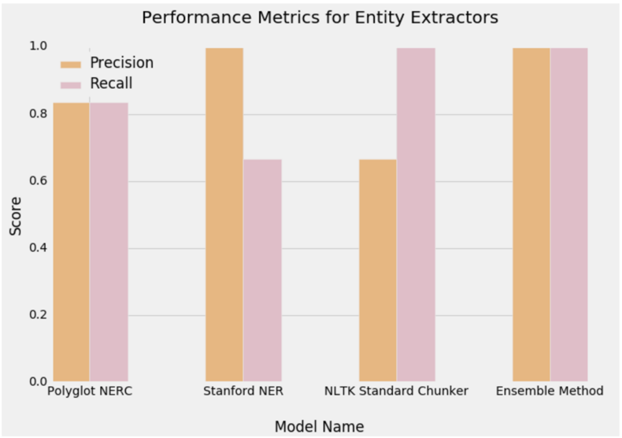
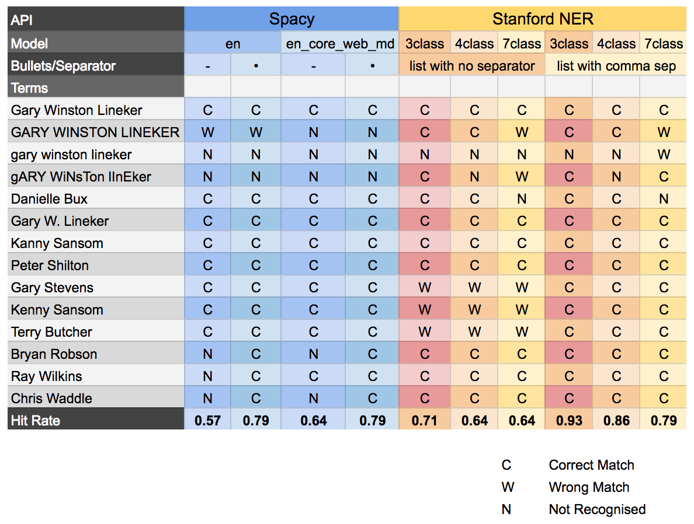
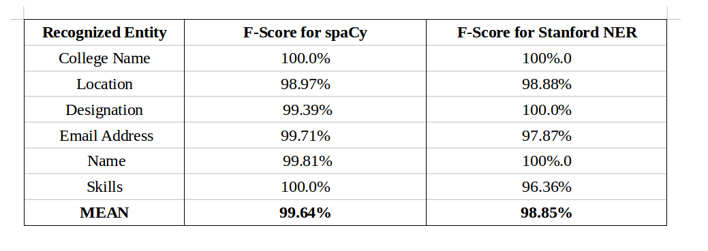
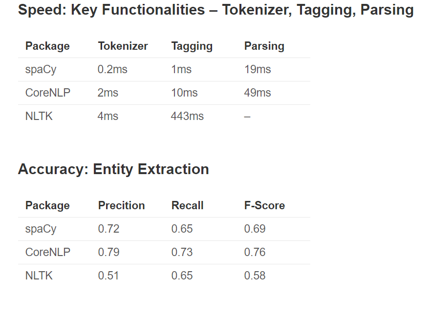

# Named Entity Recognition (NER)

This page collects NER papers, spaCy/SNER notes, and BiLSTM-CRF tutorials.
The linked notes cover milestone NER papers plus spaCy, SNER, and BiLSTM-CRF style tutorials.

The same notes are in [ANONYMIZATION](../responsible-ai/fairness-accountability-and-transparency.md#anonymization), [BERT](pretrained-language-models.md#bert), [CONDITIONAL RANDOM FIELDS (CRF)](../predictive-ml/probabilistic-models.md#conditional-random-fields-crf), [FLAIR](../deep-learning/representations.md#flair), and [SPACY](nlp.md#spacy).

- In this post, we have listed down some of the breakthrough papers and models for named entity recognition from unstructured and/or unstructured text. [State of the art LSTM architectures using NN](https://web.archive.org/web/20180123225955/http://blog.paralleldots.com/data-science/named-entity-recognition-milestone-models-papers-and-technologies/)
- Medium: [Ner free datasets](https://medium.com/data-science/deep-learning-for-ner-1-public-datasets-and-annotation-methods-8b1ad5e98caf)
- and [bilstm implementation](https://medium.com/data-science/deep-learning-for-named-entity-recognition-2-implementing-the-state-of-the-art-bidirectional-lstm-4603491087f1) Medium and using glove embeddings
3. Easy to implement in keras! They are based on the following [paper](https://arxiv.org/abs/1511.08308)
4. [Medium](https://medium.com/district-data-labs/named-entity-recognition-and-classification-for-entity-extraction-6f23342aa7c5): NLTK entities, polyglot entities, sner entities, finally an ensemble method wins all!

<figure><figcaption>
NLTK, Polyglot, SNER, and ensemble NER comparison.

Credit: <a href="https://lh5.googleusercontent.com/Z_R1r2x4UbKloRvR46EthJ-3I38Kj4TM2VfXsGzcEsQCNJ75BpS0xMbEeCtxueTHp3jbweC2ti2Y_2dopekm_qP4Vks4v6suZ_buGnFlOA1I6gdUwMYWsKWOD4eV38JVCcYQ0mes">copied from the original hosted image</a>.
</figcaption></figure>

- [Comparison between spacy and SNER](https://medium.com/@dudsdu/named-entity-recognition-for-unstructured-documents-c325d47c7e3a) for terms
- *** [Unsupervised NER using Bert](https://medium.com/data-science/unsupervised-ner-using-bert-2d7af5f90b8a)
- [Custom NER using spacy](https://medium.com/data-science/custom-named-entity-recognition-using-spacy-7140ebbb3718)
- [Spacy Ner with custom data](https://medium.com/@manivannan_data/how-to-train-ner-with-custom-training-data-using-spacy-188e0e508c6)

<figure><figcaption>
Custom NER using spaCy.

Credit: <a href="https://lh4.googleusercontent.com/L1nTdlSIQmOBa91u5HomKen0QlT3lWaKQjNv86ar2-cTuiKzI4y3oSdQGmJacjnJ28scacsfyvBDI4_Y15M1i-eQ02CKAe0O7zNyJOwfrv0TiiP2ExWx9wrciCxnEGMqmvHGM2kd">copied from the original hosted image</a>.
</figcaption></figure>

- [How to create a NER from scratch using kaggle data, using crf, and analysing crf weights using external package](https://medium.com/data-science/named-entity-recognition-and-classification-with-scikit-learn-f05372f07ba2)
- [Another comparison between spacy and SNER - both are the same, for many classes.](https://medium.com/data-science/a-review-of-named-entity-recognition-ner-using-automatic-summarization-of-resumes-5248a75de175)

<figure><figcaption>
spaCy and SNER comparison on resume summarization.

Credit: <a href="https://lh5.googleusercontent.com/LOc8elLlxDHhro4Isd3NZwQQtlEdIYmS_N3N1R8N2aEESRQnOYc5TANm2GMKKZF6r0ZDqfr34W_47ti3JU_mTtJPwxVDpQbztP7zdkRViby8hE_RDPfKrWHX3XgOiKJ5ODneGvj6">copied from the original hosted image</a>.
</figcaption></figure>

- [Vidhaya on spacy vs ner](https://www.analyticsvidhya.com/blog/2017/04/natural-language-processing-made-easy-using-spacy-%E2%80%8Bin-python/) — tutorial + code on how to use spacy for pos, dep, ner, compared to nltk/corenlp (sner etc). The results reflect a global score not specific to LOC for example.

<figure><figcaption>
Vidhaya spaCy versus NER tutorial results.

Credit: <a href="https://lh6.googleusercontent.com/z1n0cTOVDdW-NRozFyUhTE4RjAf6MVtnMFp-4CZ0Y_3VYFZirMz34wSK0bj66ViejWlfno_Bjyqvenc7KevaFGt8gIBR7RmUjP5BrCM8mkfC5g3C9MiMux7myDm5Qh_HzsXR2tSX">copied from the original hosted image</a>.
</figcaption></figure>

**Stanford NER (SNER)**

- [SNER presentation - combines HMM and MaxEnt features, distributional features, NER has](https://nlp.stanford.edu/software/jenny-ner-2007.pdf)
- [many applications.](https://nlp.stanford.edu/software/jenny-ner-2007.pdf)
- The Stanford Natural Language Processing Group. [How to train SNER, a FAQ with many other answers (read first before doing anything with SNER)](https://nlp.stanford.edu/software/crf-faq.shtml#a)
- SNER demo - capital letters matter, a minimum of one.
- Home. [State of the art NER benchmark](https://github.com/magizbox/underthesea/wiki/TASK-CONLL-2003)
- Evaluating and Combining Name Entity Recognition Systems. [Review paper, SNER, spacy, stanford wins](http://www.aclweb.org/anthology/W16-2703)
- A Comparison of Named Entity Recognition Tools Applied to Biographical Texts. [Review paper SNER, others on biographical text, stanford wins](https://arxiv.org/abs/1308.0661)
- Verifying your browser | OpenReview. Verifying your browser | OpenReview. [Another NER DL paper, 90%+](https://openreview.net/forum?id=ry018WZAZ)

**Spacy & Others**

- TRAINING A NEW ENTITY TYPE with Prodigy – annotation powered by active learning, by Explosion. [Spacy - using prodigy and spacy to train a NER classifier using active learning](https://www.youtube.com/watch?v=l4scwf8KeIA)
- NLP Town Blog | Named Entity Recognition and the Road to Deep Learning. [Ner using DL BLSTM, using glove embeddings, using CRF layer against another CRF](https://web.archive.org/web/20190320104331/http://www.nlp.town/blog/ner-and-the-road-to-deep-learning/)
- [Another medium paper on the BLSTM CRF with guillarue’s code](https://medium.com/intro-to-artificial-intelligence/entity-extraction-using-deep-learning-8014acac6bb8)
- GloVe + character embeddings + bi-LSTM + CRF for Sequence Tagging (Named Entity Recognition, NER, POS) - NLP example of bidirectionnal RNN and CRF in Tensorflow. [Guillaume blog post, detailed explanation](https://guillaumegenthial.github.io/sequence-tagging-with-tensorflow.html)
- For Italian
- [Another 90+ proposed solution](https://arxiv.org/pdf/1603.01360.pdf)
- GitHub - deeppavlov/ner: Named Entity Recognition. [A promising python implementation based on one or two of the previous papers](https://github.com/deepmipt/ner)
- [Quora advise, the first is cool, the second is questionable](https://www.quora.com/How-can-I-perform-named-entity-recognition-using-deep-learning-RNN-LSTM-Word2vec-etc)
- Off the shelf solutions benchmark
- In this post, we have listed down some of the breakthrough papers and models for named entity recognition from unstructured and/or unstructured text. [Parallel api talk about bilstm and their 2mil tagged ner model (washington passes)](https://web.archive.org/web/20180123225955/http://blog.paralleldots.com/data-science/named-entity-recognition-milestone-models-papers-and-technologies/)

- Towards Data Science. Custom NER using spacy [https://towardsdatascience.com/custom-named-entity-recognition-using-spacy-7140ebbb3718](https://towardsdatascience.com/custom-named-entity-recognition-using-spacy-7140ebbb3718)

## Deprecated links


These links and images no longer work. The original wording is kept here. A same-resource copy, when one was checked, is used above.


- State of the art LSTM architectures using NN This address no longer opens: https://blog.paralleldots.com/data-science/named-entity-recognition-milestone-models-papers-and-technologies/
- Medium: Ner free datasets This address no longer opens: https://towardsdatascience.com/deep-learning-for-ner-1-public-datasets-and-annotation-methods-8b1ad5e98caf
- bilstm implementation This address no longer opens: https://towardsdatascience.com/deep-learning-for-named-entity-recognition-2-implementing-the-state-of-the-art-bidirectional-lstm-4603491087f1
- Unsupervised NER using Bert This address no longer opens: https://towardsdatascience.com/unsupervised-ner-using-bert-2d7af5f90b8a
- How to create a NER from scratch using kaggle data, using crf, and analysing crf weights using external package This address no longer opens: https://towardsdatascience.com/named-entity-recognition-and-classification-with-scikit-learn-f05372f07ba2
- Another comparison between spacy and SNER - both are the same, for many classes. This address no longer opens: https://towardsdatascience.com/a-review-of-named-entity-recognition-ner-using-automatic-summarization-of-resumes-5248a75de175
- SNER demo - capital letters matter, a minimum of one. This address no longer opens: http://nlp.stanford.edu:8080/ner/process
- Review paper SNER, others on biographical text, stanford wins This address no longer opens: https://arxiv.org/ftp/arxiv/papers/1308/1308.0661.pdf
- Ner using DL BLSTM, using glove embeddings, using CRF layer against another CRF**.** This address no longer opens: http://nlp.town/blog/ner-and-the-road-to-deep-learning/
- For Italian This address no longer opens: https://www.qcri.org/app/media/4916
- Off the shelf solutions benchmark This address no longer opens: https://www.programmableweb.com/news/performance-comparison-10-linguistic-apis-entity-recognition/elsewhere-web/2016/11/03
- Parallel api talk about bilstm and their 2mil tagged ner model (washington passes) This address no longer opens: https://blog.paralleldots.com/data-science/named-entity-recognition-milestone-models-papers-and-technologies/
