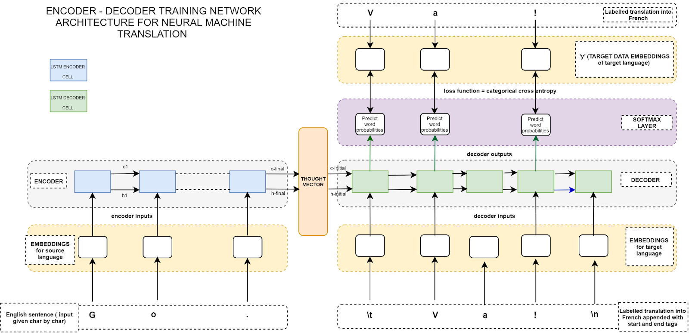

# Neural NLP

Neural networks read text either as a whole window at once or as a sequence in and a sequence out. The page covers the first with convolutional nets for text, then the second with encoder-decoder sequence-to-sequence models, teacher forcing, and the copying mechanism.

The same notes are in [Deep Learning for NLP](../deep-learning/deep-neural-nets.md#deep-learning-for-nlp).

## CONVOLUTION NEURAL NETS (CNN)

Convolutions are the fast way to let a network see a whole sentence. The same notes are in [CONVOLUTIONAL NEURAL NET](../deep-learning/convolutional-nets.md#convolutional-neural-net).

[Cnn for text](https://medium.com/@TalPerry/convolutional-methods-for-text-d5260fd5675f) is tal perry's Convolutional Methods for Text: RNNs work great for text but convolutions can do it faster, any part of a sentence can influence the semantics of a word so the network should see the entire input at once, and getting that big a receptive field can make gradients vanish. A note on 1D CNN using KERAS for time sequences used to sit here; that address no longer opens and is kept at the end of the page.

## SEQ2SEQ SEQUENCE TO SEQUENCE

When the output is also a sequence, such as a translation, the network becomes an encoder and a decoder, and the training trick that makes it work is teacher forcing.

The same notes are in [Attention](../deep-learning/attention.md), [Decoding Algorithms For NLP](decoding-algorithms-for-nlp.md), and [Recurrent Neural Net (RNN)](../deep-learning/recurrent-nets.md#recurrent-neural-net-rnn).

The starting point is the [Keras blog](https://blog.keras.io/a-ten-minute-introduction-to-sequence-to-sequence-learning-in-keras.html) — char-level, token-using embedding layer, teacher forcing. [Teacher forcing explained](https://medium.com/data-science/what-is-teacher-forcing-3da6217fed1c) is Wanshun Wong's What is Teacher Forcing?. [Same as keras but with token-level](https://medium.com/data-science/machine-translation-with-the-seq2seq-model-different-approaches-f078081aaa37) is Dhruvil Shah on different seq2seq approaches to machine translation, which rarely works as mechanical substitution of words because it needs comprehension of entire sentences. [Medium on char, word, byte-level](https://medium.com/@petepeeradejtanruangporn/experimenting-with-neural-machine-translation-for-thai-1681fd2b375a) is Pete Peeradej Tanruangporn's experiments with neural machine translation for Thai, where better masking and a larger network brought non-word level models to match or almost match word levels.

The same encoder-decoder can be built step by step. [Mastery on enc-dec using the keras method](https://machinelearningmastery.com/develop-encoder-decoder-model-sequence-sequence-prediction-keras/) is MachineLearningMastery's encoder-decoder model for sequence-to-sequence prediction in Keras, and on [neural translation](https://machinelearningmastery.com/define-encoder-decoder-sequence-sequence-model-neural-machine-translation-keras/) it is the seq2seq model for neural machine translation. [Machine translation git from eng to jap](https://github.com/samurainote/seq2seq_translate_slackbot/blob/master/seq2seq_translate.py) is the translation script in samurainote's seq2seq_translate_slackbot, [another](https://github.com/samurainote/seq2seq_translate_slackbot) is the whole repository, and its [medium](https://medium.com/data-science/how-to-implement-seq2seq-lstm-model-in-keras-shortcutnlp-6f355f3e5639) post explains how to implement the Seq2Seq LSTM model in Keras, the encoder-decoder RNN used for machine interaction and machine translation. The figure below shows that sequence-to-sequence translation setup.

<figure><figcaption>
Sequence-to-sequence machine translation.

Credit: <a href="https://lh6.googleusercontent.com/bcrIRzPLlcnQBl1zWR2s0_tB-NNEQxd8ZNQK8oK2NJsc29Fv6RdfKynfjHeNsSvl5d0SqK55k8xN1NAIrvEcnFEtpfZCfOHZzCSFLKmxeBWXn903VOJKiKTMV4Ynm_HL6Sgls2BN">copied from the original hosted image</a>.
</figcaption></figure>

A plain decoder can only generate from its vocabulary, so names and rare words in the input get lost. [Incorporating Copying Mechanism in Sequence-to-Sequence Learning](https://arxiv.org/abs/1603.06393) — In this paper, we incorporate copying into neural network-based Seq2Seq learning and propose a new model called CopyNet with encoder-decoder structure. CopyNet can nicely integrate the regular way of word generation in the decoder with the new copying mechanism which can choose sub-sequences in the input sequence and put them at proper places in the output sequence.

## Deprecated links


These links and images no longer work. The original wording is kept here. A same-resource copy, when one was checked, is used above.


- Teacher forcing explained This address no longer opens: https://towardsdatascience.com/what-is-teacher-forcing-3da6217fed1c
- Same as keras but with token-level This address no longer opens: https://towardsdatascience.com/machine-translation-with-the-seq2seq-model-different-approaches-f078081aaa37
- its medium This address no longer opens: https://towardsdatascience.com/how-to-implement-seq2seq-lstm-model-in-keras-shortcutnlp-6f355f3e5639
- 1D CNN using KERAS This address no longer opens: https://blog.goodaudience.com/introduction-to-1d-convolutional-neural-networks-in-keras-for-time-sequences-3a7ff801a2cf
