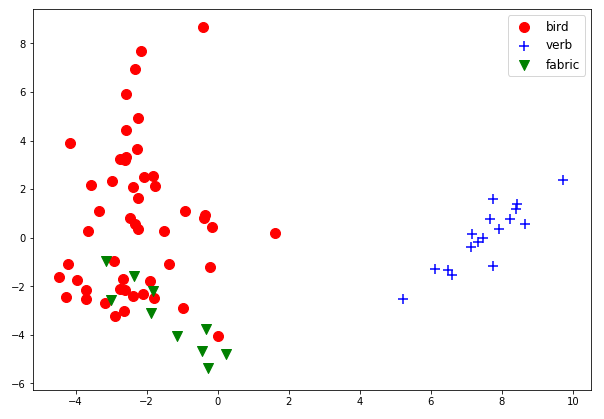
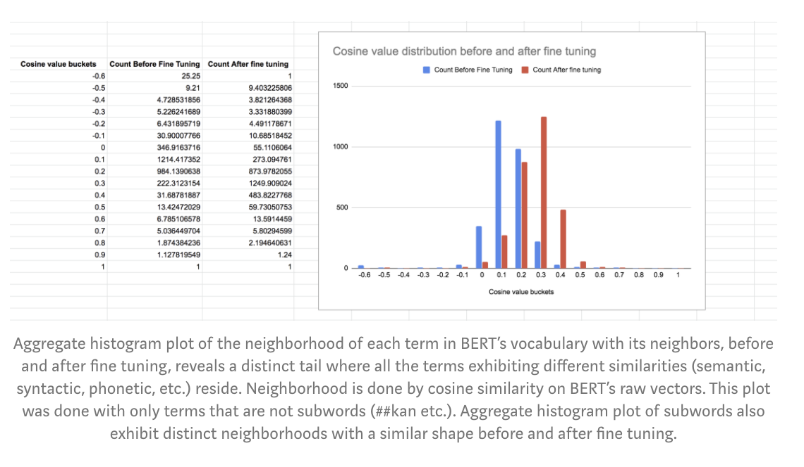
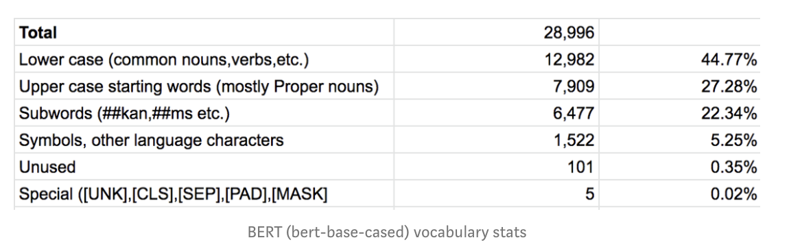
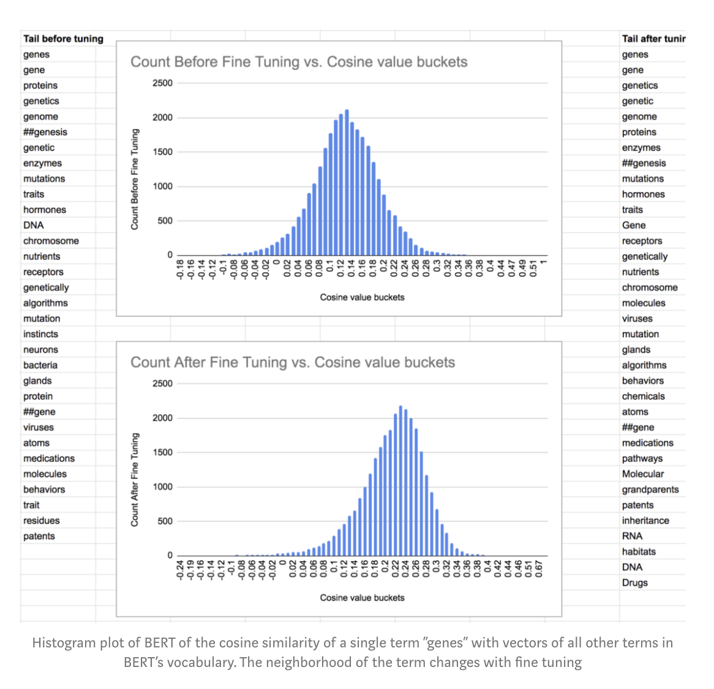
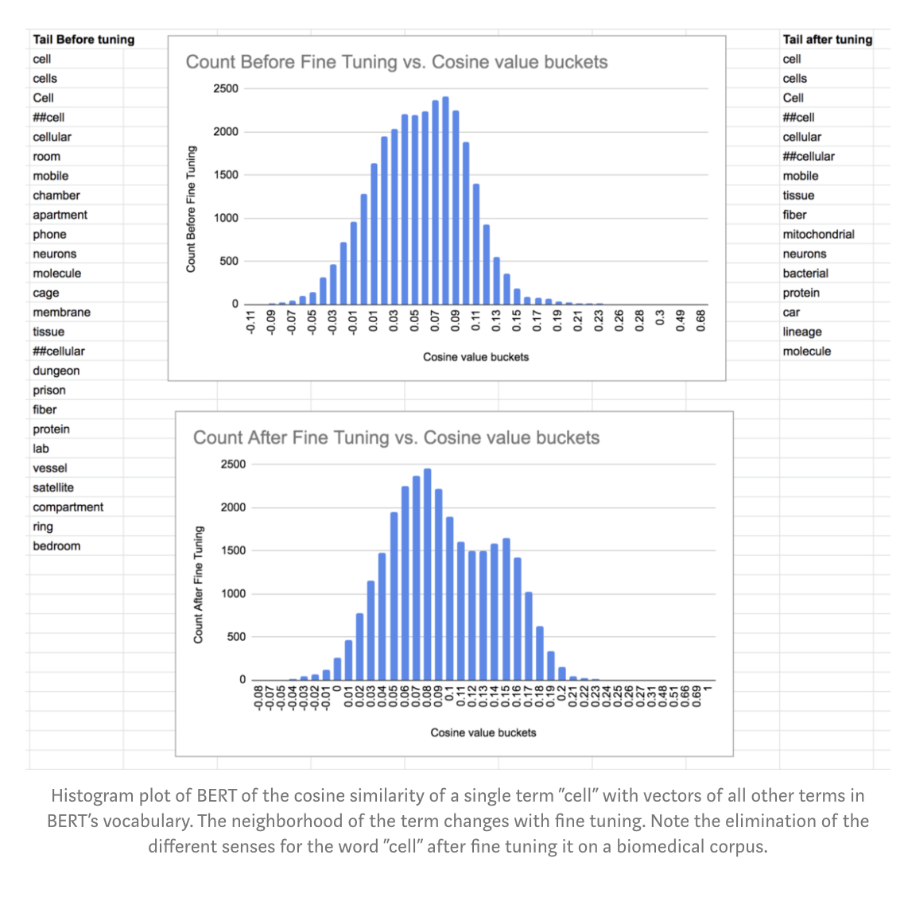
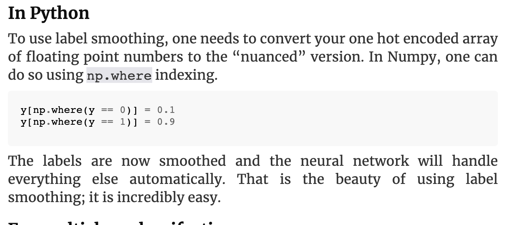

# Pretrained Language Models

A pretrained language model lets you start from a network that already knows a language and fine-tune it for your task, instead of training from scratch. The page follows the models in the order they appeared: ELMo, then ULMFiT, then BERT with its tutorials, compression, and analysis tools, then XLNet and the notes gathered beside it, and finally GPT-2 and GPT-3.

### ELMO

ELMo gave each word a vector that depends on its sentence, and the first practical question is how to get those vectors out and use them.

The same notes are in [Language modeling](language-embeddings.md#language-modeling).

[Short tutorial on elmo, pretrained, new data, incremental(finetune?)](https://github.com/PrashantRanjan09/Elmo-Tutorial) is PrashantRanjan09's short tutorial on Elmo training: pre trained, training on new data, and incremental training. [using elmo pretrained](https://github.com/PrashantRanjan09/WordEmbeddings-Elmo-Fasttext-Word2Vec) is the same author's repository for using pre trained word embeddings next to Fasttext and Word2Vec. [Why you cant use elmo to encode words (contextualized)](https://github.com/allenai/allennlp/issues/1737) is the AllenNLP issue asking for a clear guide on how to use Elmo embeddings, from someone who had to pass each sentence through the model to get them. [Vidhya on elmo](https://www.analyticsvidhya.com/blog/2019/03/learn-to-use-elmo-to-extract-features-from-text/) - everything you want to know with code.

ELMo matters because of transfer learning, and [Sebastien ruder on language modeling embeddings for the purpose of transfer learning, ELMO, ULMFIT, open AI transformer, BILSTM,](https://thegradient.pub/nlp-imagenet/) is his essay NLP's ImageNet moment has arrived. [Another good tutorial on elmo](http://www.realworldnlpbook.com/blog/improving-sentiment-analyzer-using-elmo.html) is the Realworldnlpbook post on improving a sentiment analyzer with ELMo.

For the model itself, the tutorial, github, and [ELMO](https://allennlp.org/elmo) page now lead to the officially supported AllenNLP models. [Elmo on google hub and code](https://tfhub.dev/google/elmo/2) is the TF Hub module, embeddings from a language model trained on the 1 Billion Word Benchmark, and [How to use elmo embeddings, advice for word and sentence](https://github.com/tensorflow/hub/issues/149) is the tensorflow/hub issue on using it. The notes also point at using elmo as a lambda embedding layer. [Elmbo tutorial notebook](https://github.com/sambit9238/Deep-Learning/blob/master/elmo_embedding_tfhub.ipynb) is sambit9238's TF Hub ELMo notebook. The list also mentions Elmo code on git and Elmo on keras using lambda.

ELMo is not only English. [Elmo pretrained models for many languages](https://github.com/HIT-SCIR/ELMoForManyLangs) is HIT-SCIR's pre-trained ELMo representations for many languages, and for [russian](http://docs.deeppavlov.ai/en/master/intro/pretrained_vectors.html) there are DeepPavlov's pre-trained embeddings.

A contextual vector per word still has to become one vector per sentence. Take the too [mean elmo](https://stackoverflow.com/questions/53061423/how-to-represent-elmo-embeddings-as-a-1d-array/53088523) for too: the StackOverflow question on how to represent ELMo embeddings as a 1D array for a simple sentiment task. Ari’s intro on word embeddings part 2 has elmo and some bert. [Mean elmo](https://www.analyticsvidhya.com/blog/2019/03/learn-to-use-elmo-to-extract-features-from-text/?utm_source=facebook.com&utm_medium=social), batches, with code and linear regression i is the Vidhya post again. The last note is a warning: Elmo projected using TSNE - grouping are not semantically similar.

### ULMFIT

ELMo supplies features; ULMFiT fine-tunes the whole language model for classification.

The same notes are in [Language modeling](language-embeddings.md#language-modeling).

The tutorials come first. [Tutorial and code by vidhya](https://www.analyticsvidhya.com/blog/2018/11/tutorial-text-classification-ulmfit-fastai-library/) is text classification with ULMFiT and the fastai library in Python, on ULMFiT as an essential method for transfer learning in NLP, and the [medium](https://medium.com/analytics-vidhya/tutorial-on-text-classification-nlp-using-ulmfit-and-fastai-library-in-python-2f15a2aac065) version is Prateek Joshi's copy of the same tutorial, aimed at text that becomes huge and unstructured. The [Paper](https://arxiv.org/abs/1801.06146) is Universal Language Model Fine-tuning for Text Classification, and [Ruder on transfer learning](http://ruder.io/nlp-imagenet/) is his essay on the ImageNet moment. The list also mentions a Medium on how - unclear, and Fast NLP on how.

The paper and the code sit together. [Paper: ulmfit](https://arxiv.org/abs/1801.06146) is the same paper: inductive transfer learning changed computer vision, while NLP still needed task-specific changes and training from scratch, so ULMFiT is a transfer method for any NLP task. [Fast.ai on ulmfit](http://nlp.fast.ai/category/classification.html) is the classification category on fast.ai NLP, and [this too](https://github.com/fastai/fastai/blob/c502f12fa0c766dda6c2740b2d3823e2deb363f9/nbs/examples/ulmfit.ipynb) is the ulmfit example notebook in the fastai library. [Vidhya on ulmfit using fastai](https://www.analyticsvidhya.com/blog/2018/11/tutorial-text-classification-ulmfit-fastai-library/?utm_source=facebook.com) is the Vidhya tutorial again. A Medium on ulmfit was also on the list.

To go deeper, [Building blocks of ulm fit](https://medium.com/mlreview/understanding-building-blocks-of-ulmfit-818d3775325b) is the ML Review post on its parts. [Applying ulmfit on entity level sentiment analysis using business news artcles](https://github.com/jannenev/ulmfit-language-model) is jannenev's ULMFit language model, a state of the art LM on business news classification in FastAI and Pytorch. Understanding language modelling using Ulmfit, fine tuning etc was the next note. [Vidhaya on ulmfit + colab](https://www.analyticsvidhya.com/blog/2018/11/tutorial-text-classification-ulmfit-fastai-library/) “The one cycle policy provides some form of regularisation”, if you wish to know more about one cycle policy, then feel free to refer to this excellent paper by Leslie Smith – “[A disciplined approach to neural network hyper-parameters: Part 1 — learning rate, batch size, momentum, and weight decay](https://arxiv.org/abs/1803.09820)”.

### BERT

After ULMFiT, BERT made bidirectional pretraining the default, and it has the longest trail: what its attention learns, how to use and fine-tune it, how to compress it, and how to look inside it.

The same notes are in [GLUE](../evals/benchmarking.md#glue), [Language modeling](language-embeddings.md#language-modeling), [Named Entity Recognition (NER)](named-entity-recognition-ner.md), [PRUNING / KNOWLEDGE DISTILLATION / LOTTERY TICKET](../deep-learning/deep-network-optimization.md#pruning--knowledge-distillation--lottery-ticket), [Tokenization](tokenization.md), and [TOP2VEC](topics-modeling.md#top2vec).

BERT/ROBERTA

The first question is whether the attention heads learn syntax. [Do attention heads in bert roberta track syntactic dependencies?](https://medium.com/@phu_pmh/do-attention-heads-in-bert-track-syntactic-dependencies-81c8a9be311a) - tl;dr: The attention weights between tokens in BERT/RoBERTa bear similarity to some syntactic dependency relations, but the results are less conclusive than we’d like as they don’t significantly outperform linguistically uninformed baselines for all types of dependency relations. In the case of MAX, our results indicate that specific heads in the BERT models may correspond to certain dependency relations, whereas for MST, we find much less support “generalist” heads whose attention weights correspond to a full syntactic dependency structure.

In both cases, the metrics do not appear to be representative of the extent of linguistic knowledge learned by the BERT models, based on their strong performance on many NLP tasks. Hence, our takeaway is that while we can tease out some structure from the attention weights of BERT models using the above methods, studying the attention weights alone is unlikely to give us the full picture of BERT’s strength processing natural language.

The source is [The BERT PAPER](https://arxiv.org/pdf/1810.04805.pdf), Pre-training of Deep Bidirectional Transformers for Language Understanding. [Prerequisite about transformers and attention - this is not enough](http://nlp.seas.harvard.edu/2018/04/03/attention.html) is The Annotated Transformer. [Embeddings using bert in python](https://hackerstreak.com/word-embeddings-using-bert-in-python/) - using bert as a service to encode 1024 vectors and do cosine similarity. Identifying the right meaning with bert - the idea is to classify the word duck into one of three meanings using bert embeddings, which promise contextualized embeddings. I.e., to duck, the Duck, etc. The figure below shows it.

<figure><figcaption>
Identifying the right meaning of words using BERT.

Credit: <a href="https://lh5.googleusercontent.com/WnEaYRk3za14yoiPr0dxf7f3D4iPdmNoLPnQaFi9V94oBd38mTsLvAbqLHeNYsobJmy415hWgGSoMBPrcoIXIJkwK2xHF9QHWO5vKQGI2BEA_7aQQAppHQeYePFUewj4EQRjlpaF">copied from the original hosted image</a>.
</figcaption></figure>

The attention BERT uses came from translation: [Google neural machine translation (attention) - too long](https://arxiv.org/pdf/1609.08144.pdf) is Google's Neural Machine Translation System: Bridging the Gap between Human and Machine Translation.

Next is what bert is, and the (amazing) Deconstructing bert series shows it through its attention: “I found some fairly distinctive and surprisingly intuitive attention patterns. Below I identify six key patterns and for each one I show visualizations for a particular layer / head that exhibited the pattern.” Part 1 covers attention to the next/previous/ identical/related (same and other sentences), other words predictive of a word, and delimeters tokens. The (good) Deconstructing bert part 2 looks at the visualization and attention heads, focusing on Delimiter attention, bag of words attention, next word attention - patterns.

To learn the model in order, [Bert demystified](https://medium.com/@_init_/why-bert-has-3-embedding-layers-and-their-implementation-details-9c261108e28a) read this first; it explains the implementation of BERT's three embedding layers, token, segment, and position. Read this after: the most coherent explanation on bert, 15% masked word prediction and next sentence prediction, with Roberta, xlm bert, albert, distilibert. A [thorough tutorial on bert](http://mccormickml.com/2019/07/22/BERT-fine-tuning/) is the BERT Fine-Tuning Tutorial with PyTorch by Chris McCormick and Nick Ryan, doing fine tuning using hugging face transformers package, with the [Code](https://colab.research.google.com/drive/1Y4o3jh3ZH70tl6mCd76vz_IxX23biCPP) in Colab.

The same research is on Youtube as InnerWorkingsAI's BERT Research series: [ep1](https://www.youtube.com/watch?v=FKlPCK1uFrc), key concepts and sources; [2](https://www.youtube.com/watch?v=zJW57aCBCTk), WordPiece embeddings; [3](https://www.youtube.com/watch?v=x66kkDnbzi4), fine tuning part 1; [3b](https://www.youtube.com/watch?v=Hnvb9b7a_Ps), fine tuning part 2,

Training and extending it are the next step. [How to train bert](https://medium.com/@vineet.mundhra/loading-bert-with-tensorflow-hub-7f5a1c722565) from scratch using TF, with \[CLS] \[SEP] etc. Extending a vocabulary for bert is another kind of transfer learning. The [Bert tutorial](http://mccormickml.com/2019/07/22/BERT-fine-tuning/), on fine tuning, some talk on from scratch and probably not discussed about using embeddings as input, is the McCormick tutorial again. [Bert for summarization thread](https://github.com/google-research/bert/issues/352) is the google-research/bert issue asking for an example of summarizing a document, since BERT is designed to solve 11 NLP problems including text summarization. [Bert on logs](https://medium.com/rapids-ai/cybert-28b35a4c81c4), feature names as labels, finetune bert, predict. The notes also list a Bert scikit wrapper for pipelines, and what is bert not good at, also refer to the cited paper (is/is not).

The clearest visual guides are Jay Alammar's. [Jay Alamar on Bert](http://jalammar.github.io/illustrated-bert/) is The Illustrated BERT, ELMo, and co. (How NLP Cracked Transfer Learning), on 2018 as an inflection point for models handling text. [Jay Alamar on using distilliBert](http://jalammar.github.io/a-visual-guide-to-using-bert-for-the-first-time/) is A Visual Guide to Using BERT for the First Time.

BERT is large, and sparse bert, [paper](https://arxiv.org/abs/2005.07683) - When combined with distillation, the approach achieves minimal accuracy loss with down to only 3% of the model parameters.

For code, Bert with keras [blog post](https://www.ctolib.com/Separius-BERT-keras.html) comes with a [colaboratory](https://colab.research.google.com/gist/HighCWu/3a02dc497593f8bbe4785e63be99c0c3/bert-keras-tutorial.ipynb) notebook in Google Colab. [Bert with t-hub](https://github.com/google-research/bert/blob/master/run_classifier_with_tfhub.py) is the classifier script in the official TensorFlow code and pre-trained models for BERT. [Bert on medium with code](https://medium.com/huggingface/multi-label-text-classification-using-bert-the-mighty-transformer-69714fa3fb3d) is Kaushal Trivedi's multi-label text classification using BERT, the mighty transformer. [Bert on git](https://github.com/SkullFang/BERT_NLP_Classification) uses transfer learning for text classification with BERT. Finetuning - [Better sentiment analysis with bert](https://medium.com/southpigalle/how-to-perform-better-sentiment-analysis-with-bert-ba127081eda), claims 94% on IMDB. official code [here](https://github.com/google-research/bert/blob/master/predicting_movie_reviews_with_bert_on_tf_hub.ipynb) “ it creates a single new layer that will be trained to adapt BERT to our sentiment task (i.e. classifying whether a movie review is positive or negative). This strategy of using a mostly trained model is called fine-tuning.”

Variants follow. [Explain bert](https://web.archive.org/web/2020/http://exbert.net/) is exBERT, a visual analysis of Transformer models. sentenceBERT [paper](https://arxiv.org/pdf/1908.10084.pdf) is Sentence-BERT: Sentence Embeddings using Siamese BERT-Networks. The list also noted Bert question answering on covid19. [Codebert](https://arxiv.org/pdf/2002.08155.pdf) is the paper whose authors include the Research Center for Social Computing and Information Retrieval at the Harbin Institute of Technology. Bert multilabel classification came next. [Tabert](https://ai.facebook.com/blog/tabert-a-new-model-for-understanding-queries-over-tabular-data/) - [TaBERT](https://ai.facebook.com/research/publications/tabert-pretraining-for-joint-understanding-of-textual-and-tabular-data/) is the first model that has been pretrained to learn representations for both natural language sentences and tabular data.

Size is BERT's cost, and [All the ways that you can compress BERT](http://mitchgordon.me/machine/learning/2019/11/18/all-the-ways-to-compress-BERT.html) starts from that point: model compression reduces redundancy in a trained network, which matters because BERT barely fits on a GPU and won't fit on a phone. Its categories are:

- Pruning - Removes unnecessary parts of the network after training. This includes weight magnitude pruning, attention head pruning, layers, and others. Some methods also impose regularization during training to increase prunability (layer dropout).
- Weight Factorization - Approximates parameter matrices by factorizing them into a multiplication of two smaller matrices. This imposes a low-rank constraint on the matrix. Weight factorization can be applied to both token embeddings (which saves a lot of memory on disk) or parameters in feed-forward / self-attention layers (for some speed improvements).
- Knowledge Distillation - Aka “Student Teacher.” Trains a much smaller Transformer from scratch on the pre-training / downstream-data. Normally this would fail, but utilizing soft labels from a fully-sized model improves optimization for unknown reasons. Some methods also distill BERT into different architectures (LSTMS, etc.) which have faster inference times. Others dig deeper into the teacher, looking not just at the output but at weight matrices and hidden activations.
- Weight Sharing - Some weights in the model share the same value as other parameters in the model. For example, ALBERT uses the same weight matrices for every single layer of self-attention in BERT.
- Quantization - Truncates floating point numbers to only use a few bits (which causes round-off error). The quantization values can also be learned either during or after training.
- Pre-train vs. Downstream - Some methods only compress BERT w.r.t. certain downstream tasks. Others compress BERT in a way that is task-agnostic.

The rest of the BERT notes look back at 2019 and inside the model. The list opens with Bert and nlp in 2019. [HeBert - bert for hebrwe sentiment and emotions](https://github.com/avichaychriqui/HeBERT) is HeBERT, pre-training BERT for modern Hebrew. [Kdbuggets on visualizing bert](https://www.kdnuggets.com/2019/03/deconstructing-bert-part-2-visualizing-inner-workings-attention.html) is Deconstructing BERT, Part 2: Visualizing the Inner Workings of Attention on KDnuggets. [What does bert look at, analysis of attention](https://www-nlp.stanford.edu/pubs/clark2019what.pdf) - We further show that certain attention heads correspond well to linguistic notions of syntax and coreference. For example, we find heads that attend to the direct objects of verbs, determiners of nouns, objects of prepositions, and coreferent mentions with remarkably high accuracy. Lastly, we propose an attention-based probing classifier and use it to further demonstrate that substantial syntactic information is captured in BERT’s attention

To look for yourself, [Bertviz](https://github.com/jessevig/bertviz) BertViz is a tool for visualizing attention in the Transformer model, supporting all models from the [transformers](https://github.com/huggingface/transformers) library (BERT, GPT-2, XLNet, RoBERTa, XLM, CTRL, etc.). It extends the [Tensor2Tensor visualization tool](https://github.com/tensorflow/tensor2tensor/tree/master/tensor2tensor/visualization) by [Llion Jones](https://medium.com/@llionj) and the [transformers](https://github.com/huggingface/transformers) library from [HuggingFace](https://github.com/huggingface).

Pretraining itself can be improved. PMI-masking [paper](https://openreview.net/forum?id=3Aoft6NWFej), post - Joint masking of correlated tokens significantly speeds up and improves BERT's pretraining

(really good/) Examining bert raw embeddings - TL;DR BERT’s raw word embeddings capture useful and separable information (distinct histogram tails) about a word in terms of other words in BERT’s vocabulary. This information can be harvested from both raw embeddings and their transformed versions after they pass through BERT with a Masked language model (MLM) head. The four figures below are from that analysis.

<figure><figcaption>
Examining BERT raw embeddings.

Credit: <a href="https://lh6.googleusercontent.com/nIgQQPipHF7dhRxdOw79cMhogIBvcdNjftMtQckXAKuZWkZgpgXiaBgyijRI1IB5x7oTLSRF0yL9XKv64hsSAhdnsPiRWMiIR8vQyZOpzpPdD-Qe9YTzvMgRVcEdOMQf9bCTdjVb">copied from the original hosted image</a>.
</figcaption></figure>

<figure><figcaption>
Examining BERT raw embeddings.

Credit: <a href="https://lh6.googleusercontent.com/gma8aGDKP8chI7HuhKdl2Gu6tFUT_iHghfYZ8YyvfQta3-6DFw5YSZK2v-at3XneSjo0QnVtXfcs9wNL8CdCY4D8aZXxNlduUjwXxqjao6WoiAN17R5qH46Cx1SDGjU-yu5O9W13">copied from the original hosted image</a>.
</figcaption></figure>

<figure><figcaption>
Examining BERT raw embeddings.

Credit: <a href="https://lh5.googleusercontent.com/4_FW_BymDsKMdFzKVNZ2Dmm_3pI6UrNlPWK7YsBgIznbAi551G0QkCUrRVK0sW6_sMsZ_WFJ0GwHdlu0X3YNjZ0k947iQ27PVG6ZSp7jOWjhRNr5d7FbMe1lauiresaYn9u1nXIY">copied from the original hosted image</a>.
</figcaption></figure>

<figure><figcaption>
Examining BERT raw embeddings.

Credit: <a href="https://lh5.googleusercontent.com/Hp7oLFDNtANqlV5RQzKWF-TsuURUlxQZS_sjQFXD48H3PnTtwthIGfN1zxKU14uf8y4746oXRzc4KvfyW4zBcKOdwL92LKYb9cwfDsD14-y_Lv6pmBdnwrpDyqzP0LjLEpEqWk5b">copied from the original hosted image</a>.
</figcaption></figure>

### XLNET

XLNet was the answer to BERT's masking, and the notes under this heading then widen to CLIP, adversarial training, label flipping and smoothing, and GANs.

[Xlnet is transformer and bert combined](https://medium.com/logits/xlnet-sota-pre-training-method-that-outperforms-bert-26d4e9978983) Actually its quite good explaining; Ankur Bohra's post describes XLNet, from Carnegie Mellon University and Google Brain, the team behind Transformer-XL, outperforming BERT on 20 tasks. The [git](https://github.com/zihangdai/xlnet) is XLNet: Generalized Autoregressive Pretraining for Language Understanding.

CLIP carries the same pretraining idea across text and images. (keras) [Implementation of a dual encoder](https://keras.io/examples/nlp/nl_image_search/) model for retrieving images that match natural language queries. - The example demonstrates how to build a dual encoder (also known as two-tower) neural network model to search for images using natural language. The model is inspired by the [CLIP](https://openai.com/blog/clip/) approach, introduced by Alec Radford et al. The idea is to train a vision encoder and a text encoder jointly to project the representation of images and their captions into the same embedding space, such that the caption embeddings are located near the embeddings of the images they describe. The Keras example is by Khalid Salama.

Adversarial methodologies are the next topic. What is label [flipping and smoothing](https://datascience.stackexchange.com/questions/55359/how-label-smoothing-and-label-flipping-increases-the-performance-of-a-machine-le/56662) and usage for making a model more robust against adversarial methodologies - 0

Label flipping is a training technique where one selectively manipulates the labels in order to make the model more robust against label noise and associated attacks - the specifics depend a lot on the nature of the noise. Label flipping bears no benefit only under the assumption that all labels are (and will always be) correct and that no adversaries exist. In cases where noise tolerance is desirable, training with label flipping is beneficial.

Label smoothing is a regularization technique (and then some) aimed at improving model performance. Its effect takes place irrespective of label correctness.

[Paper: when does label smoothing helps?](https://arxiv.org/abs/1906.02629) Smoothing the labels in this way prevents the network from becoming overconfident and label smoothing has been used in many state-of-the-art models, including image classification, language translation and speech recognition...Here we show empirically that in addition to improving generalization, label smoothing improves model calibration which can significantly improve beam-search. However, we also observe that if a teacher network is trained with label smoothing, knowledge distillation into a student network is much less effective. For code, [Label smoothing, python code, multi class examples](https://rickwierenga.com/blog/fast.ai/FastAI2019-12.html) is the fast.ai lesson notes, and the figure below is from them.

<figure><figcaption>
Label smoothing.

Credit: <a href="https://lh4.googleusercontent.com/pScpTAmy9S8uTobVoSLAjSlASouxyA2iBDNxH8VEjBg4indhs57dHWYXoqEZSTfp6Hhwh9i0LboD65o1LXfxv61dMJwnz1dDbm1lhcvVYtvVbW8H6Rhia-lk0bLfDomS3z6kKNlZ">copied from the original hosted image</a>.
</figcaption></figure>

Flipping can also be the attack. [Label sanitazation against label flipping poisoning attacks](https://arxiv.org/abs/1803.00992) - In this paper we propose an efficient algorithm to perform optimal label flipping poisoning attacks and a mechanism to detect and relabel suspicious data points, mitigating the effect of such poisoning attacks. [Adversarial label flips attacks on svm](http://citeseerx.ist.psu.edu/viewdoc/download?doi=10.1.1.398.7446&rep=rep1&type=pdf) - To develop a robust classification algorithm in the adversarial setting, it is important to understand the adversary’s strategy. We address the problem of label flips attack where an adversary contaminates the training set through flipping labels. By analyzing the objective of the adversary, we formulate an optimization framework for finding the label flips that maximize the classification error. An algorithm for attacking support vector machines is derived. Experiments demonstrate that the accuracy of classifiers is significantly degraded under the attack.

The adversarial idea leads to GAN training, where label flipping shows up again as a trick. [Great advice for training gans](https://medium.com/@utk.is.here/keep-calm-and-train-a-gan-pitfalls-and-tips-on-training-generative-adversarial-networks-edd529764aa9), such as label flipping batch norm, etc read! [Intro to Gans](https://medium.com/sigmoid/a-brief-introduction-to-gans-and-how-to-code-them-2620ee465c30) is a brief introduction with code.

[A fantastic series about gans, the following two what are gans and applications are there](https://medium.com/@jonathan_hui/gan-gan-series-2d279f906e7b) is Jonathan Hui's GAN series from the beginning to the end. It starts with [What are a GANs?](https://medium.com/@jonathan_hui/gan-whats-generative-adversarial-networks-and-its-application-f39ed278ef09) and cool [applications](https://medium.com/@jonathan_hui/gan-some-cool-applications-of-gans-4c9ecca35900), then the [Comprehensive overview](https://medium.com/@jonathan_hui/gan-a-comprehensive-review-into-the-gangsters-of-gans-part-1-95ff52455672) of how GANs are applied and why they are hard to train. [Cycle gan](https://medium.com/@jonathan_hui/gan-cyclegan-6a50e7600d7) transferring styles is the cross-domain case, such as turning scenery into Monet or Van Gogh. [Super gan resolution](https://medium.com/@jonathan_hui/gan-super-resolution-gan-srgan-b471da7270ec) super res images upsamples low-resolution images with an adversary network. [Why gan so hard to train](https://medium.com/@jonathan_hui/gan-why-it-is-so-hard-to-train-generative-advisory-networks-819a86b3750b) good for critique, on why generating data is harder than discriminating it.

And how to improve gans performance is the next part of the series. [Dcgan good as a starting point in new projects](https://medium.com/@jonathan_hui/gan-dcgan-deep-convolutional-generative-adversarial-networks-df855c438f) is the design built mainly from convolution layers without max pooling or fully connected layers. [Labels to improve gans, cgan, infogan](https://medium.com/@jonathan_hui/gan-cgan-infogan-using-labels-to-improve-gan-8ba4de5f9c3d) uses labels as extra help. [Stacked - labels, gan adversarial loss, entropy loss, conditional loss](https://medium.com/@jonathan_hui/gan-stacked-generative-adversarial-networks-sgan-d9449ac63db8) divide and conquer. [Progressive gans](https://medium.com/@jonathan_hui/gan-progressive-growing-of-gans-f9e4f91edf33) mini batch discrimination, training in phases from 4×4 images upward. [Using attention to improve gan](https://medium.com/@jonathan_hui/gan-self-attention-generative-adversarial-networks-sagan-923fccde790c) is SAGAN. [Least square gan - lsgan](https://medium.com/@jonathan_hui/gan-lsgan-how-to-be-a-good-helper-62ff52dd3578) asks how helpful the discriminator is as a critic.

The rest of the series is marked Unread: [Wasserstein gan, wgan gp](https://medium.com/@jonathan_hui/gan-wasserstein-gan-wgan-gp-6a1a2aa1b490) on whether a new cost function helps convergence and mode collapse; [Faster training for gans, lower training count rsgan ragan](https://medium.com/@jonathan_hui/gan-rsgan-ragan-a-new-generation-of-cost-function-84c5374d3c6e) on Relativistic GAN; [Addressing gan stability, ebgan began](https://medium.com/@jonathan_hui/gan-energy-based-gan-ebgan-boundary-equilibrium-gan-began-4662cceb7824) on changing the discriminator design; [What is wrong with gan cost functions](https://medium.com/@jonathan_hui/gan-what-is-wrong-with-the-gan-cost-function-6f594162ce01) on Arjovsky et al 2017; [Using cost functions for gans inspite of the google brain paper](https://medium.com/@jonathan_hui/gan-does-lsgan-wgan-wgan-gp-or-began-matter-e19337773233) on whether LSGAN, WGAN, WGAN-GP, or BEGAN matter; [Proving gan is js-convergence](https://medium.com/@jonathan_hui/proof-gan-optimal-point-658116a236fb) on the optimal point; [Dragan on minimizing local equilibria, how to stabilize gans](https://medium.com/@jonathan_hui/gan-dragan-5ba50eafcdf2) on mode collapse; [Unrolled gan for reducing mode collapse](https://medium.com/@jonathan_hui/gan-unrolled-gan-how-to-reduce-mode-collapse-af5f2f7b51cd) on letting the generator look k steps ahead; and [Measuring gans](https://medium.com/@jonathan_hui/gan-how-to-measure-gan-performance-64b988c47732) on the Inception Score and Fréchet Inception Distance.

Ways to improve gans performance close the GAN notes, with two more introductions. [Introduction to gans](https://medium.freecodecamp.org/an-intuitive-introduction-to-generative-adversarial-networks-gans-7a2264a81394) is the intuitive freeCodeCamp introduction. [Intro to gans](https://medium.com/datadriveninvestor/deep-learning-generative-adversarial-network-gan-34abb43c0644) is Renu Khandelwal comparing generative and discriminative models and where GANs are used. The notes also list an intro to gan in KERAS, and a “GAN” using xgboost and gmm for density sampling.

Generated images raise the reverse question of where they came from. [Reverse engineering](https://ai.facebook.com/blog/reverse-engineering-generative-model-from-a-single-deepfake-image/) is Facebook AI's work with Michigan State University on reverse engineering deepfakes to detect what model they came from and whether several deepfakes share a model.

### GPT2

Back on language, GPT-2 is the generative side of pretraining.

The same notes are in [GPT](../generative-ai/large-language-models-llms.md) and [Language modeling](language-embeddings.md#language-modeling).

[the GPT-2](https://medium.com/dair-ai/experimenting-with-openais-improved-language-model-abf73bc123b9) small algorithm was trained on the task of language modeling — which tests a program’s ability to predict the next word in a given sentence — by ingesting huge numbers of articles, blogs, and websites. By using just this data it achieved state-of-the-art scores on a number of unseen language tests, an achievement known as zero-shot learning. It can also perform other writing-related tasks, such as translating text from one language to another, summarizing long articles, and answering trivia questions. The [Medium code](https://medium.com/dair-ai/explore-pretrained-language-models-with-pytorch-1b1e06b7510c) explores Hugging Face's PyTorch reimplementation of GPT-2, with fine-tuning examples.

### GPT3

GPT-3 pushes the zero-shot result from GPT-2 further, and training models that size needs its own infrastructure.

The same notes are in [GPT](../generative-ai/large-language-models-llms.md), [GPT3 is ZERO, ONE, FEW](../problem-framing/n-shot-learning.md#gpt3-is-zero-one-few), and [Language modeling](language-embeddings.md#language-modeling).

[GPT3](https://medium.com/swlh/all-hail-gpt-3-389c7f1fcb3b) on medium - language models can be used to produce good results on zero-shot, one-shot, or few-shot learning. For the infrastructure, [Fit More and Train Faster With ZeRO via DeepSpeed and FairScale](https://huggingface.co/blog/zero-deepspeed-fairscale) is the Hugging Face blog post on those two libraries.
