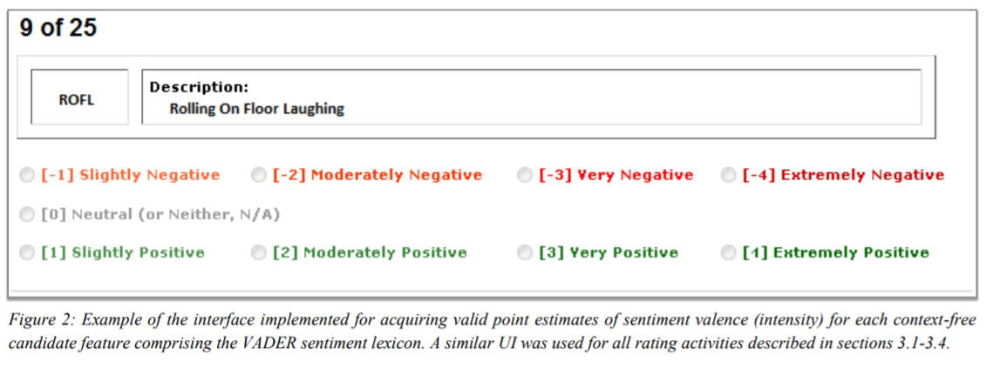
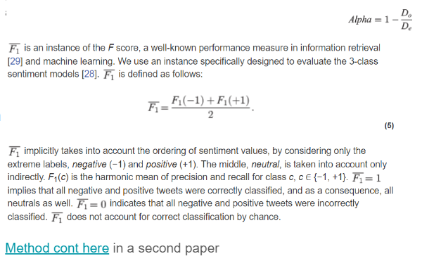

# Sentiment Analysis

A sentiment model is only as good as the words and labels it learns from, so this page starts with the data, not the model. It goes from sentiment lexicons and review or tweet datasets, to how the VADER raters were screened and how multilingual tweet agreement was measured, and then to the analyzers themselves, VADER and TextBlob, with the papers behind them.

## Databases

Everything downstream depends on a list of words with a polarity, or a set of texts someone already labeled. [Sentiment databases](https://medium.com/@datamonsters/sentiment-analysis-tools-overview-part-1-positive-and-negative-words-databases-ae35431a470c) is part 1 of the Data Monsters tools overview: sentiment tools rely on lists of words and phrases with positive and negative connotations, and the post looks at the best-known of those word databases. Sentiwordnet, which maps wordnet senses to a polarity model, is one of them, and the [SentiWordnet Site](https://github.com/aesuli/SentiWordNet) is its repository.

Labeled texts are the other half. For movie reviews, the [IMDB reviews dataset on Kaggle](https://www.kaggle.com/c/word2vec-nlp-tutorial/data) is the Bag of Words Meets Bags of Popcorn competition, which uses Google's Word2Vec on movie reviews. For tweets, [Twitter airline sentiment on Kaggle](https://www.kaggle.com/crowdflower/twitter-airline-sentiment) shows how travelers in February 2015 expressed their feelings on Twitter, and [First GOP Debate Twitter Sentiment](https://www.kaggle.com/crowdflower/first-gop-debate-twitter-sentiment) is tweets on the first 2016 GOP Presidential Debate. For products, [Amazon fine foods reviews](https://www.kaggle.com/snap/amazon-fine-food-reviews) is about 500,000 food reviews from Amazon.

## Ground Truth

A dataset is only ground truth if the people who labeled it can be trusted, and two projects wrote down how they checked that: VADER screened its raters, and a multilingual tweet study measured their agreement. The same notes are in [Inter agreement](../data/annotation-and-disagreement.md#inter-agreement).

VADER's rating process is a genuine checklist, quoted here in order:

1. For sentiment In Vader -
 1. “Screening for English language reading comprehension – each rater had to individually score an 80% or higher on a standardized college-level reading comprehension test.
 2. Complete an online sentiment rating training and orientation session, and score 90% or higher for matching the known (prevalidated) mean sentiment rating of lexical items which included individual words, emoticons, acronyms, sentences, tweets, and text snippets (e.g., sentence segments, or phrases).
 3. Every batch of 25 features contained five “golden items” with a known (pre-validated) sentiment rating distribution. If a worker was more than one standard deviation away from the mean of this known distribution on three or more of the five golden items, we discarded all 25 ratings in the batch from this worker.
 4. Bonus to incentivize and reward the highest quality work. Asked workers to select the valence score that they thought “most other people” would choose for the given lexical feature (early/iterative pilot testing revealed that wording the instructions in this manner garnered a much tighter standard deviation without significantly affecting the mean sentiment rating, allowing us to achieve higher quality (generalized) results while being more economical).
 5. Compensated AMT workers $0.25 for each batch of 25 items they rated, with an additional $0.25 incentive bonus for all workers who successfully matched the group mean (within 1.5 standard deviations) on at least 20 of 25 responses in each batch. Using these four quality control methods, we achieved remarkable value in the data obtained from our AMT workers – we paid incentive bonuses for high quality to at least 90% of raters for most batches.

The figure below summarizes those quality controls.

<figure><figcaption>
VADER ground-truth rating quality controls.

Credit: <a href="https://lh3.googleusercontent.com/69nazHo5T9cGMIhgljIDJ4muIjo-fa3PGetGTJwMsktsM699NA2a212TbyqityPup5Q3mVztCO9ieDKSk8y_qDUrTt4DNsCXkjK0Hg70JLyu-xzdqIQScsuc6Va2M2sH_Bp0o8Z_">copied from the original hosted image</a>.
</figcaption></figure>

Screening raters up front is one approach; the other is to measure agreement after the fact. [Multilingual Twitter Sentiment Classification: The Role of Human Annotators](https://journals.plos.org/plosone/article?id=10.1371/journal.pone.0155036) asks what the limits of automated Twitter sentiment classification are, and finds that model quality depends much more on the quality and size of the training data than on the type of model. The study labelled 1.6 million tweets in 13 languages and evaluated 6 pretrained classification models with 10 CFV, using SVM and NB. For annotator agreement, about 15% of the tweets were intentionally duplicated to be annotated twice, either by the same annotator or by two different annotators. Multiple annotations by the same annotator give self-agreement, and multiple annotations by different annotators give inter-agreement. The confidence intervals for the agreements are estimated by bootstrapping [[12](https://journals.plos.org/plosone/article?id=10.1371/journal.pone.0155036#pone.0155036.ref012)]. It turns out that the self-agreement is a good measure to identify low quality annotators, while the inter-annotator agreement provides a good estimate of the objective difficulty of the task, unless it is too low.

The agreement itself is measured with Alpha. Alpha was developed to measure the agreement between human annotators, but can also be used to measure the agreement between classification models and a gold standard. It generalizes several specialized agreement measures, takes ordering of classes into account, and accounts for the agreement by chance. Alpha is defined as follows:

<figure><figcaption>
Alpha agreement definition.

Credit: <a href="https://lh4.googleusercontent.com/_7WwUqxDoCvZwOyBlIUEe0k4IWAq1dlTS_kgyBiddpOgIbUS-HcArQzOE3gHDurmR0pceyxF71PZU-NsY5Q65fe_3cFpnak029I3RNnJ_ofWTGjuHwIIYo-GacTF6bKpNSP50FPP">copied from the original hosted image</a>.
</figcaption></figure>

The [Method cont here](https://journals.plos.org/plosone/article?id=10.1371/journal.pone.0194317) in a second paper, How to evaluate sentiment classifiers for Twitter time-ordered data?, which takes up the question of how to properly evaluate sentiment classifiers on Twitter, since there is no settled way to do so and social media is a growing source on the public mood about elections, Brexit, and the stock market.

## Tools

With labels that can be trusted, the choice is which analyzer to run. ** Many [Sentiment tools,](https://medium.com/@datamonsters/sentiment-analysis-tools-overview-part-2-7f3a75c262a3) are covered in part 2 of the Data Monsters overview, mostly from the tools' official websites. The one in NLTK is the [NTLK sentiment analyzer](http://www.nltk.org/api/nltk.sentiment.html), the nltk.sentiment package.

Vader runs both inside NTLK and standalone. A set of Vader, Sentiwordnet, and other python code examples, possibly good for ensembles, used to be linked here; that address now points to an unrelated site and is kept at the end of the page. The social media walkthrough at https://t-redactyl.io/posts/2017-04-08-sentiment-analysis-for-social-media/ comes with the ** [Intro into Vader](http://t-redactyl.io/blog/2017/04/using-vader-to-handle-sentiment-analysis-with-social-media-text.html) on using VADER for social media text. [Why vader?](https://www.quora.com/Which-is-the-superior-Sentiment-Analyzer-Vader-or-TextBlob) is the Quora question on whether Vader or TextBlob is the superior analyzer. ** [Vader - a clear explanation about the paper’s methodology](https://www.ijariit.com/manuscripts/v4i1/V4I1-1307.pdf) is Twitter Sentiment Analysis using Vader by Chauhan Vipul Kumar, Bansal Ashish, and Goel Amita in the International Journal of Advance Research, Ideas and Innovations in Technology. A simple intro to [Vader](https://medium.com/@aneesha/quick-social-media-sentiment-analysis-with-vader-da44951e4116) is Aneesha Bakharia's quick social media sentiment analysis with the Valence Aware Dictionary and sEntiment Reasoner, the open source python library that classifies sentiment out of the box, even without your own labeled data. [A very lengthy and overly complex explanation about using NTLK vader](https://programminghistorian.org/en/lessons/sentiment-analysis) is the Programming Historian lesson on sentiment analysis for exploratory data analysis. [Vader tutorial, +-0.2 for neutrals.](https://www.learndatasci.com/tutorials/sentiment-analysis-reddit-headlines-pythons-nltk/) is sentiment analysis on Reddit news headlines with Python's NLTK.

Text BLob is the other analyzer in that Quora comparison. Text blob classification had its own source, which is kept at the end of the page. [Python code](https://planspace.org/20150607-textblob_sentiment/) is TextBlob sentiment: calculating polarity and subjectivity. A getting-started page with more code used to sit here; that address now points to an unrelated site and is kept at the end of the page. [A lengthy tutorial](https://www.analyticsvidhya.com/blog/2018/02/natural-language-processing-for-beginners-using-textblob/) is the beginners' guide to TextBlob as an interface for basic NLP tasks like sentiment analysis and POS tagging. ** [Text blob sentiment analysis tutorial on medium](https://medium.com/@rahulvaish/textblob-and-sentiment-analysis-python-a687e9fabe96) is Rahul Vaish's very simple example of sentiment analysis in Python with TextBlob. [A lengthy intro plus code about text blob](https://aparrish.neocities.org/textblob.html) is the long form of the same material.

Behind the tools are the review papers. [Comparative opinion mining a review paper - has some info about unsupervised as well](https://arxiv.org/pdf/1712.08941.pdf) is from the Faculty of Computer Science & Information Technology at the University of Malaya. [Another reference list, has some unsupervised.](http://scholar.google.co.il/scholar_url?url=http://www.nowpublishers.com/article/DownloadSummary/INR-011&hl=en&sa=X&scisig=AAGBfm0NN0Pge4htltclF-D6H4BpxocqwA&nossl=1&oi=scholarr) goes through a Google Scholar redirect. For the lexicon from the Databases section, Sentiwordnet3.0 has its own [paper](https://www.researchgate.net/profile/Fabrizio_Sebastiani/publication/220746537_SentiWordNet_30_An_Enhanced_Lexical_Resource_for_Sentiment_Analysis_and_Opinion_Mining/links/545fbcc40cf27487b450aa21.pdf). A sentiment presentation used to sit here as well; it is kept at the end of the page.

Lexicons are not only English or only polarity. [Hebrew Psychological Lexicons](https://github.com/natalieShapira/HebrewPsychologicalLexicons) is the natalieShapira/HebrewPsychologicalLexicons repository.

 This is the official code accompanying a paper on the [Hebrew Psychological Lexicons](https://www.aclweb.org/anthology/2021.clpsych-1.6.pdf) was presented at CLPsych 2021. The figure below summarizes the lexicon.

<figure><figcaption>
Summary Hebrew Psych Lexicon
</figcaption></figure>

Reference papers:

The reference paper that grounds the tweet datasets above is Alexander Pak and Patrick Paroubek's Twitter as a Corpus for Sentiment Analysis and Opinion Mining: [Twitter as a corpus for SA and opinion mining](http://crowdsourcing-class.org/assignments/downloads/pak-paroubek.pdf).

## Deprecated links


These links and images no longer work. The original wording is kept here. A same-resource copy, when one was checked, is used above.


- Sentiwordnet – mapping wordnet senses to a polarity model: SentiWordnet Site This address no longer opens: http://sentiwordnet.isti.cnr.it/
- Text blob classification This address no longer opens: http://rwet.decontextualize.com/book/textblob/
- presentation This address no longer opens: https://web.stanford.edu/class/cs124/lec/sentiment.pdf
- Vader/Sentiwordnet/etc python code examples - possibly good for ensembles. This address now points to an unrelated site: https://nlpforhackers.io/sentiment-analysis-intro/
- More code. This address now points to an unrelated site: https://textminingonline.com/getting-started-with-textblob
