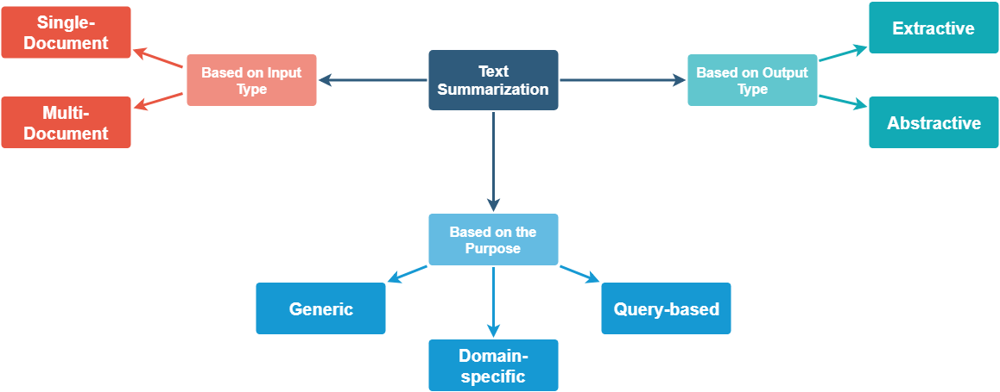

# Summarization

Summarization shortens a document, and the first choice is whether to pick existing sentences (extractive) or write new ones (abstractive). The page starts with overviews and surveys of both, then goes through abstractive models and their code, then keyword extraction with TextRank, and ends with extractive methods and the libraries that implement them.

The same notes are in [NLP for hackers tutorials](foundation-nlp.md#nlp-for-hackers-tutorials).

The figure below is the intro image from the Jatana email summarization post, which is the first link that follows.

<figure><figcaption>
Jatana unsupervised text summarization overview.

Credit: <a href="https://lh4.googleusercontent.com/eoFe8uZJHAZ8cil1x7TZ-rENzkfkQE3wVr5fHGbeS17h2GlsSMJcFzZ4plUDHd7TN1gsZ6OKKp-WelNVaHmFhOVXxPltjxSN_USk3s5Ro_L1Ct-yLiST1q7ST5k5W80CkyHZj7eM">copied from the original hosted image</a>.
</figcaption></figure>

The simplest summarizers score sentences and keep the best. [Email summarization but with a great intro (see image above)](https://medium.com/jatana/unsupervised-text-summarization-using-sentence-embeddings-adb15ce83db1) does it using sent2vec clustering picking rank. [With nltk](https://stackabuse.com/text-summarization-with-nltk-in-python/) — words assigned weighted frequency, summed up in sentences and then selected based on the top K scored sentences.

Before choosing a method, the reading lists map the field. [Awesome-text-summarization on github](https://github.com/mathsyouth/awesome-text-summarization#abstractive-text-summarization) is the curated list of resources dedicated to text summarization. [Methodical review of abstractive summarization](https://medium.com/@madrugado/interesting-stuff-at-emnlp-part-ii-ce92ac928f16) is part II of Valentin Malykh's notes on interesting work at EMNLP. [Medium on extractive and abstractive - overview with the abstractive code](https://medium.com/data-science/data-scientists-guide-to-summarization-fc0db952e363) is Richa Bathija's data scientist's guide to summarization.

The abstractive line starts with an attention model. [NAMAS](https://arxiv.org/abs/1509.00685) is A Neural Attention Model for Abstractive Sentence Summarization: extraction is inherently limited and generation is hard to build, so the paper proposes a fully data-driven approach with a local attention-based model that generates each word of the summary conditioned on the input sentence. The code is facebookarchive/NAMAS — [Neural attention model for abstractive summarization](https://github.com/facebookarchive/NAMAS) — and the conference version is — [Neural Attention Model for Abstractive Sentence Summarization](https://www.aclweb.org/anthology/D/D15/D15-1044.pdf). The same NAMAS code — summarizes single sentences quite well [github](https://github.com/facebookarchive/NAMAS).

Once both families are on the table, the introductions compare them. [Abstractive vs extractive, blue intro](https://www.salesforce.com/products/einstein/ai-research/tl-dr-reinforced-model-abstractive-summarization/) is Salesforce's reinforced model for abstractive summarization, on a page that now leads to Salesforce's general artificial intelligence site. [Intro to text summarization](https://medium.com/data-science/a-quick-introduction-to-text-summarization-in-machine-learning-3d27ccf18a9f) is Education Ecosystem's quick introduction: shortening long text into a coherent and fluent summary with only the main points. [Paper: survey on text summ](https://arxiv.org/pdf/1707.02268.pdf) is Text Summarization Techniques: A Brief Survey, and its [arxiv](https://arxiv.org/abs/1707.02268) page says why it exists: the explosion of text data from many sources has to be summarized to be useful, so the review describes the main approaches to automatic summarization and their effectiveness and shortcomings. [Very short intro](https://medium.com/@stephenhky/summarizing-text-summarization-5d83ff2863a2) is a blog entry that briefly summarizes that same survey. [Intro on encoder decoder](https://medium.com/@social_20188/text-summarization-cfdbbd6fb800) starts from how hard it is for people to summarize large documents by hand in a fast-growing information age. [Unsupervised methods using sentence emebeddings (long and good)](https://medium.com/jatana/unsupervised-text-summarization-using-sentence-embeddings-adb15ce83db1) is the Jatana post again, read for its method this time. [Abstractive summarization using bert for sota](https://medium.com/data-science/summarization-has-gotten-commoditized-thanks-to-bert-9bb73f2d6922) is the argument that summarization has gotten commoditized thanks to BERT, with Yang Liu's work behind it.

The abstractive code is where most attempts break, and the notes say which ones did:

- [Git1: uses pytorch 0.7, fails to work no matter what i did](https://github.com/alesee/abstractive-text-summarization) is a PyTorch implementation of Abstractive Text Summarization using Sequence-to-sequence RNNs and Beyond.
- [Git2, keras code for headlines, missing dataset](https://github.com/udibr/headlines) automatically generates headlines to short articles.
- [Encoder decoder in keras using rnn, claims cherry picked results, the majority is probably not as good](https://hackernoon.com/text-summarization-using-keras-models-366b002408d9) is by Rajdeep Dua and Manpreet Singh Ghotra of Salesforce.
- [A lot of Text summarization algos on git, using seq2seq, using many methods, glove, etc -](https://github.com/chen0040/keras-text-summarization) is text summarization using seq2seq in Keras.
- [Summarization with point generator networks](https://github.com/becxer/pointer-generator/) is Python3 code for the ACL 2017 paper Get To The Point: Summarization with Pointer-Generator Networks.
- Summarization based on gigaword claims SOTA; that source is kept at the end of the page.
- [Facebooks neural attention network](https://github.com/facebookarchive/NAMAS) is the NAMAS code from above.
- [Medium on summarization with tensor flow on news articles from cnn](https://hackernoon.com/how-to-run-text-summarization-with-tensorflow-d4472587602d) is on HackerNoon.

Keywords extraction is the step that TextRank made standard, and it feeds extractive summaries. [The best text rank presentation](http://ai.fon.bg.ac.rs/wp-content/uploads/2017/01/Topic_modeling_and_graph-based_keywords_extraction_2017.pdf) is Topic modeling and graph-based keywords extraction 2017, which also cites LDA as the simplest topic modelling method. [Text rank by gensim on medium](https://medium.com/@shivangisareen/text-summarisation-with-gensim-textrank-46bbb3401289) separates extractive methods, which select phrases and sentences from the source, from abstractive methods, which generate new ones. [Text rank 2](http://ai.intelligentonlinetools.com/ml/text-summarization/) is automatic text summarization with Python. A text rank note with custom code, extractive vs abstractive, how to use it, and page rank intuition used to be linked here; that address now points to an unrelated site and is kept at the end of the page. [Text rank paper](https://web.eecs.umich.edu/~mihalcea/papers/mihalcea.emnlp04.pdf) introduces TextRank, a graph-based ranking model for text, with two unsupervised methods for keyword and sentence extraction that compare favorably on established benchmarks. [Improving textrank using adjectival and noun compound modifiers](https://graphaware.com/neo4j/2017/10/03/efficient-unsupervised-topic-extraction-nlp-neo4j.html) is GraphAware on efficient unsupervised keywords extraction using graphs. [New similarity function paper for textrank](https://arxiv.org/pdf/1602.03606.pdf): This paper proposes a new similarity function for TextRank-style keyword and sentence ranking, and reports whether that change improves graph-based summarization quality over the usual overlap or TF-IDF edge weights.

Extractive summarization uses the same ranking on whole sentences. [Text rank with glove vectors instead of tf-idf as in the paper](https://medium.com/analytics-vidhya/an-introduction-to-text-summarization-using-the-textrank-algorithm-with-python-implementation-2370c39d0c60) is an introduction to TextRank with a Python implementation, for readers who have no time to go through entire articles to decide if they are useful. [Medium with code on extractive using word occurrence similarity + cosine, pick top based on rank](https://medium.com/data-science/understand-text-summarization-and-create-your-own-summarizer-in-python-b26a9f09fc70) builds your own summarizer in python, the kind news and sports apps use so readers can check a summary before the full article. [Medium on methods, freq, LSA, linking words, sentences,bayesian, graph ranking, hmm, crf,](https://medium.com/sciforce/towards-automatic-text-summarization-extractive-methods-e8439cd54715) is the survey of extractive methods. [Wiki on automatic summarization, abstractive vs extractive,](https://en.wikipedia.org/wiki/Automatic_summarization#TextRank_and_LexRank) is the Wikipedia article, at its TextRank and LexRank section. [Pyteaser, textteaset, lexrank, pytextrank summarization models & rouge-1/n and blue metrics to determine quality of summarization models](https://rare-technologies.com/text-summarization-in-python-extractive-vs-abstractive-techniques-revisited/) Bottom line is that textrank is competitive to sumy_lex.

The same notes are in [Metrics](../generative-ai/large-language-models-llms.md#metrics).

The models in that comparison are libraries you can install. [Sumy](https://github.com/miso-belica/sumy) is a module for automatic summarization of text documents and HTML pages. [Pyteaser](https://github.com/xiaoxu193/PyTeaser) summarizes news articles. [Pytextrank](https://github.com/ceteri/pytextrank) is the Python implementation of TextRank algorithms for phrase extraction. [Lexrank](https://www.cs.cmu.edu/afs/cs/project/jair/pub/volume22/erkan04a-html/erkan04a.html) is the paper LexRank: Graph-based Lexical Centrality as Salience in Text Summarization. [Gensim tutorial on textrank](https://www.machinelearningplus.com/nlp/gensim-tutorial/) is Selva Prabhakaran's complete beginners' guide to Gensim, the package billed as topic modeling for humans. The page ends where it began, with [Email summarization](https://github.com/jatana-research/email-summarization), the module that clusters skip-thought sentence embeddings to summarize e-mail.

## Deprecated links


These links and images no longer work. The original wording is kept here. A same-resource copy, when one was checked, is used above.


- Medium on extractive and abstractive - overview with the abstractive code This address no longer opens: https://towardsdatascience.com/data-scientists-guide-to-summarization-fc0db952e363
- Intro to text summarization This address no longer opens: https://towardsdatascience.com/a-quick-introduction-to-text-summarization-in-machine-learning-3d27ccf18a9f
- Abstractive summarization using bert for sota This address no longer opens: https://towardsdatascience.com/summarization-has-gotten-commoditized-thanks-to-bert-9bb73f2d6922
- Summarization based on gigaword claims SOTA This address no longer opens: https://github.com/tensorflow/models/tree/master/research/textsum
- Medium with code on extractive using word occurrence similarity + cosine, pick top based on rank This address no longer opens: https://towardsdatascience.com/understand-text-summarization-and-create-your-own-summarizer-in-python-b26a9f09fc70
- Text rank - custom code, extractive vs abstractive, how to use, some more theoretical info and page rank intuition. This address now points to an unrelated site: https://nlpforhackers.io/textrank-text-summarization/
