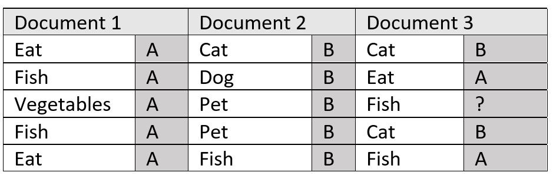
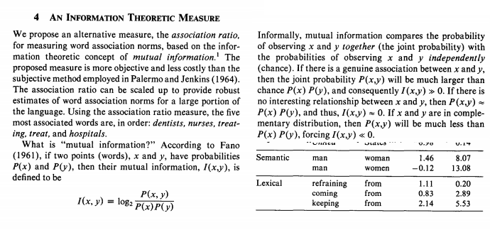
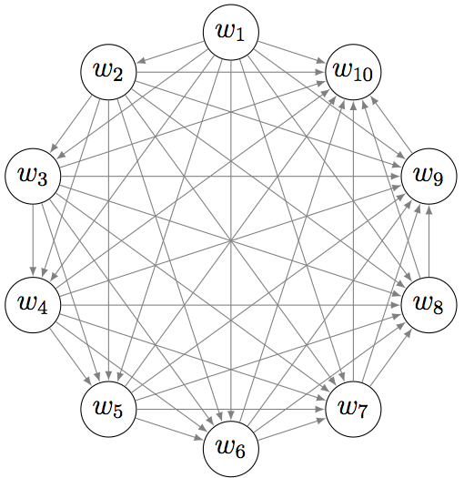

# Topics Modeling

Once TF-IDF says which words matter, the next question is which themes a whole corpus is about, without labels. The page follows the methods in the order they appeared: LSA as TF-IDF plus SVD, then NMF, then the long practice of LDA and its Mallet variant, then how to judge topics with coherence and how to read them with pyLDAvis, and finally the embedding hybrids lda2vec and Top2Vec, with a few loose pointers at the end.

## LSA (TFIDF + SVD)

The first topic model is just linear algebra on the TF-IDF matrix, and the overviews below compare it with the probabilistic models that followed.

The same notes are in [LSA](../predictive-ml/dimensionality-reduction-methods.md#lsa), [TF-IDF](tf-idf.md), and [TFIDF](tf-idf.md#tfidf).

[A very good article about LSA (TFIDV X SVD), pLSA, LDA, and LDA2VEC.](https://medium.com/nanonets/topic-modeling-with-lsa-psla-lda-and-lda2vec-555ff65b0b05) Medium high level theoretical not clear: Joyce Xu's comprehensive overview of topic modeling and its associated techniques. For code, the [Lda2vec code](http://nbviewer.jupyter.org/github/cemoody/lda2vec/blob/master/examples/twenty_newsgroups/lda2vec/lda2vec.ipynb) notebook includes code and explanation about Dirichlet probability. [A descriptive comparison for LSA pLSA and LDA](https://www.reddit.com/r/MachineLearning/comments/10mdtf/lsa_vs_plsa_vs_lda/) is the Reddit thread comparing them.

## NMF (Non Negative Matrix Factorization )

LSA allows negative weights, which are hard to read as topics; Non-negative Matrix factorization (NMF) keeps every weight non-negative so a topic is an additive mix of words. [Medium Article about LDA and](https://medium.com/ml2vec/topic-modeling-is-an-unsupervised-learning-approach-to-clustering-documents-to-discover-topics-fdfbf30e27df) NMF Non negative Matrix factorization code is Ravish Chawla's topic modeling with LDA and NMF on the ABC News Headlines dataset, which treats topic modeling as unsupervised clustering of documents, close to how K-Means and Expectation-Maximization work. The scikit-learn version is [Sklearn LDA and NMF for topic modelling](http://scikit-learn.org/stable/auto_examples/applications/plot_topics_extraction_with_nmf_lda.html#sphx-glr-auto-examples-applications-plot-topics-extraction-with-nmf-lda-py), an example of applying NMF and LatentDirichletAllocation on a corpus of documents to extract additive models of the topic structure of the corpus.

## LDA (Latent Dirichlet Allocation)

NMF factorizes a matrix; LDA models how documents are generated, and most of the practical advice on topic modeling is about it. The reading below moves from what LDA is, to tutorials and code, to the TF versus TF-IDF input question, to evaluation and choosing the number of topics, and then to variants, uses, and parameters.

The same notes are in [FEATURE ENGINEERING](../data/feature-engineering.md#feature-engineering).

A [great summation](https://cs.stanford.edu/~ppasupat/a9online/1140.html) about topic modeling, Pros and Cons! (LSA, pLSA, LDA) is the place to start. (LDA) Latent Dirichlet Allocation here means the topic model; the name LDA is already taken by the above algorithm!, so read the acronym in context. [Latent Dirichlet allocation (LDA) -](https://algorithmia.com/algorithms/nlp/LDA) This algorithm takes a group of documents (anything that is made of up text), and returns a number of topics (which are made up of a number of words) most relevant to these documents.

The explanations come next. [Medium Article about LDA and](https://medium.com/ml2vec/topic-modeling-is-an-unsupervised-learning-approach-to-clustering-documents-to-discover-topics-fdfbf30e27df) NMF Non negative Matrix factorization code is the same ABC News Headlines walkthrough from the NMF section. [Medium article on LDA - a good one with pseudo algorithm and proof](https://medium.com/@jonathan_hui/machine-learning-latent-dirichlet-allocation-lda-1d9d148f13a4) is Jonathan Hui's, framed around letting tweets self-identify the topics voters care about instead of pre-categorizing them. In case LDA groups together two topics, we can influence the algorithm in a way that makes those two topics separable - [this is called Semi Supervised Guided LDA](https://medium.freecodecamp.org/how-we-changed-unsupervised-lda-to-semi-supervised-guidedlda-e36a95f3a164).

For building it, [LDA tutorials plus code](https://www.machinelearningplus.com/nlp/topic-modeling-gensim-python/) is the gensim tutorial on extracting good quality topics, used this to build my own classes - using gensim mallet wrapper, doesn't work on pyLDAviz, so use [this](http://jeriwieringa.com/2018/07/17/pyLDAviz-and-Mallet/#comment-4018495276), Jeri E. Wieringa's post on using pyLDAvis with Mallet. "Predicting what user reviews are about with LDA and gensim", by Michael Rose, is the [Introduction to LDA topic modelling, really good,](http://www.vladsandulescu.com/topic-prediction-lda-user-reviews/) [plus git code](https://github.com/vladsandulescu/topics) for topic modeling with gensim and LDA. The [Sklearn examples using LDA and NMF](http://scikit-learn.org/stable/auto_examples/applications/plot_topics_extraction_with_nmf_lda.html#sphx-glr-auto-examples-applications-plot-topics-extraction-with-nmf-lda-py) are the same scikit-learn example as above. [Tutorial on lda/nmf on medium](https://medium.com/mlreview/topic-modeling-with-scikit-learn-e80d33668730) using tfidf matrix input is Aneesha Bakharia's topic modeling with scikit-learn, written because gensim scales well but does not include NMF. [Gensim and sklearn LDA variants, comparison](https://gist.github.com/aronwc/8248457) is an example using gensim's LDA and sklearn, and [python 3](https://github.com/EricSchles/sklearn_gensim_example/blob/master/example.py) is the sklearn_gensim_example version of it. The Bakharia post is linked again as the [Medium article on lda/nmf with code](https://medium.com/mlreview/topic-modeling-with-scikit-learn-e80d33668730).

Which input to feed each model is the question that trips people up. One of the best explanation about [Tf-idf vs bow for LDA/NMF](https://stackoverflow.com/questions/44781047/necessary-to-apply-tf-idf-to-new-documents-in-gensim-lda-model) - tf for lda, tfidf for nmf, but tfidf can be used for top k selection in lda + visualization, [important paper](http://www.cs.columbia.edu/~blei/papers/BleiLafferty2009.pdf) by David M. Blei and John D. Lafferty. The question itself came from the gensim English Wikipedia tutorial, which uses tf-idf in training but feeds a bag-of-words to new documents. [LDA is a probabilistic](https://stackoverflow.com/questions/40171208/scikit-learn-should-i-fit-model-with-tf-or-tf-idf) generative model that generates documents by sampling a topic for each word and then a word from the sampled topic. The generated document is represented as a bag of words. The answer continues:

**NMF is in its general definition the search for 2 matrices W and H such that W\*H=V where V is an observed matrix. The only requirement for those matrices is that all their elements must be non negative.

From the above definitions it is clear that in LDA only bag of words frequency counts can be used since a vector of reals makes no sense. Did we create a word 1.2 times? On the other hand we can use any non negative representation for NMF and in the example tf-idf is used.

As far as choosing the number of iterations, for the NMF in scikit learn I don't know the stopping criterion although I believe it is the relative improvement of the loss function being smaller than a threshold so you 'll have to experiment. For LDA I suggest checking manually the improvement of the log likelihood in a held out validation set and stopping when it falls under a threshold.

The rest of the parameters depend heavily on the data so I suggest, as suggested by @rpd, that you do a parameter search.

So to sum up, LDA can only generate frequencies and NMF can generate any non negative matrix.

With the input settled, the models can be compared. [How to measure the variance for LDA and NMF, against PCA.](https://stackoverflow.com/questions/48148689/how-to-compare-predictive-power-of-pca-and-nmf) 1. Variance score the transformation and inverse transformation of data, test for 1,2,3,4 PCs/LDs/NMs. When Mallet and gensim disagree, the gensim group thread is [Matching lda mallet performance with gensim and sklearn lda via hyper parameters](https://groups.google.com/forum/#!topic/gensim/bBHkGogNrfg).

[What is LDA?](https://www.quora.com/Is-LDA-latent-dirichlet-allocation-unsupervised-or-supervised-learning) is the Quora question on whether LDA is unsupervised or supervised learning, and the answer is a short sequence:

 1. It is unsupervised natively; it uses joint probability method to find topics(user has to pass # of topics to LDA api). If “Doc X word” is size of input data to LDA, it transforms it to 2 matrices:
 2. Doc X topic
 3. Word X topic
 4. further if you want, you can feed “Doc X topic” matrix to supervised algorithm if labels were given.

Medium on [LDA](https://medium.com/ml2vec/topic-modeling-is-an-unsupervised-learning-approach-to-clustering-documents-to-discover-topics-fdfbf30e27df), explains the random probabilistic nature of LDA, and the figure below is from that explanation.

<figure><figcaption>
LDA random probabilistic nature.

Credit: <a href="https://lh6.googleusercontent.com/-16nr83feu9UQzaIoi4CIMYwSHRhH99p49scg_Mnk9PH7EmMh-Q6410FLxPtwZCapOrKkq3J9MK7njHPD21o1TYxZYZopSHAoWCKFuwCMU8Rcy0kLIacqWcPqtETr8ZuTaxN6BLn">copied from the original hosted image</a>.
</figcaption></figure>

Because the model is random, the tutorials that grid search it matter. Machinelearningplus on [LDA in sklearn](https://www.machinelearningplus.com/nlp/topic-modeling-python-sklearn-examples/) is Selva Prabhakaran's guide to grid searching the best LDA topic model in scikit-learn - a great read, dont forget to read the [mallet](https://www.machinelearningplus.com/nlp/topic-modeling-gensim-python/) one too. Medium on [LSA pLSA, LDA LDA2vec](https://medium.com/nanonets/topic-modeling-with-lsa-psla-lda-and-lda2vec-555ff65b0b05) is the Joyce Xu overview from the LSA section. [Medium on LSI vs LDA vs HDP, HDP wins..](https://medium.com/square-corner-blog/topic-modeling-optimizing-for-human-interpretability-48a81f6ce0ed) is Alyssa Wisdom's Square post on optimizing topics for human interpretability; the blog has since moved to Square's developer site. Medium on [LDA](https://medium.com/@samsachedina/effective-data-science-latent-dirichlet-allocation-a109742f7d1c), some historical reference and general high level how to use exapmles.

Evaluation is where LDA is easiest to misuse. [Incredibly useful response](https://www.quora.com/What-are-good-ways-of-evaluating-the-topics-generated-by-running-LDA-on-a-corpus) on LDA grid search params and about LDA expectations. Must read. [Lda vs pLSA](https://stats.stackexchange.com/questions/155860/latent-dirichlet-allocation-vs-plsa), talks about the sampling from a distribution of distributions in LDA. [BLog post on topic modelling](http://mcburton.net/blog/joy-of-tm/) - has some text about overfitting - undiscussed in many places. [Perplexity vs coherence on held out unseen dat](https://stats.stackexchange.com/questions/182010/when-is-it-ok-to-not-use-a-held-out-set-for-topic-model-evaluation)a, not okay and okay, respectively. Due to how we measure the metrics, ie., read the formulas. That question asks when a held-out set is unnecessary, for a corpus that is complete and modeled only for exploration. [Also this](https://transacl.org/ojs/index.php/tacl/article/view/582/158), "Improving Topic Models with Latent Feature Word Representations" in TACL, and [this](https://stackoverflow.com/questions/11162402/lda-topic-modeling-training-and-testing), on training and testing LDA once the Gibbs sampler or variational Bayes has produced topics.

LDA also has uses and knobs beyond topics. LDA as [dimentionality reduction ](https://stackoverflow.com/questions/46504688/lda-as-the-dimension-reduction-before-or-after-partitioning) asks whether to reduce before or after splitting train and test for classification. [LDA on alpha and beta to control density of topics](https://stats.stackexchange.com/questions/364494/lda-and-test-data-perplexity) starts from test perplexity that rises with the number of topics in sklearn. The Jupyter notebook on [hacknews LDA topic modelling](http://nbviewer.jupyter.org/github/bmabey/hacker_news_topic_modelling/blob/master/HN%20Topic%20Model%20Talk.ipynb#topic=55&lambda=1&term=) is a worked example, and this [Jupyter notebook](http://nbviewer.jupyter.org/github/dolaameng/tutorials/blob/master/topic-finding-for-short-texts/topics_for_short_texts.ipynb) for kmeans, lda, svd,nmf comparison - advice is to keep nmf or other as a baseline to measure against LDA.

Coherence is the metric most of this points to. [Gensim on LDA](https://rare-technologies.com/what-is-topic-coherence/) was the gensim post on topic coherence; the address now opens PII Tools, a sensitive data discovery product for PII compliance. The same material with [code ](https://nbviewer.jupyter.org/github/dsquareindia/gensim/blob/280375fe14adea67ce6384ba7eabf362b05e6029/docs/notebooks/topic_coherence_tutorial.ipynb) is the topic coherence tutorial notebook. [Medium on lda with sklearn](https://medium.com/mlreview/topic-modeling-with-scikit-learn-e80d33668730) is the Bakharia post once more.

Selecting the number of topics in LDA has no single answer, so the author collected many. Blog 1 is kept at the end of the page; [blog2](http://www.rpubs.com/MNidhi/NumberoftopicsLDA) is Nidhi's optimal number of topics for LDA on RPubs. [using preplexity](https://stackoverflow.com/questions/21355156/topic-models-cross-validation-with-loglikelihood-or-perplexity) is ten-fold cross validation over topic counts, and [prep and aic bic](https://stats.stackexchange.com/questions/322809/inferring-the-number-of-topics-for-gensims-lda-perplexity-cm-aic-and-bic) is inferring the number of topics for gensim's LDA from perplexity, CM, AIC, and BIC on 20 newsgroups. For coherence, [coherence](https://stackoverflow.com/questions/17421887/how-to-determine-the-number-of-topics-for-lda) asks how to estimate the best topic number from the harmonic mean of P(w|z), [coherence2](https://www.machinelearningplus.com/nlp/topic-modeling-gensim-python/#17howtofindtheoptimalnumberoftopicsforlda) is Selva Prabhakaran's gensim tutorial section on finding the optimal number of topics, and [coherence 3 with tutorial](https://datascienceplus.com/evaluation-of-topic-modeling-topic-coherence/) is the evaluation of topic modeling through topic coherence. Two are un[clear](https://community.rapidminer.com/discussion/51283/what-is-the-best-number-of-topics-on-lda), a RapidMiner community thread that now shows an unrelated question about correlation matrices, and [unclear with analysis of stopword % inclusion](https://markhneedham.com/blog/2015/03/24/topic-modelling-working-out-the-optimal-number-of-topics/), Mark Needham working out the optimal number of topics after running mallet. [selecting number of topics](https://www.quora.com/What-are-the-best-ways-of-selecting-number-of-topics-in-LDA): This Quora thread discusses practical ways to choose the number of LDA topics, including perplexity, coherence, heuristics, and when a simpler topic count is preferred even if a coherence peak is higher. [paper: heuristic approach](https://www.ncbi.nlm.nih.gov/pmc/articles/PMC4597325/) is Weizhong Zhao's heuristic approach to determine an appropriate number of topics. The elbow method is kept at the end of the page. [using cv](http://freerangestats.info/blog/2017/01/05/topic-model-cv) is cross-validation of perplexity, and [Paper: new stability metric](https://github.com/derekgreene/topic-stability) + gh code is stability analysis for topic models.

After the count, the words per topic: [Selecting the top K words in LDA](https://stats.stackexchange.com/questions/199263/choosing-words-in-a-topic-which-cut-off-for-lda-topics) asks what cut-off threshold to use instead of a fixed top 8 words. A presentation, best practices for LDA, is kept at the end of the page. [Medium on guidedLDA](https://medium.freecodecamp.org/how-we-changed-unsupervised-lda-to-semi-supervised-guidedlda-e36a95f3a164) - switching from LDA to a variation of it that is guided by the researcher / data.

Applied examples show what the output looks like. Medium on lda - [another introductory](https://medium.com/data-science/thats-mental-using-lda-topic-modeling-to-investigate-the-discourse-on-mental-health-over-time-11da252259c3) is "That's Mental!", LDA on about 30k New York Times articles from the 80s to present to track the discourse on mental health. [la times](https://medium.com/swiftworld/topic-modeling-of-new-york-times-articles-11688837d32f) is topic modeling of New York Times articles, where a topic is a cluster of words that frequently occur together. [Topic modelling through time](https://tedunderwood.com/category/methodology/topic-modeling/) is the topic modeling category of The Stone and the Shell, posts by tedunderwood and michael_simeone.

On tools and parameters, [Mallet vs nltk](https://stackoverflow.com/questions/7476180/topic-modelling-in-mallet-vs-nltk) asks how MALLET differs from NLTK for topic modelling. The first [params](https://github.com/RaRe-Technologies/gensim/issues/193) link is the gensim issue on different mallet results when inferring the whole corpus versus one document at a time, and the second [params](https://groups.google.com/forum/#!topic/gensim/tOoc1Q0Ump0) is a gensim group thread. [Paper: improving feature models](http://aclweb.org/anthology/Q15-1022) is "Improving Topic Models with Latent Feature Word Representations" by Dat Quoc Nguyen, Richard Billingsley, Lan Du, and Mark Johnson.

Topics and word vectors keep getting compared. [Lda vs w2v (doesn't make sense to compare](https://stats.stackexchange.com/questions/145485/lda-vs-word2vec/145488) is Piotr Migdal's question, noting that LDA maps words to a vector of topic probabilities while word2vec maps them to real vectors, and the thread is linked [again here](https://stats.stackexchange.com/questions/145485/lda-vs-word2vec). Rather than compare, they can be combined: [Adding lda features to w2v for classification](https://stackoverflow.com/questions/48140319/add-lda-topic-modelling-features-to-word2vec-sentiment-classification). [Spacy and gensim on 20 news groups](https://www.shanelynn.ie/word-embeddings-in-python-with-spacy-and-gensim/) is Shane Lynn on how to load, use, and make your own word embeddings using Python with gensim and spaCy.

The best topic modelling explanation including usages used to sit here (its address now points to an unrelated site and is kept at the end of the page): insights, a great read, with code - shows how to find similar docs by topic in gensim, and shows how to transform unseen documents and do similarity using sklearn. Its list of uses stands on its own:
 1. Text classification – Topic modeling can improve classification by grouping similar words together in topics rather than using each word as a feature
 2. Recommender Systems – Using a similarity measure we can build recommender systems. If our system would recommend articles for readers, it will recommend articles with a topic structure similar to the articles the user has already read.
 3. Uncovering Themes in Texts – Useful for detecting trends in online publications for example
 4. A Form of Tagging - If document classification is assigning a single category to a text, topic modeling is assigning multiple tags to a text. A human expert can label the resulting topics with human-readable labels and use different heuristics to convert the weighted topics to a set of tags.
 5. [Topic Modelling for Feature Selection](https://www.analyticsvidhya.com/blog/2016/08/beginners-guide-to-topic-modeling-in-python/) - Sometimes LDA can also be used as feature selection technique. Take an example of text classification problem where the training data contain category wise documents. If LDA is running on sets of category wise documents. Followed by removing common topic terms across the results of different categories will give the best features for a category.

The last item's source is also [Another great article about LDA](https://www.analyticsvidhya.com/blog/2016/08/beginners-guide-to-topic-modeling-in-python/), including algorithm, parameters!! And Parameters of LDA:
 1. Alpha and Beta Hyperparameters – alpha represents document-topic density and Beta represents topic-word density. Higher the value of alpha, documents are composed of more topics and lower the value of alpha, documents contain fewer topics. On the other hand, higher the beta, topics are composed of a large number of words in the corpus, and with the lower value of beta, they are composed of few words.
 2. Number of Topics – Number of topics to be extracted from the corpus. Researchers have developed approaches to obtain an optimal number of topics by using Kullback Leibler Divergence Score. I will not discuss this in detail, as it is too mathematical. For understanding, one can refer to this\[1] original paper on the use of KL divergence.
 3. Number of Topic Terms – Number of terms composed in a single topic. It is generally decided according to the requirement. If the problem statement talks about extracting themes or concepts, it is recommended to choose a higher number, if problem statement talks about extracting features or terms, a low number is recommended.
 4. Number of Iterations / passes – Maximum number of iterations allowed to LDA algorithm for convergence.

Ways to improve LDA:
 1. Reduce dimentionality of document-term matrix
 2. Frequency filter
 3. POS filter
 4. Batch wise LDA

For background, Quentin Pleplé's topic modeling bibliography is the [History of LDA](http://qpleple.com/bib/#Newman10a). Mallet's page on topic modeling in multiple languages is [Multilingual - alpha is divided by topic count, reaffirms 7](http://mallet.cs.umass.edu/topics-polylingual.php). [Topic modelling with lda and nmf on medium](https://medium.com/ml2vec/topic-modeling-is-an-unsupervised-learning-approach-to-clustering-documents-to-discover-topics-fdfbf30e27df) - has a very good simple example with probabilities. The hacker news notebook is also the Code: [great for top docs, terms, topics etc.](http://nbviewer.jupyter.org/github/bmabey/hacker_news_topic_modelling/blob/master/HN%20Topic%20Model%20Talk.ipynb#topic=55&lambda=1&term=) Great article: [Many ways of evaluating topics by running LDA](https://www.quora.com/What-are-good-ways-of-evaluating-the-topics-generated-by-running-LDA-on-a-corpus) is the same Quora evaluation thread. The difference between lda in gensim and sklearn, a post on rare, is kept at the end of the page.

The code articles the author relied on most: [The best code article on LDA/MALLET](https://www.machinelearningplus.com/nlp/topic-modeling-gensim-python/), and using [sklearn](https://www.machinelearningplus.com/nlp/topic-modeling-python-sklearn-examples/) (using clustering for getting group of sentences in each topic). [LDA in gensim, a tutorial by gensim](https://nbviewer.jupyter.org/github/rare-technologies/gensim/blob/develop/docs/notebooks/atmodel_tutorial.ipynb) is the gensim notebook, and [Lda on medium](https://medium.com/data-science/topic-modelling-in-python-with-nltk-and-gensim-4ef03213cd21) is Susan Li's topic modelling in Python with NLTK and gensim, applying LDA to turn a set of research papers into a set of topics.

LDA against NMF and SVD comes up again and again. [What are the pros and cons of LDA and NMF in topic modeling? Under what situations should we choose LDA or NMF? Is there comparison of two techniques in topic modeling?](https://www.quora.com/What-are-the-pros-and-cons-of-LDA-and-NMF-in-topic-modeling-Under-what-situations-should-we-choose-LDA-or-NMF-Is-there-comparison-of-two-techniques-in-topic-modeling) and [What is the difference between NMF and LDA? Why are the priors of LDA sparse-induced?](https://www.quora.com/What-is-the-difference-between-NMF-and-LDA-Why-are-the-priors-of-LDA-sparse-induced) are the Quora threads. [Exploring Topic Coherence over many models and many topics](http://aclweb.org/anthology/D/D12/D12-1087.pdf) lda nmf svd, using umass and uci coherence measures. \*\*\* [Practical topic findings for short sentence text](http://nbviewer.jupyter.org/github/dolaameng/tutorials/blob/master/topic-finding-for-short-texts/topics_for_short_texts.ipynb) is the short-text notebook from above. [What's the difference between SVD/NMF and LDA as topic model algorithms essentially? Deterministic vs prob based](https://www.quora.com/Whats-the-difference-between-SVD-NMF-and-LDA-as-topic-model-algorithms-essentially), the priors question once more as [What is the difference between NMF and LDA? Why are the priors of LDA sparse-induced?](https://www.quora.com/What-is-the-difference-between-NMF-and-LDA-Why-are-the-priors-of-LDA-sparse-induced), and [What are the relationships among NMF, tensor factorization, deep learning, topic modeling, etc.?](https://www.quora.com/What-are-the-relationships-among-NMF-tensor-factorization-deep-learning-topic-modeling-etc) round out the Quora set. [Code: lda nmf](https://www.kaggle.com/rchawla8/topic-modeling-with-lda-and-nmf-algorithms) is a Kaggle notebook on the A Million News Headlines data. [A comparison of lda and nmf](https://wiki.ubc.ca/Course:CPSC522/A_Comparison_of_LDA_and_NMF_for_Topic_Modeling_on_Literary_Themes): This course note compares LDA and NMF for topic modeling on literary themes, summarizing when each method is easier to interpret or more stable on that kind of text. [Presentation: lda sparse coding matrix factorization](https://www.cs.cmu.edu/~epxing/Class/10708-15/slides/LDA_SC.pdf) is Eric Xing's CMU slides, which start from what LSI really is. [An experimental comparison between NMF and LDA for active cross-situational object-word learning](https://ieeexplore.ieee.org/abstract/document/7846822) compares the two for learning word-object associations from ambiguous data.

Coherence and presentation material close the LDA list. [Topic coherence in gensom with jupyter code](https://markroxor.github.io/gensim/static/notebooks/topic_coherence_tutorial.html) is the topic_coherence_tutorial notebook. [Topic modelling dynamic presentation](http://chdoig.github.io/pygotham-topic-modeling/#/) is Christine Doig's PyGotham 2015 introduction to topic modeling in Python. Paper: [Topic modelling and event identification from twitter data](https://arxiv.org/abs/1608.02519), says LDA vs NMI (NMF?) and using coherence to analyze. [Just another medium article about ™](https://medium.com/square-corner-blog/topic-modeling-optimizing-for-human-interpretability-48a81f6ce0ed) is the Square interpretability post again. [What is Wrong with Topic Modeling? (and How to Fix it Using Search-based SE)](https://www.researchgate.net/publication/307303102_What_is_Wrong_with_Topic_Modeling_and_How_to_Fix_it_Using_Search-based_SE) is on ResearchGate. [Talk about topic modelling](https://tedunderwood.com/category/methodology/topic-modeling/) is The Stone and the Shell again, and [Intro to topic modelling](http://blog.echen.me/2011/08/22/introduction-to-latent-dirichlet-allocation/) is an introduction to latent Dirichlet allocation.

Short text and other domains need their own tricks. [Detecting topics in twitter](https://github.com/heerme/twitter-topics) is Python code for detecting topics and events from a Twitter stream. [Another topic model tutorial](https://github.com/derekgreene/topic-model-tutorial/blob/master/2%20-%20NMF%20Topic%20Models.ipynb) is the NMF notebook from a tutorial on topic models in Python with scikit-learn. [Neural topic modeling using embedded spaces](https://github.com/elbamos/NeuralTopicModels): This repository explores neural topic models that use embedded spaces, with accompanying code for experiments. Another lda tutorial is kept at the end of the page. [Comparing tweets using lda](https://ink.library.smu.edu.sg/cgi/viewcontent.cgi?article=2374&context=sis_research) is the tweet comparison paper. [Lda and w2v as features for some classification task](https://www.kaggle.com/vukglisovic/classification-combining-lda-and-word2vec) is a Kaggle notebook combining LDA and Word2Vec on Spooky Author Identification. [Improving ™ with embeddings](https://github.com/datquocnguyen/LFTM) is the code for improving LDA and DMM (one-topic-per-document model for short texts) with word embeddings (TACL 2015). [w2v/doc2v for topic clustering - need to see the code to understand how they got clean topics, i assume a human rewrote it](https://medium.com/data-science/automatic-topic-clustering-using-doc2vec-e1cea88449c) is automatic topic clustering using Doc2Vec, motivated by keeping up with fast-moving cybersecurity trends.

## Mallet LDA

Many of the links above use Mallet through gensim, and the two do not give the same topics because they infer differently. [Diff between lda and mallet](https://groups.google.com/forum/#!topic/gensim/_VO4otCV6cU) - The inference algorithms in Mallet and Gensim are indeed different. Mallet uses Gibbs Sampling which is more precise than Gensim's faster and online Variational Bayes. There is a way to get relatively performance by increasing number of passes. The [Mallet in gensim blog post](https://rare-technologies.com/tutorial-on-mallet-in-python/) was the rare-technologies tutorial; that address now opens PII Tools, a sensitive data discovery product.

Mallet's hyperparameters are where the difference shows. Alpha beta in mallet: [contribution](https://datascience.stackexchange.com/questions/199/what-does-the-alpha-and-beta-hyperparameters-contribute-to-in-latent-dirichlet-a) Alpha beta mallet asks what LDA's two hyperparameters contribute and how topics change when either rises or falls. The defaults are:
 1. [The default for alpha is 5.](https://stackoverflow.com/questions/44561609/how-does-mallet-set-its-default-hyperparameters-for-lda-i-e-alpha-and-beta)0 divided by the number of topics. You can think of this as five "pseudo-words" of weight on the uniform distribution over topics. If the document is short, we expect to stay closer to the uniform prior. If the document is long, we would feel more confident moving away from the prior.
 2. With hyperparameter optimization, the alpha value for each topic can be different. They usually become smaller than the default setting.
 3. The default value for beta is 0.01. This means that each topic has a weight on the uniform prior equal to the size of the vocabulary divided by 100. This seems to be a good value. With optimization turned on, the value rarely changes by more than a factor of two.

## COHERENCE (Topic)

Whatever the library, the output needs a score that tracks whether humans find the topics sensible, and coherence metrics such as UMass, UCI, and C_v are that score. [What is?](https://www.quora.com/What-is-topic-coherence) is the Quora question on topic coherence. Most measures are built on PMI, and the [Wiki on pmi](https://en.wikipedia.org/wiki/Pointwise_mutual_information#cite_note-Church1990-1) is the Wikipedia article on pointwise mutual information. [Datacamp on coherence metrics, a comparison, read me.](https://datascienceplus.com/evaluation-of-topic-modeling-topic-coherence/) is the evaluation of topic modeling through coherence. For the idea underneath the metrics, Paper: [explains what is coherence](http://aclweb.org/anthology/J90-1003).

<figure><figcaption>
Topic coherence formulas.

Credit: <a href="https://lh4.googleusercontent.com/Jw5TMIwMSsVYMPRQxe5ZWKC3IDdj8KBAhd4y7nr5nLQZsxdhzDFM8gUVXjVnfZnoqfX-G1t2JjrpxKz2-IyO4WU5VTIOHUJgavudWCaaA18j7bbOf_nUpewy874W-a9SyaOWDSfQ">copied from the original hosted image</a>.
</figcaption></figure>

The formulas above differ mainly in which co-occurrence counts they use, and the papers explain the choice. [Umass vs C\_v, what are the diff? ](https://groups.google.com/forum/#!topic/gensim/CsscFah0Ax8) is the gensim group thread. Paper: umass, uci, nmpi, cv, cp etv. [Exploring the Space of Topic Coherence Measures](http://svn.aksw.org/papers/2015/WSDM_Topic_Evaluation/public.pdf) starts from the fact that topic models give no guarantee on the interpretability of their output. Paper: [Automatic evaluation of topic coherence](https://mimno.infosci.cornell.edu/info6150/readings/N10-1012.pdf) is from NAACL HLT 2010. Paper: [exploring the space of topic coherence methods](https://dl.acm.org/citation.cfm?id=2685324) is the ACM record of the same study. Paper: [Relation between mutial information / entropy and pmi](https://svn.spraakdata.gu.se/repos/gerlof/pub/www/Docs/npmi-pfd.pdf) introduces normalized variants of mutual information and PMI for collocation extraction, easier to interpret and less sensitive to occurrence frequency. Stackexchange: [coherence / pmi how to calc](https://stats.stackexchange.com/questions/158790/topic-similarity-semantic-pmi-between-two-words-wikipedia) computes PMI between two words with Wikipedia as the data source. Paper: [Machine Reading Tea Leaves: Automatically Evaluating Topic Coherence and Topic Model Quality](http://www.aclweb.org/anthology/E14-1056) Paper perplexity needs unseen data coherence doesnt.

An evaluation of topic modelling techniques for twitter (lda lda-u btm w2vgmm) is kept at the end of the page. Paper: [Topic coherence measures](https://svn.aksw.org/papers/2015/WSDM_Topic_Evaluation/public.pdf) is the same WSDM study. [topic modelling from different domains](http://proceedings.mlr.press/v32/chenf14.pdf) is topic modeling using topics from many domains, lifelong learning, and big data, mining prior knowledge without user input to reduce incoherent topics. Paper: [Optimizing Semantic Coherence in Topic Models](https://mimno.infosci.cornell.edu/papers/mimno-semantic-emnlp.pdf) argues that people must trust topics to use them, and LDA often produces topics that are obviously flawed. Paper: [L-EnsNMF: Boosted Local Topic Discovery via Ensemble of Nonnegative Matrix Factorization ](http://www.joonseok.net/papers/lensnmf.pdf) targets NMF topics that give only general information. Paper: [Content matching between TV shows and advertisements through Latent Dirichlet Allocation ](http://arno.uvt.nl/show.cgi?fid=145381) is a Tilburg data science master thesis. The paper "Full-Text or Abstract? Examining Topic Coherence Scores Using Latent Dirichlet Allocation" is kept at the end of the page. Paper: [Evaluating topic coherence](https://pdfs.semanticscholar.org/03a0/62fdcd13c9287a2d4e1d6d057fd2e083281c.pdf) - Abstract: Topic models extract representative word sets—called topics—from word counts in documents without requiring any semantic annotations. Topics are not guaranteed to be well interpretable, therefore, coherence measures have been proposed to distinguish between good and bad topics. Studies of topic coherence so far are limited to measures that score pairs of individual words. For the first time, we include coherence measures from scientific philosophy that score pairs of more complex word subsets and apply them to topic scoring.

Conclusion: The results of the first experiment show that if we are using the one-any, any-any and one-all coherences directly for optimization they are leading to meaningful word sets. The second experiment shows that these coherence measures are able to outperform the UCI coherence as well as the UMass coherence on these generated word sets. For evaluating LDA topics any-any and one-any coherences perform slightly better than the UCI coherence. The correlation of the UMass coherence and the human ratings is not as high as for the other coherences.

In code, [Evaluating topic coherence, using gensim umass or cv parameter](https://datascienceplus.com/evaluation-of-topic-modeling-topic-coherence/) - To conclude, there are many other approaches to evaluate Topic models such as Perplexity, but its poor indicator of the quality of the topics.Topic Visualization is also a good way to assess topic models. Topic Coherence measure is a good way to compare difference topic models based on their human-interpretability.The u\_mass and c\_v topic coherences capture the optimal number of topics by giving the interpretability of these topics a number called coherence score. Quentin Pleplé's topic coherence to evaluate topic models gives the Formulas: [UCI vs UMASS](http://qpleple.com/topic-coherence-to-evaluate-topic-models/), shown below.

<figure><figcaption>
UCI versus UMass coherence formulas.

Credit: <a href="https://lh6.googleusercontent.com/aWrfeNX1FDBZYrIxAUSFw2ZcRQXyHTuxZ_rgRXBhMPjvMY0sCQx-OlFKBRgId3Eynhv2532ZA5FWxB3Jz4Y8rjfAg5lnjwfxhRcmqfNq7d9rYrxWZrp146xarFHL6OkLSIVXPLEe">copied from the original hosted image</a>.
</figcaption></figure>

Coherence and perplexity both feed the choice of topic count. [Inferring the number of topics for gensim's LDA - perplexity, CM, AIC, and BIC](https://stats.stackexchange.com/questions/322809/inferring-the-number-of-topics-for-gensims-lda-perplexity-cm-aic-and-bic) is the question from the LDA section, and the gensim group threads [Perplexity as a measure for LDA](https://groups.google.com/forum/#!topic/gensim/tgJLVulf5xQ) and [Finding number of topics using perplexity](https://groups.google.com/forum/#!topic/gensim/TpuYRxhyIOc) discuss the perplexity side.

Tweets are the hard case for coherence. [Coherence for tweets](http://terrierteam.dcs.gla.ac.uk/publications/fang_sigir_2016_examine.pdf) examines the tweet pooling methods proposed to handle the brevity of tweets. The Twitter DLA presentation is kept at the end of the page, and the [tweet pooling improvements](http://users.cecs.anu.edu.au/~ssanner/Papers/sigir13.pdf) paper investigates improving LDA topics on short, messy microblog content. [hierarchical summarization of tweets](https://www.researchgate.net/publication/322359369_Hierarchical_Summarization_of_News_Tweets_with_Twitter-LDA) is on ResearchGate. For code, [twitter LDA in java](https://sites.google.com/site/lyangwww/code-data) is on Liu Yang's data and code page, which lists data sets developed in their research, such as MSDialog, a labeled dialog dataset of question answering (QA) interactions between information seekers and answer providers from an online forum on Microsoft products; Download is on that page. The same model is [on github](https://github.com/minghui/Twitter-LDA) as a Latent Dirichlet Allocation (LDA) model for Microblogs (Twitter, weibo etc.).

Papers on Twitter topic modeling: a timeline write-up is kept at the end of the page, in twitter aggregation by conversatoin, [twitter topics using LDA](http://uu.diva-portal.org/smash/get/diva2:904196/FULLTEXT01.pdf), and the [empirical study](https://snap.stanford.edu/soma2010/papers/soma2010_12.pdf) from Lehigh University.

Coherence can also be pushed up directly. [Using regularization to improve PMI score and in turn coherence for LDA topics](http://citeseerx.ist.psu.edu/viewdoc/download?doi=10.1.1.230.7738&rep=rep1&type=pdf) does it with regularization, and [Improving model precision - coherence using turkers for LDA](https://pdfs.semanticscholar.org/1d29/f7a9e3135bba0339b9d70ecbda9d106b01d2.pdf) is "A Novel Measure for Coherence in Statistical Topic Models". [Gensim](https://radimrehurek.com/gensim/models/coherencemodel.html) is the coherence model in gensim, efficient topic modelling in Python, with its [ paper about their algorithm and PMI/UCI etc.](http://svn.aksw.org/papers/2015/WSDM_Topic_Evaluation/public.pdf) being the same WSDM study.

Advice for coherence is kept at the end of the page; then [Good vs bad model (50 vs 1 iterations) measuring u\_mass coherence](https://markroxor.github.io/gensim/static/notebooks/topic_coherence_tutorial.html) - 2nd code - “In your data we can see that there is a peak between 0-100 and a peak between 400-500. What I would think in this case is that "does \~480 topics make sense for the kind of data I have?" If not, you can just do an np.argmax for 0-100 topics and trade-off coherence score for simpler understanding. Otherwise just do an np.argmax on the full set.”

Term weighting and visualization come after the score. [Diff term weighting schemas for topic modeling, code plus paper](https://github.com/cipriantruica/TM_TESTS) is the TM_TESTS repository. [Workaround for pyLDAvis using LDA-Mallet](http://jeriwieringa.com/2018/07/17/pyLDAviz-and-Mallet/#comment-4018495276) is Jeri E. Wieringa's post again, and the [pyLDAvis paper](http://www.aclweb.org/anthology/W14-3110) is "LDAvis: A method for visualizing and interpreting topics" by Carson Sievert and Kenneth Shirley. A note on visualizing LDA topics results is kept at the end of the page. For trends, [Visualizing trends, topics, sentiment, heat maps, entities](https://github.com/Lissy93/twitter-sentiment-visualisation) is sentiment analysis over real-time social media data with live charts - really good. Topic stability Metric, a novel method, compared against jaccard, spearman, silhouette.: [Measuring LDA Topic Stability from Clusters of Replicated Runs](https://arxiv.org/pdf/1808.08098.pdf)

## Visualization

A coherence score does not tell you what the topics are; pyLDAvis does, if you know how to read it. How to interpret topics using pyldaviz: Let’s interpret the topic visualization. Notice how topics are shown on the left while words are on the right. Here are the main things you should consider:
 1. Larger topics are more frequent in the corpus.
 2. Topics closer together are more similar, topics further apart are less similar.
 3. When you select a topic, you can see the most representative words for the selected topic. This measure can be a combination of how frequent or how discriminant the word is. You can adjust the weight of each property using the slider.
 4. Hovering over a word will adjust the topic sizes according to how representative the word is for the topic.

The method behind the plot is the \*\*\*\* [pyLDAviz paper\*\*\*!](https://cran.r-project.org/web/packages/LDAvis/vignettes/details.pdf), the LDAvis vignette on visualizing the fit of an LDA topic model to a corpus. The spaCy notebook on modern NLP in Python answers [pyLDAviz - what am i looking at ?](https://github.com/explosion/spacy-notebooks/blob/master/notebooks/conference_notebooks/modern_nlp_in_python.ipynb):

There are a lot of moving parts in the visualization. Here's a brief summary:

 1. On the left, there is a plot of the "distance" between all of the topics (labeled as the Intertopic Distance Map)
 2. The plot is rendered in two dimensions according a [multidimensional scaling (MDS)](https://en.wikipedia.org/wiki/Multidimensional_scaling) algorithm. Topics that are generally similar should be appear close together on the plot, while dissimilar topics should appear far apart.
 3. The relative size of a topic's circle in the plot corresponds to the relative frequency of the topic in the corpus.
 4. An individual topic may be selected for closer scrutiny by clicking on its circle, or entering its number in the "selected topic" box in the upper-left.
 5. On the right, there is a bar chart showing top terms.
 6. When no topic is selected in the plot on the left, the bar chart shows the top-30 most "salient" terms in the corpus. A term's saliency is a measure of both how frequent the term is in the corpus and how "distinctive" it is in distinguishing between different topics.
 7. When a particular topic is selected, the bar chart changes to show the top-30 most "relevant" terms for the selected topic. The relevance metric is controlled by the parameter $$\lambda$$, which can be adjusted with a slider above the bar chart.
 1. Setting the $$\lambda$$ parameter close to 1.0 (the default) will rank the terms solely according to their probability within the topic.
 2. Setting $$\lambda$$ close to 0.0 will rank the terms solely according to their "distinctiveness" or "exclusivity" within the topic — i.e., terms that occur only in this topic, and do not occur in other topics.
 3. Setting $$\lambda$$ to values between 0.0 and 1.0 will result in an intermediate ranking, weighting term probability and exclusivity accordingly.
 4. Rolling the mouse over a term in the bar chart on the right will cause the topic circles to resize in the plot on the left, to show the strength of the relationship between the topics and the selected term.
 7. A more detailed explanation of the pyLDAvis visualization can be found [here](https://cran.r-project.org/web/packages/LDAvis/vignettes/details.pdf). Unfortunately, though the data used by gensim and pyLDAvis are the same, they don't use the same ID numbers for topics. If you need to match up topics in gensim's LdaMulticore object and pyLDAvis' visualization, you have to dig through the terms manually.
 8. Youtube on LDAvis explained

The Youtube explanation is kept at the end of the page. For other views, Presentation: [More visualization options including ldavis](https://speakerdeck.com/bmabey/visualizing-topic-models?slide=17) is the visualizing topic models talk from the Data Science Summit/Dato conference 2015. Mallet output needs a fix before pyLDAvis: [A pointer to the ldaviz fix](https://github.com/RaRe-Technologies/gensim/issues/2069) is the gensim issue on incoherent topic word distributions after malletmodel2ldamodel, Jeri E. Wieringa's post is the -> [fix](http://jeriwieringa.com/2018/07/17/pyLDAviz-and-Mallet/#comment-4018495276), and her Gospel of Health and Salvation notebooks hold the [git code](https://github.com/jerielizabeth/Gospel-of-Health-Notebooks/blob/master/blogPosts/pyLDAvis_and_Mallet.ipynb).

## LDA2VEC

LDA gives interpretable document topics and word2vec gives rich word vectors; lda2vec tries to learn both at once.

The same notes are in [Embedding](../deep-learning/representations.md).

The motivation is in one quote: “if you want to rework your own topic models that, say, jointly correlate an article’s topics with votes or predict topics over users then you might be interested in [lda2vec](https://github.com/cemoody/lda2vec).” The [Datacamp intro](https://www.datacamp.com/community/tutorials/lda2vec-topic-model) is Chris Moody's LDA2vec: word embeddings in topic models, and the [Original blog](https://multithreaded.stitchfix.com/blog/2016/05/27/lda2vec/#topic=38&lambda=1&term=) is Stitch Fix's introduction of the hybrid, whose goal is to make volumes of text useful to humans while keeping the model simple to modify.

Related work came out at the same time. I just learned about these papers which are quite similar: [Gaussian LDA for Topic Word Embeddings](http://www.aclweb.org/anthology/P15-1077) and [Nonparametric Spherical Topic Modeling with Word Embeddings](http://arxiv.org/abs/1604.00126).

For the model itself, [Moody’s Slide Share](https://www.slideshare.net/ChristopherMoody3/word2vec-lda-and-introducing-a-new-hybrid-algorithm-lda2vec-57135994) is "word2vec, LDA, and introducing a new hybrid algorithm: lda2vec". The [Docs](http://lda2vec.readthedocs.io/en/latest/?badge=latest) are "lda2vec – flexible & interpretable NLP models", the [Original Git](https://github.com/cemoody/lda2vec) is Moody's repository, and + [Excellent notebook example](http://nbviewer.jupyter.org/github/cemoody/lda2vec/blob/master/examples/twenty_newsgroups/lda2vec/lda2vec.ipynb#topic=0&lambda=1&term=) is the twenty newsgroups notebook. Ports exist: the [Tf implementation](https://github.com/meereeum/lda2vec-tf) is a tensorflow port for unsupervised learning of document + topic + word embeddings, and [another more recent one tf 1.5](https://github.com/nateraw/Lda2vec-Tensorflow) is a Tensorflow 1.5 implementation of Chris Moody's Lda2vec, adapted from @meereeum.

Everything about Data Analytics wrote the explanations: [Another blog explaining about lda etc](https://datawarrior.wordpress.com/tag/lda2vec/) is its LDA2Vec tag, one [post](https://datawarrior.wordpress.com/2016/02/15/lda2vec-a-hybrid-of-lda-and-word2vec/) is "LDA2Vec: a hybrid of LDA and Word2Vec", and the other [post](https://datawarrior.wordpress.com/2016/04/20/local-and-global-words-and-topics/) is "Local and Global: Words and Topics". The two ports again are [Lda2vec in tf](https://github.com/meereeum/lda2vec-tf) and [tf 1.5](https://github.com/nateraw/Lda2vec-Tensorflow).

Doc2vec is the natural comparison. [Comparing lda2vec to lda](https://medium.com/scaleabout/a-gentle-introduction-to-doc2vec-db3e8c0cce5e) is Gidi Shperber's gentle introduction to doc2vec, how it is built and how it relates to word2vec. Youtube: [lda/doc2vec with pca examples](https://www.youtube.com/watch?v=i3Opb3-QNX4) is Bo Peng's LDA/Doc2Vec example with PCA/LDAvis visualization, and the code is on jupyter** [Example on gh](https://github.com/BoPengGit/LDA-Doc2Vec-example-with-PCA-LDAvis-visualization/blob/master/Doc2Vec/Doc2Vec2.py).

## TOP2VEC

lda2vec bolted embeddings onto LDA; Top2Vec and BERTopic start from embeddings and find topics as dense regions in them.

The same notes are in [BERT](pretrained-language-models.md#bert).

The [Git](https://github.com/ddangelov/Top2Vec) repository says it directly: Top2Vec learns jointly embedded topic, document and word vectors. The [paper](https://arxiv.org/pdf/2008.09470.pdf) is "Top2Vec: Distributed Representations of Topics".

The BERT version follows the same idea. Topic modeling with distillibert [on medium](https://medium.com/data-science/topic-modeling-with-bert-779f7db187e6) is Maarten Grootendorst's topic modeling with BERT, written for the product owner who asks what the text is about; [bertTopic](https://medium.com/data-science/interactive-topic-modeling-with-bertopic-1ea55e7d73d8)!, c-tfidf, umap, hdbscan, merging similar topics, visualization is his interactive BERTopic post for businesses facing large volumes of unstructured text, and [berTopic (same method as the above)](https://github.com/MaartenGr/BERTopic) is the library that leverages BERT and c-TF-IDF to create easily interpretable topics. [Medium with the same general method](https://medium.com/data-science/topic-modeling-with-bert-779f7db187e6) is the same BERT post, and [new way of modeling topics](https://medium.com/data-science/top2vec-new-way-of-topic-modelling-bea165eeac4a) is "TOP2VEC: New way of topic modelling", which recalls when the only way was to have a human read and annotate each article.

The same three posts are also linked at their older addresses. The first, on medium [https://towardsdatascience.com/topic-modeling-with-bert-779f7db187e6](https://towardsdatascience.com/topic-modeling-with-bert-779f7db187e6), now opens Bradney Smith's "A Complete Guide to BERT with Code" (History, Architecture, Pre-training, and Fine-tuning). The second, bertTopic [https://towardsdatascience.com/interactive-topic-modeling-with-bertopic-1ea55e7d73d8](https://towardsdatascience.com/interactive-topic-modeling-with-bertopic-1ea55e7d73d8), opens the Towards Data Science home page. The third keeps its opening line, "Few years back, it was very difficult to extract Subjects/Topics/Concepts of thousands of unannotated free text documents": new way of modeling topics [https://towardsdatascience.com/top2vec-new-way-of-topic-modelling-bea165eeac4a](https://towardsdatascience.com/top2vec-new-way-of-topic-modelling-bea165eeac4a)

## Misc

A few pointers do not fit the sequence above. A word cloud for topic modellng is kept at the end of the page. [Topic modeling with sentiment per topic according to the data in the topic](https://www.slideshare.net/jainayush91/topic-modelling-tutorial-on-usage-and-applications) is a tutorial on usage and applications. (TopSBM) topic block modeling [Topsbm ](https://topsbm.github.io/) is topic models based on stochastic block models.

## Deprecated links


These links and images no longer work. The original wording is kept here. A same-resource copy, when one was checked, is used above.


- Word cloud This address no longer opens: http://keyonvafa.com/inauguration-wordclouds/
- blog 1 This address no longer opens: https://cran.r-project.org/web/packages/ldatuning/vignettes/topics.html
- elbow method This address no longer opens: https://www.knime.com/blog/topic-extraction-optimizing-the-number-of-topics-with-the-elbow-method
- Presentation: best practices for LDA This address no longer opens: http://www.phusewiki.org/wiki/images/c/c9/Weizhong_Presentation_CDER_Nov_9th.pdf
- another introductory This address no longer opens: https://towardsdatascience.com/thats-mental-using-lda-topic-modeling-to-investigate-the-discourse-on-mental-health-over-time-11da252259c3
- Lda on medium This address no longer opens: https://towardsdatascience.com/topic-modelling-in-python-with-nltk-and-gensim-4ef03213cd21
- Topic modelling and event identification from twitter data This address no longer opens: https://arxiv.org/ftp/arxiv/papers/1608/1608.02519.pdf
- Another lda tutorial This address no longer opens: https://blog.intenthq.com/blog/automatic-topic-modelling-with-latent-dirichlet-allocation
- w2v/doc2v for topic clustering - need to see the code to understand how they got clean topics, i assume a human rewrote it This address no longer opens: https://towardsdatascience.com/automatic-topic-clustering-using-doc2vec-e1cea88449c
- Youtube on LDAvis explained This address no longer opens: http://stat-graphics.org/movies/ldavis.html
- Evaluation of topic modelling techniques for twitter This address no longer opens: https://www.cs.toronto.edu/~jstolee/projects/topic.pdf
- Full-Text or Abstract? Examining Topic Coherence Scores Using Latent Dirichlet Allocation This address no longer opens: http://www.saf21.eu/wp-content/uploads/2017/09/5004a165.pdf
- Twitter DLA This address no longer opens: https://www.slideshare.net/akshayubhat/twitter-lda
- Advice for coherence, This address no longer opens: https://gist.github.com/dsquareindia/ac9d3bf57579d02302f9655db8dfdd55
- Visualizing LDA topics results This address no longer opens: https://de.dariah.eu/tatom/topic_model_visualization.html
- Difference between lda in gensim and sklearn a post on rare. This address no longer opens: https://github.com/RaRe-Technologies/gensim/issues/457
- in twitter aggregation by conversatoin. This address no longer opens: https://www.aaai.org/ocs/index.php/ICWSM/ICWSM16/paper/download/13162/12778
- The best topic modelling explanation including Usages. This address now points to an unrelated site: https://nlpforhackers.io/topic-modeling/
- TM of twitter timeline. This address no longer opens: https://medium.com/@alexisperrier/topic-modeling-of-twitter-timelines-in-python-bb91fa90d98d
