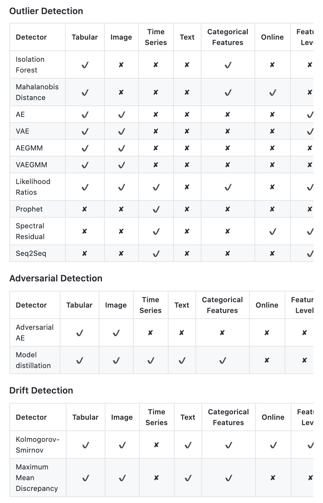
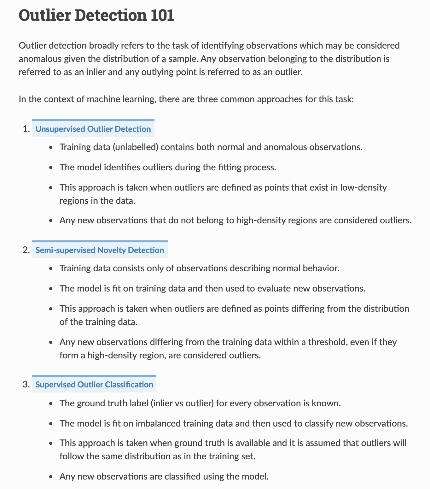
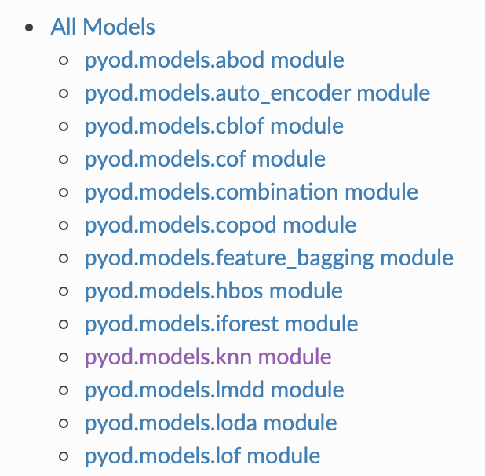
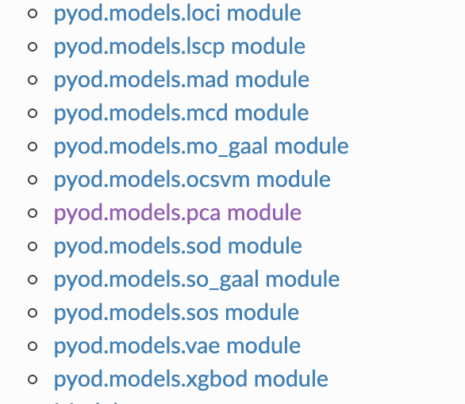
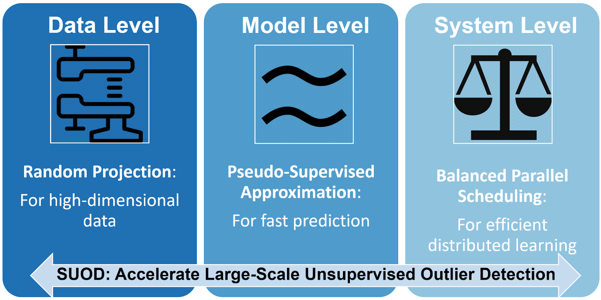
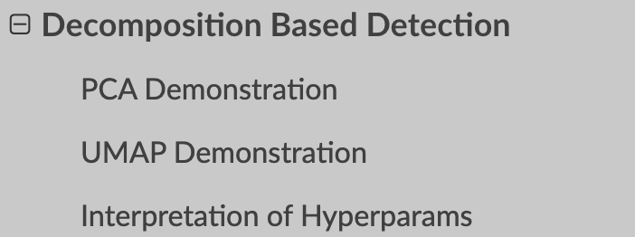
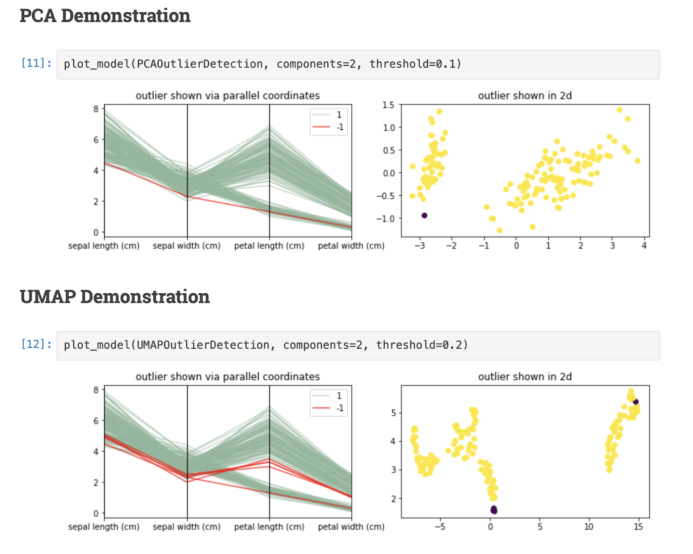
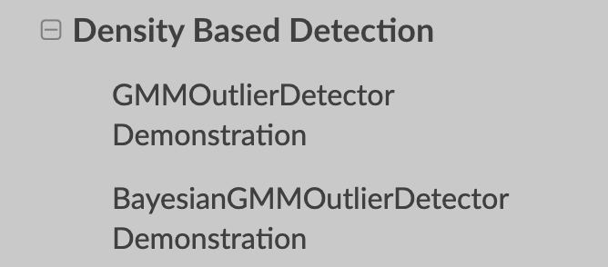
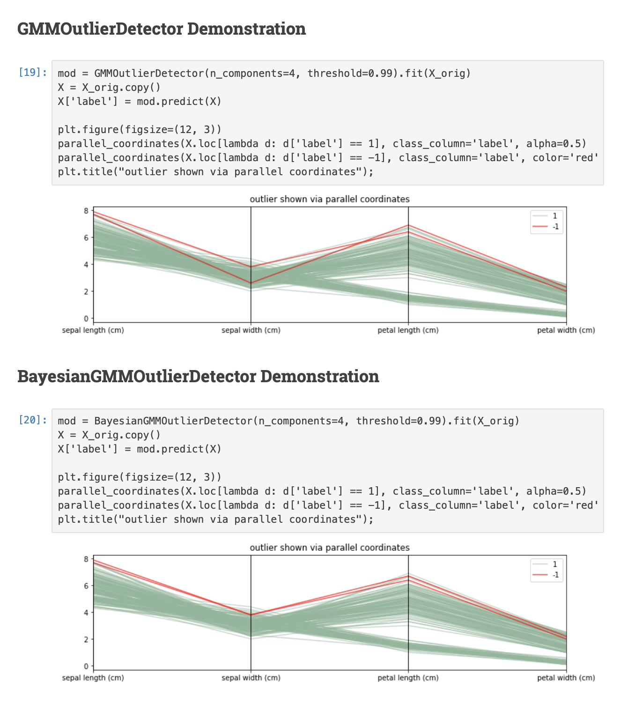

# Anomaly Detection

This page defines novelty vs outlier detection and lists methods, packages, and silhouette notes.

The same notes are in [ANOMALY DETECTION TS](timeseries.md#anomaly-detection-ts), [Drift](../ops/mlops/mlops-monitoring-and-alerts.md#drift), [Fraud Detection](../business-domains/fraud-detection.md), [HDBSCAN*](clustering-algorithms.md#hdbscan), and [PCA for log anomaly detection](../business-domains/templatization.md#pca-for-log-anomaly-detection).

“whether a new observation belongs to the same distribution as existing observations (it is an inlier), or should be considered as different (it is an outlier).

=> Often, this ability is used to clean real data sets

Two important distinctions must be made:

| novelty detection: | |
| --- | --- |
| | The training data is not polluted by outliers, and we are interested in detecting anomalies in new observations. |
| outlier detection: | |
| | The training data contains outliers, and we need to fit the central mode of the training data, ignoring the deviant observations |

1. Using IQR for AD and why IQR difference is 2.7 sigma
2. Medium — good
3. [kdnuggets](https://www.kdnuggets.com/2017/04/datascience-introduction-anomaly-detection.html)
4. Index for [Z-score and other moving averages.](https://turi.com/learn/userguide/anomaly_detection/moving_zscore.html)
5. A survey
6. [A great tutorial](https://www.analyticsvidhya.com/blog/2019/02/outlier-detection-python-pyod/) about AD using 20 algos in a [single python package](https://github.com/yzhao062/pyod).
7. [Mastery on classifying rare events using lstm-autoencoder](https://machinelearningmastery.com/lstm-model-architecture-for-rare-event-time-series-forecasting/)

The same notes are in [AUTOENCODERS](../deep-learning/deep-learning-models.md#autoencoders) and [Timeseries](timeseries.md).

8. A [comparison](http://scikit-learn.org/stable/modules/outlier_detection.html#outlier-detection) of One-class SVM versus Elliptic Envelope versus Isolation Forest versus LOF in sklearn. (The examples below illustrate how the performance of the [covariance.EllipticEnvelope](http://scikit-learn.org/stable/modules/generated/sklearn.covariance.EllipticEnvelope.html#sklearn.covariance.EllipticEnvelope) degrades as the data is less and less unimodal. The [svm.OneClassSVM](http://scikit-learn.org/stable/modules/generated/sklearn.svm.OneClassSVM.html#sklearn.svm.OneClassSVM) works better on data with multiple modes and [ensemble.IsolationForest](http://scikit-learn.org/stable/modules/generated/sklearn.ensemble.IsolationForest.html#sklearn.ensemble.IsolationForest) and [neighbors.LocalOutlierFactor](http://scikit-learn.org/stable/modules/generated/sklearn.neighbors.LocalOutlierFactor.html#sklearn.neighbors.LocalOutlierFactor) perform well in every cases.)
9. [Using Autoencoders](https://shiring.github.io/machine_learning/2017/05/01/fraud) — the information is there, but its all over the place.
10. Twitter anomaly —
11. Microsoft anomaly — a well documented black box, i cant find a description of the algorithm, just hints to what they sort of did
    1. [up/down trend, dynamic range, tips and dips](https://blogs.technet.microsoft.com/machinelearning/2014/11/05/anomaly-detection-using-machine-learning-to-detect-abnormalities-in-time-series-data/)
    2. [Api here](https://docs.microsoft.com/en-us/azure/machine-learning/team-data-science-process/apps-anomaly-detection-api)
12. STL and [LSTM for anomaly prediction](https://github.com/omri374/moda/blob/master/moda/example/lstm/LSTM_AD.ipynb) by microsoft
    1. Medium on AD
    2. Medium on AD using mahalanobis, AE and

### OUTLIER DETECTION

This section lists Alibi Detect, PyOD, SUOD, Skyline, and related sklearn notes.

1. [Alibi Detect](https://github.com/SeldonIO/alibi-detect) is an open source Python library focused on outlier, adversarial and drift detection. The package aims to cover both online and offline detectors for tabular data, text, images and time series. The outlier detection methods should allow the user to identify global, contextual and collective outliers.

<figure><figcaption>
Alibi Detect.

Credit: <a href="https://lh4.googleusercontent.com/QonFzFq66lICpFO_ZMwHOOVbf414oWxdIoV1CibK2OD5jlaRTgQGrs1cgitF2vv3HE0NitUn5XILiZRs3GRIGnDtBWbJEhcppaAhlxjThvS3_dBgyfkBoM1dKlFEgUk1Vy3yeVyc">copied from the original hosted image</a>.
</figcaption></figure>

2. [Pyod](https://pyod.readthedocs.io/en/latest/)

<figure><figcaption>
PyOD.

Credit: <a href="https://lh5.googleusercontent.com/ZKkwCMKak5EBt4hGR2NMnx_XLmc8UBkLb5-AlD83QnhpVddGHadQGajp0eutz-lo7WTK9cZdPwe6YWg4LeEgxbR5FtdxzAJ_KtE3JiXMnDfkzElJznOJQt_sqslltPkKPP3i-uv2">copied from the original hosted image</a>.
</figcaption></figure>

<figure><figcaption>
PyOD.

Credit: <a href="https://lh3.googleusercontent.com/Shm9hSKFYXqN9ab4dYa92zlsTfBle5z_iTtLSobJPpjWyo53-vNtDI7DTL-h32mCX8lea-AxGXF9UxlY_9BhFn21UlduhYz74X8X92JxiMqSymRW4JgrFoaJMy6sizWbBEi7zM2N">copied from the original hosted image</a>.
</figcaption></figure>

<figure><figcaption>
PyOD.

Credit: <a href="https://lh6.googleusercontent.com/kmW2KZFP6OY0xth2NwTXwrMajzeXG6LY1PQpAkejy-hVmR32eauIwI2REmzahEBKRIAkooaDcwq4OXBs_I-nacg4ncZljKg9WTA2RDX3PJdM6oHUxC6O_fukyh6SEwnnvZQPsSvB">copied from the original hosted image</a>.
</figcaption></figure>

1. [Anomaly detection resources](https://github.com/yzhao062/anomaly-detection-resources) (great)
2. [Novelty and outlier detection inm sklearn](https://scikit-learn.org/stable/modules/outlier_detection.html)
3. [SUOD](https://github.com/yzhao062/suod) (Scalable Unsupervised Outlier Detection) is an acceleration framework for large-scale unsupervised outlier detector training and prediction. Notably, anomaly detection is often formulated as an unsupervised problem since the ground truth is expensive to acquire. To compensate for the unstable nature of unsupervised algorithms, practitioners often build a large number of models for further combination and analysis, e.g., taking the average or majority vote. However, this poses scalability challenges in high-dimensional, large datasets, especially for proximity-base models operating in Euclidean space.

<figure><figcaption>
SUOD.

Credit: <a href="https://lh4.googleusercontent.com/lTrANgbDggSvC5zIKxuzzSKYYgMNJX7yN9Vni3FTWj7kKSpBuxhc2vvE2Oy_diF4uEalUovH3sVeIdmAfBtsTFKPL3vgzMfnX50_8yUVENyV1uMx6fRO4gKLjGAfhnZy38dAE6_y">copied from the original hosted image</a>.
</figcaption></figure>

SUOD is therefore proposed to address the challenge at three complementary levels: random projection (data level), pseudo-supervised approximation (model level), and balanced parallel scheduling (system level). As mentioned, the key focus is to accelerate the training and prediction when a large number of anomaly detectors are presented, while preserving the prediction capacity. Since its inception in Jan 2019, SUOD has been successfully used in various academic researches and industry applications, include PyOD [[2]](https://github.com/yzhao062/suod#zhao2019pyod) and [IQVIA](https://www.iqvia.com/) medical claim analysis. It could be especially useful for outlier ensembles that rely on a large number of base estimators.

1. [Skyline](https://github.com/earthgecko/skyline)
2. Scikit-lego outliers
   1. <figure><figcaption>
Scikit-lego outliers.

Credit: <a href="https://lh3.googleusercontent.com/unjrP1o3wqwUvv_J0WeX_9BZw8qrq9ToBVjSAHc1bWxOo3idh6CSLsVPTKSNovXve0-IOG5vaL5yqn4sg0a6OfvSM_X5t41wK-P_NFHjOzmmJyHKsv8I6se62OZtyildGKI5ZlrV">copied from the original hosted image</a>.
</figcaption></figure>
   2. <figure><figcaption>
Scikit-lego outliers.

Credit: <a href="https://lh5.googleusercontent.com/bafZPqSAbvczD3CE2yIPsPlTaYZ5qSAMdz4l7WqeuhQK-XjONBQDP0-tTYXjFcnMPlvljiMr1_fvMlAFCLRtATsI3mcaXjxbcjcSD97OxVzVR41qecC1BZo9DKdYag7e97g2Jirk">copied from the original hosted image</a>.
</figcaption></figure>

<figure><figcaption>
Scikit-lego outliers.

Credit: <a href="https://lh5.googleusercontent.com/9bBkl9p2YSeKumH3C2nwIpGdQvBYqt63JHtQsfJfS2wJqRJBWcLyHpZ1yuFEHh4tFdcUAc9dm-ihYYIa_h9Doa_AZpv273V0T5kEpGRfigyNXtRmR2XQWYQAVc9VFaQ-r6LPuA1-">copied from the original hosted image</a>.
</figcaption></figure>

1. <figure><figcaption>
Scikit-lego outliers.

Credit: <a href="https://lh6.googleusercontent.com/FJ_1DRIuNjz3FY_9d1QGeFb4tv6E-CK97eoaNvskApfKJETYKhLoq64gMvtqbBkGZNzeA3ZtcfenuhhYc9in9ILtv8v61cYyc6XN44obZmmMl_hBylk53NNdwVEPujJDS0hLKwyN">copied from the original hosted image</a>.
</figcaption></figure>

### ISOLATION FOREST

This section explains isolation forest partitioning and the path-length anomaly score.

The best resource to explain isolation forest — the basic idea is that for an anomaly (in the example) only 4 partitions are needed, for a regular point in the middle of a distribution, you need many many more.

[Isolation Forest](http://scikit-learn.org/stable/auto_examples/ensemble/plot_isolation_forest.html) — Isolating observations:

- randomly selecting a feature
- randomly selecting a split value between the maximum and minimum values of the selected feature.

Recursive partitioning can be represented by a tree structure, the number of splittings required to isolate a sample is equivalent to the path length from the root node to the terminating node.

This path length, averaged over a forest of such random trees, is a measure of normality and our decision function.

Random partitioning produces noticeable shorter paths for anomalies.

=> when a forest of random trees collectively produce shorter path lengths for particular samples, they are highly likely to be anomalies.

[the paper is pretty good too -](https://cs.nju.edu.cn/zhouzh/zhouzh.files/publication/icdm08b.pdf) In the training stage, iTrees are constructed by recursively partitioning the given training set until instances are isolated or a specific tree height is reached of which results a partial model.

Note that the tree height limit l is automatically set by the sub-sampling size ψ: l = ceiling(log2 ψ), which is approximately the average tree height [7].

The rationale of growing trees up to the average tree height is that we are only interested in data points that have shorter-than average path lengths, as those points are more likely to be anomalies

### LOCAL OUTLIER FACTOR

This section defines LOF as a local density ratio against k-nearest neighbours.

- [LOF](http://scikit-learn.org/stable/modules/outlier_detection.html#local-outlier-factor) computes a score (called local outlier factor) reflecting the degree of abnormality of the observations.
- It measures the local density deviation of a given data point with respect to its neighbors. The idea is to detect the samples that have a substantially lower density than their neighbors.
- In practice the local density is obtained from the k-nearest neighbors.
- The LOF score of an observation is equal to the ratio of the average local density of his k-nearest neighbors, and its own local density:
   - a normal instance is expected to have a local density similar to that of its neighbors,
   - while abnormal data are expected to have much smaller local density.

### ELLIPTIC ENVELOPE

This section assumes a known distribution and flags points far from the fitted shape.

1. We assume that the regular data come from a known distribution (e.g. data are Gaussian distributed).
2. From this assumption, we generally try to define the “shape” of the data,
3. And can define outlying observations as observations which stand far enough from the fit shape.

### ONE CLASS SVM

This section points at one-class SVM resources and the hypersphere formulation.

The same notes are in [SUPPORT VECTOR MACHINES (SVM)](linear-separator-algorithms.md#support-vector-machines-svm).

1. A nice article about ocs, with github code, two methods are described.
2. [Resources for ocsvm](https://www.quora.com/What-is-a-good-resource-for-understanding-One-Class-SVM-for-distribution-esitmation)
3. It looks like there are two such methods — The 2nd one: The algorithm obtains a spherical boundary, in feature space, around the data. The volume of this hypersphere is minimized, to minimize the effect of incorporating outliers in the solution.

The resulting hypersphere is characterized by a center and a radius R>0 as distance from the center to (any support vector on) the boundary, of which the volume R2 will be minimized.

### CLUSTERING METRICS

This section is silhouette and related clustering quality notes for embeddings and topics.

The same notes are in [Clustering Algorithms](clustering-algorithms.md).

For community detection, text clusters, etc.

[Google search for convenience](https://www.google.com/search?biw=1600&bih=912&sxsrf=ALeKk00NbB52pfM6J1N42ieEddIOirBmcQ%3A1597514997743&ei=9SQ4X-_uLLLhkgWJsIbADw&q=word+embedding+silhouette+score&oq=word+embedding+silhouette+score&gs_lcp=CgZwc3ktYWIQAzoECAAQRzoECCMQJzoHCCMQsAIQJ1DVd1jqjQFgm5ABaARwAXgBgAGMAogBrQ2SAQUwLjkuMpgBAKABAaoBB2d3cy13aXrAAQE&sclient=psy-ab&ved=0ahUKEwivvdqP553rAhWysKQKHQmYAfg4ChDh1QMIDA&uact=5)

**Silhouette:**

1. [TFIDF, PCA, SILHOUETTE](https://medium.com/data-science/mmmm-foodporn-a-clustering-and-classification-study-using-natural-language-processing-e2eae8ddefe1) for deciding how many clusters to use, the knee/elbow method.
2. [Embedding based silhouette community detection](https://link.springer.com/article/10.1007/s10994-020-05882-8#Sec10)
3. [A notebook](https://rlbarter.github.io/superheat-examples/word2vec/), using the SuperHeat package, clustering w2v cosine similarity matrix, measuring using silhouette score.
4. [Topic modelling clustering, cant access this document on github](https://github.com/danielwilentz/Cuisine-Classifier/blob/master/topic_modeling/clustering.ipynb)

## Deprecated links


These links and images no longer work. The original wording is kept here. A same-resource copy, when one was checked, is used above.


- TFIDF, PCA, SILHOUETTE. This address no longer opens: https://towardsdatascience.com/mmmm-foodporn-a-clustering-and-classification-study-using-natural-language-processing-e2eae8ddefe1
- Using IQR for AD and why IQR difference is 2.7 sigma. This address no longer opens: https://towardsdatascience.com/why-1-5-in-iqr-method-of-outlier-detection-5d07fdc82097
- Medium — good. This address no longer opens: https://towardsdatascience.com/anomaly-detection-for-dummies-15f148e559c1
- A survey. This address no longer opens: https://d1wqtxts1xzle7.cloudfront.net/49916547/Mohiuddin_Survey_financial_2015.pdf?1477591055=&response-content-disposition=inline%3B+filename%3DA_survey_of_anomaly_detection_techniques.pdf&Expires=1594649751&Signature=U~N32meGWYyIIQz1zRYC4s2tCb7e5ut28GIBC3GSG4250UjhgTMQwEIB63zwPKtS5JyKew7RWVog8gytIhc3GSSfTwsRM7lqyghuDgbds-QMp3mNyVw2bYNztnoOWncHG8rhtkwUK1EbWcYeLKvqARnJoAS177C8r1GAhfKp14GgJzHpmnsoSkB6AowJ68nauf2VyA1b~w1m~UfSNoWtjbL59clAqHn7nfqw5PGBuLHSSSxCa5PX09mADy4VzuOySzYjIviRwOlgT1eQrART0KqozqVSiGKM3SeapuI3K5tSERVPPSTnpupp--WJyYCNzzvPrdjB121P2XU7fq73wQ__&Key-Pair-Id=APKAJLOHF5GGSLRBV4ZA
- Medium on AD. This address no longer opens: https://towardsdatascience.com/machine-learning-for-anomaly-detection-and-condition-monitoring-d4614e7de770
- Medium on AD using mahalanobis, AE and. This address no longer opens: https://towardsdatascience.com/how-to-use-machine-learning-for-anomaly-detection-and-condition-monitoring-6742f82900d7
- Pyod. This address no longer opens: https://pyod.readthedocs.io/en/latest/pyod.html
- Scikit-lego. This address no longer opens: https://scikit-lego.readthedocs.io/en/latest/outliers.html
- The best resource to explain isolation forest. This address no longer opens: http://blog.easysol.net/using-isolation-forests-anamoly-detection/
- A nice article about ocs, with github code, two methods are described. This address no longer opens: http://rvlasveld.github.io/blog/2013/07/12/introduction-to-one-class-support-vector-machines/
- two such methods. This address no longer opens: http://rvlasveld.github.io/blog/2013/07/12/introduction-to-one-class-support-vector-machines/
