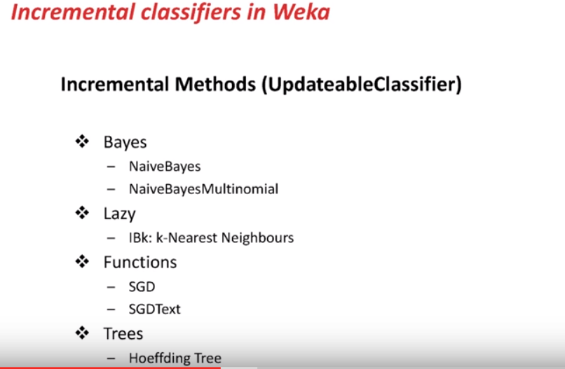
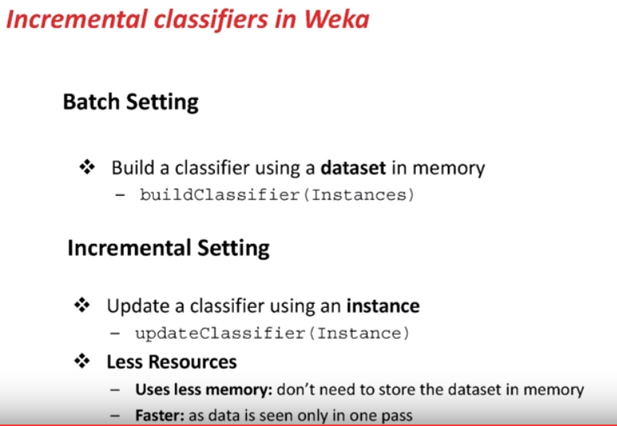

# Incremental Learning

This page defines incremental learning and points at streaming and Hoeffding-tree notes.

The same notes are in [Follow the regularized leader](../business-domains/follow-the-regularized-leader.md), [Online Learning](../types-of-machine-learning/online-learning.md), and [Training Strategies](../validation-and-evaluation/training-strategies.md).

(wiki) In computer science, incremental learning is a method of machine learning in which input data is continuously used to extend the existing model's knowledge i.e. to further train the model.

<figure><figcaption>
Incremental learning.

Credit: <a href="https://lh5.googleusercontent.com/zxvV554pWSEERqhi7sfiq57aeDukBBQxbwpkzw8u2ykK8qSGK0LWt7KwriZGJ34SXvFYU6rBi8BFon1K60Bk1_7EpRYm4C7Sv3hgc7_xnU1Vf10LSBPgDog2V_GUGKYt66dmhirD">copied from the original hosted image</a>.
</figcaption></figure>

<figure><figcaption>
Incremental learning.

Credit: <a href="https://lh6.googleusercontent.com/oVjTfYyqaoBE_mf-Vjlrc36yH9TgsTn4qe5pn1u-xQ92G549WhJmEypfy5eicUIIS_pIp2kDM3qWuZ09xBU_GikGAb6f40h8XorzEe7FufOlvCkgek7rxyTFKbL9FjrbgnX2TmPP">copied from the original hosted image</a>.
</figcaption></figure>

- Using incremental learning for time series, i.e., [sentiment from twitter api stream, learning from smiley in weka.](https://www.youtube.com/watch?v=jScSxkuSei8&list=PLm4W7_iX_v4Msh-7lDOpSFWHRYU_6H5Kx&index=12)
- And [time series in weka](https://www.youtube.com/watch?v=9R0mz_gfhBs&list=PLm4W7_iX_v4Msh-7lDOpSFWHRYU_6H5Kx&index=3), with some ideas about dealing with time series data, especially date and time.

### Hoeffding tree

This section notes that the Hoeffding tree is treated as state of the art here.

The same notes are in [Decision Trees](decision-trees.md).

- IS STATE OF THE ART
