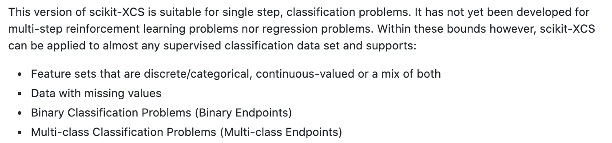

# Learning Classifier Systems

This page defines Learning Classifier Systems (LCS) and the XCS variant, with toolkit links.

### LCS

This section is the Wikipedia definition of learning classifier systems.

(WIKI) [Learning classifier systems](https://en.wikipedia.org/wiki/Learning_classifier_system), or LCS, are a paradigm of [rule-based machine learning](https://en.wikipedia.org/wiki/Rule-based_machine_learning) methods that combine a discovery component (e.g. typically a [genetic algorithm](https://en.wikipedia.org/wiki/Genetic_algorithm)) with a learning component (performing either [supervised learning](https://en.wikipedia.org/wiki/Supervised_learning), [reinforcement learning](https://en.wikipedia.org/wiki/Reinforcement_learning), or [unsupervised learning](https://en.wikipedia.org/wiki/Unsupervised_learning)).

### XCS

This section is XCS as a type of LCS, plus scikit-XCS and a tutorial.

[XCS](http://hosford42.github.io/xcs/) is a type of [Learning Classifier System (LCS)](http://en.wikipedia.org/wiki/Learning_classifier_system), a [machine learning](http://en.wikipedia.org/wiki/Machine_learning) algorithm that utilizes a [genetic algorithm](http://en.wikipedia.org/wiki/Genetic_algorithm) acting on a rule-based system, to solve a [reinforcement learning](http://en.wikipedia.org/wiki/Reinforcement_learning) problem.

[Scikit-xcs](https://github.com/UrbsLab/scikit-XCS)

<figure><figcaption>
Scikit-xcs.

Credit: <a href="https://lh4.googleusercontent.com/4v4YEGC5DOe7so8anALV1gLXGU6yJzD7kvHfgugsStyy2OxG4Nb4QrJaN-AC81Su6s8ri9MAsKnSlVY8qlrWVCcwzC71j_n1jb88Eu9_0Xo6vS68rg5RKmdzAPPEpOVThaoWaIWl">copied from the original hosted image</a>.
</figcaption></figure>

[Tutorial](https://pythonhosted.org/xcs/)
