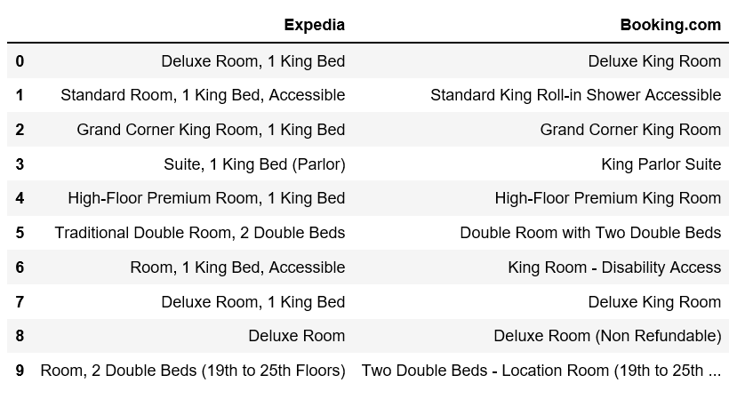
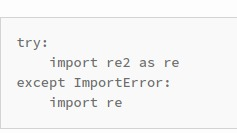

# String Matching

This page collects fuzzy string matching and regex tooling notes.

The same notes are in [Name Matching](name-matching.md) and [SIMILARITY](../validation-and-evaluation/features.md#similarity).

## Tools

This section lists fuzzy matching libraries and edit-distance approaches.

1. [Fuzzy string matching library - fuzzywuzzy - using edit-distance](https://medium.com/data-science/natural-language-processing-for-fuzzy-string-matching-with-python-6632b7824c49)
2. [Difflib](https://docs.python.org/3/library/difflib.html), [difflib-2](https://pymotw.com/2/difflib/)

<figure><figcaption>
Susan Li, Fuzzy Wuzzy String Matching, medium.com

Credit: <a href="https://lh6.googleusercontent.com/y0wbP76ObQPtAtaM-hXk0uwO1-rtcRXfcB7wEZbbPCE05FexzLYfJZtXRO9GkNGcnAOfyxTuRQDRUszfFL5qz7waIBtYnDiJrceyFl_-8rs82yAZdmcoNVKtDU9EgPgHwT9bTy4z">copied from the original hosted image</a>.
</figcaption></figure>

## REGEX

This section is about regex engines, performance, and keyword extraction alternatives.

1. [Why re is slow](https://swtch.com/~rsc/regexp/regexp1.html)
2. [Benchmark](https://github.com/mariomka/regex-benchmark), [comparisons](https://rust-leipzig.github.io/regex/2017/03/28/comparison-of-regex-engines/), [more](https://stackoverflow.com/questions/3544225/regular-expression-library-benchmarks), [many more](https://stackoverflow.com/questions/11033190/regex-library-benchmark)
3. [Split on separator but keep the separator](http://programmaticallyspeaking.com/split-on-separator-but-keep-the-separator-in-python.html), in Python
4. [Semantic versioning](https://regexr.com/39s32)
5. [Hyperscan](https://github.com/intel/hyperscan) — [Hyperscan](https://www.hyperscan.io/) [(paper)](https://www.usenix.org/system/files/nsdi19-wang-xiang.pdf) is a high-performance multiple regex matching library. It follows the regular expression syntax of the commonly-used libpcre library, but is a standalone library with its own C API.
6. [Re2](https://github.com/google/re2) — [python](https://pypi.org/project/re2/) This is the source code repository for RE2, a regular expression library.

<figure><figcaption>
Regex library comparison.

Credit: <a href="https://lh3.googleusercontent.com/-YwR-w4Xp3Z-FJH4yUu23QiFSBgr7EqkKGNhvG-c89kpsaHcEBeiqiUO4nEx-8VzEMIeaJosCR6JhDpWO5hqQjfwL2cSXUXapt_XUa_OdRmClhigiynQzDBy3zdrq_Bj4VYaWv2F">copied from the original hosted image</a>.
</figcaption></figure>

1. [Spacy’s Matcher & “regex”](https://spacy.io/usage/rule-based-matching)
2. [Flashtext](https://github.com/vi3k6i5/flashtext)— This module can be used to replace keywords in sentences or extract keywords from sentences. It is based on the [FlashText algorithm](https://arxiv.org/abs/1711.00046).

## Deprecated links


These links and images no longer work. The original wording is kept here. A same-resource copy, when one was checked, is used above.


- Fuzzy string matching library - fuzzywuzzy - using edit-distance This address no longer opens: https://towardsdatascience.com/natural-language-processing-for-fuzzy-string-matching-with-python-6632b7824c49
- Re2 This address no longer opens: https://github.com/google/re2/tree/abseil/python
