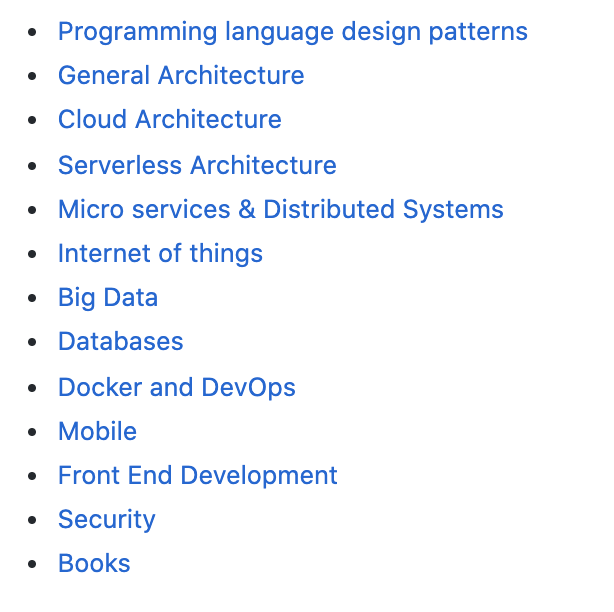

# Development Concepts

This page covers software design patterns and core programming concepts like dependency injection and SOLID.

## Patterns

This section is a curated list of software and architectural design patterns.

- [Software and architectural design patterns](https://github.com/DovAmir/awesome-design-patterns)

<figure><figcaption>
DovAmir

Credit: <a href="https://lh4.googleusercontent.com/qgvN9nWhe0NRVvcvILrJsF2UeAqZ4H8CIcAUWOBMsXlFEAxhvNCnfQiFrwtLgiXaN1DiziRZ-cjefQzwaBWjtpE3q5SDRlZ9m6-sdJ0NtFnCs4CB4ZSk9Ay9G9X0U6Gy6cLy8_nM">copied from the original hosted image.</a>
</figcaption></figure>

## Programming concepts

This section is dependency injection and the SOLID principles of object-oriented design.

[Dependency injection](https://www.freecodecamp.org/news/a-quick-intro-to-dependency-injection-what-it-is-and-when-to-use-it-7578c84fa88f/) — based on [SOLID](https://scotch.io/bar-talk/s-o-l-i-d-the-first-five-principles-of-object-oriented-design#toc-single-responsibility-principle) the class should do one thing, so we are letting other classes create 3rd party/class objects for us instead of doing it internally, either by init passing or by injecting in runtime.

[SOLID](https://scotch.io/bar-talk/s-o-l-i-d-the-first-five-principles-of-object-oriented-design#toc-single-responsibility-principle) — the five principles of object oriented.
