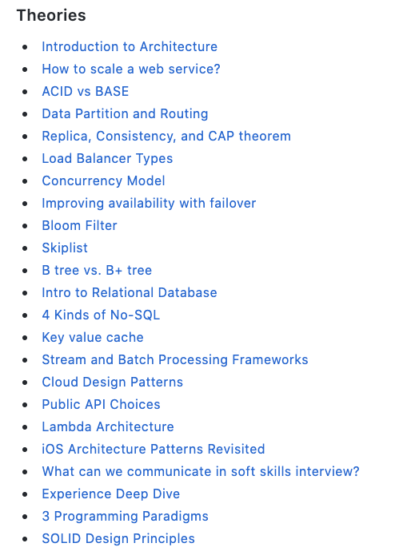

# System Design

This page is a reading and video list for system design interviews, scalability, and guided practice.

1. (Amazing) [System Design in a Hurry](https://www.hellointerview.com/learn/system-design/in-a-hurry/introduction)
2. (Amazing) [System Design and architecture](https://github.com/puncsky/system-design-and-architecture)

<figure><figcaption>
Puncsky

Credit: <a href="https://lh4.googleusercontent.com/UpUWT6Jx5fE_l9YMZQuCa4c_-OlpXYYZldQzF3l1A2H-B2Sd8uMQAdekbeeIXNdKdooKShlFSN6bncvUjvOUB3F7-_drbrFx9ZO6kQ4rrcRoWqyNJjZ33X_3ewgs0leEndte3Xhw">copied from the original hosted image.</a>
</figcaption></figure>

3. [Hired in tech](https://www.hiredintech.com/system-design/) — high level
4. [Episode 06: Intro to Architecture and Systems Design Interviews](https://www.youtube.com/watch?v=ZgdS0EUmn70) — an approach
5. [System design template](https://leetcode.com/discuss/career/229177/My-System-Design-Template)
6. [RAG SD](https://blogs.nvidia.com/blog/what-is-retrieval-augmented-generation/)
7. Jordan
   1. [Distributed Job Scheduler](https://www.youtube.com/watch?v=pzDwYHRzEnk)
   2. [Distributed Locking](https://www.youtube.com/watch?v=Lp8oITg0MiI)
   3. [Rate Limiter](https://www.youtube.com/watch?v=VzW41m4USGs)
8. [(great) System Design Primer](https://github.com/donnemartin/system-design-primer/tree/master) — Learn how to design large-scale systems. Prep for the system design interview. Includes Anki flashcards.
9. [CS75 (Summer 2012) Lecture 9 Scalability Harvard Web Development David Malan](https://www.youtube.com/watch?v=-W9F__D3oY4)
10. Scalability
    1. [a word about](https://www.allthingsdistributed.com/2006/03/a_word_on_scalability.html)
    2. [scalability for dummies](https://web.archive.org/web/20221030091841/http://www.lecloud.net/tagged/scalability/chrono) [1](https://web.archive.org/web/20220530193911/https://www.lecloud.net/post/7295452622/scalability-for-dummies-part-1-clones) [2](https://web.archive.org/web/20220602114024/https://www.lecloud.net/post/7994751381/scalability-for-dummies-part-2-database) [3](https://web.archive.org/web/20230126233752/https://www.lecloud.net/post/9246290032/scalability-for-dummies-part-3-cache) [4](https://web.archive.org/web/20220926171507/https://www.lecloud.net/post/9699762917/scalability-for-dummies-part-4-asynchronism)
    3. (good for topics) [Scalability, Availability & Stability Patterns](https://www.slideshare.net/slideshow/scalability-availability-stability-patterns/4062682)
    4. (good) [Use Back-of-the-envelope-calculations to Choose the Best Design](https://highscalability.com/google-pro-tip-use-back-of-the-envelope-calculations-to-choo/)
11. [System Design Guided Practice](https://bugfree.ai/) — AI-Powered platform provided guided practice on system design problem and behavior questions like the way you do at Leetcode.
12. [PracHub System Design Practice](https://prachub.com/categories/system-design) — Company-tagged interview prompts for timed, answer-first practice.
