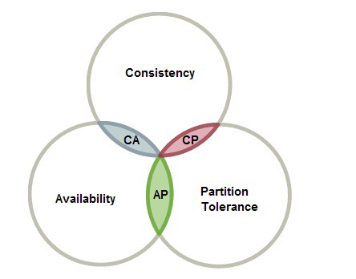

# Data Engineering

This page compares data engineering roles and covers the CAP theorem.

- [Data engineers are not software developers - a comparison](https://betterprogramming.pub/data-engineering-is-not-software-engineering-af81eb8d3949)
- [Different Types of data engineers](https://medium.com/coriers/different-types-of-data-engineering-teams-6a1056986d3)
   - data infra
   - data platform
   - data engineers
   - data governance
   - BI & analytics

### [Cap theorem](https://medium.com/data-science/cap-theorem-and-distributed-database-management-systems-5c2be977950e)

This subsection points at CAP theorem notes and how the rules have changed.

- [Cap](https://www.confluent.io/blog/turning-the-database-inside-out-with-apache-samza/) 2015
- [Cap is changing](https://www.infoq.com/articles/cap-twelve-years-later-how-the-rules-have-changed/)

<figure><figcaption>
Cap theorem

Credit: <a href="https://lh6.googleusercontent.com/cDV78UprJnSuEkoqVRRzg9K_a8YlvYAQlJ_YDj6CRMqypYp0BwFkHhErzcMtt8h0LWKd4cPk3ftCpRyLTMxLNNxCNJ6nAUZNoEh0umdNzsAdIt0IUMDBJT_uvdWgD9UxHLpHisiS">copied from the original hosted image.</a>
</figcaption></figure>

## Deprecated links


These links and images no longer work. The original wording is kept here. A same-resource copy, when one was checked, is used above.


- Cap theorem. This address no longer opens: https://towardsdatascience.com/cap-theorem-and-distributed-database-management-systems-5c2be977950e
