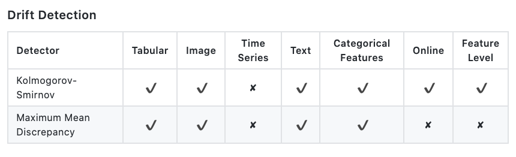

# ML Model Monitoring & Alerts

This page covers monitoring and alerts for production ML: observability reading, drift detection, and tool comparisons.

## Monitoring & alerts

This section is reading on monitoring models, dependencies, features, and production performance.

- [Monitor! Stop being a blind DS](https://cohenori.medium.com/monitor-stop-being-a-blind-data-scientist-ac915286075f)
- [Monitor your dependencies! Stop being a blind DS](https://cohenori.medium.com/monitor-your-dependencies-stop-being-a-blind-data-scientist-a3150bd64594)
- [Data science observability for executives](https://cohenori.medium.com/data-science-observability-for-executives-a054411faecc)
- [Production Machine Learning Monitoring: Outliers, Drift, Explainers & Statistical Performance](https://medium.com/data-science/production-machine-learning-monitoring-outliers-drift-explainers-statistical-performance-d9b1d02ac158), [youtube](https://www.youtube.com/watch?v=QcevzK9ZuDg), uses [alibi-explain](https://docs.google.com/document/d/1dXELAcJn9KCPSRMDvZoumUyHx8K8Yn7wfFxesSpbNCM/edit#heading=h.xs1o8m3ro5iy) (see compendium) and Ali-detect (see compendium)
- [MLflow, HyperparameterHunter, Hyperopt, concept drift, unit tests](https://medium.com/data-science/putting-ml-in-production-ii-logging-and-monitoring-algorithms-91f174044e4e), Javier Rodriguez Zaurin.
- [Meta anomaly over multiple models, aggregate](https://www.anodot.com/blog/monitoring-machine-learning/)
- [Vidhya on monitoring data & models](https://www.analyticsvidhya.com/blog/2019/10/deployed-machine-learning-model-post-production-monitoring/)
- [Monitor ML features using Amazon SageMaker Feature Store and AWS Glue DataBrew](https://medium.com/data-science/monitor-ml-features-using-amazon-sagemaker-feature-store-and-aws-glue-databrew-c530abcc479a)

### Drift

This subsection is data drift, concept drift, estimators, and Alibi Detect.

1. [Data & concept drifts](https://deepchecks.com/how-to-monitor-ml-models-in-production/), [2](https://www.explorium.ai/blog/understanding-and-handling-data-and-concept-drift/)
2. (good) [Inferring Concept Drift Without Labeled Data](https://concept-drift.fastforwardlabs.com/). Also talks about stream-based drift by Cloudera — Fast Forward Labs.
3. Arize.ai
   - Data, concept, [feature drifts](https://medium.com/data-science/using-statistical-distance-metrics-for-machine-learning-observability-4c874cded78) — various comparisons between train/prod/validation time windows, diff models, A/B testing etc., and how to measure drifts
   - [Model store, Feature store, evaluation store](https://medium.com/data-science/the-only-3-ml-tools-you-need-1aa750778d33)
   - [Monitor model performance in production](https://medium.com/data-science/the-playbook-to-monitor-your-models-performance-in-production-ec06c1cc3245) — real-time, biased, delayed, and no ground truth.
   - [use cases — i.e., how to use statistical differences/distances](https://medium.com/data-science/using-statistical-distance-metrics-for-machine-learning-observability-4c874cded78)
4. [Some advice on Medium](https://medium.com/data-science/concept-drift-and-model-decay-in-machine-learning-a98a809ea8d4), relabel using latest model (can we even trust it?) retrain after.
5. [Adversarial Validation Approach to Concept Drift Problem in User Targeting Automation Systems at Uber](https://arxiv.org/abs/2004.03045) — Previous research on concept drift mostly proposed model retraining after observing performance decreases. However, this approach is suboptimal because the system fixes the problem only after suffering from poor performance on new data. Here, we introduce an adversarial validation approach to concept drift problems in user targeting automation systems. With our approach, the system detects concept drift in new data before making inference, trains a model, and produces predictions adapted to the new data.
6. Drift estimator between data sets using random forest; the formula is in the Medium article above; code here at [MLBox](https://github.com/AxeldeRomblay/MLBox/blob/811dbcb04fc7f5501e82f3e78aa6c119f426ee78/python-package/mlbox/preprocessing/drift/drift_estimator.py)
7. [Alibi-detect](https://docs.google.com/document/d/1dXELAcJn9KCPSRMDvZoumUyHx8K8Yn7wfFxesSpbNCM/edit#heading=h.y6mpsp4co5t9) — is an open-source Python library focused on outlier, adversarial, and drift detection, by Seldon.
8. [What is concept drift and why does it go undetected](http://web.archive.org/web/20240416043659/https://censius.ai/blogs/what-is-concept-drift-and-why-does-it-go-undetected). Breaking down concept drit and explaining the best methods to avoid it.

<figure><figcaption>
Alibi Detection Drift Features

Credit: <a href="https://lh4.googleusercontent.com/sASV5qq3CTmv0gx6Tl3DiwACMnwsW9wj1yNHF5sFIFbQr4BFFgAVgfcWsnrHxNnQtQKa-b5-IdbC-OElnQIr117lxaH3TGCuz1CmpgU6mof3i9VkPR3LyzdD9S0ujTmWj7o88Iep">copied from the original hosted image.</a>
</figcaption></figure>

### Tool comparisons

This subsection compares MLOps monitoring landscapes and curated tool lists.

- [State of MLOps](https://www.stateofmlops.com) (by me), [Medium](https://cohenori.medium.com/mlops-monitoring-market-review-66904f0863bb) article, open-source [Airtable](https://airtable.com/shr4rfiuOIVjMhvhL).
- [MLOps.toys](https://mlops.toys/) — A curated list of MLOps projects by [Aporia](http://web.archive.org/web/20260725060446/https://www.aporia.com/)
- [Neptune.AI](http://web.archive.org/web/20230610222659/https://mlops.neptune.ai/) MLOps tools landscape
- [Ambiata](https://www.ambiata.com/blog/2020-12-07-mlops-tools/) how to choose the best MLOps tools
- [LakeFS](https://lakefs.io/the-state-of-data-engineering-in-2021/) on the state of data engineering — has monitoring and observability inside
- [The NLP Pandect](https://github.com/ivan-bilan/The-NLP-Pandect#mlops-for-nlp) — MLOps for NLP
- [ml-ops.org](https://ml-ops.org/)
- [Awesome production ML](https://github.com/EthicalML/awesome-production-machine-learning/)

<figure><figcaption>
Awesome production ML
</figcaption></figure>

## Deprecated links


These links and images no longer work. The original wording is kept here. A same-resource copy, when one was checked, is used above.


- Production Machine Learning Monitoring: Outliers, Drift, Explainers & Statistical Performance. This address no longer opens: https://towardsdatascience.com/production-machine-learning-monitoring-outliers-drift-explainers-statistical-performance-d9b1d02ac158
- Mlflow, Hyperparameterhunter,hyperopt, concept drift, unit tests. This address no longer opens: https://towardsdatascience.com/putting-ml-in-production-ii-logging-and-monitoring-algorithms-91f174044e4e
- Monitor ML features using Amazon SageMaker Feature Store and AWS Glue DataBrew. This address no longer opens: https://towardsdatascience.com/monitor-ml-features-using-amazon-sagemaker-feature-store-and-aws-glue-databrew-c530abcc479a
- feature drifts. This address no longer opens: https://towardsdatascience.com/using-statistical-distance-metrics-for-machine-learning-observability-4c874cded78
- Model store, Feature store, evaluation store. This address no longer opens: https://towardsdatascience.com/the-only-3-ml-tools-you-need-1aa750778d33
- Monitor model performance in production. This address no longer opens: https://towardsdatascience.com/the-playbook-to-monitor-your-models-performance-in-production-ec06c1cc3245
- use cases - i.e., how to use statistical differences/distances. This address no longer opens: https://towardsdatascience.com/using-statistical-distance-metrics-for-machine-learning-observability-4c874cded78
- Some advice on medium. This address no longer opens: https://towardsdatascience.com/concept-drift-and-model-decay-in-machine-learning-a98a809ea8d4
- What is concept drift and why does it go undetected. Breaking down concept drit and explaining the best methods to avoid it. This address no longer opens: https://censius.ai/blogs/what-is-concept-drift-and-why-does-it-go-undetected
- How does data drift hamper AI performance. Understand how data drift affect peak AI performance and how you can detect it. This address no longer opens: https://censius.ai/blogs/data-drift-barrier-to-ai-performance
- by Aporia. This address no longer opens: https://aporia.com
- Neptune.AI MLOPS tools landscape. This address no longer opens: https://mlops.neptune.ai/
- Twimlai ML AI solutions. This address no longer opens: https://twimlai.com/solutions/
