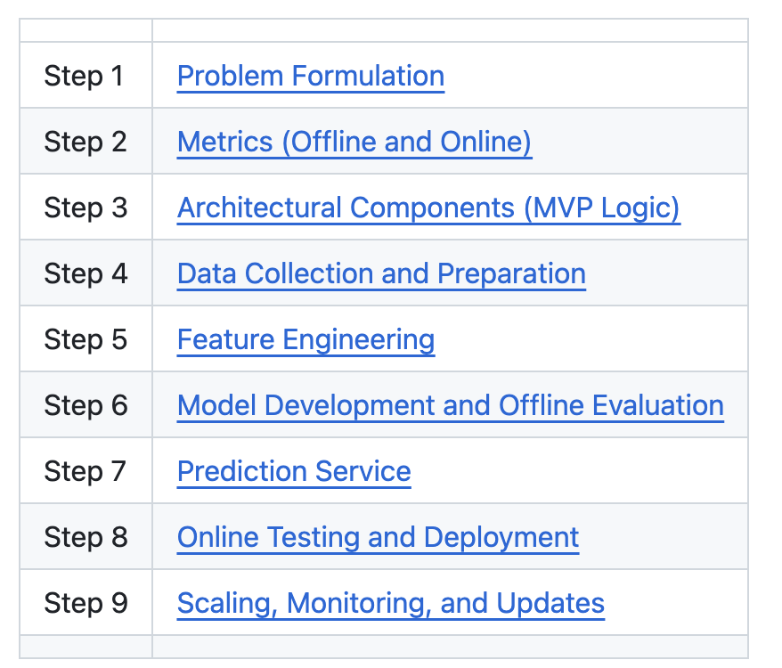
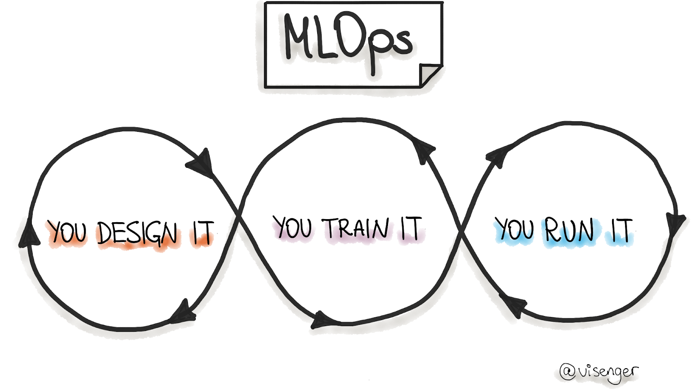
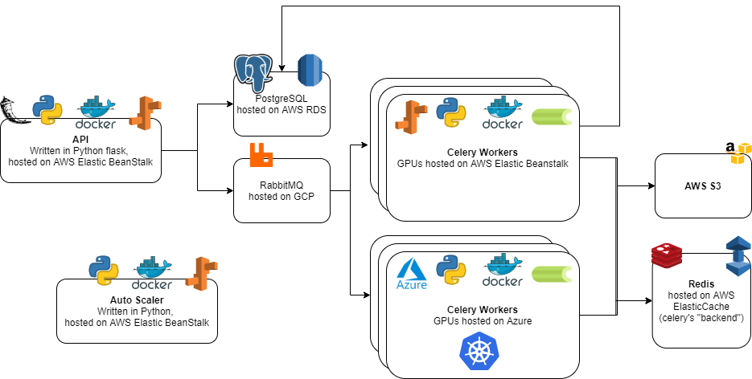
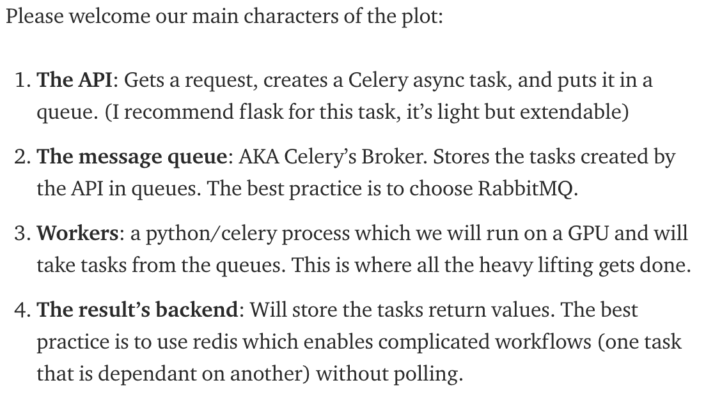

# MLOps Patterns

This page lists MLOps pattern guides, then two end-to-end systems that use them.

## General patterns

This section is a catalog of pattern guides, books, roadmaps, courses, and Metaflow notes.

1. [ML product lifecycle patterns](https://medium.com/data-science/understanding-ml-product-lifecycle-patterns-a39c18302452), Antony Mayi.

<figure><figcaption>
ML product lifecycle patterns
</figcaption></figure>

2. [ML design patterns book](https://github.com/GoogleCloudPlatform/ml-design-patterns)

<figure><figcaption>
ML design patterns book
</figcaption></figure>

<figure><figcaption>
ML design patterns book
</figcaption></figure>

3. [MLOps design patterns](https://github.com/mercari/ml-system-design-pattern/tree/master)

<figure><figcaption>
MLOps design patterns
</figcaption></figure>

4. [Awesome MLOps](https://github.com/visenger/awesome-mlops)

<figure><figcaption>
Visenger

Credit: <a href="https://lh4.googleusercontent.com/6Dd5yQHT_iJxIGqiCSmHLs5m4nVb4by_ovEoBjrJTFcUoEvh7nmiNWpb84TJQcd5IWuSy5vElL6nFsXv5NkOKzo0Juc1ZVzX1jr3BWVgIrfhTIfGggSysNOZABG5-6h4vB8_kQ9q">copied from the original hosted image.</a>
</figcaption></figure>

<figure><figcaption>
Table of contents
</figcaption></figure>

5. [MLOps Roadmap](https://github.com/cdfoundation/sig-mlops/blob/main/roadmap/2022/MLOpsRoadmap2022.md)
6. [Google's Practitioners Guide to MLOps: a framework for continuous delivery and automation of machine learning](https://cloud.google.com/resources/mlops-whitepaper)
7. [State of MLOps](https://ml-ops.org/content/state-of-mlops)

<figure><figcaption>
Template
</figcaption></figure>

8. [Easy MLOps with PyCaret and MLflow](https://medium.com/data-science/easy-mlops-with-pycaret-mlflow-7fbcbf1e38c6), Moez Ali.
9. [Challenges and solutions by Iguazio](https://medium.com/data-science/ml-ops-challenges-solutions-and-future-trends-d2e59b74dc6b), Yaron Haviv.

<figure><figcaption>
Iguazio

Credit: <a href="https://medium.com/data-science/ml-ops-challenges-solutions-and-future-trends-d2e59b74dc6b">Iguazio</a>
</figcaption></figure>

<figure><figcaption>
General patterns

Credit: <a href="https://lh3.googleusercontent.com/TqEy5NDYAnnuyM0o1j8XkKgl2KynL1Pfy6ZHG1LU7d0Ev6RtVXbCEcMFcakbPMlvYKJ41jmLDGIVazNyWA-wYEf1xKCbTzOFbJttpAp6nIWOJAvEdn1yP14NZBqXmP8b-LI80Y57">copied from the original hosted image.</a>
</figcaption></figure>

10. [Stanford CS329](https://stanford-cs329s.github.io/syllabus.html). CS 329S: Machine Learning Systems Design. The course goes into how ML systems are built, and how to debug them, find a root cause, and monitor them.
11. Metaflow, on Medium.



A high-level review.



The schema.






Amazing. (EJ) Vivek Pandey.



Extra. Jean-Michel D.



Loading and storing data, in the docs.



12. HyperparameterHunter. [Hyperopt, MLflow, unit tests, concept drift, using Python and Kafka](https://medium.com/data-science/putting-ml-in-production-ii-logging-and-monitoring-algorithms-91f174044e4e), Javier Rodriguez Zaurin.

## Patterns in practice

This section is two end-to-end systems and the tools each one uses.

- An MLOps end-to-end system, "[You dont need a bigger boat](https://github.com/jacopotagliabue/you-dont-need-a-bigger-boat)", using Metaflow, Snowflake, DBT, Prefect, Great Expectations, Weights & Biases, SageMaker, and Lambda.
- [A simplistic end-to-end system](https://github.com/jacopotagliabue/post-modern-stack): Snowflake, DBT, S3, CometML, Reclist, and SageMaker.

## Deprecated links


These links and images no longer work. The original wording is kept here. A same-resource copy, when one was checked, is used above.


- ML product lifecycle patterns. This address no longer opens: https://towardsdatascience.com/understanding-ml-product-lifecycle-patterns-a39c18302452
- Easy mlops with pycaret and mlflow. This address no longer opens: https://towardsdatascience.com/easy-mlops-with-pycaret-mlflow-7fbcbf1e38c6
- Challenges and solutions by iguazio. This address no longer opens: https://towardsdatascience.com/ml-ops-challenges-solutions-and-future-trends-d2e59b74dc6b
- 4 (amazing). This address no longer opens: https://towardsdatascience.com/learn-metaflow-in-10-mins-netflixs-python-r-framework-for-data-scientists-2ef124c716e4
- 5 (extra). This address no longer opens: https://towardsdatascience.com/be-more-efficient-to-produce-machine-learning-pipeline-with-metaflow-db5f943ebbe7
- HyperparameterHunter, Hyperopt, mlflow, unit test, concept drifts, using python and kafka. This address no longer opens: https://towardsdatascience.com/putting-ml-in-production-ii-logging-and-monitoring-algorithms-91f174044e4e
