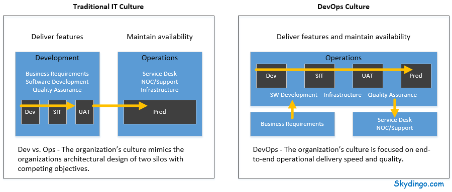

# Ops Definition Comparisons

This page compares DevOps with nearby operations roles, and it quotes a definition of AIOps.

- [Dev vs ops, vs devops vs sre: history and details by Google.](https://www.youtube.com/watch?v=tEylFyxbDLE&list=PLIivdWyY5sqJrKl7D2u-gmis8h9K66qoj&index=2)
- [SRE vs DevOps](https://medium.com/hackernoon/sre-vs-devops-the-dilemma-f7054714525c)
- [CloudOps vs DevOps](https://victorops.com/blog/what-is-cloudops-vs-devops)
- [ITOps vs DevOps](https://www.graylog.org/post/itops-vs-devops-what-is-the-difference)
- [AIOps](https://www.appdynamics.com/what-is-ai-ops/)
- [Definition](http://web.archive.org/web/20231001113410/https://dzone.com/articles/dev-vs-ops-and-devops)

> AIOps platforms utilize big data, modern machine learning and other advanced analytics technologies to directly and indirectly enhance IT operations (monitoring, automation and service desk) functions with proactive, personal and dynamic insight. AIOps platforms enable the concurrent use of multiple data sources, data collection methods, analytical (real-time and deep) technologies, and presentation technologies.

## Deprecated links


These links and images no longer work. The original wording is kept here. A same-resource copy, when one was checked, is used above.


- Definition. This address no longer opens: https://dzone.com/articles/dev-vs-ops-and-devops

<figure><figcaption>
Ops definition comparisons

Credit: <a href="https://lh3.googleusercontent.com/-q3xPZ_ASRimnV37VYLqPZxoKFSQPKSrkIQdnBHaxCPOkP9rTZT7t-6n98Zp4NKwG8QuuFNlk4omZv234Dx8QrBohcVzh7kLoiOwYmfHF5skCBKt6q8zRaHZrn2r481i3QXzr7hH">copied from the original hosted image.</a>
</figcaption></figure>
