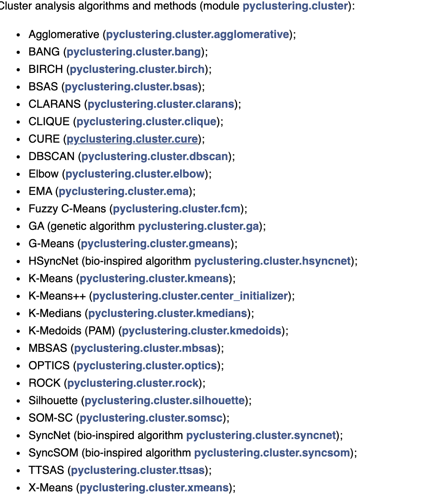
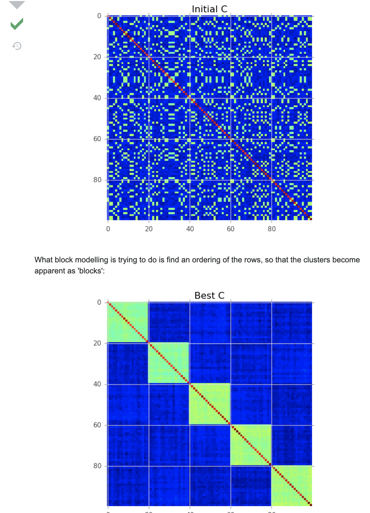
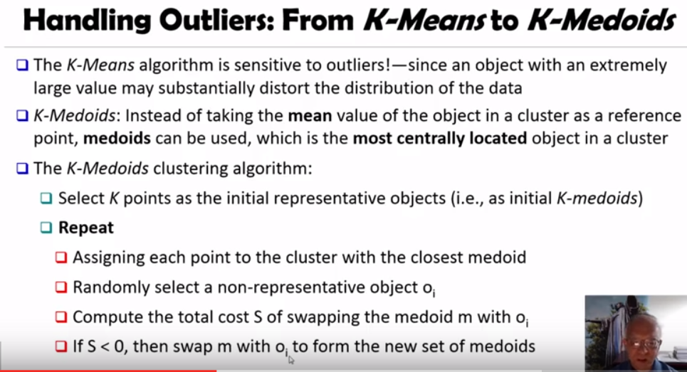
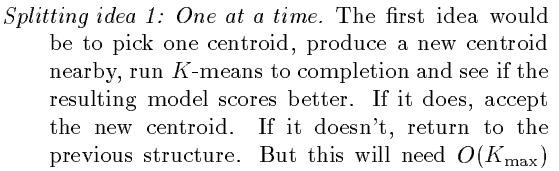
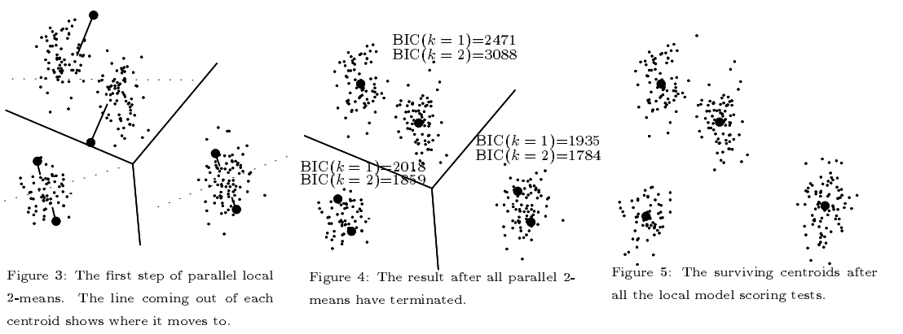
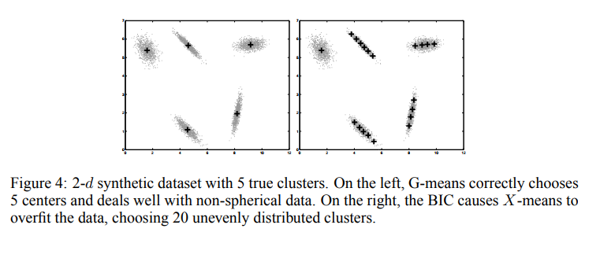
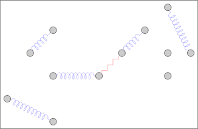

# Clustering Algorithms

Clustering is for grouping unlabeled points, and the right method depends on whether the groups are defined by distance, by density, or by must-link / cannot-link constraints. The page starts with the general map and how to pick the number of clusters, moves through the k-means family and GMM, then the density-based methods (DBSCAN, HDBSCAN, OPTICS), and ends with SVM clustering and constrained clustering.

The same notes are in [CLUSTERING METRICS](anomaly-detection.md#clustering-metrics), [CLUSTERING TS](time-series-search.md#clustering-ts), and [UNSUPERVISED](../evals/evaluation-metrics.md#unsupervised).

The map comes first. [Vidhya on clustering and methods](https://www.analyticsvidhya.com/blog/2016/11/an-introduction-to-clustering-and-different-methods-of-clustering/?utm_source=facebook.com) walks through the different types of clustering techniques in machine learning and how they are used to identify structure in data.

Nearest neighbours are the simplest way to think about "close points belong together", even though KNN itself is a classifier. [KNN](https://www.youtube.com/watch?v=4ObVzTuFivY) is mathematicalmonk's lecture on the k-nearest neighbor classification algorithm, and [intuition 2](https://www.youtube.com/watch?v=UqYde-LULfs) is Thales Sehn Körting's video on how the kNN algorithm works; a thorough explanation 3 used to sit beside them and is kept at the end of the page. The idea is to classify a new sample by looking at the majority vote of its K-nearest neighbours, with k=1 as the special case. Even amount of classes needs an odd K that is not a multiple of the amount of classes in order to break ties.

Every method below still has to answer how many clusters there are. [Determinging the number of clusters, a comparison of several methods, elbow, silhouette etc](https://www.datanovia.com/en/lessons/determining-the-optimal-number-of-clusters-3-must-know-methods/) compares the elbow, silhouette, and gap statistic methods in R with fviz\_nbclust(), plus NbClust’s 26-index majority vote. A good visual example of kmeans / gmm used to be linked here; that address no longer opens and is kept at the end of the page.

Once the cluster count is settled, time series add their own twist: Kmeans with DTW, probably fixed length vectors, using tslearn, is the approach in [https://towardsdatascience.com/how-to-apply-k-means-clustering-to-time-series-data-28d04a8f7da3](https://towardsdatascience.com/how-to-apply-k-means-clustering-to-time-series-data-28d04a8f7da3). The same notes are in [Dynamic Time Warping (DTW)](time-series-search.md#dynamic-time-warping-dtw).

When the observations do not even have the same length, [Kmeans for variable length](https://medium.com/@iliazaitsev/how-to-classify-a-dataset-with-observations-of-various-length-96fab8e95baf) shows how to use k-means to classify a dataset with a non-fixed number of features. Its example is the Wrist-Worn Accelerometer Dataset: files of 3-dimensional accelerometer measurements, 839 observations in 14 classes, each class a single action by the wearer such as Walking, Drinking, or Eating. The code is in the [notebook](https://github.com/devforfu/Blog/blob/master/trees/scikit_learn.py), part of the i-zaitsev/Blog repository of projects supporting the blog posts.

TOOLS

For running many of these algorithms from one library, the tool is [pyClustering](https://pyclustering.github.io/docs/0.10.1/html/index.html).

<figure><figcaption>
Figure.

Credit: <a href="https://lh5.googleusercontent.com/Wyc8biCZCBvmybSOytsjJYmdhQUVq5F5Kl4tj6luvww9uXVywkBWzCHlsnUaz07KTyIRi98_vIembQVnhWWRv6DYK_DhUKC9NNg8mRJPk0cg0Ov4EV66pg7dZW4K7HPEq-xy6axz">copied from the original hosted image</a>.
</figcaption></figure>

###

### Block Modeling - Distance Matrices

Sometimes the input is not a table of points but a matrix of how every item relates to every other item. The same notes are in [Graph Theory](graph-theory.md).

[Biclustering and spectral co clustering](https://scikit-learn.org/stable/modules/biclustering.html) is the scikit-learn guide to algorithms that cluster the rows and columns of a data matrix at the same time; each resulting bicluster determines a submatrix of the original data. When the matrix is square, [Clustering correlation, or distance matrices.](https://stats.stackexchange.com/questions/138325/clustering-a-correlation-matrix) is Abhishek093's question: given an N\*N correlation matrix of categorical items, how to cluster the N items into M bins so that the items in each bin behave the same.

<figure><figcaption>
Figure.

Credit: <a href="https://lh6.googleusercontent.com/SdPIjYLt8PksdDmmQDPUn24U1DyNOGyZfsV3V8OxqdU62NzahrACouK7eD5hUkjL_brbtfRq4uvEUk6FiHR_vLzr2hbnT774XElKXsZmK3RGnuLGyzFXtxTJyNmnsnrbfxj7Bvv3">copied from the original hosted image</a>.
</figcaption></figure>

In practice, any of the “precomputed” algorithms in sklearn will take such a matrix, just remember to [do 1-distanceMatrix](https://github.com/scikit-learn/scikit-learn/issues/6787). I.e., using dbscan/hdbscan/optics, you need a dissimilarity matrix.

### [Kmeans](https://github.com/jakevdp/sklearn_pycon2015/blob/master/notebooks/04.2-Clustering-KMeans.ipynb)

From matrices back to points, k-means is the default, and the heading links the PyCon 2015 notebook for it. Its main weakness is that it is sensitive to outliers, which can skew results (because we rely on the mean).

### KMEANS++ / Kernel Kmeans

The fixes to plain k-means start with smarter initialization and kernels. [A comparison of kmeans++ vs kernel kmeans](https://sandipanweb.wordpress.com/2016/08/29/kernel-k-means-and-cluster-evaluation/) is sandipanweb's post on kernel k-means, k-means++, and cluster evaluation. Kernel Kmeans is part of TSLearn.

Choosing k for these comes back to the elbow method. [elbow and mean silhouette](https://www.datanovia.com/en/lessons/determining-the-optimal-number-of-clusters-3-must-know-methods/#elbow-method) jumps to the elbow part of the same Datanovia comparison of elbow, silhouette, gap statistic, and NbClust’s 26-index majority vote. Another version is the elbow on medium using mean distance per cluster from the center. To find the elbow automatically, [Kneed a library to find the knee in a curve](https://github.com/arvkevi/kneed) does knee point detection in Python, and [how to?](https://stackoverflow.com/questions/47623915/how-to-detect-in-real-time-a-knee-elbow-maximal-curvature-in-a-curve) is Marco's question on how to detect a "knee/elbow" (maximal curvature) in a curve in real time.

### [K-mediods](https://en.wikipedia.org/wiki/K-medoids)

If outliers are the problem with the mean, k-medoids replaces the mean with a real point. It is basically k-means with a most center object rather than a center virtual point that was based on mean distance from all points, and we keep choosing medoids samples based on minimised SSE.

k-medoid is a classical partitioning technique of clustering that clusters the data set of n objects into k clusters known a priori. It is more robust to noise and outliers as compared to [k-means](https://en.wikipedia.org/wiki/K-means) because it minimizes a sum of pairwise dissimilarities instead of a sum of squared Euclidean distances. A [medoid](https://en.wikipedia.org/wiki/Medoid) can be defined as the object of a cluster whose average dissimilarity to all the objects in the cluster is minimal, i.e. it is a most centrally located point in the cluster. The cost is that it does Not scale to many samples, its O(K\*n-K)^2, though randomized resampling can assure efficiency and quality.

The video walkthrough is [From youtube (okay video)](https://www.youtube.com/watch?v=OWpRBCrx5-M), and the figure below goes with it.

<figure><figcaption>
Figure.

Credit: <a href="https://lh4.googleusercontent.com/rUA_KIAXZ3nSbbFGo0YsQCF7M5JpTm8Sr2jsdfeIuc2RWeF4OqjRTOE0wVGl7tRkJeiIwnPQJyGS-mKI-PFr_BUR5e8oWQhw1EGnamVbpmXm0rme2Clfn9Bf--6ZZbgNbsslkOIk">copied from the original hosted image</a>.
</figcaption></figure>

### K-modes

Means and medoids both assume numeric distances, so categorical data needs modes instead. The [git](https://github.com/nicodv/kmodes#huang97) repository describes itself as "Python implementations of the k-modes and k-prototypes clustering algorithms, for clustering categorical data". When the table mixes numeric and categorical columns, [a guide to clustering mixed types](https://bpostance.github.io/posts/clustering-mixed-data/) is Ben Postance's guide to clustering large datasets with mixed data-types [updated], from his risk, data science and machine learning blog.

### X-means

The k-means variants so far still need k handed to them. X-means estimates it, using BIC to decide the cluster count.

<figure><figcaption>
Figure.

Credit: <a href="https://lh6.googleusercontent.com/aSlcmQ3DlWOozVCc4583cI-f-wplzHhygD-ecO7r-J9AtqZQhyWSZkvcClpmuHZdvHUp3MZUCNthXaNG-FB8LqmKhwMmZxiPOO665C4Q_bp9mB6sIhwbxFw2NwrkaOThSruvIc1Q">copied from the original hosted image</a>.
</figcaption></figure>

X-means ([paper](https://www.cs.cmu.edu/~dpelleg/download/xmeans.pdf)) is the method in the figure above. The [Theory](https://stats.stackexchange.com/questions/13103/x-mean-algorithm-bic-calculation-question) behind bic calculation with a formula is Budric's question about the BIC formulas in Dan Pelleg and Andrew Moore's X-means: Extending K-means with Efficient Estimation of the Number of Clusters, starting from the variance equation. For Code, [Calculate bic in k-means](https://stats.stackexchange.com/questions/90769/using-bic-to-estimate-the-number-of-k-in-kmeans?rq=1) is Kam Sen's attempt to compute the BIC for the iris toy data set and reproduce the paper's results.

<figure><figcaption>
Figure.

Credit: <a href="https://lh4.googleusercontent.com/ZOcoLxyDBb42-vW0xKR-8ZjEkmUXh-zFunErX1oKHsS4ZLeaEE-momDpCW7OwVH_npu66xmojiqd3CwbvQWJkluwutnqBkEDSMluluap5T09YGlUmfWoYQ43XG1U26BHR4wf9Qa9">copied from the original hosted image</a>.
</figcaption></figure>

### G-means

G-means grows k with a statistical test instead of BIC. G-means [Improves on X-means](https://papers.nips.cc/paper/2526-learning-the-k-in-k-means.pdf) in the paper: The G-means algorithm starts with a small number of k-means centers, and grows the number of centers. Each iteration of the algorithm splits into two those centers whose data appear not to come from a Gaussian distribution using the Anderson Darling test. Between each round of splitting, we run k-means on the entire dataset and all the centers to refine the current solution. We can initialize with just k = 1, or we can choose some larger value of k if we have some prior knowledge about the range of k. G-means repeatedly makes decisions based on a statistical test for the data assigned to each enter. If the data currently assigned to a k-means center appear to be Gaussian, then we want to represent that data with only one center.

<figure><figcaption>
Figure.

Credit: <a href="https://lh3.googleusercontent.com/tW_fWHRABqO3bsqiSobm5FUlkW5sHnoWAFDJZSIGAiiSkYHtBZvUeTmFrR02xPRUQm-rvvoOoeBRh5nmyoz7SyZ4eKj9REFgpGt2lf-SACUCcckg4KiNcTV8Kd2pjtIkfzavzbVU">copied from the original hosted image</a>.
</figcaption></figure>

### GMM - Gaussian Mixture Models

G-means already treats clusters as Gaussians; GMM makes that the whole model and lets a point belong to several clusters. [What is GMM](https://datascience.stackexchange.com/questions/14435/how-to-get-the-probability-of-belonging-to-clusters-for-k-means)? In short, it is knn with mean/variance centroids, and a sample can be in several centroids with a certain probability. The answer in that thread lays the two procedures side by side:

Let us briefly talk about a probabilistic generalisation of k-means: the [Gaussian Mixture Model](https://en.wikipedia.org/wiki/Mixture_model)(GMM).

In k-means, you carry out the following procedure:

\- specify k centroids, initialising their coordinates randomly

\- calculate the distance of each data point to each centroid

\- assign each data point to its nearest centroid

\- update the coordinates of the centroid to the mean of all points assigned to it

\- iterate until convergence.

In a GMM, you carry out the following procedure:

\- specify k multivariate Gaussians (termed components), initialising their mean and variance randomly

\- calculate the probability of each data point being produced by each component (sometimes termed the responsibility each component takes for the data point)

\- assign each data point to the component it belongs to with the highest probability

\- update the mean and variance of the component to the mean and variance of all data points assigned to it

\- iterate until convergence

You may notice the similarity between these two procedures. In fact, k-means is a GMM with fixed-variance components. Under a GMM, the probabilities (I think) you're looking for are the responsibilities each component takes for each data point.

The scikit-learn examples then show the model in code. [Gmm code on sklearn](https://scikit-learn.org/stable/auto_examples/mixture/plot_gmm.html#sphx-glr-auto-examples-mixture-plot-gmm-py) plots the confidence ellipsoids of a mixture of two Gaussians fitted with Expectation Maximisation (the GaussianMixture class) and Variational Inference (the BayesianGaussianMixture class). [How to select the K using bic](https://scikit-learn.org/stable/auto_examples/mixture/plot_gmm_selection.html#sphx-glr-auto-examples-mixture-plot-gmm-selection-py) shows model selection with information-theory criteria, over both the covariance type and the number of components. [Density estimation for gmm - nice graph](https://scikit-learn.org/stable/auto_examples/mixture/plot_gmm_pdf.html#sphx-glr-auto-examples-mixture-plot-gmm-pdf-py) plots the density estimate of a mixture of two Gaussians generated with different centers and covariance matrices.

### DBSCAN

Everything above assumes roughly round clusters around a center. DBSCAN drops that assumption and groups points by density. How to use effectively, and A practical guide to dbscan - pretty good, used to be the first two reads here; both are kept at the end of the page.

[a DBSCAN visualization - very good!](https://www.naftaliharris.com/blog/visualizing-dbscan-clustering/) is the interactive visualizing DBSCAN clustering page. [DBSCAN for GPS.](https://geoffboeing.com/2014/08/clustering-to-reduce-spatial-data-set-size/) is Geoff Boeing's post on clustering to reduce spatial data set size. Because scikit-learn's DBSCAN has no built-in function aside from fit\_predict to assign new points to existing clusters, while k-means has a predict method, [Custom DBSCAN “predict”](https://stackoverflow.com/questions/27822752/scikit-learn-predicting-new-points-with-dbscan) is slaw's question on how to write one. For geographic points, [Haversine distances for](https://kanoki.org/2019/12/27/how-to-calculate-distance-in-python-and-pandas-using-scipy-spatial-and-distance-functions/) is the kanoki guide to calculating distance in Python and Pandas with scipy spatial and distance functions: finding the distance between two coordinates or cities and generating a distance matrix.

Optimized dbscans come next, for when the plain version is too slow. muDBSCAN, paper - A fast, exact, and scalable algorithm for DBSCAN clustering. This repository contains the implementation for the distributed spatial clustering algorithm proposed in the paper μDBSCAN: An Exact Scalable DBSCAN Algorithm for Big Data Exploiting Spatial Locality; the muDBSCAN repository page is [https://githubmemory.com/repo/AdityaAS/MuDBSCAN](https://githubmemory.com/repo/AdityaAS/MuDBSCAN). [Dbscan multiplex](https://github.com/GGiecold/DBSCAN_multiplex) is a fast and memory-efficient implementation of DBSCAN (Density-Based Spatial Clustering of Applications with Noise). [Fast dbscan](https://github.com/harmslab/fast_dbscan) is a lightweight, fast dbscan implementation for use on peptide strings. It uses pure C for the distance calculations and clustering. This code is then wrapped in python. The [Faster dbscan paper](https://arxiv.org/pdf/1702.08607.pdf) is the arXiv paper on faster DB-scan and HDB-scan in low-dimensional Euclidean spaces.

### ST-DBSCAN

GPS points also carry time, and ST-DBSCAN adds that dimension. The [Paper - st-dbscan an algo for clustering spatio temporal data](https://www.sciencedirect.com/science/article/pii/S0169023X06000218) is on ScienceDirect. The [Popular git](https://github.com/eubr-bigsea/py-st-dbscan) is an implementation of the ST-DBScan algorithm in Python, and the other [git](https://github.com/gitAtila/ST-DBSCAN) implements ST-DBSCAN based on Birant 2007.

### HDBSCAN\*

DBSCAN needs one density threshold for the whole dataset; HDBSCAN makes it hierarchical so that choice goes away. The same notes are in [Anomaly Detection](anomaly-detection.md).

(what is?) HDBSCAN is a clustering algorithm developed by [Campello, Moulavi, and Sander](http://link.springer.com/chapter/10.1007%2F978-3-642-37456-2_14). It extends DBSCAN by converting it into a hierarchical clustering algorithm, and then using a technique to extract a flat clustering based in the stability of clusters.

The [Github code](https://github.com/scikit-learn-contrib/hdbscan) is a high performance implementation of HDBSCAN clustering. The (great) [Documentation](http://hdbscan.readthedocs.io/en/latest/basic_hdbscan.html) comes with examples, for clustering, outlier detection, comparison, benchmarking and analysis! The ([jupytr example](http://nbviewer.jupyter.org/github/scikit-learn-contrib/hdbscan/blob/master/notebooks/How%20HDBSCAN%20Works.ipynb)) explains the goal of finding islands of higher density amid a sea of sparser noise, because real data is messy and has outliers, corrupt data, and noise, and single linkage clustering on its own is sensitive to a noise point that bridges two islands. Take a look and see how to use it; usage examples are also in the docs and github.

What are the algorithm’s [steps](http://nbviewer.jupyter.org/github/scikit-learn-contrib/hdbscan/blob/master/notebooks/How%20HDBSCAN%20Works.ipynb):

1. Transform the space according to the density/sparsity.
2. Build the minimum spanning tree of the distance weighted graph.
3. Construct a cluster hierarchy of connected components.
4. Condense the cluster hierarchy based on minimum cluster size.
5. Extract the stable clusters from the condensed tree.

### OPTICS

OPTICS attacks the same varying-density problem by ordering points instead of building a hierarchy. ([What is?](https://en.wikipedia.org/wiki/OPTICS_algorithm)) Ordering points to identify the clustering structure (OPTICS) is an algorithm for finding density-based[\[1\]](https://en.wikipedia.org/wiki/OPTICS_algorithm#cite_note-1) [clusters](https://en.wikipedia.org/wiki/Cluster_analysis) in spatial data.

Its basic idea is similar to [DBSCAN](https://en.wikipedia.org/wiki/DBSCAN),[\[3\]](https://en.wikipedia.org/wiki/OPTICS_algorithm#cite_note-3) but it addresses one of DBSCAN's major weaknesses: the problem of detecting meaningful clusters in data of varying density. (How?) The points of the database are (linearly) ordered such that points which are spatially closest become neighbors in the ordering. Additionally, a special distance is stored for each point that represents the density that needs to be accepted for a cluster in order to have both points belong to the same cluster. (This is represented as a [dendrogram](https://en.wikipedia.org/wiki/Dendrogram).)

### SVM CLUSTERING

Density is one way to cluster without labels; another is to borrow a classifier and let it relabel the data until it settles. The same notes are in [Support vector clustering (SVC)](linear-separator-algorithms.md#support-vector-clustering-svc).

The [Paper](https://www.ncbi.nlm.nih.gov/pmc/articles/PMC2099486/) is Stephen Winters-Hilt's SVM clustering work, starting from the point that Support Vector Machines are a powerful method for classification (supervised learning) and asking how to use them for clustering (unsupervised learning). An SVM-based clustering algorithm is introduced that clusters data with no a priori knowledge of input classes.

1. The algorithm initializes by first running a binary SVM classifier against a data set with each vector in the set randomly labelled, this is repeated until an initial convergence occurs.
2. Once this initialization step is complete, the SVM confidence parameters for classification on each of the training instances can be accessed.
3. The lowest confidence data (e.g., the worst of the mislabelled data) then has its' labels switched to the other class label.
4. The SVM is then re-run on the data set (with partly re-labelled data) and is guaranteed to converge in this situation since it converged previously, and now it has fewer data points to carry with mislabelling penalties.
5. This approach appears to limit exposure to the local minima traps that can occur with other approaches. Thus, the algorithm then improves on its weakly convergent result by SVM re-training after each re-labeling on the worst of the misclassified vectors – i.e., those feature vectors with confidence factor values beyond some threshold.
6. The repetition of the above process improves the accuracy, here a measure of separability, until there are no misclassifications. Variations on this type of clustering approach are shown.

### COP-CLUSTERING

The last case is when some labels, or at least some pairwise hints, are available. The same notes are in [Semi Supervised](../problem-framing/semi-supervised.md).

Constrained K-means algorithm, [git](https://github.com/Behrouz-Babaki/COP-Kmeans), is a semi-supervised algorithm; the git link is a Python implementation of COP-KMEANS, and the [paper](https://web.cse.msu.edu/~cse802/notes/ConstrainedKmeans.pdf) is from the DaimlerChrysler Research and Technology Center, in the Proceedings of the Eighteenth International Conference on Machine Learning, 2001, p. 577–584. Its abstract:

Clustering is traditionally viewed as an unsupervised method for data analysis. However, in some cases information about the problem domain is available in addition to the data instances themselves. In this paper, we demonstrate how the popular k-means clustering algorithm can be profitably modified to make use of this information. In experiments with artificial constraints on six data sets, we observe improvements in clustering accuracy. We also apply this method to the real-world problem of automatically detecting road lanes from GPS data and observe dramatic increases in performance.

In the context of partitioning algorithms, instance level constraints are a useful way to express a priori knowledge about which instances should or should not be grouped together. Consequently, we consider two types of pairwise constraints:
• Must-link constraints specify that two instances have to be in the same cluster.
• Cannot-link constraints specify that two instances must not be placed in the same cluster.

<figure><figcaption>
Figure.

Credit: <a href="https://lh6.googleusercontent.com/mluNAa5_RoVGMVfqqJRR01zRsquiK9uReJsPRxXrh0lxoXSChR-OutR_n4mg4CtILYTTIefFBpNPO3eU0YRYIQaW_3WD3hZrsd8erIrB9qivtCL4kLzw42-EUT-X8rqp7VQFRmJL">copied from the original hosted image</a>.
</figcaption></figure>

## Deprecated links


These links and images no longer work. The original wording is kept here. A same-resource copy, when one was checked, is used above.


- thorough explanation 3. This address no longer opens: https://towardsdatascience.com/introduction-to-k-nearest-neighbors-3b534bb11d26
- Kernel Kmeans is part of TSLearn. This address no longer opens: http://tslearn.readthedocs.io/en/latest/gen_modules/clustering/tslearn.clustering.GlobalAlignmentKernelKMeans.html
- Elbow method. This address no longer opens: https://blog.cambridgespark.com/how-to-determine-the-optimal-number-of-clusters-for-k-means-clustering-14f27070048f
- elbow on medium using mean distance per cluster from the center. This address no longer opens: https://towardsdatascience.com/what-is-k-ddf36926a752
- finding the optimal K. This address no longer opens: https://towardsdatascience.com/how-to-find-the-optimal-value-of-k-in-knn-35d936e554eb
- How to use effectively. This address no longer opens: https://towardsdatascience.com/how-to-use-dbscan-effectively-ed212c02e62
- A practical guide to dbscan - pretty good. This address no longer opens: https://towardsdatascience.com/a-practical-guide-to-dbscan-method-d4ec5ab2bc99
- paper. This address no longer opens: https://adityaas.github.io/
- A good visual example of kmeans / gmm. This address no longer opens: https://medium.com/sfu-cspmp/distilling-gaussian-mixture-models-701fa9546d9
