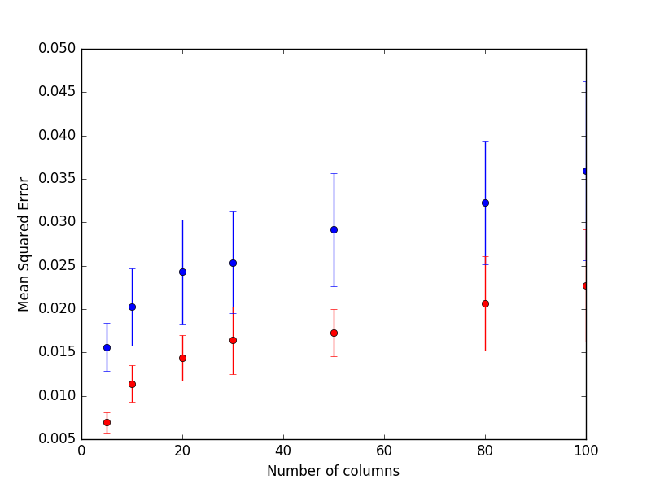

# Decision Trees

A decision tree answers a prediction by asking one feature question at a time, so the real questions are how to choose each split and when to stop. The page starts with split criteria and visualizing forests, then CART with SSE, Gini, early stopping, and pruning, then KD-trees for nearest neighbours, and ends with the forest variants built from trees: random forests and extremely randomized trees.

The same notes are in [Hoeffding tree](../decision-intelligence/incremental-learning.md#hoeffding-tree), [IMBALANCED DATASETS](../data/datasets.md#imbalanced-datasets), [Interview questions](../ai-product/data-science-management.md#interview-questions), and [Unbalanced labels](../problem-framing/label-algorithms.md#unbalanced-labels).

The split criterion is the first choice, and it matters most when the classes are imbalanced. Evgeni Dubov's post on classifying imbalanced data starts from the usual sklearn RandomForestClassifier setup and proposes [Using hellinger distance to split supervised datasets, instead of gini and entropy. Claims better results.](https://medium.com/@evgeni.dubov/classifying-imbalanced-data-using-hellinger-distance-f6a4330d6f9a) Once a forest is trained, it helps to look inside it. Visualize decision forests: [forests](https://medium.com/data-science/how-to-visualize-a-decision-tree-from-a-random-forest-in-python-using-scikit-learn-38ad2d75f21c) is Will Koehrsen's guide to visualizing a decision tree from a random forest in Python using scikit-learn.

### [CART TREES](http://machinelearningmastery.com/classification-and-regression-trees-for-machine-learning/)

The classical tree algorithm, known by its more modern name CART, is where the split math lives; the heading link is Jason Brownlee's MachineLearningMastery post on classification and regression trees. The same notes are in [REGRESSION ALGORITHMS](regression.md#regression-algorithms) and [Tutorials](../data/information-theory.md#tutorials).

The post explains about the similarities and how to measure. which is the best split? based on SSE and GINI (good info about gini here). For classification the Gini cost function is used which provides an indication of how “pure” the leaf nodes are (how mixed the training data assigned to each node is).

Gini = sum(pk * (1 – pk))

A tree grown until every leaf is pure memorizes the data, so two controls follow. Early stop — 1 sample per node is overfitting, 5-10 are good. Pruning — evaluate what happens if the lead nodes are removed, if there is a big drop, we need it.

### KDTREE

The same split-by-feature idea also organizes space for search rather than prediction. Victor Lavrenko's KD tree algorithm: how it works explains it: [Similar to a binary search tree, just by using the median and selecting a feature randomly for each level.](https://www.youtube.com/watch?v=TLxWtXEbtFE) His kNN.15 K-d tree algorithm lecture shows what it is for: [Used to find nearest neighbours.](https://www.youtube.com/watch?v=Y4ZgLlDfKDg) The Quora question on what a kd-tree is used for lists [Many applications of using KD tree, reduce color space, Database key search, etc](https://www.quora.com/What-is-a-kd-tree-and-what-is-it-used-for).

### RANDOM FOREST

Back to prediction: one tree overfits, so a forest averages many, and the forest can also be used as a feature transform. The same notes are in [Ensembles](ensembles.md).

scikit-learn's feature transformations with ensembles of trees fits an ensemble first, then trains a linear model on the resulting features: [Using an ensemble of trees to create a high dimensional and sparse representation of the data and classifying using a linear classifier](http://scikit-learn.org/stable/auto_examples/ensemble/plot_feature_transformation.html#sphx-glr-auto-examples-ensemble-plot-feature-transformation-py)

Imbalance comes back here too. [How do deal with imbalanced data in Random-forest](http://statistics.berkeley.edu/sites/default/files/tech-reports/666.pdf) — the Berkeley paper proposes two ways and shows both improve prediction accuracy:

1. One is based on cost sensitive learning.
2. Other is based on a sampling technique

### EXTRA TREES

Random forests still search for the best split; extremely randomized trees go one step further and randomize the split itself. The same notes are in [Ensembles](ensembles.md).

A comparison between random forest and extra trees used to be linked here; the original article address is kept at the end of the page. Its figure caption reads:

Fig. 1: Comparison of random forests and extra trees in presence of irrelevant predictors. In blue are presented the results from the random forest and red for the extra trees. The results are quite striking: Extra Trees perform consistently better when there are a few relevant predictors and many noisy ones

<figure><figcaption>
Comparison of random forests and extra trees in presence of irrelevant predictors.

Credit: <a href="https://lh3.googleusercontent.com/frZzCFNyzH8WZmbb0IIy_-e-wsqwclzspkGC9p2AIpRHOH1L-AEWAfQqvy96s26rts-VmSNHN8LSJMvNMjXtIv5qcE3j_MZQjnbM2ped7g7oy0Nli59cv1YhM_cGH2G2Ne67MSwM">copied from the original hosted image</a>.
</figcaption></figure>

To see why, the [Difference between RF and ET](https://stats.stackexchange.com/questions/175523/difference-between-random-forest-and-extremely-randomized-trees) thread states that random forest splits are deterministic, while in extremely randomized trees the next split is the best among random uniform splits, and asks what impact that has. [Differences #2](https://stackoverflow.com/questions/22409855/randomforestclassifier-vs-extratreesclassifier-in-scikit-learn) is the same question for RandomForestClassifier vs ExtraTreesClassifier in scikit-learn, read against the Geurts, Ernst, and Wehenkel paper "Extremely randomized trees".

To close, Will Koehrsen's post, a helpful utility for understanding your model, is the place to visualize decision forests: [https://towardsdatascience.com/how-to-visualize-a-decision-tree-from-a-random-forest-in-python-using-scikit-learn-38ad2d75f21c](https://towardsdatascience.com/how-to-visualize-a-decision-tree-from-a-random-forest-in-python-using-scikit-learn-38ad2d75f21c)

## Deprecated links


These links and images no longer work. The original wording is kept here. A same-resource copy, when one was checked, is used above.


- Visualize decision trees. This address no longer opens: https://towardsdatascience.com/interactive-visualization-of-decision-trees-with-jupyter-widgets-ca15dd312084
- A comparison between random forest and extra trees. This address no longer opens: https://www.thekerneltrip.com/statistics/random-forest-vs-extra-tree/
