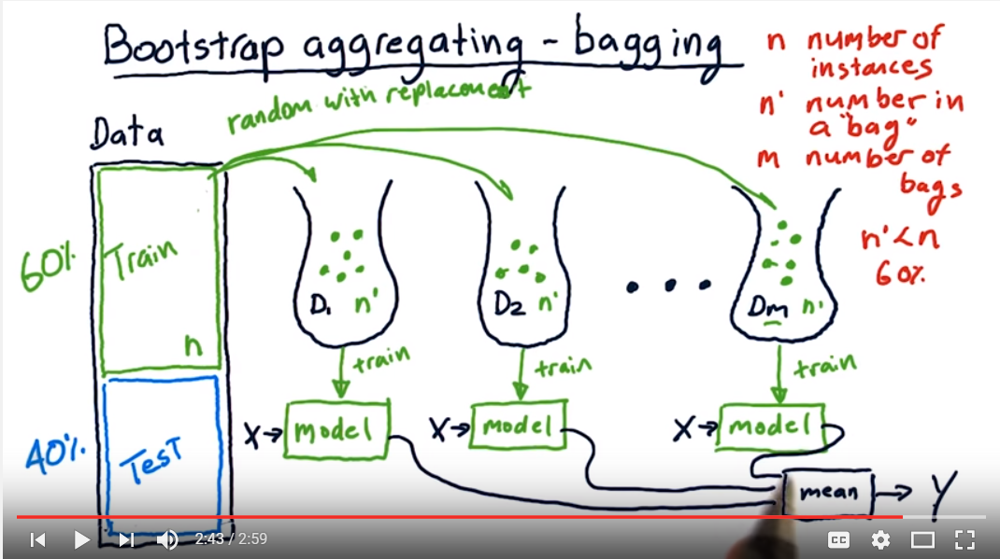
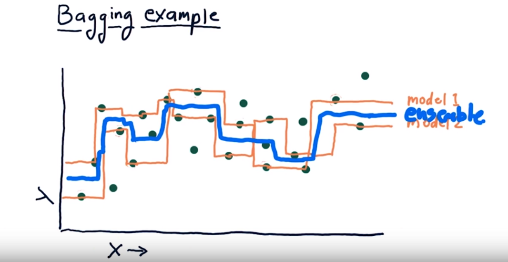
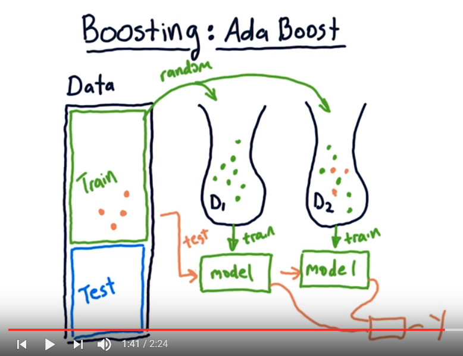

# Ensembles

This page collects voting, bagging, boosting, stacking, and related ensemble reading.

The same notes are in [Active Learning](../problem-framing/active-learning.md), [EXTRA TREES](decision-trees.md#extra-trees), [Interview questions](../ai-product/data-science-management.md#interview-questions), and [RANDOM FOREST](decision-trees.md#random-forest).

1. (good) [review on voting, bagging, boosting stacking, cascading methodologies](https://www.toptal.com/machine-learning/ensemble-methods-kaggle-machine-learn)
2. [How to combine several sklearn algorithms into a voting ensemble](https://www.youtube.com/watch?v=vlTQLb_a564&list=PLQVvvaa0QuDf2JswnfiGkliBInZnIC4HL&index=16)
3. [Stacking api, MLXTEND](http://rasbt.github.io/mlxtend/user_guide/classifier/StackingClassifier/)
4. Machine learning Mastery on
   1. [stacking neural nets — really good](https://machinelearningmastery.com/stacking-ensemble-for-deep-learning-neural-networks/)
      1. Stacked Generalization Ensemble
      2. Multi-Class Classification Problem
      3. Multilayer Perceptron Model
      4. Train and Save Sub-Models
      5. Separate Stacking Model
      6. Integrated Stacking Model
   2. [How to Combine Predictions for Ensemble Learning](https://machinelearningmastery.com/combine-predictions-for-ensemble-learning/)
      1. Plurality Voting.
      2. Majority Voting.
      3. Unanimous Voting.
      4. Weighted Voting.
   3. [Essence of Stacking Ensembles for Machine Learning](https://machinelearningmastery.com/essence-of-stacking-ensembles-for-machine-learning/)
      1. Voting Ensembles
      2. Weighted Average
      3. Blending Ensemble
      4. Super Learner Ensemble
   4. [Dynamic Ensemble Selection (DES) for Classification in Python](https://machinelearningmastery.com/dynamic-ensemble-selection-in-python/) — Dynamic Ensemble Selection algorithms operate much like DCS algorithms, except predictions are made using votes from multiple classifier models instead of a single best model. In effect, each region of the input feature space is owned by a subset of models that perform best in that region.
      1. k-Nearest Neighbor Oracle (KNORA) With Scikit-Learn
         1. KNORA-Eliminate (KNORA-E)
         2. KNORA-Union (KNORA-U)
      2. Hyperparameter Tuning for KNORA
         1. Explore k in k-Nearest Neighbor
         2. Explore Algorithms for Classifier Pool
   5. [A Gentle Introduction to Mixture of Experts Ensembles](https://machinelearningmastery.com/mixture-of-experts/)
      1. Mixture of Experts
         1. Subtasks
         2. Expert Models
         3. Gating Model
         4. Pooling Method
      2. Relationship With Other Techniques
         1. Mixture of Experts and Decision Trees
         2. Mixture of Experts and Stacking
   6. [Strong Learners vs. Weak Learners in Ensemble Learning](https://machinelearningmastery.com/strong-learners-vs-weak-learners-for-ensemble-learning/) — Weak learners are models that perform slightly better than random guessing. Strong learners are models that have arbitrarily good accuracy.

      Weak and strong learners are tools from computational learning theory and provide the basis for the development of the boosting class of ensemble methods.
5. [Vidhya on trees, bagging boosting, gbm, xgb](https://www.analyticsvidhya.com/blog/2016/04/complete-tutorial-tree-based-modeling-scratch-in-python/#three)
6. [Parallel grad boost treest](http://zhanpengfang.github.io/418home.html)
7. [A comprehensive guide to ensembles read!](https://www.analyticsvidhya.com/blog/2018/06/comprehensive-guide-for-ensemble-models/) (samuel jefroykin)
   1. Basic Ensemble Techniques
   2. 2.1 Max Voting
   3. 2.2 Averaging
   4. 2.3 Weighted Average
   5. Advanced Ensemble Techniques
   6. 3.1 Stacking
   7. 3.2 Blending
   8. 3.3 Bagging
   9. 3.4 Boosting
   10. Algorithms based on Bagging and Boosting
   11. 4.1 Bagging meta-estimator
   12. 4.2 Random Forest
   13. 4.3 AdaBoost
   14. 4.4 GBM
   15. 4.5 XGB
   16. 4.6 Light GBM
   17. 4.7 CatBoost
8. [Kaggler guide to stacking](http://blog.kaggle.com/2016/12/27/a-kagglers-guide-to-model-stacking-in-practice/)
9. [Blending vs stacking](https://www.quora.com/What-are-examples-of-blending-and-stacking-in-Machine-Learning)
10. Kaggle ensemble guide

### [Ensembles in WEKA](http://machinelearningmastery.com/use-ensemble-machine-learning-algorithms-weka/)

This section summarizes bagging, random forest, boosting, voting, and stacking as used in WEKA.

- bagging (random sample selection, multi classifier training), random forest (random feature selection for each tree, multi tree training), boosting(creating stumps, each new stump tries to fix the previous error, at last combining results using new data, each model is assigned a skill weight and accounted for in the end), voting(majority vote, any set of algorithms within weka, results combined via mean or some other way), stacking(same as voting but combining predictions using a meta model is used).

### BAGGING - bootstrap aggregating

This section is bagging with replacement bags and averaging predictions.

[Bagging](https://www.youtube.com/watch?v=2Mg8QD0F1dQ&list=PLAwxTw4SYaPnIRwl6rad_mYwEk4Gmj7Mx&index=192) — best example so far, create m bags, put n’\<n samples (60% of n) in each bag — with replacement which means that the same sample can be selected twice or more, query from the test (x) each of the m models, calculate mean, this is the classification.

<figure><figcaption>
Bagging.

Credit: <a href="https://lh5.googleusercontent.com/U0_wGc2DQhx1TYC_ntWSyW9J0XtJJwP4bZ8ONOLgbqb4LM0K7c6-As1HX9wT0LGRON6sOvl3l-WeEOOmuTCupNN3q8Q_kQU8Y1nhhBi6-Of2bcajJfVjhqRRcY-qudAm_u3jXOuF">copied from the original hosted image</a>.
</figcaption></figure>

Overfitting — not an issue with bagging, as the mean of the models actually averages or smoothes the “curves”. Even if all of them are overfitted.

<figure><figcaption>
Bagging and overfitting.

Credit: <a href="https://lh4.googleusercontent.com/KOj9utriFKEjOxhw8hFE2iX8gq5ljjBHruuhH1Q-deWVPYrEA2RHWaAhKfs-Q1XivON_F7KA3vXL4Mo-GqI4OZTgi0WhC9iNdo4IoOSxQ8gUyoa_F56TOFiXf-hgMsdIFGWLoq6k">copied from the original hosted image</a>.
</figcaption></figure>

### BOOSTING

This section is AdaBoost-style sequential reweighting of hard examples.

Mastery on using [all the boosting algorithms](https://machinelearningmastery.com/gradient-boosting-with-scikit-learn-xgboost-lightgbm-and-catboost/): Gradient Boosting with Scikit-Learn, XGBoost, LightGBM, and CatBoost

Adaboost: similar to bagging, create a system that chooses from samples that were modelled poorly before.

1. create bag\_1 with n’ features \<n with replacement, create the model\_1, test on ALL train.
2. Create bag\_2 with n’ features with replacement, but add a bias for selecting from the samples that were wrongly classified by the model\_1. Create a model\_2. Average results from model\_1 and model\_2. I.e., who was classified correctly or not.
3. Create bag\_3 with n’ features with replacement, but add a bias for selecting from the samples that were wrongly classified by the model\_1+2. Create a model\_3. Average results from model\_1, 2 & 3 I.e., who was classified correctly or not. Iterate onward.
4. Create bag\_m with n’ features with replacement, but add a bias for selecting from the samples that were wrongly classified by the previous steps.

<figure><figcaption>
Boosting.

Credit: <a href="https://lh5.googleusercontent.com/iwKa08rChrddn1TM9GoSwmc3gGfxhUbOnPpwHoBS8YHEwUPUOkHifHAO88DR2uiDgRg1VL-dgmnQ2NWFFPJ4CTWvoYdFtBCW-feiBX8SdZ1waY0VkGYclr_m48OzHazmHWrNV3G-">copied from the original hosted image</a>.
</figcaption></figure>

### XGBOOST

This section is XGBoost: definition, overfitting notes, parameters, and WEKA/R usage.

- What is XGBOOST? — XGBoost is an optimized distributed gradient boosting system designed to be highly efficient, flexible and portable [#2nd link](http://dmlc.cs.washington.edu/xgboost.html)
- [Does it cause overfitting?](https://stats.stackexchange.com/questions/20714/does-ensembling-boosting-cause-overfitting)
- [Authors Youtube lecture.](https://www.youtube.com/watch?v=Vly8xGnNiWs)
- [GIT here](https://github.com/dmlc/xgboost)
- How to use XGB tutorial on medium (comparison to GBC)
- [How to code tutorial](https://www.youtube.com/watch?v=87xRqEAx6CY), short and makes sense, with info about the parameters.
- Threads
- Rounds
- Tree height
- Loss function
- Error
- Cross fold.
- [Beautiful Video Class about XGBOOST](https://www.youtube.com/playlist?list=PLZnYQQzkMilqTC12LmnN4WpQexB9raKQG) — mostly practical in jupyter but with some insight about the theory.
- [Machine learning mastery](http://machinelearningmastery.com/gentle-introduction-xgboost-applied-machine-learning/) — slides, video, lots of info.

[R Installation in Weka](https://www.youtube.com/watch?v=EGwHXC3baWU&list=PLm4W7_iX_v4Msh-7lDOpSFWHRYU_6H5Kx&index=15), then XGBOOST in weka through R

Parameters for weka mlr class.xgboost.

- [https://cran.r-project.org/web/packages/xgboost/xgboost.pdf](https://cran.r-project.org/web/packages/xgboost/xgboost.pdf)
- Here is an example configuration for multi-class classification:
- weka.classifiers.mlr.MLRClassifier -learner “nrounds = 10, max\_depth = 2, eta = 0.5, nthread = 2”
- classif.xgboost -params "nrounds = 1000, max\_depth = 4, eta = 0.05, nthread = 5, objective = \\"multi:softprob\\"

Copy: nrounds = 10, max\_depth = 2, eta = 0.5, nthread = 2

Special case of random forest using XGBOOST:

#Random Forest™ - 1000 trees

bst <- xgboost(data = train$data, label = train$label, max\_depth = 4, num\_parallel\_tree = 1000, subsample = 0.5, colsample\_bytree =0.5, nrounds = 1, objective = "binary:logistic")

#Boosting - 3 rounds

bst <- xgboost(data = train$data, label = train$label, max\_depth = 4, nrounds = 3, objective = "binary:logistic")

RF1000: - max\_depth = 4, num\_parallel\_tree = 1000, subsample = 0.5, colsample\_bytree =0.5, nrounds = 1, nthread = 2

XG: nrounds = 10, max\_depth = 4, eta = 0.5, nthread = 2

### Gradient Boosting Classifier

This section compares GBC and XGB on loss, speed, and tutorials.

1. [Loss functions and GBC vs XGB](https://stats.stackexchange.com/questions/202858/loss-function-approximation-with-taylor-expansion)
2. [Why is XGB faster than SK GBC](https://datascience.stackexchange.com/questions/10943/why-is-xgboost-so-much-faster-than-sklearn-gradientboostingclassifier)
3. Good XGB vs GBC tutorial
4. [XGB vs GBC](https://stats.stackexchange.com/questions/282459/xgboost-vs-python-sklearn-gradient-boosted-trees)

## CatBoost

This section lists CatBoost reading.

1. (great) [what is so special?](https://hanishrohit.medium.com/whats-so-special-about-catboost-335d64d754ae)
2. [the fastest algo](https://medium.com/almabetter/catboost-the-fastest-algorithm-c21d44f8b990)
3. [a new game in ML](https://affine.medium.com/catboost-a-new-game-of-machine-learning-72a7dcea0ac4)
4. use it here is why

## Deprecated links


These links and images no longer work. The original wording is kept here. A same-resource copy, when one was checked, is used above.


- Kaggle ensemble guide. This address no longer opens: https://mlwave.com/kaggle-ensembling-guide/
- What is XGBOOST?. This address no longer opens: http://homes.cs.washington.edu/~tqchen/2016/03/10/story-and-lessons-behind-the-evolution-of-xgboost.html
- How to use XGB tutorial on medium (comparison to GBC). This address no longer opens: https://towardsdatascience.com/boosting-algorithm-xgboost-4d9ec0207d
- Parameters for weka mlr class.xgboost. This address no longer opens: http://weka.8497.n7.nabble.com/XGBoost-in-Weka-through-R-or-Python-td40282.html
- Special case of random forest using XGBOOST. This address no longer opens: https://github.com/dmlc/xgboost/blob/master/R-package/vignettes/discoverYourData.Rmd#special-note-what-about-random-forests
- Good XGB vs GBC tutorial. This address no longer opens: https://towardsdatascience.com/boosting-algorithm-xgboost-4d9ec0207d
- use it here is why. This address no longer opens: https://towardsdatascience.com/you-should-use-catboost-heres-why-72f124dcdad7
