# Timeseries

A time series is a sequence of measurements where the order matters, so predicting the next value means first understanding what the series is made of. The page starts with the components of a series, transforms, stationarity, splitting, and the windows used to smooth and weight it, then decomposition and short series. It then moves to forecasting methods and how to evaluate them, classification with DTW, Kalman filters, LSTMs, the tools, and finally Pandas manipulation.

The same notes are in [Anomaly Detection](anomaly-detection.md), [Time series entropy](../data/information-theory.md#time-series-entropy), and [Timeseries](forecasting.md#timeseries).

The simplest baseline is a series that just wanders. MachineLearningMastery's A Gentle Introduction to the Random Walk for Times Series Forecasting with Python is the [Random walk](https://machinelearningmastery.com/gentle-introduction-random-walk-times-series-forecasting-python/) reference, and the figure below illustrates it.

<figure>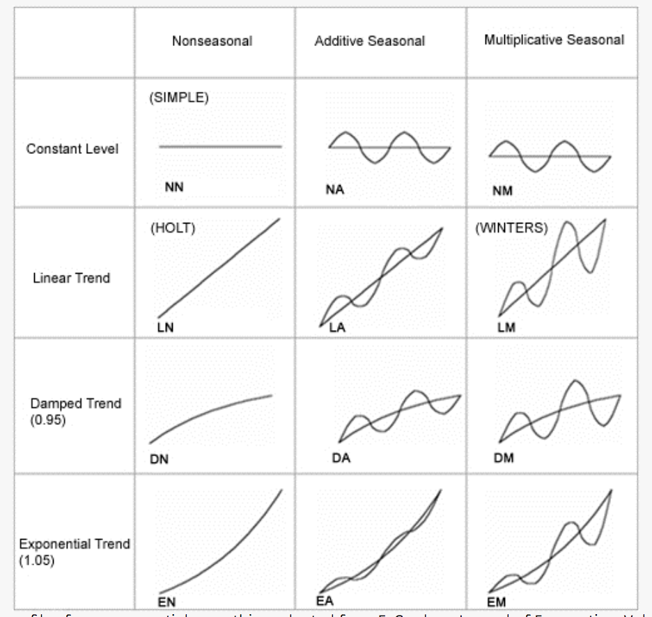<figcaption>
Figure.

Credit: <a href="https://lh6.googleusercontent.com/EIjqJgNQyohogF9eaHNDSpOJHaXag5MgHLlShTtkSHRaEU0EitX_ZPMbVDE2cbHr02bzT46Io9sJH7EkeTTrW49KMbBbYe6Xh9yFp2Tq_0LA-CZdb7X0ZZNvMs0k4hj8epypkKft">copied from the original hosted image</a>.
</figcaption></figure>

Anything beyond a random walk has structure that can be pulled apart. The [Time series decomposition book](https://otexts.com/fpp2/forecasting-decomposition.html) is section 6.8, Forecasting with decomposition, of Forecasting: Principles and Practice (2nd ed). [Mastery on ts decomposition](https://machinelearningmastery.com/decompose-time-series-data-trend-seasonality/) is MachineLearningMastery's How to Decompose Time Series Data into Trend and Seasonality.

### [Time Series Components](http://machinelearningmastery.com/time-series-forecasting/)

Decomposition needs names for the parts. The heading link is Jason Brownlee's What Is Time Series Forecasting?, which argues that time series forecasting is an important and often neglected area of machine learning, neglected because the time component makes the problems harder to handle. It names four components:

1. Level. The baseline value for the series if it were a straight line.
2. Trend. The optional and often linear increasing or decreasing behavior of the series over time.
3. Seasonality. The optional repeating patterns or cycles of behavior over time.
4. Noise. The optional variability in the observations that cannot be explained by the model.

All time series have a level, most have noise, and the trend and seasonality are optional.

With the components named, a series can be framed as supervised learning. Take a one step forecast using a window of “1” and a typical sample “time, measure1, measure2”. Linear/nonlinear classifiers predict a single output value, using the t-1 previous line, i.e., “measure1 t, measure 2 t, measure 1 t+1, measure 2 t+1 (as the class)”. Neural networks predict multiple output values, i.e., “measure1 t, measure 2 t, measure 1 t+1(class1), measure 2 t+1(class2)”.

One-Step Forecast: This is where the next time step (t+1) is predicted.

Multi-Step Forecast: This is where two or more future time steps are to be predicted.

A multi-step forecast using a window of “1” and a typical sample “time, measure1” uses the current value input and labels it with the two future input labels: “measure1 t, measure1 t+1(class), measure1 t+2(class1)”.

This article explains about ML Methods for Sequential Supervised Learning - Six methods that have been applied to solve sequential supervised learning problems:

The same notes are in [CONDITIONAL RANDOM FIELDS (CRF)](probabilistic-models.md#conditional-random-fields-crf) and [MARKOV MODELS / HIDDEN MARKOV MODEL](probabilistic-models.md#markov-models--hidden-markov-model).

1. sliding-window methods - converts a sequential supervised problem into a classical supervised problem
2. recurrent sliding windows
3. hidden Markov models
4. maximum entropy Markov models
5. input-output Markov models
6. conditional random fields
7. graph transformer networks

The article is the Oregon State University paper at [http://web.engr.oregonstate.edu/~tgd/publications/mlsd-ssspr.pdf](http://web.engr.oregonstate.edu/~tgd/publications/mlsd-ssspr.pdf), which formalizes the principal learning tasks for sequential data and describes the methods developed for them.

##

### [Data Transformations](https://www.otexts.org/fpp/2/4)

Before any of those methods, the raw series is often transformed. The forecasting textbook section in the heading covers the Log and Box cox transforms, the Back transform that returns forecasts to the original scale, Calendrical adjustments, and Inflation adjustment.

Transforming time series data to tabular (in order to use tabular based approach) is covered at [https://towardsdatascience.com/approaching-time-series-with-a-tree-based-model-87c6d1fb6603](https://towardsdatascience.com/approaching-time-series-with-a-tree-based-model-87c6d1fb6603).

### STATIONARY TIME SERIES

Most classical models assume the transformed series is stationary. [What is?](https://machinelearningmastery.com/time-series-data-stationary-python/) A time series without a trend or seasonality, in other words non-stationary has a trend or seasonality

There are ways to [remove the trend and seasonality](https://machinelearningmastery.com/difference-time-series-dataset-python/), i.e., take the difference between time points. The steps are:

1. T+1 - T
2. Bigger lag to support seasonal changes
3. pandas.diff()
4. Plot a histogram, plot a log(X) as well.
5. Test for the unit root null hypothesis - i.e., use the Augmented dickey fuller test to determine if two samples originate in a stationary or a non-stationary (seasonal/trend) time series

Shay on stationary time series, AR, ARMA used to be linked here; the address no longer opens and is kept at the end of the page.

For a decomposition that handles seasonality robustly, (amazing) [STL](https://otexts.com/fpp2/stl.html) and more.

### SPLITTING TIME SERIES DATA

A stationary series still cannot be split at random, because the future must not leak into training. SK-lego With a gap is the splitter for that; its old page is kept at the end. It is now with even timeseries split by group, as Tomer Gabay's A highly anticipated Time Series Cross-validator is finally here explains: unevenly spread Time Series data is no longer a problem for cross-validation. [https://towardsdatascience.com/a-highly-anticipated-time-series-cross-validator-is-finally-here-7dc99f672736](https://towardsdatascience.com/a-highly-anticipated-time-series-cross-validator-is-finally-here-7dc99f672736)

### [Rolling window analysis](https://link.springer.com/chapter/10.1007%2F978-0-387-32348-0_9)

Splitting asks whether a model generalizes forward in time; a rolling window asks whether its parameters stay the same over time. The chapter in the heading puts it this way:

“compute parameter estimates over a rolling window of a fixed size through the sample. If the parameters are truly constant over the entire sample, then the estimates over the rolling windows should not be too different. If the parameters change at some point during the sample, then the rolling estimates should capture this instability”

### [Moving average window](https://www.otexts.org/fpp/6/2)

A window can also smooth the series itself. The moving average is used to estimate the trend cycle. The window size is a choice, 3-5-7-9? If its too large its going to flatten the curve, too low its going to be similar to the actual curve. There is also the two tier moving average, first 4 then 2 on the resulted moving average.

[Visual example](https://www.youtube.com/watch?v=_YXoRTQQI3U) of ARIMA algorithm - captures the time series trend or forecast.

### Weighted “window”

A plain moving average weights every point in the window equally; a weighted window lets older points count less. The tool here is 1, scikit-lego with a decay estimator, whose page is kept at the end. The figure shows the decay.

<figure>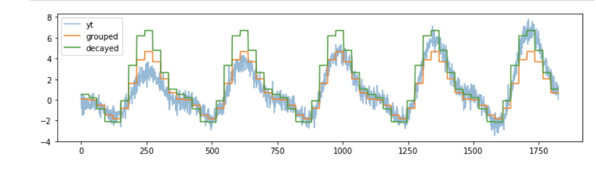<figcaption>
Figure.

Credit: <a href="https://lh5.googleusercontent.com/LKgjfaw-oOaNI7with2FnVnDSoR2LXpzN2boi3cM29HsfzELrpk6FTId0nZj1JnnTI79SBnQgLlM10Awyz7eFC8jEEaUMtax-BowEK3QFKyJEv3P-LnCrrNP9CdSxii1u2d_GEl9">copied from the original hosted image</a>.
</figcaption></figure>

### Decomposition

Smoothing extracts the trend; seasonality needs its own basis. Creating curves to explain a complex seasonal fit is the scikit-lego repeating basis function approach, whose page is kept at the end. The two figures show the curves and the fit.

<figure>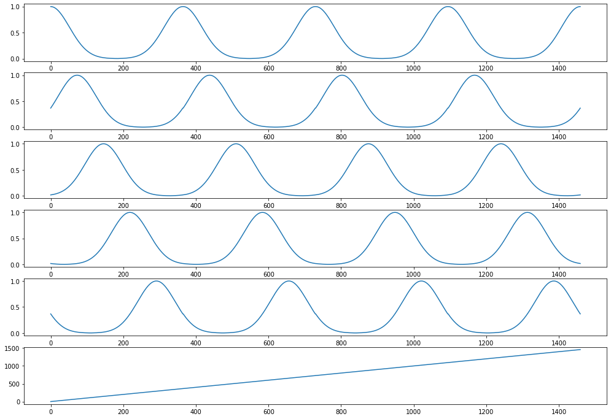<figcaption>
Figure.

Credit: <a href="https://lh6.googleusercontent.com/dnGmy5HVE3eGuaObKDMwyoabjNYBFQX_qXgoppg2hCIRHPttAYPVXCDl5qEIVmoMQk-74JGr_ol58rv-ScpTEC7bQgn8nEI2cjFj0a74qZLS47sNQQXEeHzLb0XGylhsa-uilNgs">copied from the original hosted image</a>.
</figcaption></figure>

<figure>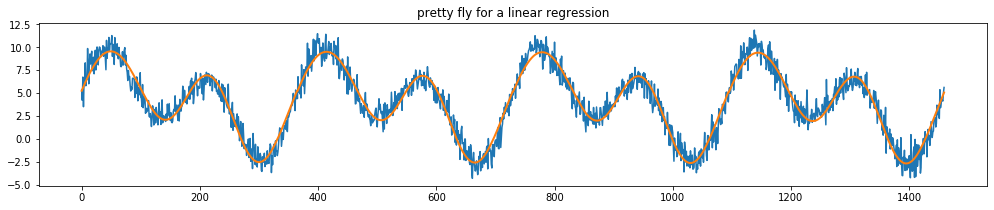<figcaption>
Figure.

Credit: <a href="https://lh6.googleusercontent.com/8iRS-_lbtCP1bVVwihykUC_Kw3LlzoyrAWika8cvNQ2UTw3bUZXqbmz7vb4N5GYgl9ne2QnDlJKU1pb9OwtFRqiAVB-XYmV7dchKF0kib0Mqe2AAHmMeCEyJxjzjPXcUuoK6T3pI">copied from the original hosted image</a>.
</figcaption></figure>

### SHORT TIME SERIES

All of the above assumes enough history, and many real series are short. [Short time series](https://robjhyndman.com/hyndsight/short-time-series/) is Rob J Hyndman's Fitting models to short time series. PDarima - Pmdarima‘s auto_arima function is extremely useful when building an ARIMA model as it helps us identify the most optimal p,d,q parameters and return a fitted ARIMA model; Muriel Kosaka's Efficient Time-Series Using Python's Pmdarima Library demonstrates the efficiency of pmdarima's auto_arima() function compared to implementing a traditional ARIMA model: [https://towardsdatascience.com/efficient-time-series-using-pythons-pmdarima-library-f6825407b7f0](https://towardsdatascience.com/efficient-time-series-using-pythons-pmdarima-library-f6825407b7f0). How little data is enough is the question of [Min sample size for short seasonal time series](https://robjhyndman.com/papers/shortseasonal.pdf).

[More mastery on short time series.](https://machinelearningmastery.com/time-series-forecasting-methods-in-python-cheat-sheet/) is MachineLearningMastery's 11 Classical Time Series Forecasting Methods in Python (Cheat Sheet), which lists:

1. Autoregression (AR)
2. Moving Average (MA)
3. Autoregressive Moving Average (ARMA)
4. Autoregressive Integrated Moving Average (ARIMA)
5. Seasonal Autoregressive Integrated Moving-Average (SARIMA)
6. Seasonal Autoregressive Integrated Moving-Average with Exogenous Regressors (SARIMAX)
7. Vector Autoregression (VAR)
8. Vector Autoregression Moving-Average (VARMA)
9. Vector Autoregression Moving-Average with Exogenous Regressors (VARMAX)
10. Simple Exponential Smoothing (SES)
11. Holt Winter’s Exponential Smoothing (HWES)

Auto ARIMA also scales to many series: Michael Keith's Multiple Series? Forecast Them together with any Sklearn Model shows how to use Python to forecast the trends of multiple series at the same time, 1. [https://towardsdatascience.com/time-series-forecasting-using-auto-arima-in-python-bb83e49210cd](https://towardsdatascience.com/time-series-forecasting-using-auto-arima-in-python-bb83e49210cd)

Predicting actual Values of time series using observations is a different angle: [Using kalman filters](https://www.youtube.com/watch?v=CaCcOwJPytQ) - explains the concept etc, 1 out of 55 videos.

### [Forecasting methods](https://www.otexts.org/fpp/2/3)

Before reaching for ARIMA, the textbook sets simple benchmarks that any model must beat:

- Average: Forecasts of all future values are equal to the mean of the historical data.
- Naive: Forecasts are simply set to be the value of the last observation.
- Seasonal Naive: forecast to be equal to the last observed value from the same season of the year
- Drift: A variation on the naïve method is to allow the forecasts to increase or decrease over time, the drift is set to be the average change seen in the historical data.

### [Evaluate forecast accuracy](https://www.otexts.org/fpp/2/5)

A benchmark only matters once there is a way to score it. The figure summarizes the accuracy measures from the textbook section in the heading.

<figure>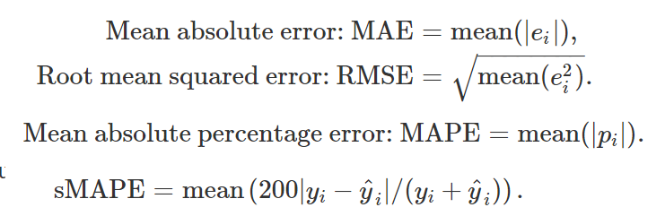<figcaption>
Figure.

Credit: <a href="https://lh6.googleusercontent.com/-t5303-rJtTF8gUP5GRrHwx9gVJTaM5zObpxRFO5iD1jgkSC-qxX1Q8-7fPnP1cb9Vo3reKMtL5f_d41XvX0xjHxTlCtHOJ7i99aaHj7YLSa_vu4E5nCg1IQCWi5YyZvQt-O1TJ3">copied from the original hosted image</a>.
</figcaption></figure>

Regression forecasts usually carry calendar effects as dummy variables, and that is where beginners trip. Dummy variables: sunday, monday, tues,wed,thurs, friday. NO SATURDAY! Notice that only six dummy variables are needed to code seven categories. That is because the seventh category (in this case Sunday) is specified when the dummy variables are all set to zero. Many beginners will try to add a seventh dummy variable for the seventh category. This is known as the "dummy variable trap" because it will cause the regression to fail.

The same trick handles other effects:

- Outliers: If there is an outlier in the data, rather than omit it, you can use a dummy variable to remove its effect. In this case, the dummy variable takes value one for that observation and zero everywhere else.
- Public holidays: For daily data, the effect of public holidays can be accounted for by including a dummy variable predictor taking value one on public holidays and zero elsewhere.
- Easter: is different from most holidays because it is not held on the same date each year and the effect can last for several days. In this case, a dummy variable can be used with value one where any part of the holiday falls in the particular time period and zero otherwise.
- Trading days: The number of trading days in a month can vary considerably and can have a substantial effect on sales data. To allow for this, the number of trading days in each month can be included as a predictor. An alternative that allows for the effects of different days of the week has the following predictors. # Mondays in month;# Tuesdays in month;# Sundays in month.
- Advertising: $advertising for previous month;$advertising for two months previously

### CLASSIFICATION

Forecasting predicts the next value; classification labels a whole series, and that needs a distance between series. [Stackexchange](https://stats.stackexchange.com/questions/131281/dynamic-time-warping-clustering/131284) - Yes, you can use DTW approach for classification and clustering of time series. I've compiled the following resources, which are focused on this very topic (I've recently answered a similar question, but not on this site, so I'm copying the contents here for everybody's convenience):

- UCR Time Series Classification/Clustering: main page, software page and corresponding paper
- Time Series Classification and Clustering with Python: a blog post
- Capital Bikeshare: Time Series Clustering: another blog post
- Jupyter Notebook Viewer. Time Series Classification and Clustering: [ipython notebook](http://nbviewer.ipython.org/github/alexminnaar/time-series-classification-and-clustering/blob/master/Time%20Series%20Classification%20and%20Clustering.ipynb)
- Dynamic Time Warping using rpy and Python:. [another blog post](https://nipunbatra.wordpress.com/2013/06/09/dynamic-time-warping-using-rpy-and-python)
- Mining Time-series with Trillions of Points: Dynamic Time Warping at Scale: another blog post
- Time Series Analysis and Mining in R (to add R to the mix): yet another blog post
- And, finally, two tools implementing/supporting DTW, to top it off: R package and Python module

Two of those answers have addresses of their own. The Mining Time-series with Trillions of Points: Dynamic Time Warping at scale post, another blog post, takes a similarity measure that's already well-known and runs it at scale: [http://practicalquant.blogspot.com/2012/10/mining-time-series-with-trillions-of.html](http://practicalquant.blogspot.com/2012/10/mining-time-series-with-trillions-of.html). Time Series Analysis and Mining with R on blog.RDataMining.com is yet another blog post: [http://rdatamining.wordpress.com/2011/08/23/time-series-analysis-and-mining-with-r](http://rdatamining.wordpress.com/2011/08/23/time-series-analysis-and-mining-with-r). The Python module from that list is kept at the end.

Tree models are the other way to classify or regress on series. Satya Pattnaik's A LightGBM Autoregressor — Using Sktime is at [https://towardsdatascience.com/a-lightgbm-autoregressor-using-sktime-6402726e0e7b](https://towardsdatascience.com/a-lightgbm-autoregressor-using-sktime-6402726e0e7b). To give those models a better notion of time, Marco Cerliani's Time2vec for Time Series features encoding shows how to learn a valuable representation of time for your Machine Learning Model: [https://towardsdatascience.com/time2vec-for-time-series-features-encoding-a03a4f3f937e](https://towardsdatascience.com/time2vec-for-time-series-features-encoding-a03a4f3f937e)

### [Kalman filters in matlab](https://www.youtube.com/watch?v=4OerJmPpkRg)

The Kalman filter video from the short-series section has a MATLAB counterpart. The heading link is MATLAB's State Observers | Understanding Kalman Filters, Part 2.

### [LTSM for time series](http://machinelearningmastery.com/time-series-prediction-lstm-recurrent-neural-networks-python-keras/)

Kalman filters model hidden state explicitly; an LSTM learns it. The heading link is Jason Brownlee's Time Series Prediction with LSTM Recurrent Neural Networks in Python with Keras, which notes that time series add the complexity of a sequence dependence among the input variables, and that the LSTM is a recurrent network designed to handle it.

The same notes are in [Deep Neural Time Series](../deep-learning/deep-neural-time-series.md) and [LSTM](../deep-learning/recurrent-nets.md#lstm).

There are three types of gates within a unit:

- Forget Gate: conditionally decides what information to throw away from the block.
- Input Gate: conditionally decides which values from the input to update the memory state.
- Output Gate: conditionally decides what to output based on input and the memory of the block.

Using lstm to predict sun spots, has some autocorrelation usage. [Part 1](https://www.business-science.io/timeseries-analysis/2018/04/18/keras-lstm-sunspots-time-series-prediction.html) teaches time series analysis with Keras LSTM deep learning by predicting sunspots ten years into the future. [Part 2](https://www.business-science.io/timeseries-analysis/2018/07/01/keras-lstm-sunspots-part2.html) continues the KERAS LSTM deep learning time series analysis on the NASA sunspots data set.

### TOOLS

Every method above has a library. SKtime - is a sk-based api, with an introduction on medium (kept at the end), and it integrates algos from tsfresh and tslearn. (really good) A LightGBM Autoregressor — Using Sktime, explains about the basics in time series prediction, splitting, next step, delayed step, multi step, deseason. [SKtime-DL - using keras and DL](https://github.com/sktime/sktime-dl) is marked DEPRECATED, now in sktime - it was the companion package for deep learning based on TensorFlow.

For features and distances there are two older libraries. [TSFresh](http://tsfresh.readthedocs.io) - extracts 1200 features, filters them using FDR for time series classification etc. [TSlearn](http://tslearn.readthedocs.io) - DTW, shapes, shapelets (keras layer), time series kmeans/clustering/svm/svr/KNN/bary centers/PAA/SAX

<figure>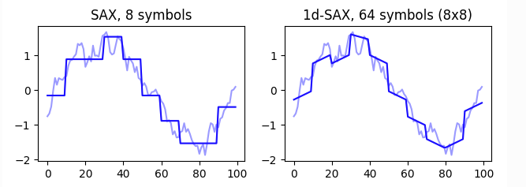<figcaption>
Figure.

Credit: <a href="https://lh5.googleusercontent.com/q4duc9XMnsYnOvbMeBcWLWf6T1uyPMrhBoPZEVVL16hS2UJJTalHA3MUE12kMo308fF1nO-qCGxeDefjvoLz106E7ZjkUTiFriggG98iX6H9vlaROGNnOdNpjEy6zZViK4Tl43mn">copied from the original hosted image</a>.
</figcaption></figure>

The DTW from the classification section has a dedicated library. [DTAIDistance](https://dtaidistance.readthedocs.io/en/latest/index.html) - Library for time series distances (e.g. Dynamic Time Warping) used in the [DTAI Research Group](https://dtai.cs.kuleuven.be/). The library offers a pure Python implementation and a faster implementation in C. The C implementation has only Cython as a dependency. It is compatible with Numpy and Pandas and implemented to avoid unnecessary data copy operations. Its clustering modules are [dtaidistance.clustering.hierarchical](https://dtaidistance.readthedocs.io/en/latest/modules/clustering/hierarchical.html), [Ddtaidistance.clustering.kmeans](https://dtaidistance.readthedocs.io/en/latest/modules/clustering/kmeans.html), and [Dtaidistance.clustering.medoids](https://dtaidistance.readthedocs.io/en/latest/modules/clustering/medoids.html).

For forecasting in one package, [Darts](https://unit8co.github.io/darts/) is a Python library for user-friendly forecasting and anomaly detection on time series. See its [Forecasting models](https://unit8co.github.io/darts/#forecasting-models) & [Examples](https://unit8co.github.io/darts/#example-usage).

The same distances can also identify anomalies, outliers or abnormal behaviour (see for example the [anomatools package](https://github.com/Vincent-Vercruyssen/anomatools), a toolbox for anomaly detection).

<figure>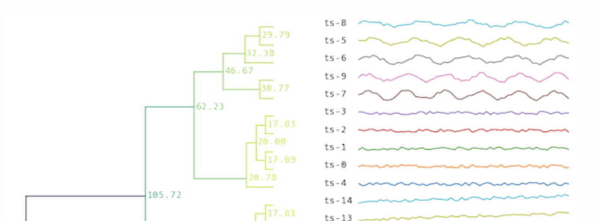<figcaption>
Figure.

Credit: <a href="https://lh3.googleusercontent.com/7nxg_PC85TDLAnkrIt2lNm3VhLRcFKwlGlEZOd4Ua7UnPFGctGheUcyzzIwVW39N8cAW7fF8cwvMJUySX6K4rkQNz1C5kGRL5P4LIPB0lNUl9gIietACvRxm4nokLL1Chr57024F">copied from the original hosted image</a>.
</figcaption></figure>

When a few labels are available, there is Semi supervised with DTAIDistance - Active semi-supervised clustering. The recommended method for perform active semi-supervised clustering using DTAIDistance is to use the COBRAS for time series clustering: [https://github.com/ML-KULeuven/cobras](https://github.com/ML-KULeuven/cobras). COBRAS is a library for semi-supervised time series clustering using pairwise constraints, which natively supports both dtaidistance.dtw and kshape.

Warping can also be learned. [Affine warp](https://github.com/ahwillia/affinewarp), a neural net with time warping - as part of the following manuscript, which focuses on analysis of large-scale neural recordings (though this code can be also be applied to many other data types). [Neural warp](https://github.com/josifgrabocka/neuralwarp) is a supporting website for the paper "NeuralWarp: Time-Series Similarity with Warping Networks", and the paper itself is [NeuralWarp](https://arxiv.org/pdf/1812.08306.pdf) Time Series Similarity with Warping Networks.

The tools all rest on one idea about features. [A great introduction into time series](https://medium.com/making-sense-of-data/time-series-next-value-prediction-using-regression-over-a-rolling-window-228f0acae363) - “The approach is to come up with a list of features that captures the temporal aspects so that the auto correlation information is not lost.” basically tells us to take sequence features and create (auto)-correlated new variables using a time window, i.e., “Time series forecasts as regression that factor in autocorrelation as well.”. we can transform raw features into other type of features that explain the relationship in time between features. we measure success using loss functions, MAE RMSE MAPE RMSEP AC-ERROR-RATE

[Interesting idea](http://blog.kaggle.com/2016/02/03/rossmann-store-sales-winners-interview-2nd-place-nima-shahbazi/) on how to define ‘time series’ dummy variables that utilize beginning\end of certain holiday events, including important information on what NOT to filter even if it seems insignificant, such as zero sales that may indicate some relationship to many sales the following day.

<figure>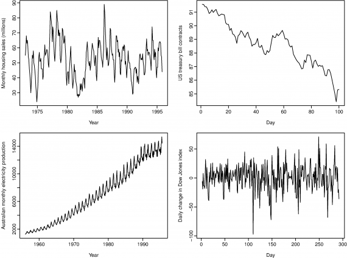<figcaption>
Figure.

Credit: <a href="https://lh6.googleusercontent.com/hUyX6IBOvCb8hrjHVG8edxDWmnHLwe6J2hf-_cGXhpSuhWAGPg7ahENwlXftItTY6kn1rw4GZxeGBwqJRa51XAQxTu4zZD_p_S93yCZvaXlU6QJJPV8jJHdq8HVVX88sOE95QBo_">copied from the original hosted image</a>.
</figcaption></figure>

Those features only make sense against the patterns they are meant to capture. [Time series patterns: ](https://www.otexts.org/fpp/2/1) A trend (a,b,c) exists when there is a long-term increase or decrease in the data. A seasonal (a - big waves) pattern occurs when a time series is affected by seasonal factors such as the time of the year or the day of the week. The monthly sales induced by the change in cost at the end of the calendar year. A cycle (a) occurs when the data exhibit rises and falls that are not of a fixed period - sometimes years.

[Some statistical measures](https://www.otexts.org/fpp/2/2) (mean, median, percentiles, iqr, std dev, bivariate statistics - correlation between variables)

Bivariate Formula: this correlation measures the extent of a linear relationship between two variables. high number = high correlation between two variable. The value of r always lies between -1 and 1 with negative values indicating a negative relationship and positive values indicating a positive relationship. Negative = decreasing, positive = increasing.

<figure>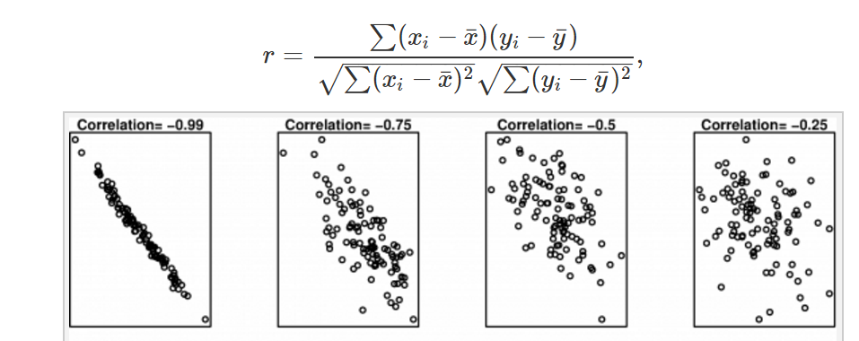<figcaption>
Figure.

Credit: <a href="https://lh4.googleusercontent.com/POsJ_tINRsrxwTHCkx56YjkN9irF-Z3atalMhZobbKPqz2zVmNEUnmtXMwimpCAMcNSutHGtk8Nn5bJTLgURfqNxmmg6BzpE2ruf5hbDxBSwB_IIafOvoFbQQARwZDGvohhEIgvY">copied from the original hosted image</a>.
</figcaption></figure>

But correlation can LIE, the following has 0.8 correlation for all of the graphs:

<figure>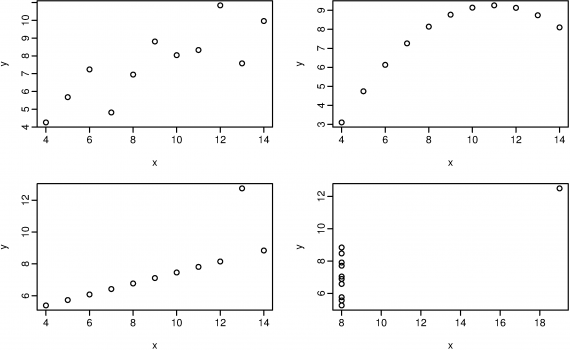<figcaption>
Figure.

Credit: <a href="https://lh6.googleusercontent.com/fsfNgKsimmzrD6j2OduCclfo9Facq9w6caU5fXNaGq3dBG6TdY1cDVOBDJ5eNGT7Sjwgi1PCrQtteuFnps1tWqKiTFXpUhUgrFVG_GT--CHZhyF2kOGpuYp9pRJjZmE8KTRFfPsA">copied from the original hosted image</a>.
</figcaption></figure>

Autocorrelation measures the linear relationship between lagged values of a time series. L8 is correlated, and has a high measure of 0.83. White-noise has autocorrelation of 0.

<figure>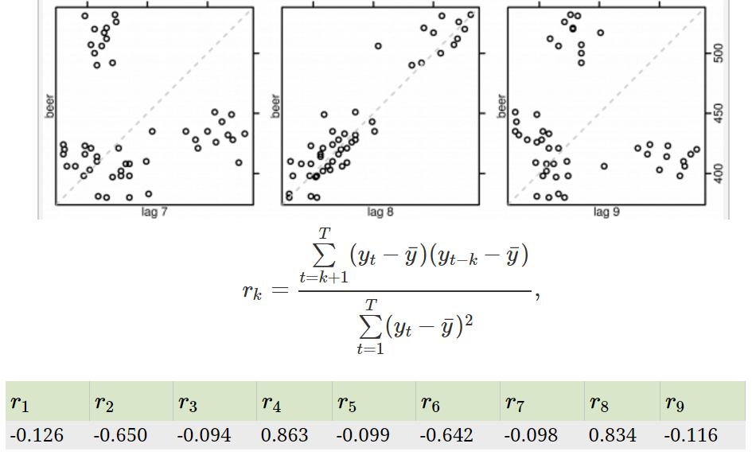<figcaption>
Figure.

Credit: <a href="https://lh6.googleusercontent.com/G2xzLwQkZaWNkLQseUHw2A1PHdq5zx0en1EZRhIKfK8m4QdxFvZ0k5wDNZDj3xMDV8IygVeQRBAeRHEtrVCULdlr9HKRuP3cjNHFwT996Ul07FXP-e8SlDFCOSQiXPdWo01ldecp">copied from the original hosted image</a>.
</figcaption></figure>

## Timeseries

All of the above starts with a series loaded and shaped in Pandas. The same notes are in [Timeseries](forecasting.md).

(good) [Pandas time series manipulation](https://medium.com/data-science/practical-guide-for-time-series-analysis-with-pandas-196b8b46858f) is the Practical Guide for Time Series Analysis with Pandas. [Using resample](https://medium.com/data-science/using-the-pandas-resample-function-a231144194c4) is Jeremy Chow's introductory dive into the technical aspects of the pandas resample function for datetime manipulation, meant as readable pseudo-documentation for those who would rather not dig through the pandas source code. The figure is his.

<figure>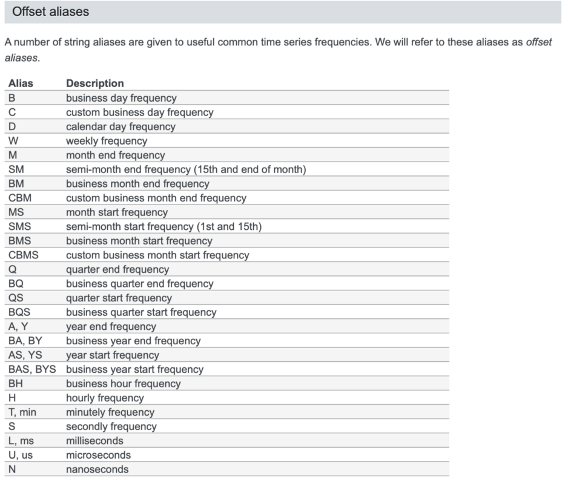<figcaption>
Pandas resample illustration.

Credit: by <a href="https://medium.com/data-science/using-the-pandas-resample-function-a231144194c4">Jeremy Chow</a>.

</figcaption></figure>

Past basic TS manipulation, the next step is to [Fill missing ts gaps, or how to resample](https://stackoverflow.com/questions/32241692/fill-missing-timeseries-data-using-pandas-or-numpy), the Stack Overflow question on filling missing timeseries data using pandas or numpy.

From Pandas the series moves into SCI-KIT LEARN. Pipeline t [o json 1](https://cmry.github.io/notes/serialize) is Scikit-learn Pipeline Persistence and JSON Serialization, which opens by thanking Sebastian Raschka and Chris Wagner for the text and code behind it, and [2](https://cmry.github.io/notes/serialize-sk) is Part II, a follow-up to that post. [cuML](https://github.com/rapidsai/cuml) - Multi gpu, multi node-gpu alternative for SKLEARN algorithms, and the [Gpu TSNE ^](https://www.reddit.com/r/MachineLearning/comments/e0j9cb/p_2000x_faster_rapids_tsne_3_hours_down_to_5/) thread goes with it. [Awesome code examples](http://machinelearningmastery.com/get-your-hands-dirty-with-scikit-learn-now/) about using svm/knn/naive/log regression in sklearn in python, i.e., “fitting a model onto the data”.

When one machine is not enough, dask handles parallel computing with task scheduling. [Parallelism of numpy, pandas and sklearn using dask and clusters](https://github.com/dask/dask) is the repo, the [Webpage](https://dask.pydata.org/en/latest/) is the Dask documentation, the dask-ml [docs](http://dask-ml.readthedocs.io/en/latest/index.html) now report that the API page has moved, and there is an [example in jupyter](https://hub.mybinder.org/user/dask-dask-examples-6bi4j3qj/notebooks/machine-learning.ipynb).

Also Insanely fast, [see here](https://www.youtube.com/watch?v=5Zf6DQaf7jk), Tom Augspurger's talk on distributed scikit learn.

Finally, the pipelines themselves can be written in a functional api for sk learn, using pipelines. thank you sk-lego.

<figure>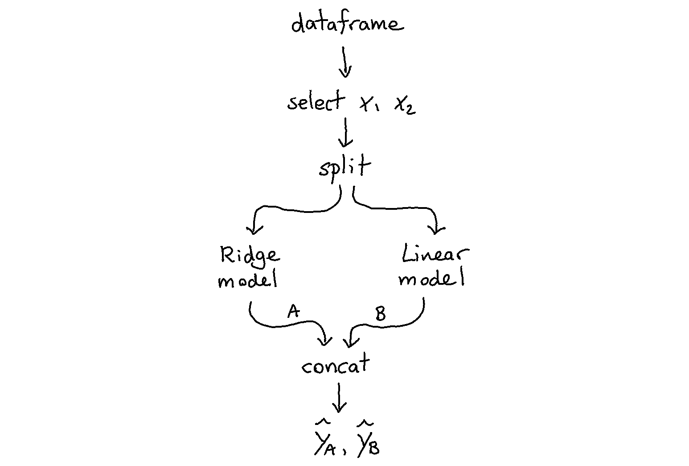<figcaption>
SK-Lego pipeline illustration.

Credit: by <a href="https://medium.com/@jeremyrchow">SK-Lego</a>.

</figcaption></figure>
<figure>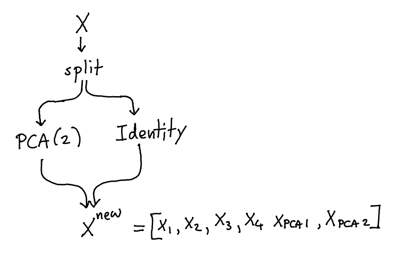<figcaption>
SK-Lego pipeline illustration.

Credit: by <a href="https://medium.com/@jeremyrchow">SK-Lego</a>.

</figcaption></figure>
<figure>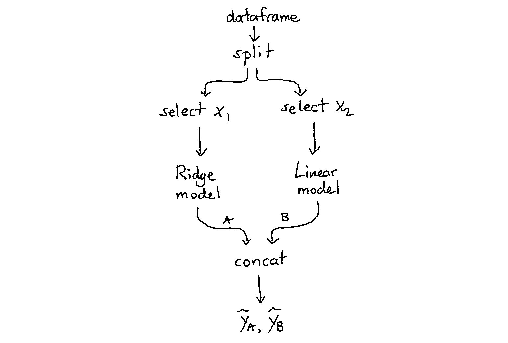<figcaption>
SK-Lego pipeline illustration.

Credit: by <a href="https://medium.com/@jeremyrchow">SK-Lego</a>.

</figcaption></figure>

 Images by [SK-Lego](https://medium.com/@jeremyrchow)

## Deprecated links


These links and images no longer work. The original wording is kept here. A same-resource copy, when one was checked, is used above.

- medium. This address no longer opens: https://towardsdatascience.com/sktime-a-unified-python-library-for-time-series-machine-learning-3c103c139a55
- With a gap. This address no longer opens: https://scikit-lego.readthedocs.io/en/latest/timegapsplit.html
- Creating. This address no longer opens: https://scikit-lego.readthedocs.io/en/latest/preprocessing.html#Repeating-Basis-Function-Transformer
- 1, scikit-lego with a decay estimator. This address no longer opens: https://scikit-lego.readthedocs.io/en/latest/meta.html#Decayed-Estimation
- Shay on stationary time series, AR, ARMA. This address no longer opens: https://towardsdatascience.com/stationarity-in-time-series-analysis-90c94f27322
- Python module. This address no longer opens: http://mlpy.sourceforge.net/
