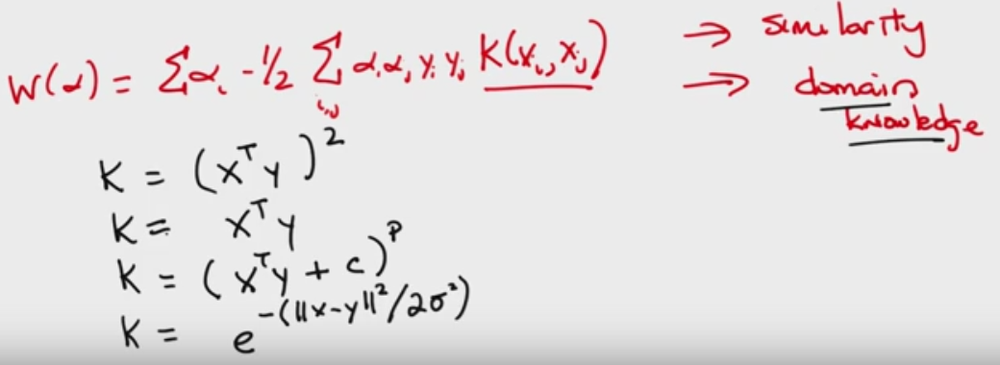

# Linear Separator Algorithms

A support vector machine answers one question: where is the best straight boundary between two classes, and what if the classes are not straight at all? The page starts with the SVM definition and margins, then kernels and the RBF rule of thumb, then how SMO, libsvm, and liblinear actually train it, and then the multi-class, regression, and clustering variants. It ends with regularization, grid search, and overfitting advice for C and gamma.

### SUPPORT VECTOR MACHINES (SVM)

The starting point is the plain two-class SVM and its margin. The same notes are in [ONE CLASS SVM](anomaly-detection.md#one-class-svm).

The OpenCV [Definition](http://docs.opencv.org/3.0-beta/modules/ml/doc/support_vector_machines.html) explains that SVM was originally a technique for building an optimal binary (2-class) classifier, later extended to regression and clustering, and that it is a partial case of kernel-based methods. Jake VanderPlas's Python Data Science Handbook chapter, In-Depth: Support Vector Machines, is the hands-on [tutorial](https://jakevdp.github.io/PythonDataScienceHandbook/05.07-support-vector-machines.html).

In the author's notes, SVM is built for an optimal 2-class classifier and extended for regression and clustering problems (1 class). It is kernel-based: it maps feature vectors into a higher-dimensional space using a kernel function, then builds an optimal linear discriminating function in this space (linear?) or an optimal hyper-plane (RBF?) that fits the training data. In case of SVM, the kernel is not defined explicitly, but a distance needs to be defined between any 2 points in the hyper-space.

The solution is optimal, the margin is maximal, between the separating hyper-plane and the nearest feature vectors. The feature vectors that are the closest to the hyper-plane are called support vectors, which means that the position of other vectors does not affect the hyper-plane (the decision function). The model produced by support vector classification (as described above) depends only on a subset of the training data, because the cost function for building the model does not care about training points that lie beyond the margin.

### KERNELS

That definition leaned on a kernel without saying what one is, so the next step is the kernel trick itself. [What are kernels in SVM](https://www.quora.com/What-are-Kernels-in-Machine-Learning-and-SVM) - intuition and example - is the Quora thread on what kernels are in machine learning and SVM and why we need them.

A kernel allows us to do certain calculations faster which otherwise would involve computations in higher dimensional space. K(x, y) = \<f(x), f(y)>. Here K is the kernel function, x, y are n dimensional inputs. f is a map from n-dimension to m-dimension space. < x,y> denotes the dot product. usually m is much larger than n. Normally calculating \<f(x), f(y)> requires us to calculate f(x), f(y) first, and then do the dot product. These two computation steps can be quite expensive as they involve manipulations in m dimensional space, where m can be a large number. Result is ONLY a scalar, i..e., 1-dim space. We don’t need to do that calc if we use a clever kernel.

Example:

Simple Example: x = (x1, x2, x3); y = (y1, y2, y3). Then for the function f(x) = (x1x1, x1x2, x1x3, x2x1, x2x2, x2x3, x3x1, x3x2, x3x3), the kernel is K(x, y ) = (\<x, y>)^2.

Let's plug in some numbers to make this more intuitive: suppose x = (1, 2, 3); y = (4, 5, 6). Then:

f(x) = (1, 2, 3, 2, 4, 6, 3, 6, 9) and f(y) = (16, 20, 24, 20, 25, 30, 24, 30, 36)

**\<f(x), f(y)> = 16 + 40 + 72 + 40 + 100+ 180 + 72 + 180 + 324 = 1024 i.e., 1\*16+2\*20+\*3\*24..

A lot of algebra. Mainly because f is a mapping from 3-dimensional to 9 dimensional space.

With a kernel its faster.

K(x, y) = (4 + 10 + 18 ) ^2 = 32^2 = 1024

A kernel is a magical shortcut to calculate even infinite dimensions!

The same thread then ties the shortcut back to the classifier, under [Relation to SVM](https://www.quora.com/What-are-Kernels-in-Machine-Learning-and-SVM)?. The idea of SVM is that y = w phi(x) +b, where w is the weight, phi is the feature vector, and b is the bias. If y> 0, then we classify datum to class 1, else to class 0. We want to find a set of weight and bias such that the margin is maximized.

Previous answers mention that kernel makes data linearly separable for SVM. I think a more precise way to put this is, kernels do not make the the data linearly separable. The feature vector phi(x) makes the data linearly separable. Kernel is to make the calculation process faster and easier, especially when the feature vector phi is of very high dimension (for example, x1, x2, x3,..., x_D^n, x1^2, x2^2,...., x_D^2).

That is also why it can be understood as a measure of similarity: if we put the definition of kernel above, \<f(x), f(y)>, in the context of SVM and feature vectors, it becomes \<phi(x), phi(y)>. The inner product means the projection of phi(x) onto phi(y). or colloquially, how much overlap do x and y have in their feature space. In other words, how similar they are.

In a library, the choice comes down to a short parameter list. The OpenCV page lists these [Kernels](http://docs.opencv.org/3.0-beta/modules/ml/doc/support_vector_machines.html):

- SVM::LINEAR Linear kernel. No mapping is done, linear discrimination (or regression) is done in the original feature space. It is the fastest option. $$K(x_i, x_j) = x_i^T x_j$$.
- SVM::RBF Radial basis function (RBF), a good choice in most cases. $$K(x_i, x_j) = e^{-\gamma ||x_i - x_j||^2}, \gamma > 0$$.

### [RBF kernel](https://www.csie.ntu.edu.tw/~cjlin/papers/guide/guide.pdf) use cases

RBF is the default, but the LIBSVM practical guide, written because beginners often get unsatisfactory results by missing easy but significant steps, says when it behaves no better than a linear kernel. The answer depends on the ratio of instances to features.

When the number of instances << number of features, i.e. 38 instances over 7000 features, RBF=LINEAR: when the number of features is large, we may not need to use RBF over Linear and vice versa (After finding C and gamma).

When the number of instances & features is VERY LARGE, i.e. 20K samples X 20K features, libsvm and liblinear give similar performance, and liblinear is faster by 150 times. Rule of thumb is to use for document classification.

When the number of instances >> number of features, the usual answer is high dimensional mapping using non linear kernel. If we insist on liblinear, -s 2 leads to faster training.

The same trade-off applies one level up, to deep learning. Kdnuggets: When to use DL over SVM and other algorithms. Computationally expensive for a very small boost in accuracy. The article is [http://www.kdnuggets.com/2016/04/deep-learning-vs-svm-random-forest.html](http://www.kdnuggets.com/2016/04/deep-learning-vs-svm-random-forest.html)

### SEQUENTIAL MINIMAL OPTIMIZATION (SMO)

Knowing which kernel to use still leaves the question of how the SVM is trained at all. [What is the SMO (SVM) classifier?](https://www.microsoft.com/en-us/research/publication/sequential-minimal-optimization-a-fast-algorithm-for-training-support-vector-machines/?from=http%3A%2F%2Fresearch.microsoft.com%2Fpubs%2F69644%2Ftr-98-14.pdf) - Sequential Minimal Optimization, or SMO. Training a support vector machine requires the solution of a very large quadratic programming (QP) optimization problem. SMO breaks this large QP problem into a series of the smallest possible QP problems. These small QP problems are solved analytically, which avoids using a time-consuming numerical QP optimization as an inner loop. The amount of memory required for SMO is linear in the training set size, which allows SMO to handle very large training sets. Because matrix computation is avoided, SMO scales somewhere between linear and quadratic in the training set size for various test problems, while the standard chunking SVM algorithm scales somewhere between linear and cubic in the training set size. SMO’s computation time is dominated by SVM evaluation, hence SMO is fastest for linear SVMs and sparse data sets. On real-world sparse data sets, SMO can be more than 1000 times faster than the chunking algorithm.

Two libraries implement this family of solvers, and two Stack Overflow questions compare them: [Differences between libsvm and liblinear](https://stackoverflow.com/questions/11508788/whats-the-difference-between-libsvm-and-liblinear) asks how the differences make liblinear faster than libsvm, & [smo vs libsvm](https://stackoverflow.com/questions/23674411/weka-smo-vs-libsvm) asks whether WEKA's SMO is different from LIBSVM, which itself implements an SMO-type algorithm.

### [LibSVM vs LibLinear](https://stackoverflow.com/questions/11508788/whats-the-difference-between-libsvm-and-liblinear)

The first of those threads is worth unpacking, because it decides which library survives a large dataset. libsvm works by using many kernel transforms to turn a non-linear problem into a linear problem beforehand.

From the link above, it seems like liblinear is very much the same thing, without those kernel transforms. So, as they say, in cases where the kernel transforms are not needed (they mention document classification), it will be faster.

The complexity comparison is a short list:

- libsvm (SMO) implementation
 - kernel (n^2)
 - Linear SVM (n^3)
- liblinear - optimized to deal with linear classification without kernels
 - Complexity O(n)
 - does not support kernel SVMs.
 - Scores higher

n is the number of samples in the training dataset.

Conclusion: In practice libsvm becomes painfully slow at 10k samples. Hence for medium to large scale datasets use liblinear and forget about libsvm (or maybe have a look at approximate kernel SVM solvers such as [LaSVM](http://leon.bottou.org/projects/lasvm), which saves training time and memory usage for large scale datasets).

### [MULTI CLASS SVM](https://www.csie.ntu.edu.tw/~cjlin/papers/multisvm.pdf)

Everything so far separated two classes, so more classes need a strategy for combining binary machines. The [comparison paper from National Taiwan University](https://www.csie.ntu.edu.tw/~cjlin/papers/multisvm.pdf) covers one against all, one against one, and Direct Acyclic Graph SVM (one against one with DAG). bottom line One Against One in LIBSVM.

Before going further, the parameters need a clear picture. [A few good explanation about SVM, formulas, figures, C, gamma, etc.](https://www.quora.com/What-are-C-and-gamma-with-regards-to-a-support-vector-machine) is the Quora answer on what C and gamma mean for a support vector machine.

Math of SVM on youtube:



The second walk through the math is Udacity's Georgia Tech Machine Learning lecture, Distance Between Planes Quiz: [Very good but lengthy and chatty example with make-sense math #2](https://www.youtube.com/watch?v=mU_N3nmv0Go&list=PLAwxTw4SYaPlkESDcHD-0oqVx5sAIgz7O&index=4). The author's notes from it:

- Linear - maximize the margin, optimal solution, only a few close points are really needed the others are zeroes by the alphas (alpha says “pay attention to this variable”) in the quadratic programming equation. XtX is a similarity function (pairs of points that relate to each other in output labels and how similar to one another, Xi’s point in the same direction) y1y2 are the labels. Therefore further points are not needed. But the similarity is important here(?)
- Non-linear - e.g. circle inside a circle, needs to map to a higher plane, a measure of similarity as XtX is important. We use this similarity idea to map into a higher plane, but we choose the higher plane for the purpose of a final function that behaves likes a known function, such as (A+B)^2. It turns out that (q1,q2,root(2)q1q2) is engineered with that root(2) thing for the purpose of making the multiplication of X^tY, which turns out to be (X^tY)^2. We can substitute this formula (X^tY)^2 instead of the X^tX in the quadratic equation to do that for us.This is the kernel trick that maps the inner class to one side and the outer circle class to the other and passes a plane in between them.
- Similarity is defined intuitively as all the points in one class vs the other.. I think
- A general kernel K=(X^tY + C)^p is a polynomial kernel that can define the above function and others.
- Quadratic eq with possible kernels including the polynomial.

The figure below is the lecture's picture of that mapping, copied from the original hosted image.

<figure><figcaption>
Figure.

Credit: <a href="https://lh5.googleusercontent.com/34PtIVvt73NxuW-INsSoqwYTIe2i5bvzD4oI568_kkpJbeurYkbnKyMOlblSb_PI_hDiWA3hqeZSME0THSUFZt5REUoF8jrss2qvz-QIEzaMVJolcxQ_DWlJtbITTbIGBbnueGA1">copied from the original hosted image</a>.
</figcaption></figure>

The lesson the author takes from it is that most importantly the kernel function is our domain knowledge. (?) IMO we should choose a kernel that fits our feature data. The output of K is a number(?), and infinite dimensions are possible as well. The Mercer condition - it acts like a distance\similar so that is the “rule” of which a kernel needs to follow. The [Super good lecture on MIT OPEN COURSE WARE](https://www.youtube.com/watch?v=_PwhiWxHK8o) expands on the quadratic equations that were introduced in the previous course above.

### SUPPORT VECTOR REGRESSION (SVR)

The same margin idea also works when the target is a number instead of a class. The same notes are in [Regression](regression.md) and [REGRESSION ALGORITHMS](regression.md#regression-algorithms).

scikit-learn's [Definition Support Vector Regression](http://scikit-learn.org/stable/modules/svm.html#svm-implementation-details) presents support vector machines (SVMs) as a set of supervised learning methods used for classification, regression and outliers detection. The method of SVM can be extended to solve regression problems. Similar to SVM, the model produced by Support Vector Regression depends only on a subset of the training data, because the cost function for building the model ignores any training data close to the model prediction.

### Support vector clustering (SVC)

With no labels at all, the support vectors can still outline where the data lives. The same notes are in [SVM CLUSTERING](clustering-algorithms.md#svm-clustering).

The support vector clustering [paper](http://www.jmlr.org/papers/volume2/horn01a/horn01a.pdf) is the original method, and the [short explanation](https://www.quora.com/Is-it-possible-to-use-SVMs-for-unsupervised-learning-density-estimation) is the Quora answer on whether SVMs can be used for unsupervised learning and density estimation.

### Regularization and influence

Every variant above has the same two knobs, C and gamma, and they are how an SVM is regularized. The same notes are in [Regularization](regularization.md).

Regularization here is basically punishment for overfitting and raising the non- linear class points higher and lower. [How does regularization look like in SVM](https://datascience.stackexchange.com/questions/4943/intuition-for-the-regularization-parameter-in-svm) - controlling ‘C’ - asks how varying the regularization parameter changes the decision boundary for a non-separable dataset. [The best explanation about Gamma (and C) in SVM!](https://www.quora.com/What-are-C-and-gamma-with-regards-to-a-support-vector-machine) is the same Quora answer on C and gamma as above.

### [Intuition for regularization in SVM](https://datascience.stackexchange.com/questions/4943/intuition-for-the-regularization-parameter-in-svm)

Once the knobs are understood, they still have to be set, and the standard way is a grid. The same notes are in [Regularization](regularization.md).

[Grid search for SVM Hyper parameters](http://docs.opencv.org/3.0-beta/modules/ml/doc/support_vector_machines.html) - in openCV. [Example in log space](https://stackoverflow.com/questions/29128074/choosing-the-best-svm-kernel-type-and-parameters-using-opencv-on-python) is the Stack Overflow question on choosing the kernel type and parameters with OpenCV's cv2.SVM.train_auto in Python.

The LIBSVM guide gives the grid itself, [I.e., (for example](https://www.csie.ntu.edu.tw/~cjlin/papers/guide/guide.pdf), C = 2^-5, 2 ^-3,..., 2^15, γ = 2^-15, 2 ^-13,..., 2^3 ). There are heuristic methods that skip some search options. However, no need for heuristics, computation-time is small, grid can be paralleled and we dont skip parameters. Search complexity is controlled using a two tier grid, coarse grid and then fine tune.

### [Overfitting advice for SVM: ](https://stats.stackexchange.com/questions/35276/svm-overfitting-curse-of-dimensionality)

A well-tuned grid can still overfit when the data is small and wide, which is exactly the case in the question behind this heading: 120 samples with 1000-200,000 features, and how SVM handles overfitting, if at all.

scikit-learn's RBF SVM parameters example illustrates the effect of the parameters gamma and C of the Radial Basis Function (RBF) kernel SVM; the regularization parameter C is the [penalty example](http://scikit-learn.org/stable/auto_examples/svm/plot_rbf_parameters.html). In non linear kernels, the controls are the kernel choice and the kernel parameters. For [RBF](http://scikit-learn.org/stable/auto_examples/svm/plot_rbf_parameters.html) - gamma, low and high values are far and near influence.

The Great [Tutorial at LIBSVM](https://www.csie.ntu.edu.tw/~cjlin/papers/guide/guide.pdf) adds the kernel notes. RBF is a reasonable first choice when the relation between class labels and attributes is nonlinear. A special case of C can make this similar to linear kernel (only! After finding C and gamma), and certain parameters makes it behave like the sigmoid kernel. The notes go on: less hyperparameters than RBF kernel, and 0 \<Kij <1 unlike other kernels where the degree is 0\<k\<infinity. Sigmoid is not valid under some parameters. DON'T USE when the #features is very large, use linear.
